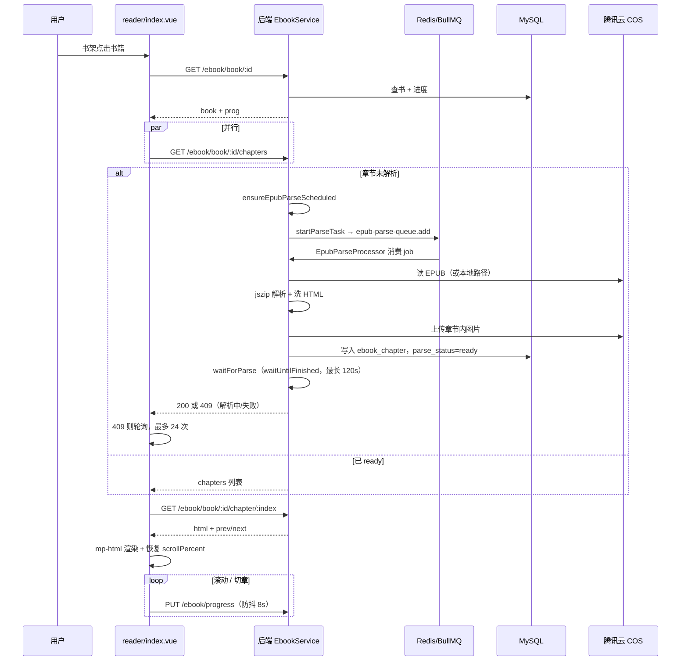

# EPUB 阅读实现说明（方案 B：后端预解析 + mp-html）

> **仓库**：小程序 `dnhyxc-ebook-miniprogram` + 后端 `dnhyxc-ai/apps/backend`  
> **约束**：个人主体小程序不可用 `web-view`；不在客户端解压 EPUB（避免 `Blob` / `URL` 等运行时问题）  
> **状态**：一期已落地；后端解析已迁至 **BullMQ `epub-parse-queue`**（Redis 持久化，`concurrency:1`）  
> **后端归档**（更细的逐行注释）：[`dnhyxc-ai/docs/ebook/miniprogram-epub-server-parse.md`](https://github.com/dnhyxc/dnhyxc-ai/blob/main/docs/ebook/miniprogram-epub-server-parse.md)

---

## 1. 架构总览

```
┌─────────────────────────────────────────────────────────────────────────┐
│  小程序 pages/reader/index.vue                                          │
│  ┌──────────────┐  ┌──────────────┐  ┌──────────────┐  ┌────────────┐ │
│  │ fetchBook    │  │fetchChapters │  │ fetchChapter │  │saveProgress│ │
│  └──────┬───────┘  └──────┬───────┘  └──────┬───────┘  └─────┬──────┘ │
│         └─────────────────┴─────────────────┴─────────────────┘         │
│                                    │ HTTP (JWT)                         │
└────────────────────────────────────┼────────────────────────────────────┘
                                     ▼
┌─────────────────────────────────────────────────────────────────────────┐
│  后端 API 进程  EbookController → EbookService                          │
│  ┌──────────────────┐    ┌─────────────────────┐                        │
│  │ GET .../chapters │───▶│ ensureEpubParse     │                        │
│  │ GET .../chapter  │    │ Scheduled           │                        │
│  └──────────────────┘    └──────────┬──────────┘                        │
│                                     │ startParseTask → queue.add        │
│                                     │ waitForParse → waitUntilFinished  │
└─────────────────────────────────────┼───────────────────────────────────┘
                                      ▼
┌─────────────────────────────────────────────────────────────────────────┐
│  Redis  BullMQ  epub-parse-queue  (jobId = epub-parse-{bookId})         │
│  ┌──────────────────────────────────────────────────────────────────┐  │
│  │ EpubParseProcessor  concurrency=1  → processEpubParseJob         │  │
│  │   waitThenParse → runEpubParse → EpubChapterParserService        │  │
│  └──────────────────────────────────────────────────────────────────┘  │
└─────────────────────────────────────┬───────────────────────────────────┘
                                      ▼
                         ┌──────────────────┐    ┌─────────────────┐
                         │ ebook_chapter 表 │    │ COS EPUB + 图片 │
                         │ parse_status     │    │ ebooks/assets/  │
                         └──────────────────┘    └─────────────────┘
```

**核心思路**：

1. 上传 EPUB 时（或首次打开阅读页时）任务入队 **BullMQ `epub-parse-queue`**，Worker 用 **jszip** 按 spine 顺序解析章节。
2. 清洗 HTML、上传内嵌图片到 COS，结果写入 **`ebook_chapter`** 表，`parse_status` 置为 `ready`。
3. 小程序只消费 **已清洗的 HTML 字符串**，用 **mp-html** 渲染（替代原生 `rich-text`）。
4. 阅读进度用 **`chapterIndex` + `scrollPercent`** 表示，配合 **`totalWordCount` / `wordCount`** 做字数加权进度。

---

## 2. 为什么选择这套方案

| 方案                     | 说明                                    | 小程序可行性      |
| ------------------------ | --------------------------------------- | ----------------- |
| 客户端 epub.js           | 浏览器 API 多，小程序缺 `Blob`/`URL` 等 | ❌ 不稳定         |
| web-view 嵌 H5 阅读器    | 体验好                                  | ❌ 个人主体不可用 |
| **后端预解析 + mp-html** | 服务端解压清洗，客户端只渲染 HTML       | ✅ 当前采用       |

---

## 3. 端到端阅读流程



### 3.1 打开书籍：`initReader`

```typescript
// src/pages/reader/index.vue（逻辑摘要 + 注释）

async function initReader(forceRefresh = false) {
  loading.value = true;
  chapterHtml.value = "";

  try {
    // 并行拉书籍详情（含进度）与章节目录
    const [book, chaptersRes] = await Promise.all([
      fetchBook(bookId.value),
      fetchChapters(bookId.value), // timeout 120s，可等待后端解析完成
    ]);

    parsePollCount = 0; // 解析成功后重置轮询计数
    toc.value = chaptersRes.chapters;
    chapterTotal.value = chaptersRes.total;

    // 恢复阅读位置：优先 chapterIndex，其次 percent 估算章序
    const startIndex = resolveStartIndex(
      book.prog?.chapterIndex,
      book.prog?.percent,
      chaptersRes.total,
    );

    await loadChapter(startIndex, book.prog?.scrollPercent ?? 0, forceRefresh);
  } catch (err) {
    if (isChapterParsePending(err)) {
      // 409 且消息不含「失败/不存在/重新上传」→ 仍在解析，继续轮询
      parsePollCount += 1;
      if (parsePollCount > PARSE_POLL_MAX) {
        /* 24 次后放弃 */
      }
      setTimeout(() => void initReader(), PARSE_POLL_INTERVAL_MS); // 5s
      return;
    }
    error.value = err instanceof Error ? err.message : "加载失败";
  }
}
```

### 3.2 加载单章：`loadChapter`

```typescript
async function loadChapter(index: number, restoreScrollPercent = 0, forceRefresh = false) {
  // 1. 优先读本地 7 天缓存（reader-cache.ts）
  const cached = !forceRefresh ? getChapterCache(bookId.value, index) : null;

  if (cached) {
    data = {/* 从缓存组装 ChapterContent */};
  } else {
    data = await fetchChapter(bookId.value, index);
    setChapterCache(bookId.value, index, data.html, data.title);
  }

  // 2. mp-html 切换章节防崩溃：先清空 → nextTick → 递增 key → 写入新 HTML
  //    原因：mp-html 内部 nodes 变短会用 {} 填充，原地 patch 会访问 undefined.attrs.id
  chapterHtml.value = "";
  await nextTick();
  chapterRenderKey.value += 1;
  chapterHtml.value = data.html;

  // 3. 恢复章内滚动（scrollPercent * 可滚动高度）
  if (restoreScrollPercent > 0) {
    scrollTop.value = Math.floor(maxScroll * restoreScrollPercent);
  }

  persistProgress(restoreScrollPercent);
}
```

### 3.3 进度恢复策略

```typescript
// src/types/ebook.ts

/** 由章序与章内滚动比估算全书进度（无字数数据时的 fallback） */
export function estimatePercent(
  chapterIndex: number,
  scrollPercent: number,
  total: number,
): number {
  if (total <= 0) return 0;
  const raw = (chapterIndex + scrollPercent) / total;
  return Math.min(1, Math.max(0, raw));
}

/**
 * 基于章节字数加权计算进度（后端提供 wordCount 时更准确）
 *
 * 公式：
 *   percent = (前面各章字数之和 + 当前章字数 × scrollPercent) / 全书总字数
 */
export function calculatePercent(
  chapterIndex: number,
  scrollPercent: number,
  chapters: ChapterMeta[],
): number {
  const totalWordCount = chapters.reduce((sum, ch) => sum + (ch.wordCount ?? 0), 0);
  if (totalWordCount <= 0) {
    return estimatePercent(chapterIndex, scrollPercent, chapters.length);
  }
  let prevWords = 0;
  for (let i = 0; i < chapterIndex; i++) {
    prevWords += chapters[i].wordCount ?? 0;
  }
  const currentWords = prevWords + (chapters[chapterIndex]?.wordCount ?? 0) * scrollPercent;
  return Math.min(1, Math.max(0, currentWords / totalWordCount));
}
```

---

## 4. 小程序端实现

### 4.1 依赖与配置

**package.json**

```json
{
  "dependencies": {
    "mp-html": "^2.5.0"
  }
}
```

**pages.json easycom**（自动注册组件，无需每页 import）

```json
{
  "easycom": {
    "autoscan": true,
    "custom": {
      "^mp-html$": "mp-html/dist/uni-app/components/mp-html/mp-html"
    }
  }
}
```

### 4.2 HTTP 层

```typescript
// src/services/http.ts

export class ApiError extends Error {
  constructor(
    readonly status: number, // HTTP 状态码，409 表示解析中
    message: string,
    readonly body?: unknown,
  ) {
    /* ... */
  }
}

export function request<T>(options: RequestOptions): Promise<T> {
  return new Promise((resolve, reject) => {
    uni.request({
      url: `${API_BASE_URL}${options.url}`,
      timeout: options.timeout ?? 60000, // 默认 60s
      // 章节接口单独设为 120s，允许后端在单次请求内等待解析完成
      success: (res) => {
        if (status >= 200 && status < 300) resolve(unwrapBody<T>(res.data));
        else reject(new ApiError(status, msg, raw));
      },
    });
  });
}
```

```typescript
// src/services/ebook.ts

export function fetchChapters(bookId: string) {
  return request<ChaptersResponse>({
    url: `/ebook/book/${bookId}/chapters`,
    timeout: 120000, // 大 EPUB 首次解析可达 30–60s
  });
}

export function fetchChapter(bookId: string, index: number) {
  return request<ChapterContent>({
    url: `/ebook/book/${bookId}/chapter/${index}`,
    timeout: 120000,
  });
}
```

### 4.3 章节离线缓存

```typescript
// src/services/reader-cache.ts

const CACHE_KEY_PREFIX = "ebook_chapter_";
const CACHE_EXPIRE_DAYS = 7;

/**
 * 键名：ebook_chapter_{bookId}_{index}
 * 值：{ bookId, index, html, title, cachedAt }
 * 过期：7 天；切章时优先读缓存，减少 API 与 mp-html 重渲染
 */
export function getChapterCache(bookId: string, index: number): ChapterCache | null {
  const cache = JSON.parse(uni.getStorageSync(key));
  if (Date.now() > cache.cachedAt + 7 * 24 * 60 * 60 * 1000) {
    uni.removeStorageSync(key);
    return null;
  }
  return cache;
}
```

### 4.4 阅读设置

```typescript
// src/hooks/useReaderSettings.ts

// 持久化到 uni.storage：字号、纸张主题、字体、行距
const mpTagStyle = computed(() => ({
  p: `margin:0 0 1em;line-height:${lineHeight.value};font-size:${fontSize.value}px`,
  img: "max-width:100%;height:auto;display:block;margin:0.5em 0",
  // ... h1-h3, blockquote 等
}));
```

纸张主题：`white` | `sepia` | `green` | `dark`，同步作用于顶栏、底栏、正文区背景色。

### 4.5 mp-html 渲染

```vue
<!-- src/pages/reader/index.vue -->
<scroll-view scroll-y :scroll-top="scrollTop" @scroll="onScroll">
  <mp-html
    :key="chapterRenderKey"   <!-- 切章强制销毁重建，避免 nodes 补丁崩溃 -->
    :content="chapterHtml"
    :copy-link="false"        <!-- 禁止外链跳转小程序页面 -->
    lazy-load                 <!-- 图片懒加载 -->
    :tag-style="mpTagStyle"
    :container-style="containerStyle"
  />
</scroll-view>
```

### 4.6 翻页与 Chrome

| 交互            | 实现                                                                    |
| --------------- | ----------------------------------------------------------------------- |
| 上一章 / 下一章 | 底栏按钮，`prevIndex` / `nextIndex` 来自章节 API                        |
| 左右滑动翻页    | `touchstart` → `touchmove` 判水平滑动 → `touchend` 触发 `goPrev/goNext` |
| 点击正文        | `toggleChrome` 显隐顶栏 + 底栏                                          |
| 目录            | 左侧 popup，`toc` 来自 `fetchChapters`                                  |

### 4.7 进度上报（防抖）

```typescript
// src/services/progress-sync.ts

const REMOTE_DEBOUNCE_MS = 8000;

/** 滚动节流 2s 后调用；8s 防抖批量写入后端 */
export function scheduleProgressSave(payload: SaveProgressPayload) {
  pending = payload;
  timer = setTimeout(() => void flushProgressSave(), REMOTE_DEBOUNCE_MS);
}

// onHide / onUnload 时 flushProgressSave()，避免离开页面丢进度
```

```typescript
// reader 内 persistProgress
scheduleProgressSave({
  bookId: bookId.value,
  chapterIndex: chapterIndex.value,
  chapterHref: chapterHref.value,
  scrollPercent, // 章内 0–1
  percent: calculatePercent(chapterIndex.value, scrollPercent, toc.value),
});
```

### 4.8 409 轮询与上限

| 常量                     | 值      | 含义                                 |
| ------------------------ | ------- | ------------------------------------ |
| `PARSE_POLL_MAX`         | 24      | 最多轮询 24 次                       |
| `PARSE_POLL_INTERVAL_MS` | 5000    | 每 5 秒重试                          |
| 最长等待                 | ~2 分钟 | 超时显示「解析时间较长，请稍后重试」 |

```typescript
function isChapterParsePending(err: unknown): boolean {
  if (!(err instanceof ApiError) || err.status !== 409) return false;
  const msg = err.message;
  // 含以下关键词则停止轮询，直接展示错误
  return !msg.includes("失败") && !msg.includes("不存在") && !msg.includes("重新上传");
}
```

---

## 5. 后端实现（dnhyxc-ai）

> 路径前缀：`apps/backend/src/services/ebook/`

### 5.1 数据库表

#### `ebook_book` 扩展字段

```typescript
// ebook-book.entity.ts

@Column({ name: 'parse_status', type: 'varchar', length: 16, default: 'pending' })
parseStatus: 'pending' | 'ready' | 'failed' | null;

@Column({ name: 'total_word_count', type: 'int', nullable: true })
totalWordCount: number | null;

@Column({ name: 'parse_attempt', type: 'int', default: 0 })
parseAttempt: number;  // 自动解析重试次数，上限 3
```

#### `ebook_chapter`

```typescript
// ebook-chapter.entity.ts

@Entity("ebook_chapter")
export class EbookChapter {
  bookId: string; // 关联源书（公开书的读书记录读源书章节）
  chapterIndex: number; // 0-based，与 API :index 一致
  href: string; // EPUB 内原始路径，用于进度恢复
  title: string;
  level: number; // 目录层级，0=章
  html: string; // mediumtext，已清洗 HTML
  wordCount: number; // 字数，供进度加权
}
```

#### `ebook_progress` 扩展字段

```typescript
// ebook-progress.entity.ts

chapterIndex: number | null; // 小程序：当前章序
chapterHref: string | null; // EPUB spine href
scrollPercent: number | null; // 章内滚动比例 0–1
percent: number | null; // 全书进度 0–1（书架展示）
epubCfi: string | null; // Web 端 epub.js 定位（小程序不用）
```

### 5.2 API 路由

```typescript
// ebook.controller.ts

@Get('book/:id/chapters')   // 目录列表
async getChapters(@Param('id', ParseUUIDPipe) id: string) { /* ... */ }

@Get('book/:id/chapter/:index')  // 单章 HTML
async getChapter(
  @Param('id', ParseUUIDPipe) id: string,
  @Param('index', ParseIntPipe) index: number,
) { /* ... */ }

@Put('progress')  // 扩展 body：chapterIndex, chapterHref, scrollPercent
```

### 5.3 `getChapters` / `getChapter` 主流程

```typescript
// ebook.service.ts

async getChapters(userId: number, bookId: string) {
  // 1. 鉴权 + 公开书读书记录 → 解析到源书 contentBook
  const { book, contentBook } = await this.resolveContentBook(userId, bookId);

  // 2. 无 COS 且无本地文件 → 400，明确提示上传云端
  this.assertEpubSourceAvailable(contentBook);

  // 3. 按需调度 BullMQ 解析任务（见 §5.4）
  await this.ensureEpubParseScheduled(contentBook);

  // 4. 等待 Worker 完成（最长 120s，见 §5.5 waitForParse）
  await this.waitForParse(contentBook.id);

  // 5. 重新读库 + assert：failed → 409「解析失败」；非 ready / 0 章 → 409「解析中」
  const freshContent = await this.bookRepo.findOne({ where: { id: contentBook.id } });
  await this.assertEpubChaptersReady(freshContent);

  // 6. 返回目录；totalWordCount 优先读 book 表汇总，否则按章节求和
  const rows = await this.chapterRepo.find({ where: { bookId: freshContent.id }, order: { chapterIndex: 'ASC' } });
  return { bookId: book.id, title: book.title, total: rows.length, totalWordCount, chapters: [...] };
}

async getChapter(userId, bookId, index) {
  // 与 getChapters 相同的前置：调度 → waitForParse → assert
  // 单章响应额外带 totalWordCount（全书字数，供进度展示）
  return { bookId, index, title, html, wordCount, totalWordCount, prevIndex, nextIndex, total };
}
```

**书架 DTO 扩展**：`toBookDto` 在 `parseStatus`、`totalWordCount` 有值时一并返回，便于二期在书架展示「解析中」角标。

### 5.4 解析状态机与调度

```
                    ┌─────────────┐
         上传 EPUB  │   pending   │◀── markEpubParsePending
                    └──────┬──────┘
                           │ startParseTask → BullMQ add
                           │ EpubParseProcessor → waitThenParse → runEpubParse
              ┌────────────┼────────────┐
              ▼            ▼            ▼
         ┌────────┐   ┌────────┐   ┌────────┐
         │ ready  │   │ failed │   │ attempt│
         │ +章节  │   │        │   │ 计数+1 │
         └────────┘   └────────┘   └────────┘
```

| `parse_status`         | 行为                                              |
| ---------------------- | ------------------------------------------------- |
| `null` / `ready`+0章   | `markEpubParsePending` → 清章节 → 入队            |
| `pending` + 0章        | 仅 `startParseTask`（避免重复 mark）              |
| `pending` + 有活跃 job | `isParseJobActive` 为 true 时跳过                 |
| `ready` + 有章节       | 直接返回                                          |
| `failed`               | **不再自动重试**；API 409「解析失败，请重新上传」 |
| `parse_attempt >= 3`   | `markEpubParseFailed`，防止反复打                 |

```typescript
// 关键常量
private static readonly PARSE_WAIT_MS = 120_000;   // HTTP 侧 waitUntilFinished 上限
private static readonly MAX_PARSE_ATTEMPTS = 3;    // 每本书最多自动解析 3 次

private epubParseJobId(bookId: string): string {
  // BullMQ 自定义 jobId 禁止含 ':'，故用 epub-parse-${bookId} 而非 epub-parse:{uuid}
  return `epub-parse-${bookId}`;
}

async markEpubParsePending(bookId: string, opts?: { resetAttempts?: boolean }) {
  if (await this.isParseJobActive(bookId)) return; // 已有 waiting/active job，不重复入队

  const nextAttempt = opts?.resetAttempts ? 1 : (book.parseAttempt ?? 0) + 1;
  if (nextAttempt > MAX_PARSE_ATTEMPTS) {
    await this.markEpubParseFailed(bookId);
    return;
  }

  await this.bookRepo.update({ id: bookId }, { parseStatus: 'pending', parseAttempt: nextAttempt });
  await this.chapterRepo.delete({ bookId }); // 重解析前清空旧章节，避免 ready+脏数据
  await this.startParseTask(bookId);
}

private async ensureEpubParseScheduled(contentBook: EbookBook) {
  if (!this.canParseEpubSource(contentBook)) return;

  const chapterCount = await this.chapterRepo.count({ where: { bookId: contentBook.id } });
  if (contentBook.parseStatus === 'ready' && chapterCount > 0) return;
  if (contentBook.parseStatus === 'failed') return;
  if (this.isParseAttemptExhausted(contentBook)) {
    await this.markEpubParseFailed(contentBook.id);
    return;
  }

  // 已在 pending 且章节已清空：只补入队，不再次 mark（避免 parse_attempt 虚增）
  if (contentBook.parseStatus === 'pending' && chapterCount === 0) {
    await this.startParseTask(contentBook.id);
    return;
  }

  if (await this.isParseJobActive(contentBook.id)) return;
  await this.markEpubParsePending(contentBook.id);
}
```

**触发时机**：

- `POST /ebook/upload` 成功且 `fmt === 'epub'` → `markEpubParsePending(id, { resetAttempts: true })`
- 首次 `GET .../chapters` 且未 ready → `ensureEpubParseScheduled` 自动调度

**解析成功后**：`runEpubParse` 将 `parseStatus='ready'`、`parseAttempt=0`、`totalWordCount` 写回 `ebook_book`。

### 5.5 BullMQ 队列（`epub-parse-queue`）

解析从进程内 `Map` 改为 **BullMQ + Redis**，与 chat 队列共用连接配置（`createBullRedisConnectionOptions`）。

#### 模块注册

```typescript
// ebook.module.ts

BullModule.registerQueueAsync({ name: EPUB_PARSE_QUEUE }), // 'epub-parse-queue'

providers: [
  EbookService,
  EpubChapterParserService,
  EpubParseProcessor,      // Worker
  EpubParseQueueEvents,    // waitUntilFinished 事件源
],
```

#### Worker：`EpubParseProcessor`

```typescript
// epub-parse.processor.ts

/** ponytail: concurrency=1 避免多本大 EPUB 同时解析占满事件循环 */
@Processor(EPUB_PARSE_QUEUE, { concurrency: 1 })
export class EpubParseProcessor extends WorkerHost {
  async process(job: Job<{ bookId: string }>): Promise<void> {
    // 唯一入口：委托 EbookService.processEpubParseJob
    await this.ebookService.processEpubParseJob(job.data.bookId);
  }
}

// ebook.service.ts
async processEpubParseJob(bookId: string): Promise<void> {
  await this.waitThenParse(bookId); // COS 等待 → runEpubParse
}
```

#### 入队：`startParseTask`

```typescript
private async startParseTask(bookId: string): Promise<void> {
  const jobId = this.epubParseJobId(bookId);
  const existing = await this.epubParseQueue.getJob(jobId);

  if (existing) {
    const state = await existing.getState();
    if (state === 'active' || state === 'waiting' || state === 'delayed') return;
    // ponytail: failed/completed 占着 jobId 时 add 会静默失败，须先 remove
    if (state === 'failed' || state === 'completed') await existing.remove();
  }

  await this.epubParseQueue.add('parse', { bookId }, {
    jobId,
    attempts: 1,              // Bull 层不重试，由 parse_attempt 控制
    removeOnComplete: true,   // ready 后 job 删除，waitForParse 靠 DB ready 快路径
    removeOnFail: { count: 50 },
  });
}
```

#### HTTP 等待：`waitForParse`

```typescript
private async waitForParse(bookId: string): Promise<void> {
  const book = await this.bookRepo.findOne({ where: { id: bookId }, select: ['id', 'parseStatus'] });

  // 快路径：已 ready 直接返回，不查 Redis（job 可能已被 removeOnComplete 删掉）
  if (book?.parseStatus === 'ready') return;

  let job = await this.epubParseQueue.getJob(this.epubParseJobId(bookId));

  // pending 且 job 尚未可见：mark 与 add 竞态，最多轮询 10×100ms
  if (!job && book?.parseStatus === 'pending') {
    for (let i = 0; i < 10; i++) {
      await new Promise((r) => setTimeout(r, 100));
      job = await this.epubParseQueue.getJob(this.epubParseJobId(bookId));
      if (job) break;
    }
  }
  if (!job) return;

  const state = await job.getState();
  if (state === 'completed' || state === 'failed') return;

  try {
    // 与 QueueEvents 配合，最长等 PARSE_WAIT_MS（120s）
    await Promise.race([
      job.waitUntilFinished(this.epubParseQueueEvents.events),
      timeout(PARSE_WAIT_MS),
    ]);
  } catch {
    // 超时由 assertEpubChaptersReady 返回 409
  }
}
```

#### `EpubParseQueueEvents`

```typescript
// epub-parse-queue-events.ts — 独立 QueueEvents 实例，供 waitUntilFinished 使用
this.events = new QueueEvents(EPUB_PARSE_QUEUE, {
  connection: createBullRedisConnectionOptions(configService),
});
```

| 对比项     | 旧（进程内 Map）       | 现（BullMQ）                         |
| ---------- | ---------------------- | ------------------------------------ |
| 任务持久化 | API 重启丢失           | Redis 保留 waiting 任务              |
| 并发控制   | 无统一限制             | `concurrency:1` 串行解析             |
| 同书去重   | `parseTasks` Map       | 固定 `jobId` + `isParseJobActive`    |
| HTTP 等待  | 轮询 DB `parse_status` | `ready` 快路径 + `waitUntilFinished` |

### 5.6 EPUB 文件来源

```typescript
private canParseEpubSource(book: EbookBook): boolean {
  // 优先 COS：ebooks/{uuid}.epub
  if (book.filePath && isCosEbookKey(book.filePath)) return true;
  // 本地开发兜底：后端与 EPUB 同机时可读 localPath
  return !!(book.localPath?.trim() && existsSync(book.localPath.trim()));
}

private async resolveEpubBuffer(book: EbookBook): Promise<Buffer> {
  if (book.filePath && isCosEbookKey(book.filePath)) {
    const key = await this.uploadService.resolveCosObjectKey(book.filePath);
    return this.uploadService.getObjectBuffer(key);
  }
  if (local && existsSync(local)) {
    return readFileAsync(local);
  }
  throw new BadRequestException('EPUB 文件不可用');
}
```

> **生产环境**：仅 `file_path`（COS）可用；`src_kind=path` 且无 COS 的书会返回 400「请上传至云端」。

### 5.7 EPUB 解析器

```typescript
// epub-chapter-parser.service.ts

async parseEpubBuffer(buffer: Buffer, bookId: string): Promise<ParsedEpubChapter[]> {
  const zip = await JSZip.loadAsync(buffer);

  // 1. container.xml → OPF 路径
  //    关键：正则用 <rootfile\b 避免匹配 <rootfiles>
  const opfPath = parseContainerPath(containerXml);

  // 2. 解析 manifest + spine（阅读顺序）
  const manifest = parseManifest(opfXml);
  const spineIds = parseSpine(opfXml);

  // 3. 从 NCX 或 nav.xhtml 提取章节标题
  const titleByHref = await this.loadNavTitles(zip, manifest, opfDir);

  // 4. 遍历 spine，逐章处理
  for (const id of spineIds) {
    let body = extractBodyHtml(rawHtml);
    body = await this.rewriteImages(body, chapterHref, zip, bookId, cache);
    const html = sanitizeEpubHtml(body);
    chapters.push({ index, href, title, html, wordCount: countWords(html) });
  }

  if (chapters.length === 0) throw new Error('未能解析出章节正文');
  return chapters;
}
```

### 5.8 HTML 清洗

```typescript
// epub-html.util.ts

/** mp-html / rich-text 白名单标签 */
const ALLOWED_TAGS = /^(div|p|span|h[1-6]|img|a|br|strong|em|...|table|...)$/i;

export function sanitizeEpubHtml(html: string): string {
  // 1. 移除 script / iframe / style / on* 事件
  // 2. 非白名单标签剥离
  // 3. img 保留 src + alt + loading="lazy"
  // 4. a 保留 href（小程序 copy-link=false 不跳转）
  return out.trim();
}

export function countWords(html: string): number {
  // 中文逐字 + 英文单词 + 数字串
  return chinese + english + numbers;
}
```

### 5.9 图片 COS 化

```typescript
// 解析时把 EPUB 内相对路径图片上传到 COS
// 键名：ebooks/assets/{bookId}/{uuid}_{filename}
// HTML 内 src 改写为 buildCosPublicUrl(key)

private async rewriteImages(html, chapterHref, zip, bookId, cache) {
  for (const m of html.matchAll(/]+src=["']([^"']+)["']/gi)) {
    const resolved = resolveRelativePath(chapterHref, src);
    if (/^https?:/.test(resolved)) continue; // 已是绝对 URL
    const url = await this.uploadService.uploadEbookAssetBuffer({ bookId, buffer, ... });
    out = out.replace(full, ``);
  }
}
```

### 5.10 COS 对象键自愈

```typescript
// upload.service.ts — 历史中文文件名键可能失效

async resolveCosObjectKey(storedKey: string): Promise<string> {
  if (await this.objectExists(key)) return key;
  // ponytail: 按 ebooks/{uuid} 前缀列举，修复旧数据
  const prefix = `ebooks/${uuidMatch[1]}`;
  const objects = await cos.getBucket({ Prefix: prefix });
  return epubObject.Key ?? key;
}

buildCosObjectKey(originalname, prefix) {
  if (prefix === 'ebooks') {
    // 新上传：ebooks/{uuid}.epub，避免中文文件名损坏
    return `${prefix}/${randomUUID()}${safeExt}`;
  }
}
```

---

## 6. API 契约摘要

### GET `/ebook/book/:id/chapters`

```json
{
  "bookId": "uuid",
  "title": "书名",
  "total": 79,
  "totalWordCount": 407664,
  "chapters": [
    { "index": 0, "href": "OEBPS/ch1.xhtml", "title": "第一章", "level": 0, "wordCount": 5200 }
  ]
}
```

| HTTP | 含义                                                                                                       |
| ---- | ---------------------------------------------------------------------------------------------------------- |
| 200  | 解析完成，有章节                                                                                           |
| 400  | 未上传云端 / 非 EPUB                                                                                       |
| 401  | 未登录                                                                                                     |
| 404  | 书不存在                                                                                                   |
| 409  | `pending` →「章节正在解析中」；`failed` →「章节解析失败，请重新上传」；`ready` 但 0 章 →「章节正在解析中」 |

### GET `/ebook/book/:id/chapter/:index`

```json
{
  "bookId": "uuid",
  "index": 0,
  "title": "第一章",
  "html": "<div><p>...</p></div>",
  "wordCount": 5200,
  "totalWordCount": 407664,
  "prevIndex": null,
  "nextIndex": 1,
  "total": 79
}
```

| 字段             | 说明                                                    |
| ---------------- | ------------------------------------------------------- |
| `wordCount`      | 当前章字数                                              |
| `totalWordCount` | 全书总字数（`ebook_book.total_word_count`），供进度加权 |

### PUT `/ebook/progress`

```json
{
  "bookId": "uuid",
  "chapterIndex": 12,
  "chapterHref": "OEBPS/ch13.xhtml",
  "scrollPercent": 0.42,
  "percent": 0.35
}
```

---

## 7. 重试与防死循环

| 层级              | 机制                                                   | 上限                                    |
| ----------------- | ------------------------------------------------------ | --------------------------------------- |
| **小程序轮询**    | 409 → `setTimeout(initReader, 5s)`                     | 24 次 ≈ 2 分钟                          |
| **后端 COS 等待** | Worker 内 `waitThenParse` 轮询 objectExists            | 10×1s                                   |
| **后端解析次数**  | `parse_attempt` 字段                                   | 3 次后 `failed`                         |
| **BullMQ 去重**   | 固定 `jobId=epub-parse-${bookId}` + `isParseJobActive` | 同书同时 1 个 job                       |
| **BullMQ 并发**   | `EpubParseProcessor` `concurrency:1`                   | 全局串行解析大 EPUB                     |
| **HTTP 等待**     | `waitForParse` → `waitUntilFinished`                   | 120 秒                                  |
| **Bull 重试**     | `attempts: 1`                                          | 不在队列层重试，由 `parse_attempt` 控制 |

失败后用户需**重新上传 EPUB**（`resetAttempts: true`）方可再次解析。

**运行依赖**：后端解析依赖 **Redis**（BullMQ 与 chat 队列共用连接配置）。本地开发须保证 Redis 可用，否则任务无法入队消费。

---

## 8. 文件地图

### 小程序 `dnhyxc-ebook-miniprogram`

| 文件                             | 职责                                     |
| -------------------------------- | ---------------------------------------- |
| `src/pages/reader/index.vue`     | 阅读页：加载、渲染、翻页、进度、409 轮询 |
| `src/services/ebook.ts`          | 章节 / 进度 API 封装                     |
| `src/services/http.ts`           | `uni.request` + `ApiError`               |
| `src/services/reader-cache.ts`   | 章节 HTML 7 天本地缓存                   |
| `src/services/progress-sync.ts`  | 进度防抖上报                             |
| `src/hooks/useReaderSettings.ts` | 字号 / 主题 / 行距 / mpTagStyle          |
| `src/types/ebook.ts`             | 类型 + `calculatePercent`                |
| `src/pages.json`                 | easycom 注册 mp-html                     |

### 后端 `dnhyxc-ai/apps/backend`

| 文件                             | 职责                                                       |
| -------------------------------- | ---------------------------------------------------------- |
| `ebook.controller.ts`            | `chapters` / `chapter/:index` 路由                         |
| `ebook.service.ts`               | 解析调度、Bull 入队、`waitForParse`、`processEpubParseJob` |
| `epub-parse.constants.ts`        | 队列名 `epub-parse-queue`                                  |
| `epub-parse.processor.ts`        | BullMQ Worker，`concurrency:1`                             |
| `epub-parse-queue-events.ts`     | `QueueEvents`，供 `waitUntilFinished`                      |
| `ebook.module.ts`                | 注册 Bull 队列与 Worker                                    |
| `epub-chapter-parser.service.ts` | jszip 解析 spine                                           |
| `epub-html.util.ts`              | HTML 清洗、字数统计                                        |
| `ebook-chapter.entity.ts`        | 章节表                                                     |
| `ebook-book.entity.ts`           | `parse_status` / `parse_attempt` / `total_word_count`      |
| `ebook-progress.entity.ts`       | 小程序进度字段                                             |
| `upload.service.ts`              | COS 读写、图片上传、键名自愈                               |

---

## 9. 常见问题排查

| 现象                   | 可能原因                          | 处理                                                                         |
| ---------------------- | --------------------------------- | ---------------------------------------------------------------------------- |
| 一直 409「解析中」     | Worker 未消费 / Redis 不可用      | 确认 Redis 连通；查 `EpubParseProcessor` 日志；`epub-parse-queue` 是否堆积   |
| 入队无日志、永不 ready | `jobId` 含 `:` 或 stale job 占坑  | 须用 `epub-parse-${bookId}`；`failed`/`completed` job 需 `remove` 后再 `add` |
| 409「解析失败」        | `parse_attempt >= 3` 或 EPUB 损坏 | 重新上传；查 `EPUB 解析失败 book=...` 日志                                   |
| 400「尚未上传云端」    | 仅 `local_path`，生产无文件       | 桌面端上传至 COS                                                             |
| `mp-html` 切章崩溃     | 组件原地 patch                    | 确认 `:key="chapterRenderKey"` + 清空后 nextTick                             |
| 进度不准               | 章节无 `wordCount`                | 等待全书解析完成；会用 `estimatePercent` fallback                            |
| 热更新 EADDRINUSE      | 旧 node 占 9226                   | `lsof -i :9226` → kill 后重启                                                |
| API 重启后解析继续     | BullMQ 任务在 Redis               | 正常；Worker 重启后会继续消费 waiting job                                    |

---

## 10. 与相关文档的关系

| 文档                                                                                                                                     | 关系                                       |
| ---------------------------------------------------------------------------------------------------------------------------------------- | ------------------------------------------ |
| [phase1-epub-shelf-reader-plan.md](./phase1-epub-shelf-reader-plan.md)                                                                   | 一期产品方案（rich-text 已升级为 mp-html） |
| [backend-ebook-chapter-api.md](./backend-ebook-chapter-api.md)                                                                           | API 规范原文                               |
| [epub-rendering-implementation.md](./epub-rendering-implementation.md)                                                                   | 方案选型与里程碑（M1–M5 设计稿）           |
| [dnhyxc-ai: miniprogram-epub-server-parse.md](https://github.com/dnhyxc/dnhyxc-ai/blob/main/docs/ebook/miniprogram-epub-server-parse.md) | 后端 BullMQ 迁移归档（逐行注释）           |
| **本文档**                                                                                                                               | **小程序 + 后端当前实现的端到端说明**      |

---

## 11. 二期可扩展方向（未实现）

- 章节目录 `level` 多级缩进（解析器已留字段）
- 书架按 `parseStatus` 展示「解析中」角标（后端 DTO 已带 `parseStatus`）
- 解析队列监控 / 告警（`epub-parse-queue` 堆积、失败 job 巡检）
- 划线 / 想法（仍用 CFI，需章节 href 映射）
- 听书 TTS
