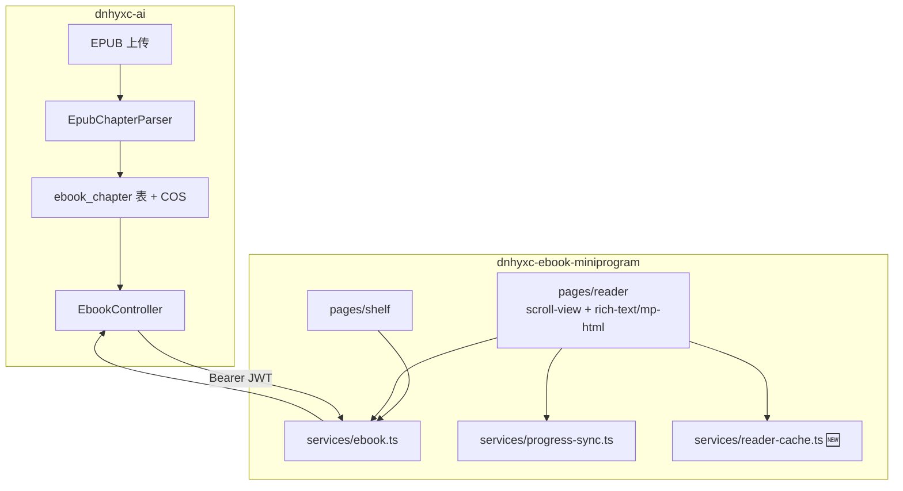

# 微信小程序 EPUB 渲染实现方案

> **项目**：`dnhyxc-ebook-miniprogram`（uni-app 3 + Vue 3 + TS + wot-ui）  
> **约束**：个人主体小程序不可使用 `web-view`  
> **版本**：2026-07-12

---

## 1. 市面上 EPUB 渲染方案调研

### 1.1 方案全景

| 方案                       | 核心技术                                                        | 个人主体可用 | 渲染效果   | 性能     | 实现复杂度 |
| -------------------------- | --------------------------------------------------------------- | ------------ | ---------- | -------- | ---------- |
| **后端预解析 + rich-text** | 服务端解析 EPUB → 返回清洗后的章节 HTML → 小程序 rich-text 渲染 | ✅           | ⭐⭐⭐     | ⭐⭐⭐⭐ | ⭐⭐       |
| **web-view + epubjs**      | 小程序 web-view 加载 H5 阅读器页面                              | ❌           | ⭐⭐⭐⭐⭐ | ⭐⭐⭐⭐ | ⭐⭐⭐     |
| **客户端 epubjs + Canvas** | 小程序端直接解压 EPUB，Canvas 绘制文本                          | ✅           | ⭐⭐⭐     | ⭐⭐     | ⭐⭐⭐⭐⭐ |
| **后端预解析 + mp-html**   | 服务端解析 EPUB → 返回 HTML → mp-html 组件渲染                  | ✅           | ⭐⭐⭐⭐   | ⭐⭐⭐   | ⭐⭐⭐     |

### 1.2 方案详细分析

#### 方案一：后端预解析 + 小程序 rich-text（当前项目采用）

**原理**：

1. Web 端上传 EPUB 文件
2. 后端异步解析：解压 ZIP → 读取 OPF/NCX → 提取 spine → 清洗章节 HTML → 持久化
3. 小程序通过 API 获取章节列表和章节 HTML
4. 使用小程序原生 `rich-text` 组件渲染 HTML

**优点**：

- 个人主体小程序完全可用，无任何限制
- 客户端无需解压 EPUB，内存占用低
- API 响应速度快（已预解析）
- 进度同步简单（chapterIndex + scrollPercent）
- 实现成本低，后端逻辑可复用 Web 端代码

**缺点**：

- `rich-text` 标签白名单限制，复杂版式降级
- CSS 样式支持有限，部分样式无法生效
- 需要后端开发解析服务
- 图片资源需要特殊处理（重写为绝对 URL）

**适用场景**：个人主体小程序、对渲染效果要求中等、追求稳定性的场景

---

#### 方案二：web-view + epubjs

**原理**：

1. 在小程序中使用 `web-view` 组件加载 H5 阅读器页面
2. H5 页面使用 epubjs 库解析和渲染 EPUB
3. 通过 postMessage 实现小程序与 H5 通信

**优点**：

- 渲染效果完美，支持所有 EPUB 特性（复杂版式、CSS 样式、多媒体）
- 可复用 Web 端成熟的 epubjs 实现
- 支持 CFI 精确定位，进度同步精确
- 支持划线、笔记等高级功能

**缺点**：

- **个人主体小程序不可用**（web-view 需要配置业务域名）
- 海外类型小程序也不可用
- 需要配置业务域名（ICP 备案域名）
- H5 页面作为分包增加包体积
- 小程序与 H5 通信复杂，需要处理跨域
- 用户体验有割裂感（H5 页面无法使用小程序原生组件）

**适用场景**：企业主体小程序、对渲染效果要求极高的场景

---

#### 方案三：客户端 epubjs + Canvas 渲染

**原理**：

1. 小程序端下载 EPUB 文件到本地
2. 使用 jszip 解压 EPUB
3. 解析 OPF/NCX 获取章节列表
4. 解析章节 HTML，提取文本内容
5. 使用 Canvas 绘制文本，实现翻页效果

**优点**：

- 个人主体小程序可用
- 渲染效果可高度自定义（字体、行间距、翻页动画）
- 支持离线阅读
- 无需后端解析服务

**缺点**：

- 性能差（解压和渲染都在客户端，大文件卡顿）
- Canvas 渲染文本体验不如 HTML（无法复制、选中）
- 实现复杂度极高（需要自己实现排版引擎）
- 内存占用大（EPUB 解压后体积翻倍）
- 不支持复杂 HTML 结构（表格、图片、多媒体）

**适用场景**：对渲染效果有特殊要求、愿意投入大量开发资源的场景

---

#### 方案四：后端预解析 + mp-html

**原理**：

1. 同方案一的后端解析流程
2. 小程序使用 `mp-html` 组件替代原生 `rich-text` 渲染 HTML

**优点**：

- 个人主体小程序可用
- 比原生 `rich-text` 支持更多 HTML 标签（table、ul、ol、iframe 等）
- 支持内联样式和 class 样式
- 支持图片懒加载
- 支持点击事件（链接跳转）
- 渲染效果优于方案一

**缺点**：

- 仍有部分标签限制
- 需要额外安装依赖包
- 性能略低于原生 rich-text
- 包体积略有增加

**适用场景**：个人主体小程序、对渲染效果有较高要求但无法使用 web-view 的场景

---

### 1.3 方案选型建议

基于本项目约束（个人主体小程序），**方案一（后端预解析 + rich-text）** 是当前最佳选择，理由如下：

1. **合规性**：个人主体小程序无法使用 web-view，方案二不可行
2. **稳定性**：方案一经过验证，是业界成熟方案
3. **性能**：后端预解析减少客户端负担，响应速度快
4. **实现成本**：后端已有解析基础，小程序端开发简单
5. **扩展性**：可逐步升级为方案四（mp-html）提升渲染效果

**后续升级路径**：方案一 → 方案四（mp-html）→ 方案二（企业主体后）

---

## 2. 本项目现有实现分析

### 2.1 现有架构

```
Web 上传 EPUB
    → 后端解析 spine → 清洗 HTML → 持久化
小程序
    → GET /ebook/shelf
    → GET /ebook/book/:id（含 prog）
    → GET .../chapters + GET .../chapter/:index
    → scroll-view + rich-text
    → PUT /ebook/progress（chapterIndex, scrollPercent, percent）
```

### 2.2 现有代码结构

| 文件                             | 职责                    | 状态      |
| -------------------------------- | ----------------------- | --------- |
| `src/pages/reader/index.vue`     | 阅读页面，渲染章节 HTML | ✅ 已实现 |
| `src/services/ebook.ts`          | 电子书 API 调用         | ✅ 已实现 |
| `src/services/progress-sync.ts`  | 进度同步（防抖 + 缓存） | ✅ 已实现 |
| `src/types/ebook.ts`             | 类型定义                | ✅ 已实现 |
| `src/hooks/useReaderSettings.ts` | 阅读设置（字号、背景）  | ✅ 已实现 |

### 2.3 现有功能清单

| 功能         | 状态 | 说明                                   |
| ------------ | ---- | -------------------------------------- |
| 书架展示     | ✅   | 网格封面 + 进度条                      |
| 目录导航     | ✅   | 左侧抽屉式目录                         |
| 章节切换     | ✅   | 上一章 / 下一章                        |
| 进度同步     | ✅   | chapterIndex + scrollPercent + percent |
| 阅读设置     | ✅   | 字号调节、背景色切换                   |
| 图片加载     | ⚠️   | 依赖服务端重写图片 URL                 |
| 解析状态处理 | ✅   | 409 pending 自动重试                   |

### 2.4 现有问题与改进空间

| 问题               | 影响             | 改进方案             |
| ------------------ | ---------------- | -------------------- |
| rich-text 标签限制 | 复杂版式无法渲染 | 升级为 mp-html       |
| 图片懒加载缺失     | 首屏加载慢       | 添加图片懒加载       |
| 进度估算粗糙       | 进度显示不准确   | 基于章节字数加权计算 |
| 无字体选择         | 阅读体验单一     | 添加字体选择         |
| 无行间距调整       | 阅读体验单一     | 添加行间距调整       |
| 无翻页动画         | 交互体验一般     | 添加滑动翻页         |
| 无离线缓存         | 断网无法阅读     | 添加章节缓存         |

---

## 3. 详细实现方案

### 3.1 方案架构



### 3.2 核心改动点

#### 3.2.1 升级渲染组件：rich-text → mp-html

**安装依赖**：

```bash
pnpm add mp-html
```

**配置 uni-app 组件**：
在 `pages.json` 中注册 mp-html 组件：

```json
{
  "usingComponents": {
    "mp-html": "mp-html/dist/uni-app/components/mp-html/mp-html"
  }
}
```

**修改阅读页面**：
将 `rich-text` 替换为 `mp-html`，支持更多标签和样式：

```vue
<template>
  <mp-html
    :content="chapterHtml"
    :copy-link="false"
    :lazy-load="true"
    :scroll-with-animation="false"
    @load="onMpHtmlLoad"
    @error="onMpHtmlError"
  />
</template>
```

**mp-html 优势**：

- 支持 `table`、`ul`、`ol`、`li`、`blockquote` 等标签
- 支持内联样式（`style` 属性）
- 支持图片懒加载（`lazy-load`）
- 支持点击事件（链接跳转）
- 支持自定义样式（通过 `tag-style` 属性）

---

#### 3.2.2 增强进度计算：基于章节字数加权

**后端扩展**：
在 `ebook_chapter` 表中增加 `word_count` 字段，解析时统计每章字数：

```sql
ALTER TABLE ebook_chapter ADD COLUMN word_count INT DEFAULT 0;
```

**章节响应扩展**：

```json
{
  "bookId": "uuid",
  "index": 0,
  "title": "第一章",
  "html": "<div>...</div>",
  "wordCount": 2500,
  "totalWordCount": 100000,
  "prevIndex": null,
  "nextIndex": 1,
  "total": 42
}
```

**目录响应扩展**：

```json
{
  "bookId": "uuid",
  "title": "书名",
  "total": 42,
  "totalWordCount": 100000,
  "chapters": [{ "index": 0, "href": "...", "title": "第一章", "level": 0, "wordCount": 2500 }]
}
```

**前端进度计算优化**：

```typescript
export function calculatePercent(
  chapterIndex: number,
  scrollPercent: number,
  chapters: ChapterMeta[],
): number {
  if (!chapters || chapters.length === 0) return 0;

  const totalWordCount = chapters.reduce((sum, ch) => sum + (ch.wordCount || 0), 0);
  if (totalWordCount === 0) {
    return (chapterIndex + scrollPercent) / chapters.length;
  }

  let prevWords = 0;
  for (let i = 0; i < chapterIndex; i++) {
    prevWords += chapters[i].wordCount || 0;
  }

  const currentChapterWords = chapters[chapterIndex]?.wordCount || 0;
  const currentWords = prevWords + currentChapterWords * scrollPercent;

  return Math.min(1, Math.max(0, currentWords / totalWordCount));
}
```

---

#### 3.2.3 增强阅读设置：字体、行间距、字间距

**扩展 `useReaderSettings` hook**：

```typescript
import { ref, computed } from "vue";

const fontSize = ref(16);
const paperTheme = ref("white");
const fontFamily = ref("system");
const lineHeight = ref(1.8);
const letterSpacing = ref(0);

const fontFamilies = [
  { value: "system", label: "系统字体" },
  { value: "serif", label: "宋体" },
  { value: "sans-serif", label: "黑体" },
  { value: "monospace", label: "等宽字体" },
];

const lineHeightOptions = [1.4, 1.6, 1.8, 2.0, 2.2];

const readerStyle = computed(() => {
  const themes: Record<string, { backgroundColor: string; color: string }> = {
    white: { backgroundColor: "#ffffff", color: "#333333" },
    cream: { backgroundColor: "#fdf6e3", color: "#4a4a4a" },
    green: { backgroundColor: "#e8f5e9", color: "#2e7d32" },
    dark: { backgroundColor: "#1a1a1a", color: "#cccccc" },
  };

  const theme = themes[paperTheme.value] || themes.white;

  return {
    ...theme,
    fontSize: `${fontSize.value}px`,
    fontFamily:
      fontFamily.value === "system"
        ? '-apple-system, BlinkMacSystemFont, "Segoe UI", Roboto, sans-serif'
        : fontFamily.value,
    lineHeight: lineHeight.value,
    letterSpacing: `${letterSpacing.value}px`,
  };
});

function bumpFontSize(delta: number) {
  fontSize.value = Math.max(12, Math.min(28, fontSize.value + delta));
}

function setLineHeight(height: number) {
  lineHeight.value = height;
}

function setLetterSpacing(spacing: number) {
  letterSpacing.value = spacing;
}

export function useReaderSettings() {
  return {
    fontSize,
    paperTheme,
    fontFamily,
    lineHeight,
    letterSpacing,
    readerStyle,
    fontFamilies,
    lineHeightOptions,
    bumpFontSize,
    setLineHeight,
    setLetterSpacing,
  };
}
```

**更新阅读设置面板**：

```vue
<wd-popup v-model="settingsOpen" position="bottom" round>
  <view class="settings-panel">
    <text class="settings-title">阅读设置</text>
    
    <view class="settings-row">
      <text>字号</text>
      <view class="font-actions">
        <wd-button size="small" @click="bumpFontSize(-1)">A-</wd-button>
        <text>{{ fontSize }}</text>
        <wd-button size="small" @click="bumpFontSize(1)">A+</wd-button>
      </view>
    </view>
    
    <view class="settings-row">
      <text>字体</text>
      <view class="font-family-options">
        <wd-button
          v-for="opt in fontFamilies"
          :key="opt.value"
          size="small"
          :type="fontFamily === opt.value ? 'primary' : 'info'"
          @click="fontFamily = opt.value"
        >
          {{ opt.label }}
        </wd-button>
      </view>
    </view>
    
    <view class="settings-row">
      <text>行间距</text>
      <view class="line-height-options">
        <wd-button
          v-for="h in lineHeightOptions"
          :key="h"
          size="small"
          :type="lineHeight === h ? 'primary' : 'info'"
          @click="setLineHeight(h)"
        >
          {{ h }}x
        </wd-button>
      </view>
    </view>
    
    <view class="settings-row">
      <text>背景</text>
      <view class="paper-options">
        <wd-button
          v-for="opt in paperOptions"
          :key="opt.value"
          size="small"
          :type="paperTheme === opt.value ? 'primary' : 'info'"
          @click="paperTheme = opt.value"
        >
          {{ opt.label }}
        </wd-button>
      </view>
    </view>
  </view>
</wd-popup>
```

---

#### 3.2.4 添加滑动翻页功能

**实现滑动手势识别**：

```vue
<template>
  <scroll-view
    scroll-y
    class="reader-scroll"
    :scroll-top="scrollTop"
    :style="scrollAreaStyle"
    @scroll="onScroll"
    @touchstart="onTouchStart"
    @touchmove="onTouchMove"
    @touchend="onTouchEnd"
    @tap="toggleChrome"
  >
    <view class="reader-body" :style="readerStyle">
      <mp-html :content="chapterHtml" lazy-load />
    </view>
  </scroll-view>
</template>

<script setup lang="ts">
const touchStartX = ref(0);
const touchStartY = ref(0);
const touchEndX = ref(0);
const touchEndY = ref(0);
const isSwiping = ref(false);

function onTouchStart(e: TouchEvent) {
  touchStartX.value = e.touches[0].clientX;
  touchStartY.value = e.touches[0].clientY;
  isSwiping.value = false;
}

function onTouchMove(e: TouchEvent) {
  touchEndX.value = e.touches[0].clientX;
  touchEndY.value = e.touches[0].clientY;

  const deltaX = touchEndX.value - touchStartX.value;
  const deltaY = touchEndY.value - touchStartY.value;

  if (Math.abs(deltaX) > Math.abs(deltaY) && Math.abs(deltaX) > 50) {
    isSwiping.value = true;
  }
}

function onTouchEnd() {
  if (!isSwiping.value) return;

  const deltaX = touchEndX.value - touchStartX.value;

  if (deltaX < -80 && nextIndex.value != null) {
    goNext();
  } else if (deltaX > 80 && prevIndex.value != null) {
    goPrev();
  }

  isSwiping.value = false;
}
</script>
```

---

#### 3.2.5 添加离线阅读支持

**创建章节缓存服务**：

```typescript
const CACHE_KEY_PREFIX = "ebook_chapter_";
const CACHE_EXPIRE_DAYS = 7;

export interface ChapterCache {
  bookId: string;
  index: number;
  html: string;
  title: string;
  cachedAt: number;
}

export function getChapterCache(bookId: string, index: number): ChapterCache | null {
  try {
    const key = `${CACHE_KEY_PREFIX}${bookId}_${index}`;
    const data = uni.getStorageSync(key);
    if (!data) return null;

    const cache = JSON.parse(data) as ChapterCache;
    const expireTime = cache.cachedAt + CACHE_EXPIRE_DAYS * 24 * 60 * 60 * 1000;

    if (Date.now() > expireTime) {
      uni.removeStorageSync(key);
      return null;
    }

    return cache;
  } catch {
    return null;
  }
}

export function setChapterCache(bookId: string, index: number, html: string, title: string): void {
  try {
    const key = `${CACHE_KEY_PREFIX}${bookId}_${index}`;
    const cache: ChapterCache = {
      bookId,
      index,
      html,
      title,
      cachedAt: Date.now(),
    };
    uni.setStorageSync(key, JSON.stringify(cache));
  } catch (err) {
    console.warn("[reader-cache] set failed", err);
  }
}

export function clearChapterCache(bookId: string): void {
  try {
    const keys = uni.getStorageInfoSync().keys || [];
    keys.forEach((key) => {
      if (key.startsWith(`${CACHE_KEY_PREFIX}${bookId}_`)) {
        uni.removeStorageSync(key);
      }
    });
  } catch (err) {
    console.warn("[reader-cache] clear failed", err);
  }
}

export function getCachedChapters(bookId: string): number[] {
  try {
    const keys = uni.getStorageInfoSync().keys || [];
    const indices: number[] = [];
    keys.forEach((key) => {
      const match = key.match(new RegExp(`${CACHE_KEY_PREFIX}${bookId}_(\\d+)`));
      if (match) {
        indices.push(parseInt(match[1], 10));
      }
    });
    return indices.sort((a, b) => a - b);
  } catch {
    return [];
  }
}
```

**修改章节加载逻辑**：

```typescript
async function loadChapter(index: number, restoreScrollPercent = 0) {
  loading.value = true;
  error.value = "";

  try {
    const cached = getChapterCache(bookId.value, index);

    let data: ChapterContent;
    if (cached && !forceRefresh) {
      data = {
        bookId: cached.bookId,
        index: cached.index,
        title: cached.title,
        html: cached.html,
        prevIndex: index > 0 ? index - 1 : null,
        nextIndex: index < chapterTotal.value - 1 ? index + 1 : null,
        total: chapterTotal.value,
      };
    } else {
      data = await fetchChapter(bookId.value, index);
      setChapterCache(bookId.value, index, data.html, data.title);
    }

    chapterIndex.value = data.index;
    chapterTitle.value = data.title;
    chapterHtml.value = data.html;
    chapterHref.value = toc.value[index]?.href ?? "";
    prevIndex.value = data.prevIndex;
    nextIndex.value = data.nextIndex;
    chapterTotal.value = data.total;
    tocOpen.value = false;

    scrollTop.value = 0;
    await new Promise((r) => setTimeout(r, 50));
    if (restoreScrollPercent > 0 && scrollHeight.value > viewportHeight.value) {
      const maxScroll = scrollHeight.value - viewportHeight.value;
      scrollTop.value = Math.floor(maxScroll * restoreScrollPercent);
    }

    persistProgress(restoreScrollPercent);
  } catch (err) {
    if (err instanceof ApiError && err.status === 409) {
      loadingText.value = "章节解析中…";
      setTimeout(() => void loadChapter(index, restoreScrollPercent), 2000);
      return;
    }
    error.value = err instanceof Error ? err.message : "章节加载失败";
  } finally {
    loading.value = false;
  }
}
```

---

#### 3.2.6 添加图片懒加载优化

**使用 mp-html 自带的懒加载**：

```vue
<mp-html
  :content="chapterHtml"
  :lazy-load="true"
  lazy-load-placeholder="https://your-cdn.com/placeholder.png"
/>
```

**后端图片处理**：

1. 将 EPUB 内的图片提取到 CDN
2. 重写 HTML 中的 `src` 属性为 CDN URL
3. 添加 `loading="lazy"` 属性（mp-html 支持）

**图片 URL 格式**：

```
https://cdn.example.com/ebook-assets/{bookId}/{path}
```

---

### 3.3 API 接口变更

#### 3.3.1 `GET /ebook/book/:id/chapters`（扩展）

**新增字段**：

```json
{
  "bookId": "uuid",
  "title": "书名",
  "total": 42,
  "totalWordCount": 100000,
  "chapters": [
    {
      "index": 0,
      "href": "OEBPS/chapter1.xhtml",
      "title": "第一章",
      "level": 0,
      "wordCount": 2500
    }
  ]
}
```

#### 3.3.2 `GET /ebook/book/:id/chapter/:index`（扩展）

**新增字段**：

```json
{
  "bookId": "uuid",
  "index": 0,
  "title": "第一章",
  "html": "<div>...</div>",
  "wordCount": 2500,
  "totalWordCount": 100000,
  "prevIndex": null,
  "nextIndex": 1,
  "total": 42
}
```

#### 3.3.3 `GET /ebook/book/:id`（扩展）

**新增字段**：

```json
{
  "id": "uuid",
  "title": "书名",
  "author": "作者",
  "coverUrl": "https://cdn...",
  "fmt": "epub",
  "parseStatus": "ready",
  "totalWordCount": 100000,
  "prog": {
    "chapterIndex": 5,
    "scrollPercent": 0.3,
    "percent": 0.15,
    "chapterHref": "OEBPS/chapter6.xhtml"
  }
}
```

---

### 3.4 前端类型定义扩展

```typescript
export interface ChapterMeta {
  index: number;
  href: string;
  title: string;
  level: number;
  wordCount?: number;
}

export interface ChaptersResponse {
  bookId: string;
  title: string;
  total: number;
  totalWordCount?: number;
  chapters: ChapterMeta[];
}

export interface ChapterContent {
  bookId: string;
  index: number;
  title: string;
  html: string;
  wordCount?: number;
  totalWordCount?: number;
  prevIndex: number | null;
  nextIndex: number | null;
  total: number;
}

export interface BackendBook {
  id: string;
  title: string;
  author?: string;
  coverUrl?: string;
  fmt: BookFormat;
  parseStatus?: "pending" | "ready" | "failed";
  totalWordCount?: number;
}
```

---

### 3.5 后端解析逻辑优化

#### 3.5.1 HTML 清洗规则

```typescript
function cleanEpubHtml(html: string, bookId: string): string {
  let result = html;

  result = result
    .replace(/<script[^>]*>[\s\S]*?<\/script>/gi, "")
    .replace(/<iframe[^>]*>[\s\S]*?<\/iframe>/gi, "")
    .replace(/on\w+="[^"]*"/gi, "")
    .replace(/<style[^>]*>[\s\S]*?<\/style>/gi, (match) => {
      if (match.includes("@font-face")) return "";
      return match;
    });

  result = result.replace(/src="([^"]+)"/gi, (match, src) => {
    if (src.startsWith("http://") || src.startsWith("https://")) {
      return match;
    }
    const encodedPath = encodeURIComponent(src);
    return `src="https://cdn.example.com/ebook-assets/${bookId}/${encodedPath}"`;
  });

  result = result.replace(/href="([^"]+)"/gi, (match, href) => {
    if (href.startsWith("#")) return match;
    if (href.startsWith("http://") || href.startsWith("https://")) return match;
    return `href="epub://${href}"`;
  });

  return result;
}
```

#### 3.5.2 字数统计

```typescript
function countWords(html: string): number {
  const text = html.replace(/<[^>]*>/g, "");
  const chineseChars = text.match(/[\u4e00-\u9fa5]/g)?.length || 0;
  const englishWords = text.match(/[a-zA-Z]+/g)?.length || 0;
  const numbers = text.match(/\d+/g)?.length || 0;
  return chineseChars + englishWords + numbers;
}
```

---

### 3.6 性能优化策略

#### 3.6.1 章节分页加载

- 每次只加载当前章节，不预加载所有章节
- 翻页时异步加载下一章

#### 3.6.2 图片优化

- 服务端压缩图片（WebP 格式）
- 添加图片懒加载
- 设置合理的图片尺寸限制

#### 3.6.3 进度同步优化

- 防抖：滚动时每 2 秒计算一次进度
- 延迟上传：进度变更后 8 秒再上传到服务器
- 页面隐藏/卸载时强制同步

#### 3.6.4 缓存策略

- 章节内容本地缓存（7 天有效期）
- 目录信息本地缓存
- 阅读设置本地存储

---

## 4. 里程碑与验收清单

### 4.1 里程碑

| 阶段   | 内容         | 验收标准                              |
| ------ | ------------ | ------------------------------------- |
| **M1** | mp-html 集成 | 阅读页使用 mp-html 渲染，支持更多标签 |
| **M2** | 进度计算优化 | 基于章节字数计算进度，显示更准确      |
| **M3** | 阅读设置增强 | 字体选择、行间距调整、字间距调整      |
| **M4** | 滑动翻页     | 左右滑动切换章节                      |
| **M5** | 离线阅读     | 缓存章节内容，断网可阅读              |
| **M6** | 联调打磨     | 图片加载、解析状态、错误处理完善      |

### 4.2 验收清单

- [ ] mp-html 替换 rich-text 后，表格、列表等标签正常渲染
- [ ] 进度显示基于章节字数加权，打开书时恢复位置更准确
- [ ] 字体选择功能正常，支持系统字体、宋体、黑体、等宽字体
- [ ] 行间距调整功能正常，支持 1.4x–2.2x
- [ ] 左右滑动可切换章节
- [ ] 已阅读章节缓存到本地，断网时可继续阅读
- [ ] 图片懒加载正常，首屏加载速度提升
- [ ] 解析中（409）状态处理完善，自动重试
- [ ] 阅读设置（字号、背景、字体、行间距）本地持久化

---

## 5. 风险与对策

| 风险               | 影响                       | 对策                                      |
| ------------------ | -------------------------- | ----------------------------------------- |
| mp-html 兼容性问题 | 部分标签渲染异常           | 先在 H5 端测试，再验证小程序端            |
| 章节 HTML 体积大   | 首屏加载慢                 | 图片懒加载 + CDN 加速                     |
| 本地缓存溢出       | 小程序存储空间不足         | 限制缓存数量（最多 3 本书），过期自动清理 |
| 进度计算不一致     | Web 端与小程序端进度不同步 | 统一使用 percent 作为基准                 |
| 图片 URL 签名过期  | 图片无法加载               | 使用永久签名或 CDN 直链                   |

---

## 6. 依赖与版本

| 依赖            | 版本    | 用途           |
| --------------- | ------- | -------------- |
| mp-html         | ^2.1.0  | 富文本渲染组件 |
| epubjs          | ^0.3.71 | 后端 EPUB 解析 |
| jszip           | ^3.10.1 | 后端 EPUB 解压 |
| fast-xml-parser | ^4.3.4  | 后端 XML 解析  |

---

**相关文档**

- [phase1-epub-shelf-reader-plan.md](./phase1-epub-shelf-reader-plan.md) — 一期方案
- [backend-ebook-chapter-api.md](./backend-ebook-chapter-api.md) — 后端 API 规范
