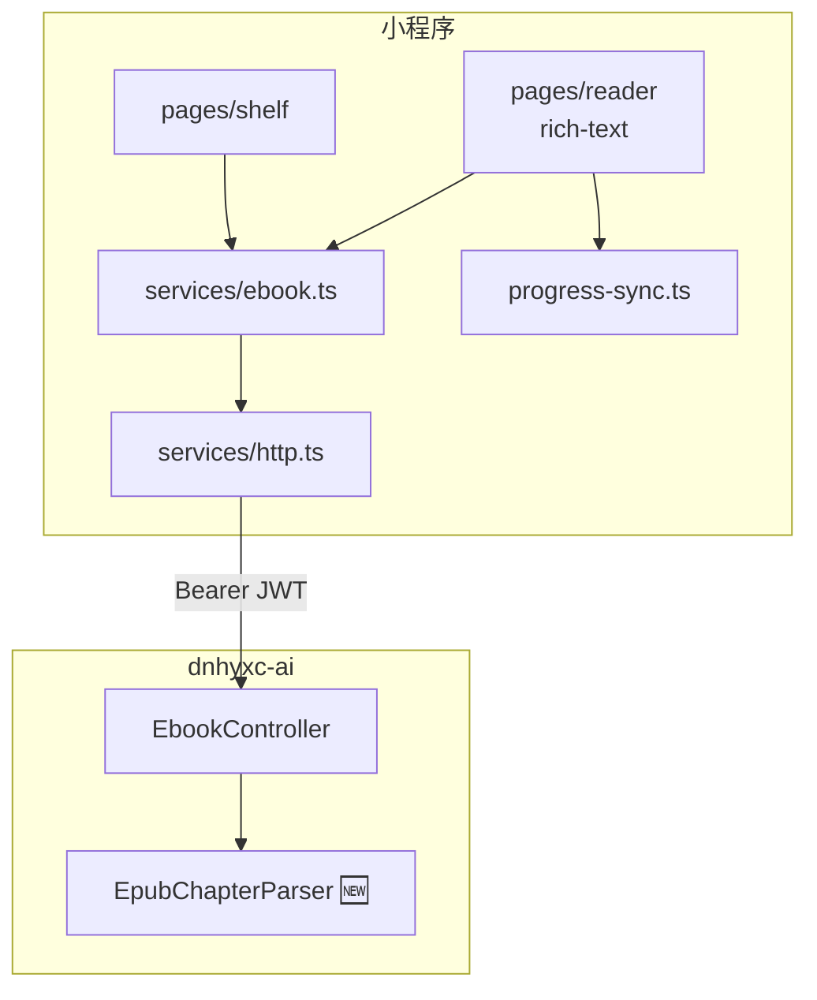

# Phase 1：书架 + EPUB 阅读（方案 B）

> **项目**：`dnhyxc-ebook-miniprogram`（uni-app 3 + Vue 3 + TS + wot-ui）  
> **后端**：`dnhyxc-ai` `/ebook/*` + 新增章节 API（见 [backend-ebook-chapter-api.md](./backend-ebook-chapter-api.md)）  
> **约束**：个人主体小程序 **不可用 `web-view`**，EPUB 由 **后端预解析章节 HTML**，小程序 `rich-text` 渲染。

---

## 1. 目标与范围

| 做                                           | 不做                               |
| -------------------------------------------- | ---------------------------------- |
| Tab「书架」+「我的」                         | 公开书架、划线、想法               |
| EPUB 按章阅读（纵向滚动 + 目录跳转）         | 客户端 epub.js、web-view 分包      |
| 进度 `chapterIndex + scrollPercent` 云端同步 | 小程序与 Web CFI 精确对齐（二期）  |
| 微信登录 + JWT                               | PDF 小程序内阅读（Toast 引导 Web） |

---

## 2. 技术路线（方案 B）

```
Web 上传 EPUB
    → 后端解析 spine → 清洗 HTML → 持久化
小程序
    → GET /ebook/shelf
    → GET /ebook/book/:id（含 prog）
    → GET .../chapters + GET .../chapter/:index
    → scroll-view + rich-text
    → PUT /ebook/progress（chapterIndex, scrollPercent, percent）
```

**与 Web 双轨进度**

| 端     | 主字段                          | 说明               |
| ------ | ------------------------------- | ------------------ |
| Web    | `epubCfi`                       | epub.js            |
| 小程序 | `chapterIndex`, `scrollPercent` | 章序 + 章内滚动比  |
| 共用   | `percent`                       | 全书 0–1，书架展示 |

---

## 3. 架构



---

## 4. 目录结构

```
src/
├── config/api.ts
├── types/ebook.ts
├── services/
│   ├── http.ts
│   ├── auth.ts
│   ├── ebook.ts
│   └── progress-sync.ts
├── hooks/
│   ├── useTheme.ts
│   ├── useTabbar.ts
│   └── useReaderSettings.ts
├── components/
│   ├── BookCover.vue
│   ├── AppNavbar.vue
│   └── AppTabbar.vue
└── pages/
    ├── shelf/index.vue      # Tab 书架
    ├── reader/index.vue     # 阅读（非 Tab）
    ├── mine/index.vue
    └── settings/index.vue
```

**已删除/不需要**：`packages/reader-webview/`、epub.js 分包、postMessage 桥。

---

## 5. 页面规格

### 5.1 书架 `pages/shelf`

- `onShow`：`ensureToken()` → `GET /ebook/shelf`
- 网格封面（2–3 列），底部进度条（`prog.percent`）
- 点击 EPUB → `navigateTo` reader；PDF → Toast「请前往 Web 阅读」
- 下拉刷新、空态、未登录引导

### 5.2 阅读 `pages/reader`

- 入参：`bookId`
- 拉 `GET /ebook/book/:id` → 恢复 `chapterIndex` / `scrollPercent`
- 拉 `GET .../chapters`（目录抽屉）
- 拉 `GET .../chapter/:index` → `rich-text` 渲染 `html`
- 顶栏：返回、书名、目录；底栏：上一章 / 下一章
- 点击正文区切换 chrome 显隐
- 阅读设置（本地）：字号、纸色（白/护眼/绿/暗）
- `onScroll` 防抖记进度；`onHide` / `onUnload` → `flushProgressSave()`

### 5.3 我的 / 设置

- 沿用现有主题切换；设置页保留背景主题选择

---

## 6. API 清单

| 接口                                 | 状态      | 用途            |
| ------------------------------------ | --------- | --------------- |
| `POST /auth/wechat/login`            | 后端 M0   | 微信 code → JWT |
| `GET /ebook/shelf`                   | 已有      | 书架            |
| `GET /ebook/book/:id`                | 扩展 prog | 开书            |
| `GET /ebook/book/:id/chapters`       | **新增**  | 目录            |
| `GET /ebook/book/:id/chapter/:index` | **新增**  | 章节 HTML       |
| `PUT /ebook/progress`                | 扩展 body | 进度同步        |

详见 [backend-ebook-chapter-api.md](./backend-ebook-chapter-api.md)。

---

## 7. 里程碑

| 阶段   | 内容                    | 验收                               |
| ------ | ----------------------- | ---------------------------------- |
| **M0** | 微信登录 JWT            | 小程序带 token 调通 `/ebook/shelf` |
| **M1** | 后端章节解析 + 两章 API | Postman 返回合法 HTML              |
| **M2** | 书架页                  | 列表、开书、PDF 拦截               |
| **M3** | 阅读页                  | 滚动、切章、目录、进度回写         |
| **M4** | 联调打磨                | 409 解析中、图片加载、断网提示     |

---

## 8. 风险与对策

| 风险                 | 对策                                         |
| -------------------- | -------------------------------------------- |
| `rich-text` CSS 受限 | 服务端简化 HTML；复杂版式接受降级            |
| 章节 HTML 体积大     | 按章分页；图片 CDN + 懒加载                  |
| 解析耗时             | `parse_status=pending` + 书架/阅读页 Loading |
| 进度双轨不一致       | 一期以 `percent` 粗同步；二期 href↔CFI 映射  |

---

## 9. 环境配置

```bash
# .env.development（本地，勿提交密钥）
VITE_API_BASE_URL=https://your-api.example.com
```

`src/config/api.ts` 读取 `import.meta.env.VITE_API_BASE_URL`。

---

## 10. 验收清单

- [ ] 登录后书架展示与 Web 同一用户数据
- [ ] 打开 EPUB 显示第一章正文（含图片）
- [ ] 切换章节、目录跳转正常
- [ ] 退出再进恢复到上次章节与大致滚动位置
- [ ] Web 端可见更新后的 `percent`
- [ ] 个人主体包体无 web-view / 无业务域名配置

---

**相关文档**

- [backend-ebook-chapter-api.md](./backend-ebook-chapter-api.md) — 后端章节 API 规范
- [dnhyxc-ai ebook 专题](https://github.com/dnhyxc/dnhyxc-ai/blob/main/docs/ebook/README.md) — Web 端参考
