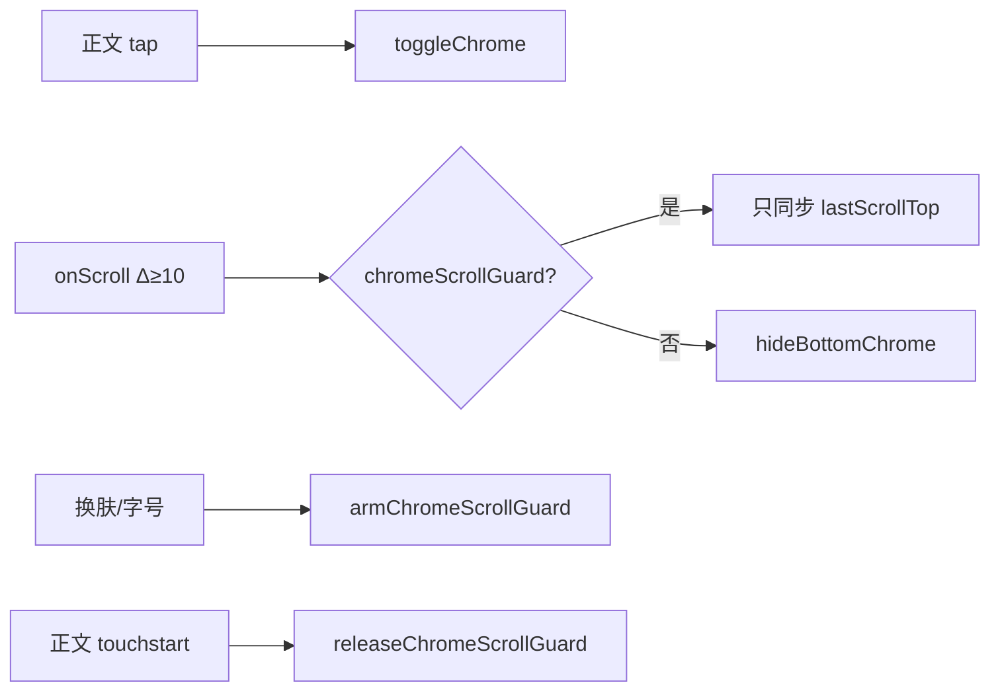

# 阅读页底部操作栏（实现思路）

> **状态**：已采纳  
> **关联文件**：`src/pages/reader/index.vue`、`src/hooks/useReaderSettings.ts`  
> **来源会话**：[EPUB 阅读与操作栏](8b499fc2-b71a-4661-a818-13e365c53986)、[阅读 UI 迭代](478d2163-8768-4eb5-8e66-d25230844f76)

---

## 1. 需求背景（必填）

用户要求底部操作体验对齐微信读书：默认沉浸；点击正文显示底部栏；栏内提供目录、主题、翻页方式、字体（字号+行距同面板）；出现/消失要有过渡动画；Header 保持始终可见。后续又要求：换肤/改字号不能因正文重排的伪滚动立刻收起栏，但手动滑动要立刻收起。

---

## 2. 用户需求与 Agent 问答（必填）

### 2.1 微信读书式底部栏

**用户：**

> 我希望跟微信读书一样，点击页面才让底部出现操作条，操作条中要包含目录、主题切换、翻页方式设置、字体大小、行距设置，其中字体大小和行距设置放在一起……注意只需要改底部的 UI 及操作，头部的 UI 保持不变

**Agent 回答摘要：**

- `chromeVisible` 默认 false，点击正文切换
- 底部四入口 + `bottomPanel` 子面板
- `pageMode` 写入 `useReaderSettings`（左右翻页暂 toast）

### 2.2 过渡动画

**用户：**

> 点击出现底部操作栏时要有过渡动画效果

**已落地方案：** `transform: translateY(100%)` ↔ `translateY(0)` + opacity，约 0.28s。

### 2.3 Header 显隐策略（最终）

**用户（多轮）：**

> 还是将头部跟随底部操作栏一样…… / 顶部操作栏在页面滚动时也需要隐藏…… / header 不要改动，撤回对 header 的改动

**已采纳结论：** Header **始终显示**；仅底部栏随点击/滚动显隐。曾尝试的 header 跟随方案已撤回，不记为实现。

### 2.4 换肤不收栏、手动滑动收栏

**用户：**

> 切换主题或者切换字体字号或行距时，会出现选择后立即隐藏操作栏……我希望的是手动滑动需要立即收起，但是切换主题或者行号字体大小不要自动收起

**Agent 回答摘要：**

- 根因：`setContent` 重排触发 `scroll`，`|ΔscrollTop|≥10` 调用 `hideBottomChrome`
- 方案：`chromeScrollGuard`；换肤时 `arm`；正文 `touchstart` 立刻 `release`；停稳约 320ms 自动解除

---

## 3. 实现思路（必填）

### 3.1 总体策略

底部栏与目录解耦：`chromeVisible` 管工具栏；`bottomPanel` 管主题/翻页/字体子面板；目录用独立 `tocOpen`（见目录文档）。滚动收栏用护栏区分「用户滑动」与「样式重排伪滚动」。

### 3.2 控制流



### 3.3 分点设计

1. 工具栏四入口：`openBottomPanel('toc'|'theme'|'pageMode'|'typography')`
2. 再次点同一面板关闭子面板；目录再次点关闭抽屉
3. `streamPaddingStyle`：栏可见时给正文加 `paddingBottom`，避免内容被挡住
4. `chromeBarStyle`：背景/字色跟随纸张主题（含半透明）

---

## 4. 改动点对比：改前 / 改后（必填）

### 4.1 改动点：底栏从「上一章/下一章」改为四入口工具栏

- **位置**：`src/pages/reader/index.vue` 模板底部区域（约第 85–224 行）
- **差异摘要**：设置从独立 `wd-popup` 迁入底栏子面板；目录入口下沉到底栏。

#### 改动前

```vue
<!-- 显隐与 chrome 同步的简易底栏 -->
<view
  v-show="chromeVisible && chapterHtml"
  class="reader-bottom"
  :style="bottomBarStyle"
  @click.stop
>
  <!-- 仅上一章 / 进度 / 下一章 -->
  <wd-button size="small" :disabled="prevIndex == null" @click="goPrev">上一章</wd-button>
  <text class="chapter-indicator">{{ chapterIndex + 1 }} / {{ chapterTotal }}</text>
  <wd-button size="small" :disabled="nextIndex == null" @click="goNext">下一章</wd-button>
</view>

<!-- 设置在独立底部弹层 -->
<wd-popup v-model="settingsOpen" position="bottom" round>
  <view class="settings-panel">
    <!-- 字号按钮 A- / A+、字体、行距、背景按钮组 -->
  </view>
</wd-popup>
```

#### 改动后

```vue
<!-- 固定底栏：默认藏在屏下，visible 时滑入 -->
<view
  v-if="hasContent"
  class="reader-chrome-bottom"
  :class="{
    'reader-chrome-bottom--visible': chromeVisible,
    'reader-chrome-bottom--dark': paperTheme === 'dark',
  }"
  :style="chromeBarStyle"
  @click.stop
>
  <!-- 子面板：主题色块 / 翻页方式 / 字号行距滑轨 -->
  <view v-if="bottomPanel" class="reader-subpanel">
    <!-- theme | pageMode | typography 三分支（略） -->
  </view>
  <!-- 四入口工具条 -->
  <view class="reader-toolbar">
    <view class="toolbar-item" @click="openBottomPanel('toc')">
      <AppIcon name="list" :size="22" :color="readerStyle.color" />
      <text class="toolbar-label">目录</text>
    </view>
    <view class="toolbar-item" @click="openBottomPanel('theme')">
      <text class="toolbar-label">主题</text>
    </view>
    <view class="toolbar-item" @click="openBottomPanel('pageMode')">
      <text class="toolbar-label">翻页</text>
    </view>
    <view class="toolbar-item" @click="openBottomPanel('typography')">
      <text class="toolbar-label">字体</text>
    </view>
  </view>
</view>
```

### 4.2 改动点：底栏滑入样式

- **位置**：同文件 `<style>` → `.reader-chrome-bottom`（约第 1302–1323 行）
- **差异摘要**：用 transform/opacity 代替 `v-show` 瞬间出现。

#### 改动前

```scss
/* 旧底栏无进出动画，依赖 v-show */
.reader-bottom {
  /* 贴底固定 */
  position: fixed;
  left: 0;
  right: 0;
  bottom: 0;
  /* 无 transform 过渡 */
}
```

#### 改动后

```scss
/* 默认移出视口并不可点 */
.reader-chrome-bottom {
  position: fixed;
  left: 0;
  right: 0;
  bottom: 0;
  z-index: 100;
  /* 含安全区 */
  padding-bottom: env(safe-area-inset-bottom);
  /* 藏到屏幕下方 */
  transform: translateY(100%);
  opacity: 0;
  pointer-events: none;
  /* 滑入滑出曲线 */
  transition:
    transform 0.28s cubic-bezier(0.32, 0.72, 0, 1),
    opacity 0.28s ease;
}

/* 可见态回到原位 */
.reader-chrome-bottom--visible {
  transform: translateY(0);
  opacity: 1;
  pointer-events: auto;
}
```

### 4.3 改动点：翻页模式写入设置 hook

- **位置**：`src/hooks/useReaderSettings.ts` → `pageMode` / `setPageMode`
- **差异摘要**：持久化翻页偏好；横向模式尚未实现，先 toast。

#### 改动前

```ts
// 无翻页模式状态
// 设置面板也不提供「上下滚动 / 左右翻页」
```

#### 改动后

```ts
// 翻页模式联合类型
export type ReaderPageMode = "scroll" | "horizontal";
// 本地存储 key
const PAGE_MODE_KEY = "reader-page-mode";

// 读取：非法值回落 scroll
function loadPageMode(): ReaderPageMode {
  const v = uni.getStorageSync(PAGE_MODE_KEY) as ReaderPageMode;
  return v === "horizontal" ? v : "scroll";
}

// 响应式状态
const pageMode = ref<ReaderPageMode>(loadPageMode());
// 变更即持久化
watch(pageMode, (v) => uni.setStorageSync(PAGE_MODE_KEY, v));

// UI 切换入口
function setPageMode(mode: ReaderPageMode) {
  // 左右翻页尚未落地，仅提示
  if (mode === "horizontal") {
    uni.showToast({ title: "左右翻页即将支持", icon: "none" });
    return;
  }
  // 上下滚动可写入
  pageMode.value = mode;
}
```

### 4.4 改动点：滚动收栏护栏

- **位置**：`src/pages/reader/index.vue` → `armChromeScrollGuard` / `onScroll`（约第 1153–1216 行）
- **差异摘要**：区分伪滚动与手指滑动。

#### 改动前

```ts
// 任一足够大的 scrollTop 变化都收栏
function onScroll(e: { detail: { scrollTop: number } }) {
  const top = e.detail.scrollTop;
  // 无护栏：换肤重排也会走进这里
  if (chromeVisible.value && Math.abs(top - lastScrollTopForChrome) >= 10) {
    hideBottomChrome();
  }
  lastScrollTopForChrome = top;
}
```

#### 改动后

```ts
// 样式重排护栏开关
let chromeScrollGuard = false;
// 停稳自动解除的定时器
let chromeScrollGuardTimer: ReturnType<typeof setTimeout> | null = null;

// 换肤 / 打开栏时开启护栏
function armChromeScrollGuard() {
  chromeScrollGuard = true;
  bumpChromeScrollGuardSettle();
}

// 伪滚动停稳约 320ms 后解除
function bumpChromeScrollGuardSettle() {
  if (chromeScrollGuardTimer) clearTimeout(chromeScrollGuardTimer);
  chromeScrollGuardTimer = setTimeout(() => {
    chromeScrollGuard = false;
    chromeScrollGuardTimer = null;
    lastScrollTopForChrome = currentScrollTop.value;
  }, 320);
}

// 手指点到正文立刻解除，后续滑动可收栏
function releaseChromeScrollGuard() {
  if (!chromeScrollGuard && !chromeScrollGuardTimer) return;
  chromeScrollGuard = false;
  if (chromeScrollGuardTimer) {
    clearTimeout(chromeScrollGuardTimer);
    chromeScrollGuardTimer = null;
  }
}

function onScroll(e: { detail: { scrollTop: number; scrollHeight: number } }) {
  const { scrollTop: top, scrollHeight: height } = e.detail;
  // 护栏期：只同步基准，不收栏，并续期
  if (chromeScrollGuard) {
    lastScrollTopForChrome = top;
    bumpChromeScrollGuardSettle();
  } else if (
    chromeVisible.value &&
    Math.abs(top - lastScrollTopForChrome) >= SCROLL_HIDE_CHROME_PX
  ) {
    // 真实用户滑动：立刻收起底栏（并关目录）
    hideBottomChrome();
    lastScrollTopForChrome = top;
  } else {
    lastScrollTopForChrome = top;
  }
  currentScrollTop.value = top;
  scrollHeight.value = height;
  // …章节激活与边缘加载省略
}
```

---

## 5. 验证要点（建议）

- [ ] 进入阅读：底栏默认隐藏，Header 始终在
- [ ] 点正文：底栏滑入；再点：滑出
- [ ] 主题 / 翻页 / 字体子面板互斥切换；左右翻页 toast
- [ ] 改主题/字号/行距：底栏保持；手指再滑正文：立刻收起
- [ ] 底栏打开时正文不被遮挡（有 paddingBottom）

---

## 6. 影响分析（必填，放在文档最后）

### 6.1 结论

- **是否影响已有功能点**：是 — 底栏交互与设置入口全面替换旧「上一章/下一章 + settings popup」。
- **是否影响既有正常逻辑**：局部影响 — `useReaderSettings` 新增 `pageMode`；Header 右侧目录/设置入口已移除（目录改底栏）。

### 6.2 影响点明细

| #   | 影响对象      | 影响方式                  | 程度 | 说明与回归建议                   |
| --- | ------------- | ------------------------- | ---- | -------------------------------- |
| 1   | 阅读设置入口  | 从 navbar/popup 迁到底栏  | 高   | 走一遍四入口                     |
| 2   | 滚动收栏      | 增加护栏时序              | 中   | 换肤后立刻滑、停一会再滑两种路径 |
| 3   | 正文避让      | 可见时 paddingBottom      | 中   | 滚到章末确认不被挡               |
| 4   | pageMode 存储 | 新 key `reader-page-mode` | 低   | 清缓存后默认上下滚动             |

### 6.3 调用面 / 波及说明

`useReaderSettings` 目前主要被阅读页使用；`pageMode` / `paperStyles` 导出供底栏色块。书架/设置页主题体系与纸张主题独立，无直接耦合。
