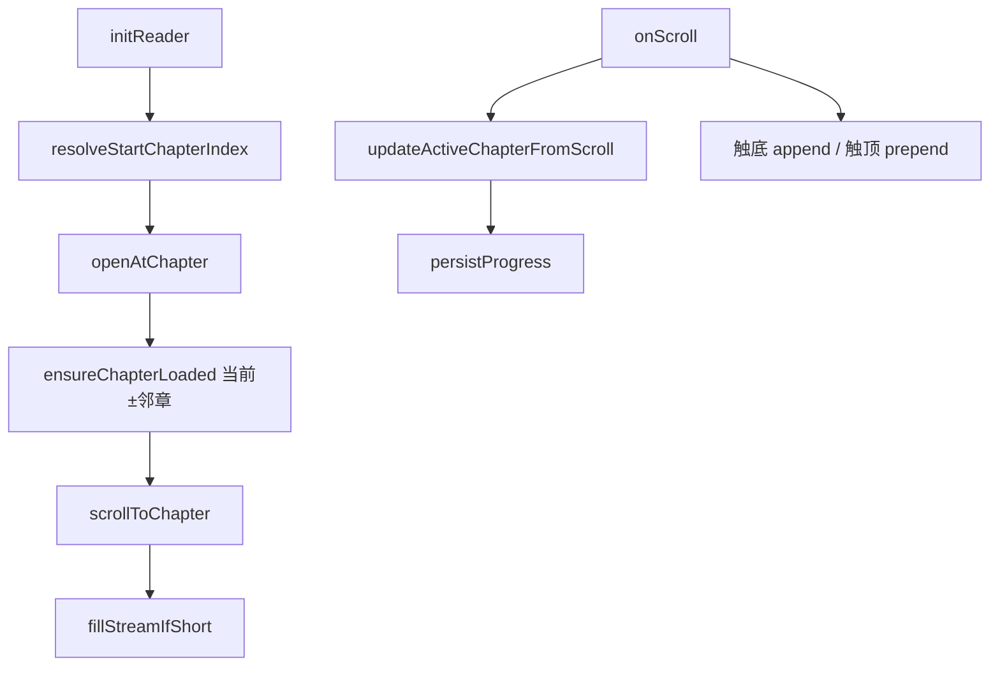

# 阅读页连续章节流与起始章恢复（实现思路）

> **状态**：已采纳  
> **关联文件**：`src/pages/reader/index.vue`、`src/types/ebook.ts`  
> **来源会话**：[EPUB 阅读与操作栏](8b499fc2-b71a-4661-a818-13e365c53986)

---

## 1. 需求背景（必填）

原阅读页一次只渲染一章 HTML，靠左右滑或底栏「上一章 / 下一章」切章。用户要求改成微信读书式体验：上下滚动时上下章内容在同一滚动流中紧密衔接；短章不足一屏时仍能继续往下读。同时修复「首次解析完成后跳到最后一章」的进度恢复错误。

成功标准：多章拼接在同一 `scroll-view`；触底/触顶自动加载邻章；向前插入章节时视觉位置不跳；无有效进度时从第 0 章开始。

---

## 2. 用户需求与 Agent 问答（必填）

### 2.1 首次阅读跳到末章

**用户：**

> 首次点击书籍进行阅读时，等待解析完成后，他会跳转到最后一章，而不是第一章。正常应该在第一章。

**Agent 回答摘要：**

- 怀疑进度恢复 / 起始章索引计算错误
- 核对 `prog.percent` 刻度（Web 0–100 vs 小程序 0–1）

**已落地方案要点：**

- 抽出 `toProgressRatio`：`percent > 1` 时按百分比除以 100
- `resolveStartChapterIndex`：优先 `chapterIndex`，否则用归一化 ratio 估算；无进度则 0

### 2.2 希望上下滑动切章

**用户：**

> 阅读时能够改为上下滑动切换章节？

**Agent 回答摘要：**

- 先做过「章首/章末手势切章」中间方案

**说明：** 该中间方案已被后续连续流完全替代，**不写入实现细节**；仅记录需求演进。

### 2.3 连续流（微信读书式）

**用户：**

> 这种方式向下滑动无法让下一章的内容紧接着在上一章的上面……无法像微信读书一样……同时如果页面没有出现滚动条，则无法实现上下滑动翻页

**Agent 回答摘要：**

- 改为多章拼接同一滚动流
- 触底 append、触顶 prepend，短章用 `fillStreamIfShort` 预加载

**已落地方案要点：**

- `chapterBlocks[]` + `v-for` 渲染多块 `mp-html`
- `appendNextChapter` / `prependPrevChapter` + 滚动阈值
- prepend 后按新增块高度补偿 `scrollTop`

---

## 3. 实现思路（必填）

### 3.1 总体策略

不维护「当前章 HTML 单缓冲」，改为「窗口内多章块」列表。切目录/跳章时用 `openAtChapter` 重建窗口并滚动到目标块；阅读中靠滚动位置推断当前章并上报进度。

### 3.2 数据流 / 控制流



### 3.3 分点设计

1. **起始章**：见 4.1 — 归一化 percent，避免 `100 * total` 落在末章。
2. **块模型**：`ChapterBlock { index, title, html, href }`，加载时即 `stripReaderColorStyles`（与换肤文档共用）。
3. **连续加载**：`lower-threshold` / `upper-threshold` 与 `onScroll` 内距离检测双保险。
4. **向前插入补偿**：prepend 后测量新块高度，把 `scrollTop` 加上 delta，避免视口内容被顶走。
5. **短章补齐**：`fillStreamIfShort` 递归预加载直到可滚或到达末章。

---

## 4. 改动点对比：改前 / 改后（必填）

### 4.1 改动点：起始章解析迁入类型层并归一化 percent

- **位置**：改前 `src/pages/reader/index.vue` → `resolveStartIndex`；改后 `src/types/ebook.ts` → `toProgressRatio` / `resolveStartChapterIndex`
- **差异摘要**：Web 端 `percent=100` 不再被当成 ratio=100 算出末章；逻辑可复用。

#### 改动前

```ts
// 仅在阅读页内部根据进度推起始章
function resolveStartIndex(
  // 服务端/本地保存的章节下标
  progChapterIndex: number | undefined,
  // 全书进度；此处未区分 0–1 与 0–100
  progPercent: number | undefined,
  // 总章节数
  total: number,
): number {
  // 有明确章序时夹在合法范围内
  if (progChapterIndex != null && progChapterIndex >= 0) {
    // 防止越界到不存在的章
    return Math.min(progChapterIndex, total - 1);
  }
  // 无章序时用 percent * total 估算（若 percent 为 100 会直接落到末章）
  if (progPercent != null && total > 0) {
    // 错误刻度：100 * total → floor 后夹到 total-1
    return Math.min(Math.floor(progPercent * total), total - 1);
  }
  // 无进度从第一章
  return 0;
}
```

#### 改动后

```ts
// Web 端 percent 为 0–100，小程序为 0–1；>1 按百分比刻度归一
export function toProgressRatio(percent: number): number {
  // 非法或非正值一律视为无进度
  if (!Number.isFinite(percent) || percent <= 0) return 0;
  // 大于 1 视为百分制，除以 100；否则视为 ratio
  return percent > 1 ? percent / 100 : percent;
}

// 恢复阅读起始章：优先 chapterIndex，否则按 percent 估算
export function resolveStartChapterIndex(
  // 已保存章节下标
  progChapterIndex: number | undefined,
  // 全书进度（可能是 0–1 或 0–100）
  progPercent: number | undefined,
  // 目录总章数
  total: number,
): number {
  // 无章节时固定 0
  if (total <= 0) return 0;
  // 有合法章序直接使用
  if (progChapterIndex != null && progChapterIndex >= 0) {
    // 夹到最后一章以内
    return Math.min(progChapterIndex, total - 1);
  }
  // 否则尝试用百分比重构章序
  if (progPercent != null) {
    // 先归一到 0–1
    const ratio = toProgressRatio(progPercent);
    // 仅当确实有进度时估算
    if (ratio > 0) {
      // floor(ratio*total) 再夹紧
      return Math.min(Math.floor(ratio * total), total - 1);
    }
  }
  // 首次阅读 / 无进度 → 第一章
  return 0;
}
```

### 4.2 改动点：单章 HTML → 多章 `chapterBlocks` 流

- **位置**：`src/pages/reader/index.vue` 模板与状态（约第 21–71、282–298 行）
- **差异摘要**：滚动容器内可同时存在多章；不再依赖左右滑切章。

#### 改动前

```vue
<!-- 有单章 HTML 时才显示滚动区 -->
<scroll-view
  v-if="chapterHtml"
  scroll-y
  class="reader-scroll"
  :scroll-top="scrollTop"
  @scroll="onScroll"
  @tap="toggleChrome"
>
  <!-- 整页只有一个 mp-html -->
  <view class="reader-body" :style="readerStyle">
    <!-- 章节切换靠换 content / key -->
    <mp-html
      :key="chapterRenderKey"
      :content="chapterHtml"
      :tag-style="mpTagStyle"
      :container-style="containerStyle"
    />
  </view>
</scroll-view>
```

#### 改动后

```vue
<!-- 有任一章节块即显示连续流 -->
<scroll-view
  v-if="hasContent"
  scroll-y
  enhanced
  :bounces="false"
  class="reader-scroll"
  :scroll-top="scrollTop"
  lower-threshold="280"
  upper-threshold="280"
  @scroll="onScroll"
  @scrolltolower="onScrollNearEnd"
  @scrolltoupper="onScrollNearStart"
>
  <!-- 多章垂直拼接 -->
  <view class="reader-stream" :style="streamPaddingStyle" @tap="toggleChrome">
    <!-- 每个已加载章节一块 -->
    <view
      v-for="block in chapterBlocks"
      :id="`chapter-${block.index}`"
      :key="`${block.index}-${mpRenderKey}`"
      class="chapter-block"
      :style="readerStyle"
    >
      <!-- 章标题（可选） -->
      <view v-if="block.title" class="chapter-heading">{{ block.title }}</view>
      <!-- 每章独立 mp-html，便于 setContent 换肤 -->
      <mp-html
        v-if="mpHtmlMounted"
        :ref="bindMpHtmlRef(block.index)"
        :content="block.html"
        :tag-style="mpTagStyle"
        :container-style="containerStyle"
      />
    </view>
  </view>
</scroll-view>
```

### 4.3 改动点：打开章节窗口与边缘扩展

- **位置**：`openAtChapter` / `appendNextChapter` / `prependPrevChapter` / `onScroll`（约第 964–1216 行）
- **差异摘要**：跳章重建窗口；滚动加载邻章；prepend 补偿滚动位置。

#### 改动前

```ts
// 切章时清空并只加载一章
async function loadChapter(index: number, scrollPercent = 0) {
  // 单缓冲清空
  chapterHtml.value = "";
  // 拉取单章
  const data = await fetchChapter(bookId.value, index);
  // 写入唯一 HTML
  chapterHtml.value = data.html;
  // 再按章内百分比滚动（省略）
}
```

#### 改动后

```ts
// 以目标章为中心重建滚动窗口
async function openAtChapter(index: number, scrollPercent = 0, forceRefresh = false) {
  // 清空旧块，避免残留章错位
  chapterBlocks.value = [];
  // 关闭目录以免遮挡
  closeToc();
  // 同步标题/前后章元数据
  setActiveChapterMeta(index);
  // 确保目标章在列表中
  await ensureChapterLoaded(index, forceRefresh);
  // 预取邻章，保证一屏内可连续滚
  const neighbors: Promise<void>[] = [];
  // 下一章
  if (index + 1 < chapterTotal.value) neighbors.push(ensureChapterLoaded(index + 1, forceRefresh));
  // 上一章（有章内进度或常规回看都需要）
  if (index > 0) neighbors.push(ensureChapterLoaded(index - 1, forceRefresh));
  // 等邻章就绪
  await Promise.all(neighbors);
  // 滚到目标块并套用章内百分比
  await scrollToChapter(index, scrollPercent);
  // 上报进度
  persistProgress(scrollPercent);
  // 短章继续向后填，直到可滚动
  void fillStreamIfShort();
}

// 触底追加下一章
async function appendNextChapter() {
  // 取当前窗口最后一章下标
  const last = lastLoadedIndex();
  // 已到书末则跳过
  if (last == null || last >= chapterTotal.value - 1) return;
  // 防并发扩展
  if (expandingEdge === "bottom" || loadingMore.value) return;
  // 标记底部扩展中
  expandingEdge = "bottom";
  // 展示底部 loading
  loadingMore.value = true;
  try {
    // 只加载 last+1
    await ensureChapterLoaded(last + 1);
  } finally {
    // 复位 loading / 锁
    loadingMore.value = false;
    expandingEdge = null;
  }
}

// 触顶插入上一章并补偿 scrollTop
async function prependPrevChapter() {
  // 当前窗口第一章
  const first = firstLoadedIndex();
  // 已到书首
  if (first == null || first <= 0) return;
  // 防并发
  if (expandingEdge === "top" || loadingMore.value) return;
  expandingEdge = "top";
  loadingMore.value = true;
  // 记录插入前滚动位置与内容高度
  const prevTop = currentScrollTop.value;
  const prevHeight = scrollHeight.value;
  try {
    // 插入 first-1
    await ensureChapterLoaded(first - 1);
    await nextTick();
    // 等布局
    await new Promise((r) => setTimeout(r, 100));
    // 测量新块高度，把视口钉在原内容
    await new Promise<void>((resolve) => {
      createQuery()
        .select(`#chapter-${first - 1}`)
        .boundingClientRect((rect) => {
          // 新增块高度；测不到则用 scrollHeight 差兜底
          const added = rect && !Array.isArray(rect) ? (rect.height ?? 0) : 0;
          const delta = added > 0 ? added : Math.max(scrollHeight.value - prevHeight, 0);
          // 补偿后视口内容不变
          const nextTop = prevTop + delta;
          scrollTop.value = nextTop;
          currentScrollTop.value = nextTop;
          resolve();
        })
        .exec();
    });
  } finally {
    loadingMore.value = false;
    expandingEdge = null;
  }
}
```

---

## 5. 验证要点（建议）

- [ ] 无进度新书打开落在第 1 章（index 0）
- [ ] Web 同步下来的 `percent≈100` 且无 `chapterIndex` 时不会误跳末章（有 `chapterIndex` 仍尊重章序）
- [ ] 向下滚：下一章紧接上一章，无整页跳顶
- [ ] 向上滚到顶：上一章插入后阅读位置不跳动
- [ ] 短章（不足一屏）仍能继续加载后续章

---

## 6. 影响分析（必填，放在文档最后）

### 6.1 结论

- **是否影响已有功能点**：是 — 阅读页从「单章翻页」变为「多章连续流」，切章交互与进度上报路径均变化。
- **是否影响既有正常逻辑**：局部影响 — `resolveStartChapterIndex` / `toProgressRatio` 抽到 `ebook.ts`，当前仅阅读页调用；底栏「上一章/下一章」按钮已移除，改由滚动流承担。

### 6.2 影响点明细

| #   | 影响对象   | 影响方式                  | 程度 | 说明与回归建议                    |
| --- | ---------- | ------------------------- | ---- | --------------------------------- |
| 1   | 阅读页切章 | 不再左右滑/底栏按钮切章   | 高   | 真机验证连续滚与目录跳转          |
| 2   | 进度恢复   | percent 刻度归一          | 高   | 用带 Web 百分制进度的书验证开篇章 |
| 3   | 章节缓存   | 窗口内可同时缓存多章 HTML | 中   | 大书滚动时关注内存与请求次数      |
| 4   | 进度上报   | 按视口锚点章 + 章内比     | 中   | 滚跨章后杀进程再进，位置应接近    |

### 6.3 调用面 / 波及说明

`Grep`：`resolveStartChapterIndex`、`toProgressRatio` 仅 `src/pages/reader/index.vue` 与 `src/types/ebook.ts` 自身使用；书架等其它页无引用。连续流逻辑封闭在阅读页。
