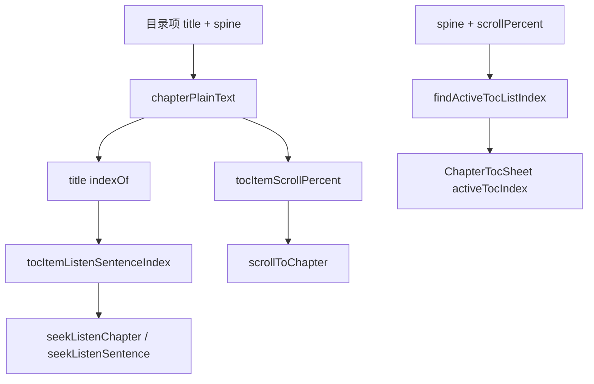

# 目录 TOC 与听书节起点播（实现思路）

> **状态**：已采纳  
> **关联文件**：`src/utils/ebook-toc.ts`、`src/pages/reader/index.vue`、`src/pages/listen/index.vue`、`src/components/ChapterTocSheet.vue`、`src/utils/listen-text.ts`  
> **来源会话**：[听书切句与起播](c3f8bd51-ec80-47b8-be74-2f558038843f)

---

## 1. 需求背景（必填）

同一 spine 文件内常有多节目录项。需要：目录高亮正确；点目录从**该节标题所在句**起播；阅读页听书时 `tocSplit` 不能挡住分段 `mp-html` 导致高亮消失；滚动定位与起播句用同一套纯文本坐标，避免「比 × 句数」偏到节标题前。

成功标准：点目录从节起点播；播放位进展示区；听书高亮可见；目录当前项高亮与播放/滚动位一致。

---

## 2. 用户需求与 Agent 问答（必填）

### 2.1 目录跳转与选中

**用户：**

> 目前目录虽然展示正常了，但是点击目录无法正常跳转到对应的章节，同时目录中章节选中也有问题

**Agent 回答摘要（已落地）：**

- 抽出 `ebook-toc`：`findActiveTocListIndex` / `splitHtmlAtTocTitle` / `tocItemScrollPercent`
- 抽屉用列表下标高亮，不是 spine index

### 2.2 节起点播偏到标题前 / 上方

**用户：**

> 听书切换章节如图，他会从当前章节上面开始播，并不是以当前章节的起始开始播

**Agent 回答摘要（已落地）：**

- `tocItemListenSentenceIndex`：标题在纯文本中的 offset → `sentenceIndexAtPlainOffset`
- 起播不再用 `scrollPercent × 句数` 估下标

### 2.3 听书高亮被 tocSplit 挡住

**用户：**

> 目前听书，播放文本高亮无法正常展示了

**Agent 回答摘要（已落地）：**

- 模板：`isListenSegmentedChapter` 优先于 `tocSplit`
- 起播 / 听书切节前清空 `block.tocSplit`

---

## 3. 实现思路（必填）

### 3.1 总体策略

目录几何与听书分句共用 `chapterPlainText` / `chapterToSentences`，一处映射、两处消费（滚屏比 + 起播句）。听书分段与目录锚点互斥，听书路径不用 `tocSplit`。

### 3.2 数据流



### 3.3 分点设计

1. **工具模块** `ebook-toc.ts`：纯函数，阅读页/听书页共用。
2. **起播句**：标题 offset → 句下标；滚动用 percent 顶齐。
3. **模板优先级**：听书分段 > tocSplit > 整章。
4. **听书切节**：`jumpListenToTocItem`（先滚后 seek，见滚屏文档）。

---

## 4. 改动点对比：改前 / 改后（必填）

### 4.1 改动点：新建 `ebook-toc.ts`

- **位置**：`src/utils/ebook-toc.ts`（新建；未入库于 `HEAD`）
- **差异摘要**：集中目录定位与起播句映射。

#### 改动前

```ts
// （无，新建文件）
// 原先目录高亮/跳转逻辑散落在 reader 页内，且缺少「标题 → 听书句下标」
```

#### 改动后

```ts
// 章内纯文本（与听书分句同一清洗）
export function chapterPlainText(html: string): string {
  // 与 listen-text 同一套去 markdown / 转纯文本
  return stripMarkdownForTts(htmlToPlainText(html || ""));
}

// 目录项 → 听书起播句（标题所在朗读单元）
export function tocItemListenSentenceIndex(chapterHtml: string, item: ChapterMeta): number {
  // 与播放队列同一分句结果
  const list = chapterToSentences(chapterHtml);
  // 空章从 0
  if (!list.length) return 0;
  // 取目录标题
  const title = (item.title ?? "").trim();
  // 无标题从 0
  if (!title) return 0;
  // 标题在纯文本中的起点
  const plain = chapterPlainText(chapterHtml);
  // 找不到标题则章首
  const pos = plain.indexOf(title);
  // 未命中回退 0
  if (pos < 0) return 0;
  // 字符偏移映射到句下标
  return sentenceIndexAtPlainOffset(list, pos);
}
```

（同文件另含 `findActiveTocListIndex` / `splitHtmlAtTocTitle` / `tocItemScrollPercent`。）

### 4.2 改动点：滚动比 → 句下标改为纯文本坐标

- **位置**：`src/utils/listen-text.ts` → `sentenceIndexAtScrollPercent`
- **差异摘要**：避免长短句不均时起播偏到节标题前。

#### 改动前

```ts
// 旧逻辑（概念）：用句数比例估算
export function sentenceIndexAtScrollPercent(
  list: ListenSentence[],
  scrollPercent: number,
): number {
  // 钳制比例
  const p = Math.min(1, Math.max(0, scrollPercent));
  // 空列表
  if (!list.length) return 0;
  // 比 × 句数 —— 长短段不均时会偏早
  return Math.min(list.length - 1, Math.floor(p * list.length));
}
```

#### 改动后

```ts
// 章内滚动比 → 句下标：按纯文本坐标映射
export function sentenceIndexAtScrollPercent(
  list: ListenSentence[],
  scrollPercent: number,
): number {
  // 空列表
  if (!list.length) return 0;
  // 钳制 0~1
  const p = Math.min(1, Math.max(0, scrollPercent));
  // 顶部
  if (p <= 0) return 0;
  // 全文末字符坐标
  const plainEnd = list[list.length - 1]!.end;
  // 底部
  if (p >= 1 || plainEnd <= 0) return list.length - 1;
  // 比例落在纯文本上再映射句
  return sentenceIndexAtPlainOffset(list, p * plainEnd);
}
```

### 4.3 改动点：听书分段模板优先于 tocSplit

- **位置**：`src/pages/reader/index.vue` → 章节正文模板（约第 57–113 行）
- **差异摘要**：听书时不再渲染 tocSplit，恢复 `mp-html-章-段` 以便 `setContent` 高亮。

#### 改动前

```vue
<!-- 概念：tocSplit 与听书分段同级或 tocSplit 优先时 -->
<template v-if="mpHtmlMounted && block.tocSplit">
  <!-- 目录拆章会占住整章，听书分段 id 不存在 -->
  <mp-html :id="`mp-html-${block.index}-after`" :content="block.tocSplit.after || ''" />
</template>
<template v-else-if="mpHtmlMounted && isListenSegmentedChapter(block.index)">
  <!-- 听书分段进不来 → 高亮失效 -->
  <mp-html :id="`mp-html-${block.index}-${si}`" :content="seg.html || ''" />
</template>
```

#### 改动后

```vue
<!-- 听书分段优先：tocSplit 会挡住 mp-html-章-段 -->
<template v-if="mpHtmlMounted && isListenSegmentedChapter(block.index)">
  <!-- 每段独立 mp-html，供句高亮 setContent -->
  <view
    v-for="(seg, si) in block.segments"
    :id="`ls-${block.index}-${si}`"
    :key="`ls-${block.index}-${si}`"
    class="chapter-seg"
  >
    <!-- 段级实例 id -->
    <mp-html :id="`mp-html-${block.index}-${si}`" :content="seg.html || ''" />
  </view>
</template>
<!-- 目录跳转：仅非听书章使用 tocSplit -->
<template v-else-if="mpHtmlMounted && block.tocSplit">
  <!-- before / 锚点 / after -->
  <mp-html :id="`mp-html-${block.index}-after`" :content="block.tocSplit.after || ''" />
</template>
```

### 4.4 改动点：听书页目录选中与按节 seek

- **位置**：`src/pages/listen/index.vue` → `activeTocIndex` / `seekToTocItem`
- **差异摘要**：点目录用 `tocItemListenSentenceIndex`，不再默认章首句 0。

#### 改动前

```ts
// 概念：听书页点目录只传 spine，从句 0 起播
async function onTocSelect(item: ChapterMeta) {
  // 忽略节内标题位置
  await seekListenChapter(item.index, 0);
}
```

#### 改动后

```ts
// 目录项 → 节内起播句后切章
async function seekToTocItem(item: ChapterMeta) {
  // 默认句 0
  let fromSentence = 0;
  try {
    // 拉正文算标题句下标
    if (bookId.value) {
      // 与阅读页同一映射
      const data = await fetchChapter(bookId.value, item.index);
      // 节起点
      fromSentence = tocItemListenSentenceIndex(data.html || "", item);
    }
  } catch {
    // 无正文时仍切章
  }
  // 带标题覆盖章名
  await seekListenChapter(item.index, {
    fromSentence,
    chapterTitle: (item.title || "").trim() || undefined,
  });
}
```

---

## 5. 验证要点（建议）

- [ ] 同文件多节：点第二节目录从该节标题句起播，不从上一节尾巴起
- [ ] 听书中高亮可见；起播前若有 tocSplit 会被清掉
- [ ] 目录抽屉当前项随滚动/播放位置变化

---

## 6. 影响分析（必填）

### 6.1 结论

- **是否影响已有功能点**：是 — 目录跳转、听书起播句、阅读页正文模板分支。
- **是否影响既有正常逻辑**：局部 — 非听书目录仍用 tocSplit；听书路径改走分段优先。

### 6.2 影响点清单

| 影响对象             | 影响方式                            | 严重程度 | 回归建议                          |
| -------------------- | ----------------------------------- | -------- | --------------------------------- |
| 阅读页非听书目录跳转 | 仍 `splitHtmlAtTocTitle` + 锚点顶齐 | 低       | 未听书时点目录顶齐                |
| 听书起播句           | 与 `chapterToSentences` 粒度绑定    | 中       | 改分句后复测目录起播              |
| `ChapterTocSheet`    | 新增 `activeTocIndex`               | 低       | 阅读/听书页抽屉高亮               |
| 后端 TOC 字段        | 听书页优先 `res.toc`                | 低       | 见 `backend-ebook-chapter-api.md` |

### 6.3 相关文档

- 先滚后合成：[reader-listen-scroll-before-tts-impl.md](./reader-listen-scroll-before-tts-impl.md)
- 一句一合成：[reader-listen-sentence-unit-impl.md](./reader-listen-sentence-unit-impl.md)
- 听书页上下章按目录：[reader-listen-page-toc-chapter-nav-impl.md](./reader-listen-page-toc-chapter-nav-impl.md)
