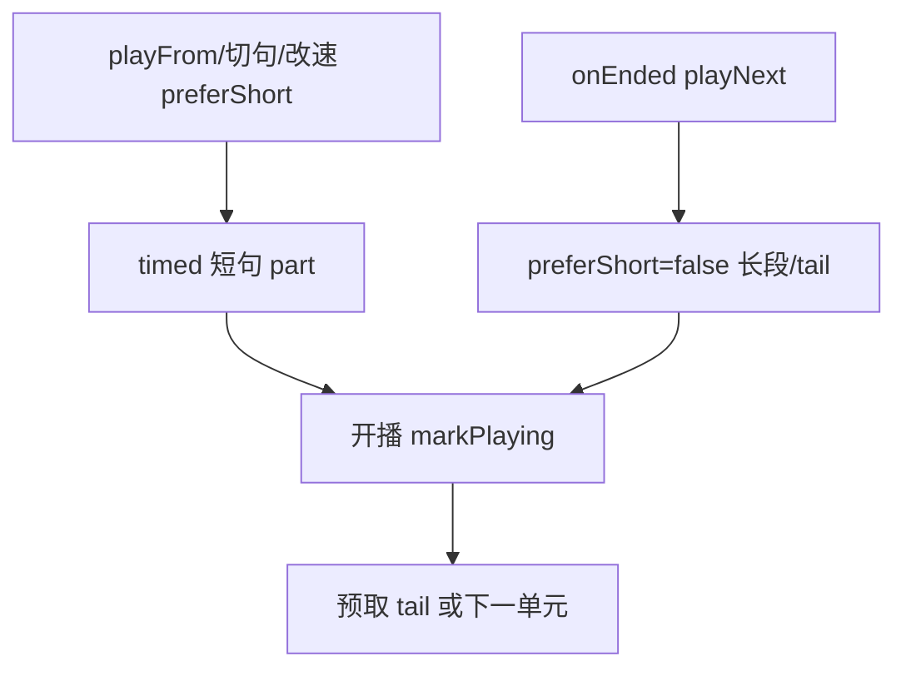

# 听书双轨合成：紧急短句 + 长片段接龙（实现思路）

> **状态**：已采纳  
> **关联文件**：`src/utils/listen-text.ts`、`src/services/tts-player.ts`、`src/hooks/useChapterListen.ts`  
> **来源会话**：[听书切句与起播](c3f8bd51-ec80-47b8-be74-2f558038843f)  
> **相关文档**：[TTS 预取](./reader-listen-tts-prefetch-impl.md)、[按句切换（历史口径）](./reader-listen-sentence-unit-impl.md)

---

## 1. 需求背景（必填）

一句一 `timed` 请求过多、卡顿；整段加长合成又让起播/切句/切章/改倍速首包变慢。需要：**需要立即出声的路径先短句合成**；连播与预取走**打包长片段**，且预取文本不得重复已播短句。

成功标准：起播快；连播少打 timed；预取为「剩余长段」不含首句；续播不再退回逐句 timed。

---

## 2. 用户需求与 Agent 问答（必填）

### 2.1 紧急短句 + 其余长片段

**用户：**

> 能否在首次开启听书/分句切换/章节切换/倍速切换/这种需要立即响应的播放时，先按原来的分段进行tts合成，其他的再按目前的方式合成？

**Agent 回答摘要（已落地）：**

- `preferShort`：仅 `playFrom` / 切句 / 改倍速音色等紧急入口为 true
- `playNext` 续播强制长段（整段或 `listenUnitTail` 剩余）
- 打包单元仍由 `chapterToSentences`（≤1200）+ `parts` 句级坐标

### 2.2 预取不要带上已播首句

**用户：**

> 开启听书时，预取的 TTS 转换会把之前初始转换的内容也加进去……正常应该去除。

**Agent 回答摘要（已落地）：**

- `listenUnitTailText` / `listenUnitTail`：从 `partIndex` 起拼接剩余
- 短句轨预取只打剩余文本；接龙优先播 tail 缓存

### 2.3 续播又变回按句 timed

**用户：**

> 目前这个改动影响了 timed 的调用时机，他现在会按句进行 tts 了

**Agent 回答摘要（已落地）：**

- `playNext` 设 `preferShort = false`
- 无缓存时续播合成剩余长段/整段，不再默认短句

---

## 3. 实现思路（必填）

### 3.1 总体策略

朗读队列仍是**打包单元**（少请求）；紧急路径只合成**当前 part**；后台预取/续播合成**剩余或下一单元**。用 `boundaryUnit` + `playPartOffset` 让剩余音频的 WordBoundary 仍能映射到章内句坐标。

### 3.2 控制流



### 3.3 分点设计

1. **`resolveListenSynthTarget`**：紧急用 part；`useUnit` 用整段。
2. **`listenUnitTail*`**：去掉已播句。
3. **`preferShort`**：一次性消费；续播禁止。
4. **`boundaryUnit`**：播 tail 时高亮/seek 用临时单元。

---

## 4. 改动点对比：改前 / 改后（必填）

### 4.1 改动点：剩余长段文本

- **位置**：`src/utils/listen-text.ts` → `listenUnitTailText` / `listenUnitTail`
- **差异摘要**：预取/接龙可去掉已播短句。

#### 改动前

```ts
// （无独立 tail API；预取直接用 unit.text 整段）
```

#### 改动后

```ts
/** 从 fromPartIndex 起的剩余文本（预取接龙用，去掉已播短句） */
export function listenUnitTailText(unit: ListenSentence, fromPartIndex: number): string {
  // 取段内句列表
  const parts = listenUnitParts(unit);
  // 越界则无剩余
  if (!parts.length || fromPartIndex >= parts.length) return "";
  // 从 0 起等于整段
  if (fromPartIndex <= 0) return unit.text;
  // 用空格拼接剩余句（与打包 text 规则一致）
  return parts
    .slice(fromPartIndex)
    .map((p) => p.text)
    .join(" ");
}
```

### 4.2 改动点：续播禁止短句轨

- **位置**：`src/services/tts-player.ts` → `playNext` / `playCurrent`
- **差异摘要**：自动连播一律长段，避免又变逐句 timed。

#### 改动前

```ts
// playNext 后 playCurrent 无 preferShort 门闩时
// 容易在无缓存分支再次走短句
const target = resolveListenSynthTarget(sentence, {
  // 强制短句轨
  partIndex: partIdx,
  useUnit: false,
});
```

#### 改动后

```ts
private async playNext(): Promise<void> {
  // 无句列表则结束
  if (!this.sentences.length) return;
  // 续播禁止短句
  this.preferShort = false;
  // …推进 part / 下一单元后
  await this.playCurrent();
}
```

```ts
// playCurrent 内：仅 allowShort 时走短句；否则 tail 或整段
const allowShort = this.preferShort;
// 消费一次性门闩
this.preferShort = false;
```

---

## 5. 验证要点（建议）

- [ ] 起播：先短句 timed，出声后再预取剩余（见预取文档）
- [ ] 预取 payload 不含已播首句
- [ ] 短句播完后接龙为长段，不再一句一 timed
- [ ] 切章/改倍速仍可短句首包

---

## 6. 影响分析（必填）

### 6.1 结论

- **是否影响已有功能点**：是（局部）— 合成粒度与切句缓存策略变化
- **是否影响既有正常逻辑**：是 — `playNext` / 预取文本 / 高亮坐标系（tail）

### 6.2 影响点明细

| #   | 影响对象               | 影响方式             | 程度 | 回归建议                 |
| --- | ---------------------- | -------------------- | ---- | ------------------------ |
| 1   | timed 次数             | 紧急短 + 长段接龙    | 高   | 起播与连播分别看网络面板 |
| 2   | 句高亮                 | tail 用 boundaryUnit | 中   | 长段内跟读是否对齐       |
| 3   | 历史「一句一单元」文档 | 口径被本方案部分取代 | 低   | 以本文 + 预取文档为准    |
