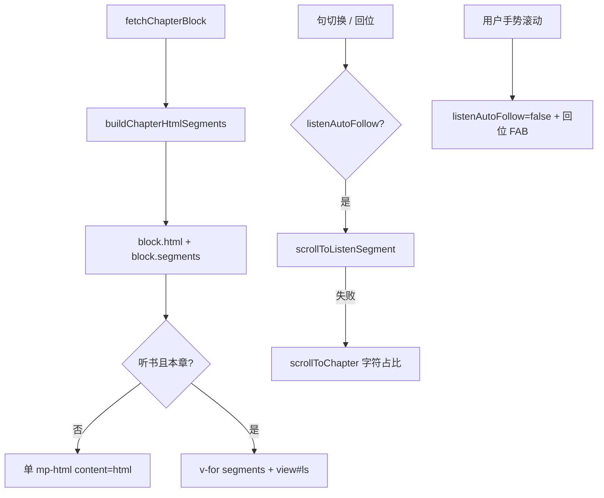

# 听书跟读滚屏与 setData 性能（实现思路）

> **状态**：已采纳（含后续「可视区保活 / 去掉听浮标 / 跟读定时器清理」迭代）  
> **关联文件**：`src/pages/reader/index.vue`、`src/utils/listen-text.ts`  
> **来源会话**：[听书混合交互](faa5daf9-2879-4986-83be-4d4d503a5cec)、[setData 与跟读定位](18e2e903-7486-4b12-b57a-8130fc3dea1d)、[听书跟读与迷你条迭代](c3f8bd51-ec80-47b8-be74-2f558038843f)  
> **相关文档**：隐藏页 `setData` 见 [reader-listen-hidden-page-setdata-impl.md](./reader-listen-hidden-page-setdata-impl.md)；迷你条 UI 见 [reader-listen-minibar-ui-impl.md](./reader-listen-minibar-ui-impl.md)

---

## 1. 需求背景（必填）

听书播放时需把「当前句」保持在屏幕可视区；用户手动滚动后应停止自动跟读，并出现「回位」。同时微信开发者工具对 `mp-html` `setContent` 报出数 MB 级 `setData` 性能警告，句级 HTML 锚点还会造成明显卡顿。

成功标准：跟读时当前播放内容始终落在可视舒适区（**已在区内则不每句强制跳滚**）；手动滑动可打断并回位；平时阅读仍整章单 `mp-html`，不因句锚膨胀 nodes。  
（句级正文高亮在块段方案之上另做，见 [reader-listen-highlight-impl.md](./reader-listen-highlight-impl.md)。）

---

## 2. 用户需求与 Agent 问答（必填）

### 2.1 跟读与手动打断

**用户：**

> 播放时需要将当前播放的内容始终展示在当前屏幕的显示区域……用户手动向上或者向下滚动了内容，则需要停止自动播放滚动。同时在右下脚展示回到当前播放位置的按钮

**Agent 回答摘要：**

- `listenAutoFollow`：句切换时自动滚；手势滚动超阈值则 `breakListenAutoFollow`
- 「回位」FAB：底栏开启挂 chrome 上沿，收起挂「听」圆形入口上方

### 2.2 setData 过大

**用户：**

> setData 数据传输长度为 3194 KB，存在有性能问题！（堆栈落在 `mp-html` `setContent` / `mounted`）

**Agent 回答摘要：**

- 根因是整章 HTML 进 `mp-html` nodes；同时挂多章会连刷警告
- **最终落地**：不向 HTML 注入句锚；`openAtChapter` 先挂当前章再错峰邻章

### 2.3 拒绝句锚方案

**用户：**

> 这种锚点的方式不行，会导致页面非常卡顿

**Agent 回答摘要：**

- 去掉句锚注入与 `use-anchor` 开启路径
- 跟读暂以章内字符占比估算（后续由块段方案取代为精定位）

### 2.4 估算不够准，要求准且不卡

**用户：**

> 但是这种方式无法正确的将当前播放内容展示在当前屏幕显示区域。你需要在不影响当前功能逻辑及性能的前提下解决这个问题

**Agent 回答摘要：**

- **最终落地**：块级切段 + 原生 `view` id（`#ls-章-段`）量位置；仅听书当前章拆多段 `mp-html`
- 段内再按字符占比微调；失败回退整章估算

### 2.5 每句必滚导致正文跳出屏幕

**用户：**

> 目前这个播放滚动每播一句就会滚动一次，这会导致正在播放内容可能会滚出当前屏幕显示外。我需要实时保证正在播放的内容始终展示在当前屏幕展示区

**Agent 回答摘要：**

- 根因：高亮跨句时 `scrollToListenSegment` **始终**把目标滚到视口约 28% 焦点带
- **最终落地**：先判断高亮点是否已在「上下舒适带」内；在带内且非强制回位则不滚；出带才滚到焦点带（见 4.7）

### 2.6 去掉右下角「听」浮标

**用户：**

> 把这个正在听书的标识去除（橙色圆形「听」）

**Agent 回答摘要：**

- 删除 `showListenFloat` / `onListenFloatTap` 及相关样式
- 「回位」在底栏收起时改为贴右下安全区（不再叠在「听」上方）

### 2.7 跟读后置定时器需清理

**用户：**

> 这个定时器没有清除，会影响性能（指向 `scrollToListenSentence` finally 内 `setTimeout`）

**Agent 回答摘要：**

- 用 `listenAnchorTimer` 跟踪；新跟读前 / 停听 / `onUnload` 均 `clearTimeout`
- 同步修复：`finally` 内禁止 `return`（biome `noUnsafeFinally`），改为 `if (gen === listenScrollGen) { … }`

---

## 3. 实现思路（必填，细致到每个点）

### 3.1 总体策略

不在 `mp-html` 内灌每句 `<a id>`（nodes / setData 膨胀且卡顿）。把章节 HTML 按块级标签切成有限段（≤40），平时仍整章一个 `mp-html`；**仅听书播放中的当前章**渲染为「原生 view 外壳 + 小段 mp-html」。跟读时 `createSelectorQuery` 选 `#ls-c-s`，再按句在段内的字符偏移微调 `scrollTop`。

### 3.2 数据流 / 控制流



### 3.3 分点设计

#### 3.3.1 切段与纯文本坐标

- **做法**：`splitHtmlIntoBlocks` + `mergeHtmlChunks`；段的 `start/end` 对齐 `chapterToSentences` 的坐标系；见 4.1

#### 3.3.2 条件渲染

- **做法**：`isListenSegmentedChapter` 为真才拆段；邻章保持单实例；见 4.2

#### 3.3.3 跟读滚动

- **做法**：`scrollToListenSegment` 量 view 矩形 + 段内 frac；`applyScrollTop` 同值 bump；见 4.3

#### 3.3.4 手动打断与回位

- **做法**：`onScroll` 中检测手势位移 → `breakListenAutoFollow`；`onListenFollowTap` 强制跟读；见 4.4

#### 3.3.5 邻章错峰

- **做法**：`openAtChapter` 先定位当前章，延迟再挂邻章，降低连续大 setData；见 4.5

---

## 4. 改动点对比：改前 / 改后（必填）

### 4.1 改动点：章节块携带 segments；分句带字符偏移

- **位置**：`src/utils/listen-text.ts`（新建/扩展）；`src/pages/reader/index.vue` → `ChapterBlock` / `fetchChapterBlock`
- **差异摘要**：加载章节时预切段；句子携带 `start/end` 供段映射。

#### 改动前

```ts
// 章节块仅存整章 HTML
interface ChapterBlock {
  // 章索引
  index: number;
  // 标题
  title: string;
  // 整章 HTML
  html: string;
  // 目录 href
  href: string;
}

// 组装章节块
return {
  // 索引
  index: data.index,
  // 标题
  title: data.title || "",
  // 去内联色后的 HTML
  html: stripReaderColorStyles(data.html || ""),
  // href
  href: toc.value[index]?.href ?? "",
};
```

#### 改动后

```ts
// 块段：html + 与分句同一纯文本坐标
export type ChapterHtmlSegment = {
  // 段 HTML
  html: string;
  // 段在章纯文本中的起点
  start: number;
  // 段在章纯文本中的终点
  end: number;
};

// 章节块增加 segments
interface ChapterBlock {
  // 章索引
  index: number;
  // 标题
  title: string;
  // 整章 HTML（非听书章仍用它渲染）
  html: string;
  // 目录 href
  href: string;
  // 块级切段，听书跟读时用原生 view id 定位
  segments: ChapterHtmlSegment[];
}

// 清洗 HTML
const html = stripReaderColorStyles(data.html || "");
// 组装章节块
return {
  // 索引
  index: data.index,
  // 标题
  title: data.title || "",
  // 整章 HTML
  html,
  // href
  href: toc.value[index]?.href ?? "",
  // 预切段（渲染时按需启用）
  segments: buildChapterHtmlSegments(html),
};
```

### 4.2 改动点：听书当前章分段渲染

- **位置**：`src/pages/reader/index.vue` → `chapterBlocks` 的 `v-for` 模板（约第 43–95 行）
- **差异摘要**：非听书章 / 非当前听书章仍单 `mp-html`；听书当前章拆 `#ls-*` 外壳。

#### 改动前

```vue
<mp-html
  v-if="mpHtmlMounted"
  :id="`mp-html-${block.index}`"
  :content="block.html || ''"
  :container-style="containerStyle"
  :tag-style="mpTagStyle"
  :copy-link="false"
  :lazy-load="true"
  :domain="''"
  :error-img="''"
  :loading-img="''"
  :scroll-table="false"
  :selectable="false"
  :use-anchor="false"
/>
```

#### 改动后

```vue
<!-- 听书当前章：块级原生 view 定位，避免往 mp-html 灌句锚 -->
<template v-if="mpHtmlMounted && isListenSegmentedChapter(block.index)">
  <view
    v-for="(seg, si) in block.segments"
    :id="`ls-${block.index}-${si}`"
    :key="`ls-${block.index}-${si}`"
    class="chapter-seg"
  >
    <mp-html
      :id="`mp-html-${block.index}-${si}`"
      :content="seg.html || ''"
      :container-style="containerStyle"
      :tag-style="mpTagStyle"
      :copy-link="false"
      :lazy-load="true"
      :domain="''"
      :error-img="''"
      :loading-img="''"
      :scroll-table="false"
      :selectable="false"
      :use-anchor="false"
    />
  </view>
</template>
<mp-html
  v-else-if="mpHtmlMounted"
  :id="`mp-html-${block.index}`"
  :content="block.html || ''"
  :container-style="containerStyle"
  :tag-style="mpTagStyle"
  :copy-link="false"
  :lazy-load="true"
  :domain="''"
  :error-img="''"
  :loading-img="''"
  :scroll-table="false"
  :selectable="false"
  :use-anchor="false"
/>
```

### 4.3 改动点：块段跟读滚动

- **位置**：`src/pages/reader/index.vue` → `scrollToListenSegment` / `scrollToListenSentence`
- **差异摘要**：优先查原生段 view；失败再 `scrollToChapter(..., "listen")` 字符占比兜底。

#### 改动前

```text
（无跟读滚屏；听书前阅读页无 scrollToListenSentence）
```

#### 改动后

```ts
// 是否将本章拆成听书块段渲染
function isListenSegmentedChapter(chapterIdx: number): boolean {
  // 听书中且索引等于当前听书章且已有段
  return (
    listenActive.value &&
    listenChapterIndex.value === chapterIdx &&
    (chapterBlocks.value.find((b) => b.index === chapterIdx)?.segments.length ?? 0) > 0
  );
}

// 滚到块段原生 view，并按段内字符占比微调
function scrollToListenSegment(
  // 章索引
  chapterIdx: number,
  // 当前句起点
  sentStart: number,
  // 当前句终点
  sentEnd: number,
  // 本章段列表
  segments: ChapterHtmlSegment[],
  // 是否强制 bump scrollTop
  forceBump = false,
): Promise<boolean> {
  // 句起点落在哪一段
  const si = segmentIndexForChar(segments, sentStart);
  // 取段元数据
  const seg = segments[si];
  // 无段则失败
  if (!seg) return Promise.resolve(false);
  // 焦点落在可视区约 28%
  const focus = listenFocusOffsetPx();
  // 段纯文本跨度
  const span = Math.max(seg.end - seg.start, 1);
  // 句在段内的相对位置（偏句前 20%）
  const frac = Math.min(
    1,
    Math.max(0, (sentStart - seg.start + Math.max(sentEnd - sentStart, 1) * 0.2) / span),
  );
  // createQuery 选 #ls-${chapterIdx}-${si} 与 .reader-scroll，算 absY 后 applyScrollTop
  // …
}

// 听书跟读入口
async function scrollToListenSentence(force = false) {
  // 未听书直接返回
  if (!listenActive.value) return;
  // 非强制且已打断跟读则跳过
  if (!force && !listenAutoFollow.value) return;
  // 确保章已加载
  await ensureChapterLoaded(listenChapterIndex.value);
  // 等分段挂载
  await nextTick();
  await new Promise((r) => setTimeout(r, force ? 80 : 32));
  // 优先块段定位
  const block = chapterBlocks.value.find((b) => b.index === listenChapterIndex.value);
  const meta = listenSentences.value[listenSentenceIndex.value];
  if (block?.segments.length && meta && typeof meta.start === "number") {
    const ok = await scrollToListenSegment(
      listenChapterIndex.value,
      meta.start,
      meta.end,
      block.segments,
      force,
    );
    if (ok) return;
  }
  // 兜底：整章字符占比
  await scrollToChapter(
    listenChapterIndex.value,
    listenSentenceScrollPercent(listenSentenceIndex.value),
    "listen",
  );
}
```

### 4.4 改动点：手动滚动打断与回位 FAB

- **位置**：`src/pages/reader/index.vue` → `listenAutoFollow` / `breakListenAutoFollow` / 回位 `view`
- **差异摘要**：跟读与收栏手势解耦；回位分别 dock 在底栏上沿或「听」入口上方。

#### 改动前

```text
（无 listenAutoFollow / 回位 FAB）
```

#### 改动后

```ts
// 默认自动跟读
const listenAutoFollow = ref(true);

// 用户手势滚动后关闭自动跟读
function breakListenAutoFollow() {
  // 未听书或已关闭则忽略
  if (!listenActive.value || !listenAutoFollow.value) return;
  // 关掉自动跟读，露出回位按钮
  listenAutoFollow.value = false;
}

// 回位：重新打开跟读并强制滚到当前句
function onListenFollowTap() {
  // 恢复自动跟读
  listenAutoFollow.value = true;
  // 短时抑制再次被判为手势打断
  suppressListenBreak(400);
  // 标记程序化滚动
  markListenProgrammatic(400);
  // 强制滚到当前句
  void scrollToListenSentence(true);
}
```

```vue
<!-- 底栏可见：回位挂在 chrome 上沿 -->
<view
  v-if="showListenFollowFab && chromeVisible"
  class="reader-listen-follow reader-listen-follow--docked"
  @click.stop="onListenFollowTap"
>
  <text class="reader-listen-follow__text">回位</text>
</view>

<!-- 底栏收起：回位在「听」圆形入口上方 -->
<view
  v-if="showListenFollowFab && !chromeVisible"
  class="reader-listen-follow"
  :style="listenFollowStyle"
  @click.stop="onListenFollowTap"
>
  <text class="reader-listen-follow__text">回位</text>
</view>
```

### 4.5 改动点：openAtChapter 错峰挂邻章

- **位置**：`src/pages/reader/index.vue` → `openAtChapter`
- **差异摘要**：先渲染并滚到当前章，再延迟加载邻章，避免连续多次大 setData。

#### 改动前

```ts
async function openAtChapter(index: number, scrollPercent = 0, forceRefresh = false) {
  // 清空已挂章节流
  chapterBlocks.value = [];
  // 关目录
  closeToc();
  // 更新当前章元信息
  setActiveChapterMeta(index);

  // 先加载当前章
  await ensureChapterLoaded(index, forceRefresh);

  // 并行预加载邻章
  const neighbors: Promise<void>[] = [];
  // 下一章
  if (index + 1 < chapterTotal.value) neighbors.push(ensureChapterLoaded(index + 1, forceRefresh));
  // 上一章（有进度或默认都预加载）
  if (scrollPercent > 0 && index > 0) neighbors.push(ensureChapterLoaded(index - 1, forceRefresh));
  else if (index > 0) neighbors.push(ensureChapterLoaded(index - 1, forceRefresh));
  // 等邻章都挂上再滚动（易连续大 setData）
  await Promise.all(neighbors);

  // 滚到目标位置
  await scrollToChapter(index, scrollPercent);
  // 持久化进度
  persistProgress(scrollPercent);
  await nextTick();
  measureViewport();

  // 短章补齐
  void fillStreamIfShort();
}
```

#### 改动后

```ts
async function openAtChapter(index: number, scrollPercent = 0, forceRefresh = false) {
  // 清空已挂章节流
  chapterBlocks.value = [];
  // 关目录
  closeToc();
  // 更新当前章元信息
  setActiveChapterMeta(index);

  // 先挂当前章并定位，邻章错峰加载，避免连续几次 MB 级 setData
  await ensureChapterLoaded(index, forceRefresh);
  // 先让用户看到目标章
  await scrollToChapter(index, scrollPercent);
  // 持久化进度
  persistProgress(scrollPercent);
  await nextTick();
  measureViewport();

  // 再准备邻章
  const neighbors: Promise<void>[] = [];
  // 下一章
  if (index + 1 < chapterTotal.value) neighbors.push(ensureChapterLoaded(index + 1, forceRefresh));
  // 上一章
  if (index > 0) neighbors.push(ensureChapterLoaded(index - 1, forceRefresh));
  // 错峰一帧后再挂
  if (neighbors.length) {
    await new Promise((r) => setTimeout(r, 64));
    await Promise.all(neighbors);
  }

  // 短章补齐
  void fillStreamIfShort();
}
```

### 4.6 改动点：切段与句→段映射工具

- **位置**：`src/utils/listen-text.ts` → `buildChapterHtmlSegments` / `segmentIndexForChar`
- **差异摘要**：纯新增工具函数，供阅读页切段跟读使用。

#### 改动前

```text
（无，新建/扩展 listen-text 中的切段 API）
原职责：仅 htmlToPlainText / 分句供 TTS
```

#### 改动后

```ts
// 把章节 HTML 切成块段，并标上与分句相同的纯文本坐标
export function buildChapterHtmlSegments(html: string, maxSeg = 40): ChapterHtmlSegment[] {
  // 全章纯文本（与分句同一清洗）
  const fullPlain = stripMarkdownForTts(htmlToPlainText(html));
  // 块级切开再合并到上限
  const chunks = mergeHtmlChunks(splitHtmlIntoBlocks(html), maxSeg);
  // … 将每段 plain 对齐到 fullPlain 的 start/end …
  return segs;
}

// 字符偏移 → 段下标
export function segmentIndexForChar(segments: ChapterHtmlSegment[], charOffset: number): number {
  // 空段兜底
  if (!segments.length) return 0;
  // 记录最后一个 start<=offset 的段
  let best = 0;
  for (let i = 0; i < segments.length; i++) {
    const seg = segments[i];
    if (!seg) continue;
    if (seg.start <= charOffset) best = i;
    // 落在半开区间 [start, end)
    if (charOffset < seg.end) return i;
  }
  return best;
}
```

### 4.7 改动点：可视区内不强制跟滚

- **位置**：`src/pages/reader/index.vue` → `scrollToListenSegment`（约第 691–758 行）
- **差异摘要**：句高亮变化时先测屏上位置；已在舒适带则只同步跟读基线，不再 `applyScrollTop`。

#### 改动前

```ts
// 滚到块段原生 view，并按段内字符占比微调
function scrollToListenSegment(
  chapterIdx: number,
  sentStart: number,
  sentEnd: number,
  segments: ChapterHtmlSegment[],
  forceBump = false,
): Promise<boolean> {
  // 句起点落在哪一段
  const si = segmentIndexForChar(segments, sentStart);
  // 取段元数据
  const seg = segments[si];
  // 无段则失败
  if (!seg) return Promise.resolve(false);
  // 焦点带距 scroll-view 顶的像素
  const focus = listenFocusOffsetPx();
  // 段长（字符）
  const span = Math.max(seg.end - seg.start, 1);
  // 句在段内相对位置 0–1
  const frac = Math.min(
    1,
    Math.max(0, (sentStart - seg.start + Math.max(sentEnd - sentStart, 1) * 0.2) / span),
  );

  return new Promise((resolve) => {
    // 量段矩形
    createQuery()
      .select(`#ls-${chapterIdx}-${si}`)
      .boundingClientRect((segRect) => {
        // 量 scroll-view 矩形与 scrollTop
        createQuery()
          .select(".reader-scroll")
          .fields({ rect: true, size: true, scrollOffset: true }, (scrollData) => {
            void (async () => {
              // 归一段节点
              const block = segRect && !Array.isArray(segRect) ? segRect : null;
              // 归一滚动容器
              const scroll = scrollData && !Array.isArray(scrollData) ? scrollData : null;
              // 当前滚动偏移
              const offsetTop = scroll?.scrollTop;
              // 量不到则失败
              if (!block || !scroll || typeof offsetTop !== "number") {
                resolve(false);
                return;
              }
              // 段顶在内容坐标系中的位置
              const segTop = (block.top ?? 0) - (scroll.top ?? 0) + offsetTop;
              // 段高
              const segH = block.height ?? 0;
              // 始终把句滚到焦点带（每句都会跳）
              const target = Math.max(0, Math.floor(segTop + frac * segH - focus));
              // 标记程序滚，避免误打断跟读
              markListenProgrammatic(700);
              // 写入 scroll-top
              await applyScrollTop(target, forceBump);
              // 更新手动打断基线
              syncListenFollowAnchor(target);
              // 同步 chrome 用滚动记忆
              lastScrollTopForChrome = target;
              resolve(true);
            })();
          })
          .exec();
      })
      .exec();
  });
}
```

#### 改动后

```ts
// 跟读定位：句仍在可视舒适区内则不滚，否则滚到焦点带
function scrollToListenSegment(
  chapterIdx: number,
  sentStart: number,
  sentEnd: number,
  segments: ChapterHtmlSegment[],
  forceBump = false,
): Promise<boolean> {
  // 句起点落在哪一段
  const si = segmentIndexForChar(segments, sentStart);
  // 取段元数据
  const seg = segments[si];
  // 无段则失败
  if (!seg) return Promise.resolve(false);
  // 出带时滚到的焦点偏移
  const focus = listenFocusOffsetPx();
  // 段长（字符）
  const span = Math.max(seg.end - seg.start, 1);
  // 句在段内相对位置 0–1
  const frac = Math.min(
    1,
    Math.max(0, (sentStart - seg.start + Math.max(sentEnd - sentStart, 1) * 0.2) / span),
  );

  return new Promise((resolve) => {
    // 量段矩形
    createQuery()
      .select(`#ls-${chapterIdx}-${si}`)
      .boundingClientRect((segRect) => {
        // 量 scroll-view
        createQuery()
          .select(".reader-scroll")
          .fields({ rect: true, size: true, scrollOffset: true }, (scrollData) => {
            void (async () => {
              // 归一段节点
              const block = segRect && !Array.isArray(segRect) ? segRect : null;
              // 归一滚动容器
              const scroll = scrollData && !Array.isArray(scrollData) ? scrollData : null;
              // 当前滚动偏移
              const offsetTop = scroll?.scrollTop;
              // 量不到则失败
              if (!block || !scroll || typeof offsetTop !== "number") {
                resolve(false);
                return;
              }
              // scroll-view 顶部屏幕坐标
              const scrollTopY = scroll.top ?? 0;
              // 可视高度
              const scrollH = scroll.height ?? 0;
              // 段高
              const segH = block.height ?? 0;
              // 当前句在屏幕上的 Y
              const highlightY = (block.top ?? 0) + frac * segH;
              // 估一行高，避免「贴边算可见」
              const lineH = Math.min(48, Math.max(20, Math.floor(scrollH * 0.04)));
              // 底栏遮挡高度（仅 chrome 打开时）
              const chromeCover = chromeVisible.value
                ? chromeInsets.value.bottom || lastChromeBottom || 0
                : 0;
              // 上边距舒适带
              const topPad = Math.max(40, Math.floor(scrollH * 0.1));
              // 下边距 + 底栏遮挡
              const bottomPad = Math.max(40, Math.floor(scrollH * 0.12)) + chromeCover;
              // 舒适带顶
              const bandTop = scrollTopY + topPad;
              // 舒适带底
              const bandBottom = scrollTopY + scrollH - bottomPad;
              // 整行是否落在带内
              const inBand = highlightY >= bandTop && highlightY + lineH <= bandBottom;

              // 已在展示区且非强制回位：不跳滚
              if (inBand && !forceBump) {
                // 仍同步基线，手动滑检测不漂移
                syncListenFollowAnchor(offsetTop);
                resolve(true);
                return;
              }

              // 段顶内容坐标
              const segTop = (block.top ?? 0) - scrollTopY + offsetTop;
              // 滚到焦点带
              const target = Math.max(0, Math.floor(segTop + frac * segH - focus));
              // 仅真实滚动时标记程序滚
              markListenProgrammatic(700);
              // 写入 scroll-top
              await applyScrollTop(target, forceBump);
              // 更新基线
              syncListenFollowAnchor(target);
              // chrome 滚动记忆
              lastScrollTopForChrome = target;
              resolve(true);
            })();
          })
          .exec();
      })
      .exec();
  });
}
```

### 4.8 改动点：跟读 gen + 锚点定时器可清理

- **位置**：`src/pages/reader/index.vue` → `scrollToListenSentence` / `clearListenAnchorTimer`（约第 760–807 行）
- **差异摘要**：并发跟读用 `listenScrollGen` 丢弃过期调用；300ms 再同步基线的 timer 可 clear；`finally` 不用 `return`。

#### 改动前

```ts
// 听书跟读入口
async function scrollToListenSentence(force = false) {
  // 未听书直接返回
  if (!listenActive.value) return;
  // 非强制且已打断跟读则返回
  if (!force && !listenAutoFollow.value) return;
  // 当前章
  const chap = listenChapterIndex.value;
  // 当前句下标
  const sent = listenSentenceIndex.value;
  // 句总数
  const total = listenSentenceCount.value;
  // 无句可跟
  if (total <= 0) return;

  // 每次跟读都先压制手动打断（即使最终不滚）
  markListenProgrammatic(800);
  try {
    // 确保章已挂载
    await ensureChapterLoaded(chap);
    await nextTick();
    // 强制/非强制都空等一帧
    await new Promise((r) => setTimeout(r, force ? 80 : 32));
    // 等待期间可能被打断
    if (!force && !listenAutoFollow.value) return;

    // 取本章块
    const block = chapterBlocks.value.find((b) => b.index === chap);
    // 旧逻辑只用整句元数据
    const meta = listenSentences.value[sent];
    // 有分段则精定位
    if (block?.segments.length && meta && typeof meta.start === "number") {
      const ok = await scrollToListenSegment(chap, meta.start, meta.end, block.segments, force);
      if (ok) return;
    }
    // 回退章内百分比
    await scrollToChapter(chap, listenSentenceScrollPercent(sent), "listen");
  } finally {
    // 再压一小段程序滚窗口
    markListenProgrammatic(280);
    // 立即同步基线
    syncListenFollowAnchor();
    lastScrollTopForChrome = currentScrollTop.value;
    // 未持有 timer 句柄：句句堆积 setTimeout
    setTimeout(() => {
      if (listenActive.value && listenAutoFollow.value) syncListenFollowAnchor();
    }, 300);
  }
}
```

#### 改动后

```ts
// 丢弃过期异步跟读
let listenScrollGen = 0;
// 300ms 再同步基线的唯一 timer
let listenAnchorTimer: ReturnType<typeof setTimeout> | null = null;

// 清理跟读锚点延时任务
function clearListenAnchorTimer() {
  // 无则跳过
  if (listenAnchorTimer == null) return;
  // 清掉
  clearTimeout(listenAnchorTimer);
  // 置空句柄
  listenAnchorTimer = null;
}

// 听书跟读入口
async function scrollToListenSentence(force = false) {
  // 未听书直接返回
  if (!listenActive.value) return;
  // 非强制且已打断跟读则返回
  if (!force && !listenAutoFollow.value) return;
  // 当前章
  const chap = listenChapterIndex.value;
  // 当前句下标
  const sent = listenSentenceIndex.value;
  // 句总数
  const total = listenSentenceCount.value;
  // 无句可跟
  if (total <= 0) return;

  // 本次跟读代数
  const gen = ++listenScrollGen;
  // 新跟读取消上一次延时同步
  clearListenAnchorTimer();
  try {
    // 确保章已挂载
    await ensureChapterLoaded(chap);
    // 已被更新的跟读取代
    if (gen !== listenScrollGen) return;
    await nextTick();
    // 仅强制回位/切章后空等量高
    if (force) await new Promise((r) => setTimeout(r, 80));
    // 再次校验代数
    if (gen !== listenScrollGen) return;
    // 等待期间可能被打断
    if (!force && !listenAutoFollow.value) return;

    // 取本章块
    const block = chapterBlocks.value.find((b) => b.index === chap);
    // 优先句级高亮 span（WordBoundary 子句）
    const meta = listenHighlightSpan.value ?? listenSentences.value[sent];
    // 有分段则精定位（内部可能 no-op）
    if (block?.segments.length && meta && typeof meta.start === "number") {
      const ok = await scrollToListenSegment(chap, meta.start, meta.end, block.segments, force);
      if (ok) return;
    }
    // 回退路径才压制手动打断
    markListenProgrammatic(800);
    // 回退章内百分比
    await scrollToChapter(chap, listenSentenceScrollPercent(sent), "listen");
  } finally {
    // 过期调用不清理、不排新 timer（禁止 finally return）
    if (gen === listenScrollGen) {
      // 立即同步基线
      syncListenFollowAnchor();
      lastScrollTopForChrome = currentScrollTop.value;
      // 滚动沉降后再同步一次，可被下次 clear
      listenAnchorTimer = setTimeout(() => {
        listenAnchorTimer = null;
        if (gen !== listenScrollGen) return;
        if (listenActive.value && listenAutoFollow.value) syncListenFollowAnchor();
      }, 300);
    }
  }
}
```

### 4.9 改动点：移除右下角「听」浮标，回位贴底

- **位置**：`src/pages/reader/index.vue` 模板「听」FAB；`showListenFloat` / `listenFollowStyle`；样式 `.reader-listen-float*`
- **差异摘要**：播放中底栏收起不再显示橙色「听」；「回位」落在原「听」位置。

#### 改动前

```vue
<!-- 听书跟读中且底栏收起：右下角圆形入口 -->
<view
  v-if="showListenFloat"
  class="reader-listen-float"
  :class="{ 'reader-listen-float--playing': listenStatus === 'playing' }"
  :style="listenFloatStyle"
  @click.stop="onListenFloatTap"
>
  <!-- 文案：听 -->
  <text class="reader-listen-float__text">听</text>
</view>
```

```ts
// 听书中底栏收起时显示「听」
const showListenFloat = computed(
  () => hasContent.value && listenActive.value && !chromeVisible.value && !tocOpen.value,
);

// 「回位」叠在「听」正上方
const listenFollowStyle = computed(() => {
  // 听 FAB 边距 + 尺寸 + 间距
  const aboveListen = LISTEN_FAB_EDGE_RPX + LISTEN_FAB_SIZE_RPX + LISTEN_FAB_GAP_RPX;
  return {
    ...accentBtnStyle.value,
    // 抬高以免压住「听」
    bottom: `calc(${aboveListen}rpx + env(safe-area-inset-bottom))`,
  };
});
```

#### 改动后

```vue
<!-- （已删除 showListenFloat 整块模板与 .reader-listen-float 样式） -->
<!-- 底栏收起时的「回位」仍保留，见下方 listenFollowStyle -->
```

```ts
// 「回位」贴右下安全区（原「听」位置）
const listenFollowStyle = computed(() => ({
  ...accentBtnStyle.value,
  // 不再叠高一截
  bottom: `calc(${LISTEN_FAB_EDGE_RPX}rpx + env(safe-area-inset-bottom))`,
}));
```

---

## 5. 验证要点（建议）

- [ ] 普通阅读：单章 `mp-html`，控制台无明显数 MB `setData` 连刷
- [ ] 点「听」后当前章拆段；句在屏内时**不**每句跳滚，接近底边时才跟滚且当前句仍可见
- [ ] 手动上/下滑：停止跟读并出现「回位」；点回位强制对齐
- [ ] 底栏开：回位挂 chrome 上沿；底栏关：回位在右下，**无**橙色「听」浮标
- [ ] 连续听多句：不应堆积大量未清的 300ms timer
- [ ] 邻章仍整章渲染；切听书章时跟读目标章切换分段

---

## 6. 影响分析（必填，放在文档最后）

### 6.1 结论

- **是否影响已有功能点**：局部影响 — 听书时当前章 DOM 结构从单 `mp-html` 变为多段；跟读从「每句必滚」改为「出带才滚」；去掉「听」浮标入口
- **是否影响既有正常逻辑**：局部影响 — `openAtChapter` 时序变为先滚后挂邻章；换肤需按段 `setContent`；底栏收起时只能靠点屏幕唤出 chrome / 「回位」进迷你条，不再有「听」快捷钮

### 6.2 影响点明细

| #   | 影响对象     | 影响方式                                           | 程度 | 说明与回归建议                       |
| --- | ------------ | -------------------------------------------------- | ---- | ------------------------------------ |
| 1   | 听书跟读精度 | 由整章估算改为块段 + 段内微调                      | 高   | 有图/标题密的章核对当前句是否在屏内  |
| 2   | 跟读滚动频率 | 屏内句不再强制滚到 28% 焦点带                      | 高   | 长听一章确认句始终可见且不抖         |
| 3   | 「听」浮标   | 已删除；回位位置下移                               | 中   | 底栏收起时用点空白唤栏 / 回位        |
| 4   | 听书启动瞬间 | 当前章 remount 为多段 mp-html                      | 中   | 起播应可接受一次短重组，不应持续卡顿 |
| 5   | 换肤/字号    | 听书章需逐段 `setContent`                          | 中   | 听书中改字号，正文样式与跟读仍可用   |
| 6   | 跟读 timer   | 可清理，避免句句堆积                               | 低   | 快速切句后停听，确认无悬挂回调       |
| 7   | 打开章节性能 | 邻章错峰，首屏更快、警告减少                       | 低   | 快速连翻目录确认邻章仍会补上         |
| 8   | TTS 分句     | `ListenSentence` 增 `start/end`，播放仍只用 `text` | 低   | 上/下句与章末进章正常                |

### 6.3 调用面 / 波及说明（建议）

- `buildChapterHtmlSegments` / `segmentIndexForChar`：阅读页加载与跟读（亦被句高亮复用）
- `scrollToListenSentence`：句切换 watch、回位、起播
- 听书会话与迷你条本身见 [reader-listen-hybrid-impl.md](./reader-listen-hybrid-impl.md)、[reader-listen-minibar-ui-impl.md](./reader-listen-minibar-ui-impl.md)
- 句级高亮见 [reader-listen-highlight-impl.md](./reader-listen-highlight-impl.md)
- 阅读页隐藏时 setData 防护见 [reader-listen-hidden-page-setdata-impl.md](./reader-listen-hidden-page-setdata-impl.md)
