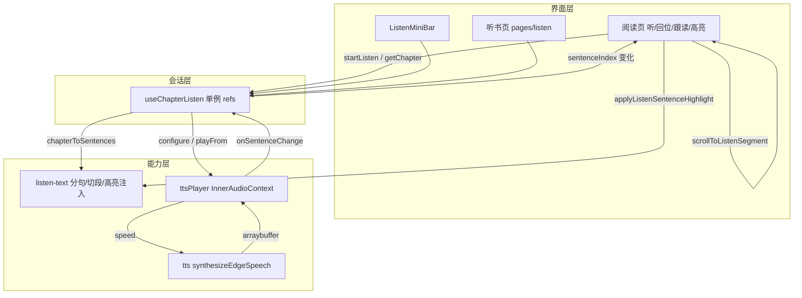

# 听书功能（功能实现详解与复刻指南）

> **一句话**：在阅读页点「听」，用 Edge TTS 逐句朗读当前书，底部迷你条播控，可展开独立听书页，正文跟读滚屏并句级高亮，手动滑动可打断并回位。  
> **入口**：阅读页底栏工具条「听」；听书中底栏收起时右下角圆形「听」；迷你条「展开」进 `/pages/listen/index`。  
> **关联文件**：见 §0.4 文件地图。  
> **文档目标**：读懂整套听书如何串起来；按 §5 可在其他 uni-app / 小程序项目复刻等价逻辑。  
> **非目标**：不写 EPUB 解析/书架/主题换肤本体；不写 Web 端听书实现；不做词级卡拉 OK 高亮。  
> **改动追溯**：[reader-listen-hybrid-impl.md](./reader-listen-hybrid-impl.md)、[reader-listen-follow-scroll-impl.md](./reader-listen-follow-scroll-impl.md)、[reader-listen-highlight-impl.md](./reader-listen-highlight-impl.md)

---

## 0. 先看这里（必填，一眼建立模型）

### 0.1 30 秒读懂

- **做什么**：把章节 HTML 切成句子 → 后端 Edge TTS 合成 mp3 → 页内音频逐句播；阅读页迷你条 + 可选大字听书页；播放时正文跟读到当前句并做句级高亮。
- **不做什么**：不做词级卡拉 OK；不用微信原生后台音频底栏盖住自定义 UI（现用 `InnerAudioContext`）；不高亮时不整章重灌 HTML。
- **关键角色**：界面（阅读页 / 迷你条 / 听书页）只展示与点按；会话层 `useChapterListen` 持有状态；能力层 `tts` + `ttsPlayer` + `listen-text` 负责分句、合成、播放与高亮注入。

### 0.2 功能点总表（必填）

| 编号 | 功能点（人话）                   | 用户可感知表现                     | 关键实现位置                                                     | 正文  |
| ---- | -------------------------------- | ---------------------------------- | ---------------------------------------------------------------- | ----- |
| F1   | 章节 HTML 变成可朗读的句子列表   | （幕后）有句才开播                 | `listen-text.ts` → `chapterToSentences`                          | §4.1  |
| F2   | 向后端要一句语音二进制           | 短暂「合成中」后出声               | `tts.ts` → `synthesizeEdgeSpeech`                                | §4.2  |
| F3   | 逐句播放、预取下一句、倍速重合成 | 连续听、切倍速不变调               | `tts-player.ts` → `TtsPlayer`                                    | §4.3  |
| F4   | 听书会话：开始 / 暂停 / 停止     | 状态在 idle↔loading↔playing↔paused | `useChapterListen.ts`                                            | §4.4  |
| F5   | 从当前阅读进度附近起播           | 不是每次都从章首听                 | `onListenTap` + `scrollPercent`                                  | §4.5  |
| F6   | 底栏迷你播控条与倍速菜单         | 上/下句、播控、Nx、展开            | `ListenMiniBar.vue`                                              | §4.6  |
| F7   | 展开独立听书页看大字当前句       | 新页大字 + 底栏播控，返回不断播    | `pages/listen/index.vue`                                         | §4.7  |
| F8   | 底栏「听」开关与收栏圆形入口     | 点听开/关；收栏右下角「听」唤回    | `reader/index.vue` 工具条/FAB                                    | §4.8  |
| F9   | 播放时正文跟读到当前句           | 当前句落在屏幕上半区               | 块段 `#ls-*` + `scrollToListenSentence`                          | §4.9  |
| F10  | 手动滑动打断跟读并「回位」       | 出回位钮；点回位继续跟             | `listenAutoFollow` / 回位 FAB                                    | §4.10 |
| F11  | 听书中滚动不收底栏；目录跳章续听 | 底栏常驻；点目录从该章章首听       | `onScroll` / `goChapter`                                         | §4.11 |
| F12  | 章末自动下一章；全书听完停       | Toast「已听完本书」或继续播        | `advanceChapter`                                                 | §4.12 |
| F13  | 离开阅读栈且不在听书页则停播     | 回书架等场景不残留播放             | `stopListenIfLeavingReader`                                      | §4.13 |
| F14  | 路由与微信音频相关配置           | 听书页可打开                       | `pages.json` / `manifest.json`                                   | §4.14 |
| F15  | 当前播放句在正文中高亮           | 当前句琥珀色底，切句跟随           | `injectListenSentenceHighlight` + `applyListenSentenceHighlight` | §4.15 |

### 0.3 架构一图（必填）



### 0.4 文件地图与建造顺序（必填）

| 建造序 | 文件                                       | 职责（一句话）                            | 依赖                 |
| ------ | ------------------------------------------ | ----------------------------------------- | -------------------- |
| 1      | `src/utils/listen-text.ts`                 | HTML→纯文本→分句；块段切分；句级高亮注入  | 无                   |
| 2      | `src/services/tts.ts`                      | Edge TTS HTTP，可 abort                   | 登录 token、API 基址 |
| 3      | `src/services/tts-player.ts`               | 逐句合成写入临时 mp3 并播放               | 1、2                 |
| 4      | `src/hooks/useChapterListen.ts`            | 听书会话状态与对外 API                    | 1、3                 |
| 5      | `src/components/ListenMiniBar.vue`         | 阅读页底栏迷你播控                        | 4                    |
| 6      | `src/pages/listen/index.vue`               | 独立大字听书页                            | 4                    |
| 7      | `src/pages.json` / `src/manifest.json`     | 注册听书页；声明 audio 后台模式           | 6                    |
| 8      | `src/pages/reader/index.vue`               | 入口、跟读、回位、句高亮、getChapter 注入 | 1、4、5              |
| 9      | `src/hooks/useTheme.ts` → `useThemeAccent` | 听书按钮主题色                            | 主题系统             |

---

## 1. 人话版：用户旅程（必填）

1. **进入**：用户在阅读页打开一本书，滑到某处，点底栏「听」。
2. **主路径**：底部立刻出现迷你条（「准备朗读…」）→ 当前章被拆成许多短句 → 后端合成第一句语音 → 手机出声；正文自动滚到正在念的那一句附近，并给该句琥珀色高亮；迷你条显示当前句摘要与进度 `3/120`。
3. **分支**：
   - 点暂停/继续、上句/下句、倍速菜单（如 1.25x，音色不变尖）；高亮随当前句移动。
   - 点「展开」进听书页看大字，返回阅读页声音不断。
   - 用手滑正文：自动跟读停下，出现「回位」；高亮仍跟当前句；点回位又跟着念。
   - 听书时上下滑不自动收底栏；收栏后右下角圆形「听」可唤回底栏。
   - 点目录某章：正文跳过去并从该章开头续听。
   - 一章念完自动下一章；没有下一章则提示听完并停止。
4. **离开**：再点「听/关闭」停播，高亮消失；若从阅读页退回书架且栈里没有听书页，也会停播。

---

## 2. 问题与解决方案总表（必填）

| 问题编号 | 现象 / 风险（人话）                                | 根因                             | 解决方案（本项目做法）                         | 对应功能点 |
| -------- | -------------------------------------------------- | -------------------------------- | ---------------------------------------------- | ---------- |
| P1       | 用微信后台音频管理器会弹出原生底栏盖住自定义迷你条 | `BackgroundAudioManager` 系统 UI | 改用 `InnerAudioContext`，并主动 `stop` 后台条 | F3, F6     |
| P2       | 客户端 `playbackRate` 让声音变尖                   | 变速连音调一起变                 | 倍速只改 TTS 请求的 `speed`，播放端固定 1      | F2, F3, F6 |
| P3       | 切句时 Network 堆一堆未完成合成                    | 预取未取消                       | `abort` + `jobs` Map，切句只保留当前 key       | F2, F3     |
| P4       | 往 HTML 插每句锚点导致 setData 数 MB、卡顿         | mp-html nodes 膨胀               | 不灌句锚；听书当前章用原生 view 块段定位       | F9         |
| P5       | 整章字符占比跟读对不齐屏幕                         | 图/标题占高但无字                | 块段量高 + 段内字符微调，失败再整章估算        | F9         |
| P9       | 句级高亮若整章 setContent 会再次卡顿               | 富文本重解析成本高               | 只对当前句所在块段注入 span 并 setContent      | F15        |
| P6       | 程序滚屏被误判成「用户手滑打断」                   | enhanced scroll-view 事件难分    | 时间窗 `markListenProgrammatic` + 基线位移阈值 | F10        |
| P7       | 听书时跟读滚动把底栏收起来                         | 原滚动收栏逻辑                   | `listenActive` 时跳过自动收栏                  | F11        |
| P8       | 异步拉章/合成时用户已点停止仍回调                  | 竞态                             | `sessionGen` / `playGen` 代际作废              | F4, F3     |

---

## 3. 实现思路总览（必填）

### 3.1 总体策略

把「朗读引擎」与「阅读 UI」拆开：引擎是模块级单例（hook + player），任何页面 import 同一套状态；阅读页负责注入 `getChapter`、跟读滚屏、句级高亮和 chrome 交互。分句在本地做，不新增后端字段。跟读与高亮都建立在听书当前章的块段上：定位用原生 `view` id，高亮只对当前段 `setContent`，避免整章重灌。

### 3.2 数据流与控制流

1. `startListen` → `status=loading` → `getChapter(html)` → `chapterToSentences`
2. `ttsPlayer.configure` + `playFrom(startIdx)` → 合成 → 写临时 mp3 → `InnerAudioContext.play`
3. `onEnded` → 下一句；句尽 → `onChapterEnd` → `advanceChapter`
4. `sentenceIndex` 变化 → 阅读页 `watch` → `scrollToListenSentence`

### 3.3 模块职责

| 模块               | 谁调用我             | 我调用谁                        |
| ------------------ | -------------------- | ------------------------------- |
| `listen-text`      | hook、阅读页切段     | 无                              |
| `tts`              | player               | `uni.request`、token            |
| `ttsPlayer`        | hook                 | tts、文件系统、InnerAudio       |
| `useChapterListen` | 阅读页/迷你条/听书页 | listen-text、ttsPlayer          |
| 阅读页跟读         | 句切换 watch         | listen-text 切段、SelectorQuery |

---

## 4. 分功能点详解（必填，核心）

### 4.1 F1：章节 HTML 变成句子列表

#### （1）人话说明

后端给的是带标签的章节 HTML。听书前要先变成一句句纯文字，每句还要记住它在整章文字里的起止位置，后面跟读才知道滚到哪一段。

#### （2）实现思路

清洗标签与 Markdown 痕迹 → 按中英文句号等切句（与 Web 对齐）→ 产出 `{ text, index, start, end }`。

#### （3）问题与对策

对应 P5 的坐标系：`start/end` 必须与切段用的纯文本清洗一致。无则注意：空章返回 `[]`。

#### （4）实现过程

1. `htmlToPlainText` 去脚本/样式/标签，块结束换行。
2. `stripMarkdownForTts` 去掉代码块、强调标记等。
3. `buildSentenceOffsetSpans` 找句界。
4. `chapterToSentences` 组装并过滤空句。

#### （5）关键代码（逐行上方注释）

- **位置**：`src/utils/listen-text.ts` → `chapterToSentences`

```ts
// 导出：把章节 HTML 变成带偏移的句子数组
export function chapterToSentences(html: string): ListenSentence[] {
  // 先转纯文本再清 Markdown，得到分句坐标系
  const plain = stripMarkdownForTts(htmlToPlainText(html));
  // 没有字则本章不可朗读
  if (!plain) return [];
  // 按句界切出 start/end，再映射成 ListenSentence
  return (
    buildSentenceOffsetSpans(plain)
      .map(({ start, end }) => ({
        // 句文本再清一次，避免残留标记
        text: stripMarkdownForTts(plain.slice(start, end)).trim(),
        // 纯文本起点
        start,
        // 纯文本终点
        end,
      }))
      // 丢掉空句
      .filter((s) => s.text.length > 0)
      // 重新编号 index
      .map((s, index) => ({ text: s.text, index, start: s.start, end: s.end }))
  );
}
```

#### （6）复刻提示

- 可原样搬：句界算法与清洗顺序。
- 须替换：若宿主已有 HTML→text，需保证与跟读切段同一套清洗。
- 最小验证：对 `"<p>你好。</p><p>世界！</p>"` 得到 2 句。

---

### 4.2 F2：Edge TTS 合成一句语音

#### （1）人话说明

把一句中文发给后端 Edge 接口，拿回一段音频二进制（mp3）。请求必须能取消，否则连点下句会堆很多半截请求。

#### （2）实现思路

不用通用 JSON HTTP 封装（要 `arraybuffer`）。返回 `{ promise, abort }`。倍速用 body 里的 `speed`。

#### （3）问题与对策

P2、P3：speed 走合成；abort 清 pending。边界：未配置 `API_BASE_URL`、空文本、401、超时 45s。

#### （4）实现过程

1. 校验基址与文本。
2. 带 Bearer token POST。
3. success 校验状态码后 `resolve(ArrayBuffer)`。
4. `abort` 调 `task.abort` 并 reject「已取消」。

#### （5）关键代码（逐行上方注释）

- **位置**：`src/services/tts.ts` → `synthesizeEdgeSpeech`（核心请求体）

```ts
// 发起可取消的合成请求
task = uni.request({
  // Edge 合成接口
  url: `${API_BASE_URL}/speech-transcription/edge/speech`,
  // POST JSON
  method: "POST",
  // 含 Content-Type 与可选 Authorization
  header,
  data: {
    // 待朗读文本
    text: trimmed,
    // 默认晓晓音色
    voice: options.voice ?? DEFAULT_EDGE_TTS_VOICE,
    // 倍速写在合成参数里，避免播放器变调
    speed: options.speed ?? 1,
    // 音量
    vol: options.vol ?? 5,
    // 音调
    pitch: options.pitch ?? 0,
  },
  // 直接拿二进制，不走 JSON 解析
  responseType: "arraybuffer",
  // 超时与本地 timer 双保险
  timeout: SPEECH_TIMEOUT_MS,
  // … success / fail 中 finish 防重复 settle
});
```

#### （6）复刻提示

- 可原样搬：abort 句柄模式。
- 须替换：URL、鉴权头、音色字段名。
- 最小验证：合成一句非空文本得到非空 ArrayBuffer。

---

### 4.3 F3：逐句播放器（InnerAudio + 预取）

#### （1）人话说明

播放器拿着整章句子列表：播当前句 → 播完自动下一句 → 章末回调。切倍速时按新语速重新合成当前句，听起来只是变快不变怪。

#### （2）实现思路

故意不用 `BackgroundAudioManager`（P1）。`playGen` 作废过期异步。开播前只保留当前句预取；真正 `play` 后再预取下一句。

#### （3）问题与对策

P1/P2/P3/P8。边界：无 `USER_DATA_PATH` 则写临时文件失败。

#### （4）实现过程

1. `ensureAudio` 创建 InnerAudio，绑 `onEnded`→`playNext`。
2. `playCurrent`：通知句变更 → abort 无关 job → `takeBuffer` → 写 mp3 → `play`。
3. `setRate`：改 rate、abort、重播当前句。
4. `stop`：升 gen、abort、stop 音频、删临时文件。

#### （5）关键代码（逐行上方注释）

- **位置**：`src/services/tts-player.ts` → `setRate` / `playCurrent` 要点

```ts
// 倍速变化：只改合成 speed，不改 playbackRate 音调
setRate(rate: number): void {
  // 夹紧到 0.5–2
  const next = clampRate(rate);
  // 相同则忽略
  if (next === this.rate) return;
  // 记下新倍速
  this.rate = next;
  // 取消旧倍速下的预取/合成
  this.abortAllSpeech();
  if (this.audio) {
    try {
      // 播放端永远 1 倍，防变调
      this.audio.playbackRate = 1;
    } catch {
      // 部分基础库只读，忽略
    }
  }
  // 有句子则按新语速重播当前句
  if (this.sentences.length) {
    void this.playCurrent();
  }
}

// 写临时文件供 InnerAudio 播放
private writeTempMp3(buf: ArrayBuffer): string {
  // 取小程序用户目录
  const base = userDataPath();
  // 没有可写路径则失败
  if (!base) throw new Error("无可用本地路径");
  // 唯一文件名
  const filePath = `${base}/tts-${Date.now()}-${Math.random().toString(36).slice(2, 8)}.mp3`;
  // 同步写入二进制
  uni.getFileSystemManager().writeFileSync(filePath, buf, "binary");
  // 返回给 audio.src
  return filePath;
}
```

#### （6）复刻提示

- 可原样搬：playGen、预取策略、倍速重合成。
- 须替换：若必须锁屏续播，再评估 BGM（需处理系统底栏与自定义条冲突）。
- 最小验证：两句文本能连播；改 1.5x 后音色不尖。

---

### 4.4 F4：听书会话状态机

#### （1）人话说明

全局只有一个听书会话。开始听进入 loading，出声变 playing，暂停变 paused，停止回 idle。页面们都读同一份状态。

#### （2）实现思路

模块顶层 `ref` + `sessionGen`：每次 start/stop/seek 加一代，过期的 `loadAndPlayChapter` 回调直接 return。

#### （3）问题与对策

P8。边界：空句章尝试跳下一章；再空则 toast 并 stop。

#### （4）实现过程

1. `startListen` 升 gen、注入 `getChapter`、loading UI。
2. `loadAndPlayChapter` 拉章、分句、configure player、`playFrom`。
3. `stopListen` 升 gen、清 player、`resetSession`。

#### （5）关键代码（逐行上方注释）

- **位置**：`src/hooks/useChapterListen.ts` → `startListen`

```ts
// 对外：从某章某进度开始听书会话
export async function startListen(opts: StartListenOptions): Promise<void> {
  // 作废上一会话的一切异步回调
  sessionGen += 1;
  // 立刻停掉旧音频与 pending 合成
  ttsPlayer.stop();
  // 注入阅读页提供的取章函数
  getChapterFn = opts.getChapter;
  // 记录书信息供通知/UI
  bookId.value = opts.bookId;
  bookTitle.value = opts.bookTitle;
  coverUrl.value = opts.coverUrl ?? "";
  chapterIndex.value = opts.chapterIndex;
  // 每次新会话倍速回到 1
  rate.value = 1;
  // 先进入 loading，立刻露出迷你条，再拉章合成
  status.value = "loading";
  // 占位文案
  currentSentenceText.value = "准备朗读…";
  // 章标题稍后由 load 填
  chapterTitle.value = "";
  // 按滚动进度映射起播句
  await loadAndPlayChapter(opts.chapterIndex, {
    scrollPercent: opts.scrollPercent ?? 0,
  });
}
```

#### （6）复刻提示

- 可原样搬：sessionGen 模式。
- 须替换：若用 Pinia，仍建议单例 + 代际。
- 最小验证：快速连点开始/停止，不应出现双音重叠。

---

### 4.5 F5：从当前阅读进度起播

#### （1）人话说明

用户滑到第 3 屏再点「听」，应从附近句子开始念，而不是章首。

#### （2）实现思路

阅读页滚动时维护 `readingScrollPercent`（0–1）；`startListen` 传入；`sentenceIndexFromScrollPercent` 映射句下标（近似均分）。

#### （3）问题与对策

设计约束：句长短不一，映射是近似。边界：`p<=0` 首句，`p>=1` 末句。

#### （4）实现过程

1. `persistProgress` 写 `readingScrollPercent`。
2. `onListenTap` 把该值传给 `startListen`。
3. `loadAndPlayChapter` 无 `fromSentence` 时用该映射。

#### （5）关键代码（逐行上方注释）

- **位置**：`useChapterListen.ts` → `sentenceIndexFromScrollPercent`；`reader/index.vue` → `onListenTap` 参数

```ts
// 章内滚动进度 → 起播句下标
function sentenceIndexFromScrollPercent(count: number, scrollPercent: number): number {
  // 无句
  if (count <= 0) return 0;
  // 单句
  if (count === 1) return 0;
  // 夹紧
  const p = Math.min(1, Math.max(0, scrollPercent));
  if (p <= 0) return 0;
  if (p >= 1) return count - 1;
  // 按句数比例取整
  return Math.min(count - 1, Math.floor(p * count));
}
```

#### （6）复刻提示

- 可原样搬：映射函数。
- 须替换：进度字段来源（本项目是阅读页滚动推算）。
- 最小验证：滑到章中再听，首句不是章标题第一句（通常）。

---

### 4.6 F6：迷你播控条与倍速菜单

#### （1）人话说明

听书开始后，底栏上方出现迷你条：显示当前句、进度、上句/播放/下句/倍速/展开。点倍速弹出 0.75x–2x 选项。

#### （2）实现思路

组件只绑 `useChapterListen`，不拥有播放器。倍速用菜单而非循环点击（产品定案）。主按钮用 `useThemeAccent`。

#### （3）问题与对策

无独立坑；注意 `@click.stop` 防止点条时触发阅读页 toggleChrome。

#### （4）实现过程

1. `v-if="isActive"` 显示。
2. 操作区调用 `prev/next/toggle/setListenRate/expandListenPage`。
3. `watch(isActive/rateMenuOpen)` emit `layout` 让阅读页重测 inset。

#### （5）关键代码（逐行上方注释）

- **位置**：`src/components/ListenMiniBar.vue` 模板动作区

```vue
    <!-- 播控行：阻止冒泡到阅读页 -->
    <view class="listen-mini__actions">
      <!-- 上一句 -->
      <view class="listen-mini__btn" @click.stop="prevListenSentence">
        <text>上句</text>
      </view>
      <!-- 暂停/播放，主题强调色 -->
      <view
        class="listen-mini__btn listen-mini__btn--primary"
        :style="accentBtnStyle"
        @click.stop="onToggle"
      >
        <text>{{ playLabel }}</text>
      </view>
      <!-- 下一句 -->
      <view class="listen-mini__btn" @click.stop="nextListenSentence">
        <text>下句</text>
      </view>
      <!-- 打开/关闭倍速菜单，按钮上显示当前 Nx -->
      <view
        class="listen-mini__btn"
        :class="{ 'listen-mini__btn--menu-open': rateMenuOpen }"
        @click.stop="toggleRateMenu"
      >
        <text>{{ rateLabel }}</text>
      </view>
      <!-- 进独立听书页 -->
      <view class="listen-mini__btn" @click.stop="expandListenPage">
        <text>展开</text>
      </view>
    </view>
```

#### （6）复刻提示

- 可原样搬：状态绑定方式。
- 须替换：UI 组件库与样式 token。
- 最小验证：迷你条出现且倍速菜单可选。

---

### 4.7 F7：独立听书页

#### （1）人话说明

点「展开」进入专门听书页，中间大字显示当前句，底部播控与倍速条；返回阅读页时声音继续。

#### （2）实现思路

`expandListenPage` 若栈顶已是听书页则不重复 navigate。听书页同样 `useChapterListen`，纸张色跟阅读设置。停止用页内「停止听书」。

#### （3）问题与对策

与 F13 配合：从阅读页进听书页时栈内仍有 listen，unload 阅读页不会误停（见 F13）。

#### （4）实现过程

1. 注册路由（F14）。
2. `navigateTo('/pages/listen/index')`。
3. 页内绑 status / 句文本 / 播控。

#### （5）关键代码（逐行上方注释）

- **位置**：`useChapterListen.ts` → `expandListenPage`

```ts
// 打开独立听书页（已在该页则忽略）
export function expandListenPage(): void {
  // 空闲无会话
  if (status.value === "idle") return;
  // 当前页面栈
  const pages = getCurrentPages();
  // 栈顶页
  const top = pages[pages.length - 1] as { route?: string } | undefined;
  // 已在听书页不再 push
  if (top?.route?.includes("pages/listen/index")) return;
  // 保留阅读页在栈中，返回不断播
  uni.navigateTo({ url: "/pages/listen/index" });
}
```

#### （6）复刻提示

- 可原样搬：栈判断。
- 须替换：路由路径与导航 API。
- 最小验证：展开→返回，迷你条仍在且音频未断。

---

### 4.8 F8：底栏「听」与圆形入口

#### （1）人话说明

工具条最右侧「听」：未听时开始，听书中显示「关闭」。底栏收起后右下角圆形「听」用来唤回底栏（不是重新起播）。

#### （2）实现思路

`onListenTap` toggle；`showListenFloat` 在 `listenActive && !chromeVisible`。圆形只 `chromeVisible=true`。

#### （3）问题与对策

无；注意与「回位」FAB 分层：回位在听入口上方。

#### （4）实现过程

1. 工具条绑定 `onListenTap`。
2. `v-if="showListenFloat"` 圆形入口。
3. `onListenFloatTap` 开底栏。

#### （5）关键代码（逐行上方注释）

- **位置**：`reader/index.vue` → `onListenTap` 起播分支要点

```ts
// 底栏「听」：开启会话并注入取章
await startListen({
  // 当前书 id
  bookId: bookId.value,
  // 书名
  bookTitle: bookTitle.value,
  // 封面（播放器元数据预留）
  coverUrl: bookCoverUrl.value,
  // 当前章
  chapterIndex: chapterIndex.value,
  // 章内阅读进度 → 起播句
  scrollPercent: readingScrollPercent.value,
  // 复用阅读页缓存加载章节
  getChapter: async (index) => {
    const block = await fetchChapterBlock(index);
    return {
      html: block.html,
      title: block.title,
      nextIndex: index < chapterTotal.value - 1 ? index + 1 : null,
    };
  },
});
```

#### （6）复刻提示

- 须替换：工具条布局。
- 最小验证：听↔关闭两态；收栏后圆形可唤回。

---

### 4.9 F9：正文跟读滚屏（块段定位）

#### （1）人话说明

念到某一句时，阅读区应自动滚到能看见这句话的位置。不能靠在 HTML 里插几千个锚点（会卡），而是：听书时把**当前章**切成若干段落块，每块包在带 id 的原生盒子里再量位置。

#### （2）实现思路

- `buildChapterHtmlSegments` 预切段（≤40）。
- 仅 `listenActive && 本章 === 听书章` 时分段渲染 `#ls-章-段`。
- `segmentIndexForChar(sent.start)` → 量矩形 → 段内 frac 微调 → `applyScrollTop`。
- 失败则整章字符占比兜底。

#### （3）问题与对策

P4、P5。边界：切段失败/查询不到节点时走兜底。

#### （4）实现过程

1. `fetchChapterBlock` 带 `segments`。
2. 模板 `isListenSegmentedChapter` 分支。
3. 句切换 `watch` → `scrollToListenSentence`。
4. `scrollToListenSegment` 计算 target。

#### （5）关键代码（逐行上方注释）

- **位置**：`listen-text.ts` → `buildChapterHtmlSegments`；`reader` → `isListenSegmentedChapter`

```ts
// 是否对某一章启用块段 mp-html（仅听书当前章）
function isListenSegmentedChapter(chapterIdx: number): boolean {
  return (
    // 正在听书
    listenActive.value &&
    // 就是当前播放章
    listenChapterIndex.value === chapterIdx &&
    // 已有切段数据
    (chapterBlocks.value.find((b) => b.index === chapterIdx)?.segments.length ?? 0) > 0
  );
}
```

```ts
// 把章节切成带纯文本坐标的块段
export function buildChapterHtmlSegments(html: string, maxSeg = 40): ChapterHtmlSegment[] {
  // 全章纯文本（与分句同一清洗）
  const fullPlain = stripMarkdownForTts(htmlToPlainText(html));
  // 按块级标签切开，再合并到上限，避免上百个组件
  const chunks = mergeHtmlChunks(splitHtmlIntoBlocks(html), maxSeg);
  // … 将每段 plain 对齐到 fullPlain 的 start/end 后返回 …
  return segs;
}
```

#### （6）复刻提示

- 可原样搬：切段 + 原生 id 思路（任何富文本组件都适用）。
- 须替换：渲染组件（本项目 mp-html）。
- 最小验证：听书中句切换，视口上半区出现对应段落。

---

### 4.10 F10：手动打断跟读与回位

#### （1）人话说明

跟读时若用户自己上下滑超过约 36px，停止自动滚，并显示「回位」。点回位恢复自动跟读并立刻滚到当前句。

#### （2）实现思路

不依赖 touch 事件（enhanced scroll-view 常丢），只看 `@scroll` 相对 `listenFollowBaselineTop` 的位移。程序滚期间用时间窗忽略打断。

#### （3）问题与对策

P6。回位位置：底栏开→挂 chrome 上沿；底栏关→挂圆形「听」上方。

#### （4）实现过程

1. `onScroll` → `onListenScrollWhileFollowing`。
2. 超阈值 → `listenAutoFollow=false`。
3. `onListenFollowTap` 置 true 并 `scrollToListenSentence(true)`。

#### （5）关键代码（逐行上方注释）

- **位置**：`reader/index.vue` → `onListenScrollWhileFollowing`

```ts
// 跟读中根据滚动位移判断是否用户手动拉开
function onListenScrollWhileFollowing(top: number) {
  // 未听书或已打断
  if (!listenActive.value || !listenAutoFollow.value) return;
  // 程序滚 / 短时抑制窗内不判打断
  if (isListenScrollIgnored()) return;
  // 相对上次跟读锚点超过阈值 → 用户在拖
  if (Math.abs(top - listenFollowBaselineTop) >= LISTEN_BREAK_FOLLOW_PX) {
    // 关闭自动跟读，露出回位钮
    breakListenAutoFollow();
  }
}
```

#### （6）复刻提示

- 可原样搬：基线 + 阈值 + 时间窗。
- 最小验证：跟读中猛滑出现回位；点回位正文回到当前句。

---

### 4.11 F11：听书中不收栏；目录跳章续听

#### （1）人话说明

听书时希望底栏迷你条一直在，所以滚动不再自动藏底栏。在目录点另一章，正文跳过去并从该章开头继续听。

#### （2）实现思路

`onScroll` 里 `hideBottomChrome` 条件加 `!listenActive`。`goChapter` 若正在听则 `seekListenChapter(index, 0)`。

#### （3）问题与对策

P7。

#### （4）实现过程

1. 改滚动收栏条件。
2. `goChapter` 记录 `resumeListenAtChapter` 并 seek。

#### （5）关键代码（逐行上方注释）

```ts
// 滚动收栏：听书中跳过
} else if (
  chromeVisible.value &&
  !listenActive.value &&
  Math.abs(top - lastScrollTopForChrome) >= SCROLL_HIDE_CHROME_PX
) {
  // 非听书才自动藏底栏
  hideBottomChrome();
  lastScrollTopForChrome = top;
}

// 目录跳章：听书则从目标章章首续播
function goChapter(index: number) {
  if (index < 0 || index >= chapterTotal.value) return;
  const resumeListenAtChapter = listenActive.value;
  void (async () => {
    await openAtChapter(index, 0);
    if (resumeListenAtChapter) {
      await seekListenChapter(index, 0);
      void nextTick(() => setTimeout(measureChromeInsets, 80));
    }
  })();
}
```

#### （6）复刻提示

- 最小验证：听书时滚动底栏仍在；目录换章后从新章开头出声。

---

### 4.12 F12：章末自动下一章

#### （1）人话说明

一章最后一句播完，自动加载下一章从第一句继续；没有下一章则提示听完并停止。

#### （2）实现思路

player `onChapterEnd` → `advanceChapter`；用 `advancing` 锁防重入；`getChapter(current).nextIndex`。

#### （3）问题与对策

空章在 `loadAndPlayChapter` 内已尝试跳下一章。

#### （4）实现过程

1. configure 时挂 `onChapterEnd`。
2. `advanceChapter` 取 next 或 stop。

#### （5）关键代码（逐行上方注释）

```ts
async function advanceChapter(): Promise<void> {
  // 防章末回调重入
  if (advancing || !getChapterFn) return;
  advancing = true;
  try {
    // 用当前章 payload 读 nextIndex
    const chapter = await getChapterFn(chapterIndex.value);
    const next = chapter.nextIndex;
    if (next == null) {
      uni.showToast({ title: "已听完本书", icon: "none" });
      stopListen();
      return;
    }
    // 下一章从第 0 句
    await loadAndPlayChapter(next, { fromSentence: 0 });
  } catch {
    uni.showToast({ title: "加载下一章失败", icon: "none" });
    status.value = "paused";
  } finally {
    advancing = false;
  }
}
```

#### （6）复刻提示

- 最小验证：短章连听能跨章；最后一章结束停播。

---

### 4.13 F13：离开阅读页时的停播策略

#### （1）人话说明

从阅读页返回书架应停播；但「展开听书页」时阅读页可能 unload/hide，不能误停。

#### （2）实现思路

`stopListenIfLeavingReader`：页面栈里若还有 `pages/listen/index` 则不停，否则 `stopListen`。在阅读页 `onUnload`（及项目里挂接的离开钩子）调用。

#### （3）问题与对策

设计约束：依赖页面栈 route 字符串。

#### （4）实现过程

1. 遍历 `getCurrentPages()`。
2. 无听书页 → stop。

#### （5）关键代码（逐行上方注释）

```ts
export function stopListenIfLeavingReader(): void {
  const pages = getCurrentPages();
  const hasListen = pages.some((p) => {
    const route = (p as { route?: string }).route ?? "";
    return route.includes("pages/listen/index");
  });
  // 栈内还有听书页：用户只是进了展开页，保持会话
  if (!hasListen) stopListen();
}
```

#### （6）复刻提示

- 须替换：路由名判断。
- 最小验证：阅读→听书页→返回阅读不断；阅读→返回书架停播。

---

### 4.14 F14：路由与配置

#### （1）人话说明

听书页要在小程序里注册；manifest 声明 audio 相关后台模式（历史/能力声明；当前播放实现是页内 InnerAudio）。

#### （2）实现思路

`pages.json` 增加 `pages/listen/index`（custom 导航）。`mp-weixin.requiredBackgroundModes: ["audio"]`。

#### （3）问题与对策

无；若移除 InnerAudio 改 BGM，该声明才真正关键锁屏续播。

#### （4）实现过程

1. 配路由。
2. 配 manifest。

#### （5）关键代码（逐行上方注释）

```json
{
  "path": "pages/listen/index",
  "style": {
    "navigationStyle": "custom",
    "navigationBarTitleText": "听书",
    "backgroundColor": "#ffffff"
  }
}
```

```json
    "usingComponents": true,
    "requiredBackgroundModes": ["audio"]
```

#### （6）复刻提示

- 最小验证：`navigateTo` 听书页不报页不存在。

---

### 4.15 F15：当前播放句正文高亮

#### （1）人话说明

念到哪一句，阅读正文里那一句就带半透明琥珀色底。切到下一句时，旧高亮消失、新句亮起。停听后高亮全部去掉。

#### （2）实现思路

不在整章 HTML 上动刀。沿用听书块段：算出当前句所在段 → 用干净 `seg.html` 包一层 `<span data-listen-hl>` → **只对该段** `setContent`。换段时先把上一段刷回干净 HTML。高亮与是否自动跟读无关。

#### （3）问题与对策

对应 P9。边界：纯文本匹配失败（极端拆字标签）则该句无高亮，不影响播放；实例未就绪时短延迟重试一次。

#### （4）实现过程

1. `listen-text`：`findPlainRangeInHtml` + `injectListenSentenceHighlight` / `stripListenHighlight`。
2. 阅读页：`applyListenSentenceHighlight` / `clearListenSentenceHighlight`。
3. `watch` 句索引与 `listenActive`；`refreshMpHtmlStyles` 末尾重刷。

#### （5）关键代码（逐行上方注释）

- **位置**：`src/pages/reader/index.vue` → `applyListenSentenceHighlight`；详解见 [reader-listen-highlight-impl.md](./reader-listen-highlight-impl.md)

```ts
// 句级高亮：只重绘当前句所在块段
function applyListenSentenceHighlight(retry = true) {
  // 未听书则清高亮
  if (!listenActive.value) {
    clearListenSentenceHighlight();
    return;
  }
  // 必须已是听书分段章
  const chap = listenChapterIndex.value;
  if (!isListenSegmentedChapter(chap)) return;
  // 取当前句与所在段
  const block = chapterBlocks.value.find((b) => b.index === chap);
  const meta = listenSentences.value[listenSentenceIndex.value];
  if (!block?.segments.length || !meta?.text) return;
  const si = segmentIndexForChar(block.segments, meta.start);
  const seg = block.segments[si];
  if (!seg) return;
  // 从干净原文注入高亮 span
  const highlighted = injectListenSentenceHighlight(
    seg.html,
    meta.text,
    listenHighlightMarkStyle(),
  );
  // 仅对该段 mp-html setContent
  setListenSegContent(chap, si, highlighted);
  listenHlChap = chap;
  listenHlSeg = si;
}
```

#### （6）复刻提示

- 可原样搬：段内注入 + 单段 setContent。
- 须替换：高亮色、富文本组件 API。
- 最小验证：连切三句，高亮跟随且无整章卡顿。
- 改动追溯：[reader-listen-highlight-impl.md](./reader-listen-highlight-impl.md)

---

## 5. 跨项目复刻手册（必填）

### 5.1 前置条件

- uni-app Vue3 + 微信小程序（或等价：可写本地文件 + 页内音频）。
- 后端提供「文本→音频二进制」接口（本项目为 Edge TTS）。
- 宿主已有：登录 token、书籍章节 HTML API、阅读页滚动容器。
- 不要把真实密钥写进代码；用环境变量配 API 基址。

### 5.2 推荐建造顺序（按依赖）

1. **Step 1 — 分句**：实现 `htmlToPlainText` + `chapterToSentences`；验收：固定 HTML 句数正确。
2. **Step 2 — TTS**：`synthesizeEdgeSpeech` + abort；验收：拿到 arraybuffer。
3. **Step 3 — Player**：InnerAudio 逐句 + 倍速重合成 + 预取；验收：两句连播、改速不变调。
4. **Step 4 — Session hook**：start/stop/pause + sessionGen；验收：连点无双音。
5. **Step 5 — 迷你条 UI**：绑 hook；验收：可见播控。
6. **Step 6 — 听书页 + 路由**：验收：展开/返回不断播。
7. **Step 7 — 阅读页入口**：注入 getChapter、进度起播；验收：F5/F8。
8. **Step 8 — 跟读块段 + 回位**：验收：F9/F10。
9. **Step 9 — 句级高亮（单段 setContent）**：验收：F15。
10. **Step 10 — chrome/目录/离开**：验收：F11–F13。

### 5.3 最小可运行切片（MVP）

先做 **F1 + F2 + F3 + F4 + F8（仅开始/停止）+ F5**：阅读页一点就能出声。  
增强顺序建议：F6 → F12 → F7 → F9 → F10 → F15 → F11 → F13。

### 5.4 平台差异清单

| 本项目用法                  | 可移植抽象      | 其他项目常见替身            |
| --------------------------- | --------------- | --------------------------- |
| `uni.request` + arraybuffer | 下载音频二进制  | fetch → arrayBuffer         |
| `InnerAudioContext`         | 页内短音频播放  | HTMLAudioElement / AVPlayer |
| `USER_DATA_PATH` 写 mp3     | 二进制→可播 URI | blob: URL / 缓存目录        |
| `getCurrentPages`           | 路由栈判断      | vue-router / 导航栈 API     |
| mp-html + 原生 view 段      | 富文本跟读定位  | Web 用 DOM Range / 段落 ref |
| 模块级 Vue ref 单例         | 全局听书会话    | Pinia/Redux store           |

### 5.5 验收用例（对应功能点）

- [ ] F1：章节能分成多句；空章有提示
- [ ] F2/F3：出声；快速下句无大量 pending
- [ ] F4：开始/暂停/停止状态正确
- [ ] F5：章中起播非章首
- [ ] F6：迷你条播控与倍速菜单；不变调
- [ ] F7：展开/返回会话不断
- [ ] F8：听/关闭；圆形入口唤回底栏
- [ ] F9：句切换正文跟读到视口上半区
- [ ] F10：手滑出回位；点回位恢复
- [ ] F15：当前句琥珀色高亮，切句跟随，停听清除
- [ ] F11：听书滚动不收栏；目录跳章续听
- [ ] F12：章末自动下一章；末章听完停止
- [ ] F13：回书架停播；经听书页返回不停
- [ ] 回归：未听书时阅读滚动收栏、换肤仍正常

### 5.6 常见移植失误

1. 用 `playbackRate` 做倍速 → 声音变尖（P2）。
2. 用 BGM 却不处理系统底栏 → 盖住自定义迷你条（P1）。
3. 切句不 abort → 网络面板堆请求、串音（P3）。
4. 每句插入 HTML 锚点 → setData 爆炸卡顿（P4）。
5. 句高亮对整章 setContent → 再次卡顿（P9）。
6. 无 sessionGen → 停止后旧合成仍 `setContent`/播下一句（P8）。
7. 跟读用程序滚却无忽略窗 → 一直误出「回位」（P6）。
8. 离开阅读页无条件 stop → 展开听书页被误杀（F13）。

---

## 6. 验证要点（建议）

- [ ] 主路径：听 → 出声 → 迷你条 → 跟读 + 句高亮
- [ ] 边界：空章、末章、弱网、未登录 401
- [ ] 失败：合成失败 toast 并 paused，可再点播放
- [ ] 并存：听书中改字号/主题，分段章样式与高亮仍更新

---

## 7. 影响与边界（必填，放文末）

### 7.1 对本项目其他功能的影响

- **是否影响已有功能点**：局部 — 阅读页底栏多「听」与迷你条高度，chrome inset 更频繁测量；听书句切换多小段 setContent
- **是否影响既有正常逻辑**：局部 — 听书当前章 DOM 改为多段 mp-html；非听书路径仍整章单实例

### 7.2 影响点明细

| #   | 对象       | 方式                             | 程度 | 说明与回归                         |
| --- | ---------- | -------------------------------- | ---- | ---------------------------------- |
| 1   | 阅读页底栏 | 听书时增高                       | 中   | 开停听书确认正文 padding           |
| 2   | 滚动收栏   | 听书中禁用自动收                 | 中   | 非听书仍自动收                     |
| 3   | 目录跳章   | 听书时附带 seek                  | 中   | 听/不听两种跳章                    |
| 4   | 网络与登录 | TTS 需鉴权                       | 中   | 未登录提示                         |
| 5   | 性能       | 听书章多段挂载；句高亮只刷当前段 | 中   | 起播一次性重组可接受；切句勿整章灌 |
| 6   | 句高亮     | 琥珀底跟随当前句                 | 中   | 连切句与停听清理                   |

### 7.3 文档范围外的相邻能力

连续章节流、主题换肤、进度同步、EPUB 后端解析等见其它 `docs/*-impl.md`；句高亮专项见 [reader-listen-highlight-impl.md](./reader-listen-highlight-impl.md)。
