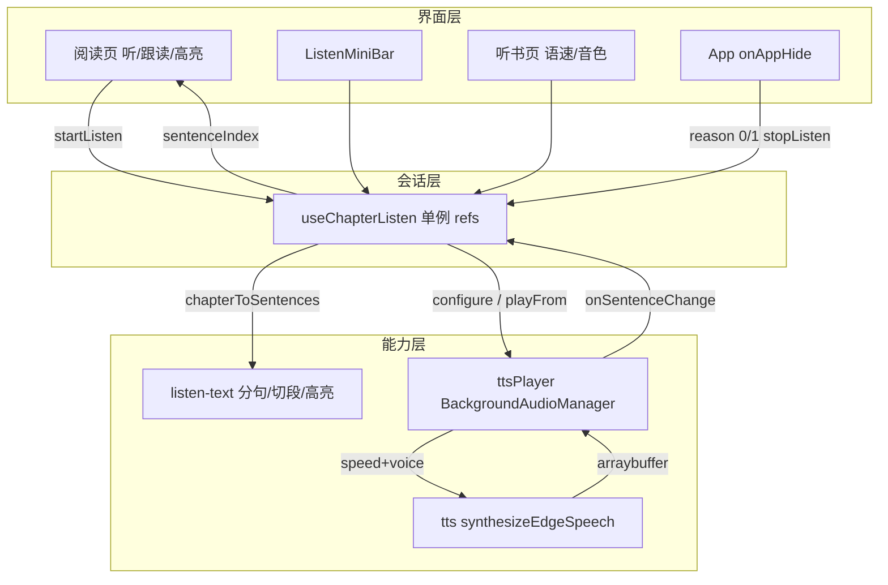

# 听书功能（功能实现详解与复刻指南）

> **一句话**：在阅读页点「听」，用 Edge TTS 逐句朗读当前书；迷你条 + 可选独立听书页播控；正文跟读与句级高亮；锁屏可续播，退出小程序则停播。  
> **入口**：阅读页底栏「听」；听书中底栏收起时右下角圆形「听」；迷你条「展开」进 `/pages/listen/index`。  
> **关联文件**：见 §0.4。  
> **文档目标**：读懂整套听书如何串起来；按 §5 可在其他 uni-app / 微信小程序项目复刻等价逻辑。  
> **非目标**：不写 EPUB 解析/书架/主题换肤本体；不写 Web 端听书；不做词级卡拉 OK。  
> **改动追溯**：[reader-listen-hybrid-impl.md](./reader-listen-hybrid-impl.md)、[reader-listen-follow-scroll-impl.md](./reader-listen-follow-scroll-impl.md)、[reader-listen-highlight-impl.md](./reader-listen-highlight-impl.md)、[reader-ebook-toc-listen-impl.md](./reader-ebook-toc-listen-impl.md)、[reader-listen-sentence-unit-impl.md](./reader-listen-sentence-unit-impl.md)、[reader-listen-tts-prefetch-impl.md](./reader-listen-tts-prefetch-impl.md)、[reader-listen-scroll-before-tts-impl.md](./reader-listen-scroll-before-tts-impl.md)、[reader-listen-page-toc-chapter-nav-impl.md](./reader-listen-page-toc-chapter-nav-impl.md)

---

## 0. 先看这里（必填，一眼建立模型）

### 0.1 30 秒读懂

- **做什么**：章节 HTML → 分句 → 后端 Edge TTS 合成 mp3 → `BackgroundAudioManager` 逐句播；阅读页迷你条 / 听书页播控；跟读滚屏 + 句高亮；锁屏续播；退出小程序停播。
- **不做什么**：不用 `InnerAudioContext` 做主播放（锁屏会被系统停）；不在 `App.onHide` 无差别停播（会误伤锁屏）。
- **三层角色**：
  - **界面**：阅读页入口、迷你条、听书页、跟读/高亮 UI
  - **会话**：`useChapterListen` 模块级单例状态
  - **能力**：`listen-text` 分句、`tts` 合成、`ttsPlayer` 后台音频

### 0.2 功能点总表（必填）

| 编号 | 功能点（人话）                   | 用户可感知表现              | 关键实现位置                            | 正文  |
| ---- | -------------------------------- | --------------------------- | --------------------------------------- | ----- |
| F1   | 章节 HTML 切成可朗读句子         | （幕后）有句才开播          | `listen-text.ts` → `chapterToSentences` | §4.1  |
| F2   | 向后端要一句语音二进制           | 「准备朗读…」后出声         | `tts.ts` → `synthesizeEdgeSpeech`       | §4.2  |
| F3   | 后台音频逐句播、预取、倍速重合成 | 连续听、改倍速不变调        | `tts-player.ts` → `TtsPlayer`           | §4.3  |
| F4   | 听书会话开始/暂停/停止           | idle↔loading↔playing↔paused | `useChapterListen.ts`                   | §4.4  |
| F5   | 按当前阅读滚动进度起播           | 不是每次从章首              | `onListenTap` + `scrollPercent`         | §4.5  |
| F6   | 底栏迷你播控条与倍速             | 上/下句、播控、Nx、展开     | `ListenMiniBar.vue`                     | §4.6  |
| F7   | 独立听书页 + Edge 音色           | 大字当前句、抽屉选音色      | `pages/listen/index.vue` + `edgeTts.ts` | §4.7  |
| F8   | 底栏「听」开关与收栏入口         | 点听开/关；收栏右下角「听」 | `reader/index.vue`                      | §4.8  |
| F9   | 播放时正文跟读到当前句           | 当前句落在上半屏            | 块段 + `scrollToListenSentence`         | §4.9  |
| F10  | 手动滑打断跟读并「回位」         | 出回位钮；点回位继续跟      | `listenAutoFollow` / 回位 FAB           | §4.10 |
| F11  | 章末自动下一章；全书听完停       | Toast「已听完本书」或续播   | `advanceChapter`                        | §4.11 |
| F12  | 锁屏续播；退出小程序停播         | 锁屏仍出声；关小程序停      | BGM + `App.vue` `onAppHide`             | §4.12 |
| F13  | 离开阅读栈且不在听书页则停       | 回书架不残留播放            | `stopListenIfLeavingReader`             | §4.13 |
| F14  | 路由与后台 audio 配置            | 听书页可开、后台模式合法    | `pages.json` / `manifest.json`          | §4.14 |
| F15  | 当前句正文高亮                   | 琥珀色底，切句跟随          | `injectListenSentenceHighlight`         | §4.15 |

### 0.3 架构一图（必填）



### 0.4 文件地图与建造顺序（必填）

| 建造序 | 文件                                   | 职责（一句话）                               | 依赖            |
| ------ | -------------------------------------- | -------------------------------------------- | --------------- |
| 1      | `src/utils/listen-text.ts`             | HTML→分句；块段；句高亮注入                  | 无              |
| 2      | `src/constants/edgeTts.ts`             | Edge 音色列表与默认                          | 无              |
| 3      | `src/services/tts.ts`                  | Edge TTS HTTP，可 abort                      | API 基址、token |
| 4      | `src/services/tts-player.ts`           | BGM 逐句播、预取、锁屏控播                   | 1、2、3         |
| 5      | `src/hooks/useChapterListen.ts`        | 会话状态与对外 API                           | 1、2、4         |
| 6      | `src/components/ListenMiniBar.vue`     | 阅读页迷你播控                               | 5               |
| 7      | `src/pages/listen/index.vue`           | 独立听书页 + 音色抽屉                        | 2、5            |
| 8      | `src/pages.json` / `src/manifest.json` | 听书页路由；`requiredBackgroundModes: audio` | 7               |
| 9      | `src/App.vue`                          | 退出类 AppHide 停播                          | 5               |
| 10     | `src/pages/reader/index.vue`           | 入口、跟读、高亮、getChapter                 | 1、5、6         |

---

## 1. 人话版：用户旅程（必填）

1. **进入**：打开一本书，滑到某处，点底栏「听」。
2. **主路径**：立刻出现迷你条（「准备朗读…」）→ 当前章拆成短句 → 后端合成第一句 → 手机出声；正文滚到当前句并琥珀色高亮；迷你条显示句摘要与 `3/120`。
3. **分支**：
   - 暂停/继续、上/下句；倍速（如 1.25x，不变尖）；听书页换 Edge 音色（记住选择）。
   - 「展开」进听书页看大字，返回阅读页声音不断。
   - 手滑正文：跟读停下，出「回位」；高亮仍跟当前句。
   - 听书时滚动不自动收底栏；收栏后右下角「听」可唤回。
   - 目录跳章：从该章章首续听。
   - 一章念完自动下一章；全书完则提示并停止。
   - **锁屏**：继续播，控制中心可切句。
   - **关闭小程序 / 进其他小程序**：听书停止。
4. **离开**：再点「听/关闭」停播；或从阅读页回书架（栈无听书页）停播。

---

## 2. 问题与解决方案总表（必填）

| 问题编号 | 现象 / 风险（人话）      | 根因                                 | 解决方案（本项目做法）                                    | 对应功能点 |
| -------- | ------------------------ | ------------------------------------ | --------------------------------------------------------- | ---------- |
| P1       | 锁屏后没声               | `InnerAudioContext` 进后台被系统停   | 改用 `BackgroundAudioManager` + `requiredBackgroundModes` | F3, F12    |
| P2       | 关小程序还在播           | BGM + 后台模式默认退出续播           | `wx.onAppHide` 仅 `reason` 0/1 时 `stopListen`            | F12        |
| P3       | 锁屏也被停               | 曾在 `App.onHide` 无差别 stop        | 用 `reason` 区分退出与「其他（含锁屏）」                  | F12        |
| P4       | 改倍速声音变尖           | `playbackRate` 同时改变调            | 倍速只走 TTS `speed` 重合成                               | F2, F3     |
| P5       | 切句时网络堆一堆 pending | 预取未 abort                         | `abort` + `abortSpeechExcept`                             | F2, F3     |
| P6       | 体验版首次点听失败       | `play` 落在 await 之后，脱离点击手势 | `startListen` 首个 await 前 `unlockFromUserGesture`       | F3, F4     |
| P7       | 能播却弹「音频播放失败」 | BGM/`InnerAudio` `onError` 误报多    | 不据此 toast；合成失败才提示                              | F3         |
| P8       | 整章 setData 过大卡顿    | 句锚灌进整章 mp-html                 | 块段切分 + 仅当前块段高亮 setContent                      | F9, F15    |
| P9       | 跟读与用户滚屏打架       | 句切换强制滚                         | 超阈值打断跟读 + 「回位」                                 | F10        |

---

## 3. 实现思路总览（必填）

### 3.1 总体策略

- **分句在客户端**：不依赖后端切句，HTML→纯文本→句界与 Web 对齐。
- **会话单例**：`useChapterListen` 用模块级 `ref`，阅读页与听书页共享同一会话。
- **播放用 BGM**：为锁屏/控制中心；代价是系统音频条与自定义迷你条并存。
- **退出用 reason**：微信基础库 3.5.7+ 的 `onAppHide.reason` 才能兼顾「关小程序停 / 锁屏继续」。

### 3.2 数据流与控制流

1. `startListen` → 手势解锁 → `loadAndPlayChapter` → `chapterToSentences` → `configure` → `playFrom`
2. `playCurrent`：合成 → 写 `USER_DATA_PATH` 临时 mp3 → 设 BGM 元数据 → `bgm.src`
3. `onEnded` → 下一句；末句 → `onChapterEnd` → `advanceChapter`
4. `onSentenceChange` → 更新句文案 → 阅读页跟读/高亮

### 3.3 模块职责（谁调用谁）

- Reader / MiniBar / Listen 页 → 只调 hook API
- Hook → `ttsPlayer` + `chapterToSentences`
- Player → `synthesizeEdgeSpeech`
- Reader 跟读/高亮 → `listen-text` 块段与 inject（不经过 player）

---

## 4. 分功能点详解（必填）

### 4.1 F1：章节 HTML 变成句子列表

#### （1）人话说明

要把一章网页式正文变成「一句一句」的朗读单元。先去掉标签得到纯文字，再按中英文句号等切开，并记下每句在全文里的起止位置（后面高亮要用）。

#### （2）实现思路

分句与 Web `englishTts` 对齐；`start/end` 与 `htmlToPlainText` + `stripMarkdownForTts` 同一坐标系，便于跟读/高亮定位。

#### （3）问题与对策

无独立踩坑；注意空章要返回 `[]`，由会话层决定跳下一章或 toast。

#### （4）实现过程

1. HTML → 纯文本
2. 再清一层 TTS 不需要的标记
3. 算句界 spans → 映射为 `ListenSentence[]`

#### （5）关键代码

- **位置**：`src/utils/listen-text.ts` → `chapterToSentences`

```ts
// 导出：把章节 HTML 变成带起止坐标的句子数组
export function chapterToSentences(html: string): ListenSentence[] {
  // 先转纯文本，再剥一层 TTS 无关噪音
  const plain = stripMarkdownForTts(htmlToPlainText(html));
  // 没有正文就没有句子
  if (!plain) return [];
  // 在纯文本上切句界，再填 text/index/start/end
  return (
    buildSentenceOffsetSpans(plain)
      .map(({ start, end }) => ({
        // 每句再 trim，避免边界空白进合成
        text: stripMarkdownForTts(plain.slice(start, end)).trim(),
        start,
        end,
      }))
      // 丢掉空句
      .filter((s) => s.text.length > 0)
      // 补上稳定的 index
      .map((s, index) => ({ text: s.text, index, start: s.start, end: s.end }))
  );
}
```

#### （6）复刻提示

换项目时只需保证「纯文本坐标系」与高亮定位一致；句界规则可按语言调整。

---

### 4.2 F2：Edge TTS 合成一句音频

#### （1）人话说明

把一句中文发给自己的后端，后端用 Edge 语音合成，返回一段 mp3 二进制。切句或停止时要能取消还在飞的请求。

#### （2）实现思路

不走通用 JSON unwrap（响体是 arraybuffer）；返回 `{ promise, abort }` 给播放器管理生命周期。`speed` 表示听书倍速，避免播放端变调。

#### （3）问题与对策

对应 P4、P5：倍速走 `speed`；切句必须 `abort`。

#### （4）实现过程

1. 校验 baseURL / 文本
2. 带 token POST
3. 成功 resolve ArrayBuffer；失败/超时/abort reject

#### （5）关键代码

- **位置**：`src/services/tts.ts` → `synthesizeEdgeSpeech`

```ts
// 导出可取消的 Edge 合成请求
export function synthesizeEdgeSpeech(
  text: string,
  options: EdgeSpeechOptions = {},
): EdgeSpeechRequest {
  // 未配置 API 基址时直接失败，避免打到错误域名
  if (!API_BASE_URL) {
    return {
      promise: Promise.reject(new ApiError(0, "未配置 VITE_API_BASE_URL")),
      abort: () => undefined,
    };
  }
  // 去掉首尾空白；空串不发请求
  const trimmed = text.trim();
  if (!trimmed) {
    return {
      promise: Promise.reject(new ApiError(0, "朗读文本为空")),
      abort: () => undefined,
    };
  }
  // JSON 请求头；有登录态则带 Bearer
  const header: Record<string, string> = {
    "Content-Type": "application/json",
  };
  const token = getToken();
  if (token) header.Authorization = `Bearer ${token}`;
  // settled 保证 success/fail/abort/超时只结束一次
  let settled = false;
  let task: UniApp.RequestTask | null = null;
  let rejectFn: ((err: ApiError) => void) | null = null;
  const finish = (fn: () => void) => {
    if (settled) return;
    settled = true;
    fn();
  };
  const promise = new Promise<ArrayBuffer>((resolve, reject) => {
    rejectFn = reject;
    // 二进制响体，不要按 JSON 解析
    task = uni.request({
      url: `${API_BASE_URL}/speech-transcription/edge/speech`,
      method: "POST",
      header,
      data: {
        text: trimmed,
        // 发音人；缺省晓晓
        voice: options.voice ?? DEFAULT_EDGE_TTS_VOICE,
        // 听书倍速走合成参数
        speed: options.speed ?? 1,
        vol: options.vol ?? 5,
        pitch: options.pitch ?? 0,
      },
      responseType: "arraybuffer",
      timeout: SPEECH_TIMEOUT_MS,
      success: (res) => {
        finish(() => {
          if (res.statusCode === 401) {
            reject(new ApiError(401, "未登录或登录已过期"));
            return;
          }
          if (res.statusCode >= 200 && res.statusCode < 300 && res.data) {
            resolve(res.data as ArrayBuffer);
            return;
          }
          reject(new ApiError(res.statusCode || 0, "语音合成失败"));
        });
      },
      fail: (err) => {
        finish(() => {
          const msg = err.errMsg ?? "网络错误";
          // abort 视为取消，不当成致命网络错
          if (/abort/i.test(msg)) {
            reject(new ApiError(0, "语音合成已取消"));
            return;
          }
          reject(new ApiError(0, msg));
        });
      },
    });
    // 超时主动 abort，避免永久 pending
    setTimeout(() => {
      finish(() => {
        try {
          task?.abort();
        } catch {
          // ignore
        }
        reject(new ApiError(0, "语音合成超时"));
      });
    }, SPEECH_TIMEOUT_MS);
  });
  return {
    promise,
    abort: () => {
      finish(() => {
        try {
          task?.abort();
        } catch {
          // ignore
        }
        rejectFn?.(new ApiError(0, "语音合成已取消"));
      });
    },
  };
}
```

#### （6）复刻提示

换成任意云 TTS 即可，保持「ArrayBuffer + abort」接口形状。

---

### 4.3 F3：BackgroundAudioManager 逐句播放

#### （1）人话说明

拿到 mp3 字节后写到小程序本地临时文件，交给微信「后台音频管理器」播放。一句结束自动下一句；可预取下一句；锁屏控制中心能上一句/下一句。

#### （2）实现思路

BGM 是全局单例，监听只绑一次。赋值 `src` 即开播。`playGen` 丢弃过期异步。不信任 `onError` 弹 toast。

#### （3）问题与对策

对应 P1、P5、P6、P7。

#### （4）实现过程

1. `ensureBgm` 绑 ended/play/pause/prev/next
2. `unlockFromUserGesture` 在点击栈播静音片
3. `playCurrent` 合成→写文件→元数据→`bgm.src`→预取下一句

#### （5）关键代码

- **位置**：`src/services/tts-player.ts` → `ensureBgm` / `unlockFromUserGesture` / `playCurrent`

```ts
// 懒创建并只绑定一次全局 BGM 监听
private ensureBgm(): UniApp.BackgroundAudioManager {
  if (this.bgm) return this.bgm;
  const bgm = uni.getBackgroundAudioManager();
  if (!this.bgmBound) {
    // 自然播完进下一句
    bgm.onEnded(() => {
      void this.playNext();
    });
    // 正句开播后同步 UI（解锁静音片不算）
    bgm.onPlay(() => {
      if (!this.expectingPlayback) return;
      this.markPlaying(this.playGen);
    });
    // 控制中心暂停 → 会话变 paused
    bgm.onPause(() => {
      this.expectingPlayback = false;
      this.clearPlayWatchdog();
      this.onPause?.();
    });
    bgm.onStop(() => {
      this.expectingPlayback = false;
      this.clearPlayWatchdog();
    });
    // 锁屏切句
    bgm.onPrev(() => {
      this.prevSentence();
    });
    bgm.onNext(() => {
      this.nextSentence();
    });
    // 误报极多，绝不据此 toast
    bgm.onError(() => undefined);
    this.bgmBound = true;
  }
  this.bgm = bgm;
  return bgm;
}

// 必须在用户点击的同步栈、任何 await 之前调用
unlockFromUserGesture(): void {
  const bgm = this.ensureBgm();
  this.clearPlayWatchdog();
  this.applyBgmMeta("听书");
  // 开发者工具解码静音片易炸，跳过
  if (isDevtools()) return;
  const silent = ensureSilentWavPath();
  if (!silent) return;
  try {
    // 赋值 src 即开播；静音仅用于占住播放会话
    bgm.src = silent;
  } catch {
    // ignore
  }
}

// 合成并播放当前句
private async playCurrent(): Promise<void> {
  // 世代号：切句/停止后丢弃过期结果
  const gen = ++this.playGen;
  const sentence = this.sentences[this.sentenceIndex];
  if (!sentence) {
    this.onChapterEnd?.();
    return;
  }
  // 先推句文案到 UI
  this.onSentenceChange?.(this.sentenceIndex);
  // 只保留当前句已有预取，其余 abort
  const curKey = this.cacheKey(sentence.text);
  this.abortSpeechExcept(new Set([curKey]));
  const bgm = this.ensureBgm();
  this.expectingPlayback = false;
  this.clearPlayWatchdog();
  try {
    const buf = await this.takeBuffer(sentence.text);
    if (gen !== this.playGen) return;
    if (!buf.byteLength) throw new Error("语音合成失败");
    const prev = this.lastTempPath;
    // 写入 USER_DATA_PATH 临时 mp3
    const filePath = this.writeTempMp3(buf);
    this.lastTempPath = filePath;
    // 控制中心展示书名/章名/句摘要
    this.applyBgmMeta(sentence.text || this.chapterTitle || "听书");
    this.expectingPlayback = true;
    this.armPlayWatchdog(gen);
    // 本地文件赋给 BGM，支持锁屏续播
    bgm.src = filePath;
    this.removeTemp(prev);
    // 开播后再预取下一句，避免抢带宽
    if (gen === this.playGen) {
      this.prefetchNext(this.sentenceIndex);
    }
  } catch {
    if (gen === this.playGen) {
      this.onError?.("语音合成失败");
    }
  }
}
```

#### （6）复刻提示

非微信平台用各自「后台音频」API；保持「本地文件或 https + 元数据 + 逐句切」模型。

---

### 4.4 F4：听书会话状态机

#### （1）人话说明

整本书听书过程有一份「会话」：正在听哪本、哪章、哪句、倍速、音色、播放状态。阅读页和听书页共用这份会话。

#### （2）实现思路

模块级 `ref` 单例（非 provide/inject），保证跨页一致。`sessionGen` 作废过期异步。

#### （3）问题与对策

对应 P6：`unlockFromUserGesture` 必须在第一个 `await` 之前。

#### （4）实现过程

1. `startListen` 重置并解锁
2. `loadAndPlayChapter` 拉章、分句、configure、playFrom
3. `stopListen` 升 gen、停 BGM、清会话

#### （5）关键代码

- **位置**：`src/hooks/useChapterListen.ts` → `startListen` / `stopListen`

```ts
// 从阅读页「听」进入：建立会话并起播
export async function startListen(opts: StartListenOptions): Promise<void> {
  // 作废上一次会话的一切异步回调
  sessionGen += 1;
  // 停掉可能残留的 BGM
  ttsPlayer.stop();
  // 点击栈内解锁（本函数第一个 await 之前）
  ttsPlayer.unlockFromUserGesture();
  // 注入取章回调与书信息
  getChapterFn = opts.getChapter;
  bookId.value = opts.bookId;
  bookTitle.value = opts.bookTitle;
  coverUrl.value = opts.coverUrl ?? "";
  chapterIndex.value = opts.chapterIndex;
  // 每次起播重置为 1x（产品选择）
  rate.value = 1;
  // 只同步音色/倍速到播放器，不开播
  ttsPlayer.setVoice(voice.value, { play: false });
  ttsPlayer.setRate(1, { play: false });
  // 先露出迷你条 loading
  status.value = "loading";
  currentSentenceText.value = "准备朗读…";
  chapterTitle.value = "";
  // 之后才 await 拉章/合成
  await loadAndPlayChapter(opts.chapterIndex, {
    scrollPercent: opts.scrollPercent ?? 0,
  });
}

// 彻底结束听书会话
export function stopListen(): void {
  sessionGen += 1;
  advancing = false;
  ttsPlayer.stop();
  getChapterFn = null;
  resetSession();
}
```

#### （6）复刻提示

状态可放 Pinia/单例；关键是「跨页共享 + 世代号」。

---

### 4.5 F5：按阅读进度起播

#### （1）人话说明

用户滑到章节中间再点「听」，应从附近句子开始，而不是章首。

#### （2）实现思路

阅读页维护 `readingScrollPercent`（0–1），映射为句下标 `floor(p * count)`。

#### （3）问题与对策

边界：p≤0→0；p≥1→末句；单句章→0。

#### （4）实现过程

1. 滚动时更新 percent
2. `onListenTap` 传入 `scrollPercent`
3. `sentenceIndexFromScrollPercent` 算起播句

#### （5）关键代码

- **位置**：`useChapterListen.ts` → `sentenceIndexFromScrollPercent`；`reader` → `onListenTap`

```ts
// 滚动进度 0–1 → 句下标
function sentenceIndexFromScrollPercent(count: number, scrollPercent: number): number {
  if (count <= 0) return 0;
  if (count === 1) return 0;
  const p = Math.min(1, Math.max(0, scrollPercent));
  if (p <= 0) return 0;
  if (p >= 1) return count - 1;
  return Math.min(count - 1, Math.floor(p * count));
}
```

```ts
// 阅读页：未在听则起播，已在听则关闭
async function onListenTap() {
  if (!bookId.value || !hasContent.value) return;
  if (listenActive.value) {
    stopListen();
    void nextTick(() => setTimeout(measureChromeInsets, 80));
    return;
  }
  bottomPanel.value = null;
  try {
    await startListen({
      bookId: bookId.value,
      bookTitle: bookTitle.value,
      coverUrl: bookCoverUrl.value,
      chapterIndex: chapterIndex.value,
      // 用当前阅读位置映射起播句
      scrollPercent: readingScrollPercent.value,
      getChapter: async (index) => {
        const block = await fetchChapterBlock(index);
        return {
          html: block.html,
          title: block.title,
          nextIndex: index < chapterTotal.value - 1 ? index + 1 : null,
        };
      },
    });
    void nextTick(() => {
      setTimeout(measureChromeInsets, 80);
      void scrollToListenSentence(true);
    });
  } catch (err) {
    uni.showToast({
      title: err instanceof Error ? err.message : "听书启动失败",
      icon: "none",
    });
  }
}
```

#### （6）复刻提示

若有更准的「视口首句」检测可替换 percent 映射。

---

### 4.6 F6：迷你播控条

#### （1）人话说明

听书进行中，阅读页底栏上方出现一条：当前句、进度、上句/播放/下句、倍速、展开。

#### （2）实现思路

`ListenMiniBar` 只消费 `useChapterListen`；按钮用 `wd-button`（soft/base）拿组件自带按下态；等宽用 flex 格子包裹。

#### （3）问题与对策

`custom-class` 不能当 flex 子项等分 → 外层 `listen-mini__cell` 等分。

#### （4）实现过程

1. `isActive` 时渲染
2. 语速菜单 `setListenRate`
3. 播控调 hook；正文点击 `expandListenPage`

#### （5）关键代码

- **位置**：`src/components/ListenMiniBar.vue`（结构摘要）

```vue
<!-- 仅有听书会话时显示 -->
<wd-config-provider v-if="isActive" :theme="dark ? 'dark' : 'light'" :theme-vars="miniThemeVars">
  <view class="listen-mini" @click.stop>
    <!-- 点摘要区展开听书页 -->
    <view class="listen-mini__main" @click="expandListenPage">
      <text class="listen-mini__chapter">{{ chapterTitle || bookTitle || "听书" }}</text>
      <text class="listen-mini__progress">{{ progressLabel }}</text>
      <text class="listen-mini__sentence">{{ currentSentenceText || "准备朗读…" }}</text>
    </view>
    <!-- 倍速条：等分格子 + wd-button -->
    <view v-if="rateMenuOpen" class="listen-mini__rates">
      <view v-for="r in rates" :key="r" class="listen-mini__cell">
        <wd-button
          type="primary"
          :variant="rate === r ? 'base' : 'soft'"
          block
          size="small"
          custom-class="listen-mini__btn"
          @click.stop="pickRate(r)"
        >
          {{ r }}x
        </wd-button>
      </view>
    </view>
    <!-- 此处省略：上句 / 播放暂停 / 下句 / 倍速入口 / 展开，同样 cell+wd-button -->
  </view>
</wd-config-provider>
```

#### （6）复刻提示

任意 UI 库按钮即可；保持「等分宽度 + 按下反馈」。

---

### 4.7 F7：独立听书页与 Edge 音色

#### （1）人话说明

「展开」进入大字听书页：当前句可滚动阅读；底部播控、语速、Edge 音色抽屉。选过的音色会记住。

#### （2）实现思路

页只绑同一 hook；音色表在 `edgeTts.ts`；本地 key `ebook_edge_tts_voice`。抽屉用 `wd-popup` + `root-portal` 避免被页面裁切。

#### （3）问题与对策

微信 `overflow:hidden` 会裁自绘 fixed 层 → 用组件 popup + root-portal。

#### （4）实现过程

1. `expandListenPage` navigateTo
2. 页内展示 `currentSentenceText`（scroll-view，padding 在内容层让滚动条贴边）
3. `setListenVoice` 校验、存 storage、player 重合成

#### （5）关键代码

- **位置**：`edgeTts.ts` 默认与列表；`setListenVoice`

```ts
// 与 Web / 后端一致的默认发音人
export const DEFAULT_EDGE_TTS_VOICE = "zh-CN-XiaoxiaoNeural";

// 本地存储 key
const VOICE_STORAGE_KEY = "ebook_edge_tts_voice";

// 切换音色并持久化
export function setListenVoice(next: string): void {
  // 非法 id 或未变化则忽略
  if (!isEdgeTtsVoiceId(next) || next === voice.value) return;
  voice.value = next;
  try {
    uni.setStorageSync(VOICE_STORAGE_KEY, next);
  } catch {
    // ignore
  }
  // 播放器按新音色重合成当前句
  ttsPlayer.setVoice(next);
  if (status.value !== "idle") status.value = "playing";
}
```

#### （6）复刻提示

音色表可缩成你们支持的子集；存储 key 按产品命名。

---

### 4.8 F8：底栏「听」与收栏圆形入口

#### （1）人话说明

底栏最右侧是「听/关闭」开关。听书中若收起底栏，右下角保留圆形「听」以便唤回。

#### （2）实现思路

`listenActive` 驱动文案与高亮；`onListenFloatTap` 打开 chrome，不重复起播。

#### （3）问题与对策

无；注意与「回位」FAB 叠层顺序。

#### （4）实现过程

见 F5 `onListenTap`；浮动钮另绑 `chromeVisible = true`。

#### （5）关键代码

（入口逻辑见 §4.5；浮动钮略，行为：显示底栏。）

#### （6）复刻提示

开关与起播务必同一入口，避免双会话。

---

### 4.9 F9：跟读滚屏

#### （1）人话说明

朗读时，正文自动滚到当前句附近，用户不用自己找。

#### （2）实现思路

听书当前章把 HTML 切成块段原生 view（`#ls-*`），用句的 `start` 映射块段再 `scroll-into-view` / 算 offset；避免整章句锚导致 setData 过大（P8）。

#### （3）问题与对策

对应 P8。

#### （4）实现过程

1. `buildChapterHtmlSegments`
2. watch `listenSentenceIndex` → `scrollToListenSentence`
3. 仅听书当前章启用分段模式

#### （5）关键代码

- **位置**：`listen-text.ts` → `buildChapterHtmlSegments` / `segmentIndexForChar`（细节见 [reader-listen-follow-scroll-impl.md](./reader-listen-follow-scroll-impl.md)）

```ts
// 字符偏移落在哪一段（跟读定位入口）
export function segmentIndexForChar(segments: ChapterHtmlSegment[], charOffset: number): number {
  // 空段表 → 0
  if (!segments.length) return 0;
  for (let i = 0; i < segments.length; i++) {
    const seg = segments[i]!;
    // 落在 [start, end) 即命中
    if (charOffset >= seg.start && charOffset < seg.end) return i;
  }
  // 超出则钳到最后一段
  return segments.length - 1;
}
```

#### （6）复刻提示

可先用「整章百分比滚动」做 MVP，再升级块段。

---

### 4.10 F10：打断跟读与回位

#### （1）人话说明

用户自己滑正文时，不要再强制拽回去；给一个「回位」按钮，想跟读时再点。

#### （2）实现思路

`listenAutoFollow` 开关；跟读滚动时记位置，用户滚超过阈值则 `breakListenAutoFollow`；回位恢复开关并 `scrollToListenSentence(true)`。

#### （3）问题与对策

对应 P9；程序滚动要用护栏避免误判为用户手势。

#### （4）实现过程

详见 [reader-listen-follow-scroll-impl.md](./reader-listen-follow-scroll-impl.md)。

#### （5）关键代码

（篇幅见专项 impl；核心标志位 `listenAutoFollow` + 回位 FAB。）

#### （6）复刻提示

阈值按设备调试；程序滚动务必 suppress 手势检测。

---

### 4.11 F11：章末切章

#### （1）人话说明

一章最后一句念完，自动进下一章继续；没有下一章就提示听完并停止。

#### （2）实现思路

`onChapterEnd` → `advanceChapter`；用 `getChapter` 返回的 `nextIndex`；`advancing` 防重入。

#### （3）问题与对策

空章则跳过继续找下一章（`loadAndPlayChapter` 内）。

#### （4）实现过程

1. player 末句 `onChapterEnd`
2. `advanceChapter` 取 next
3. null → toast + stop；否则 `loadAndPlayChapter(next, { fromSentence: 0 })`

#### （5）关键代码

```ts
// 章播完：有下一章则章首续听
async function advanceChapter(): Promise<void> {
  if (advancing || !getChapterFn) return;
  advancing = true;
  try {
    const chapter = await getChapterFn(chapterIndex.value);
    const next = chapter.nextIndex;
    if (next == null) {
      uni.showToast({ title: "已听完本书", icon: "none" });
      stopListen();
      return;
    }
    await loadAndPlayChapter(next, { fromSentence: 0 });
  } catch {
    uni.showToast({ title: "加载下一章失败", icon: "none" });
    status.value = "paused";
  } finally {
    advancing = false;
  }
}
```

#### （6）复刻提示

`nextIndex` 由你们的目录/章节 API 提供即可。

---

### 4.12 F12：锁屏续播与退出停播

#### （1）人话说明

手机锁屏时希望继续听；但用户关掉小程序或跳到别的小程序时，不要在后台一直念。

#### （2）实现思路

- 续播：BGM + `manifest.requiredBackgroundModes: ["audio"]`
- 停播：`wx.onAppHide` 看 `reason`——`0` 退出、`1` 进其他小程序才 `stopListen`；`3` 等（含锁屏）不停

#### （3）问题与对策

对应 P1–P3。须基础库 ≥ 3.5.7 才有可靠 `reason`。

#### （4）实现过程

1. manifest 声明 audio
2. player 用 BGM
3. App `onLaunch` 里注册 `wx.onAppHide`

#### （5）关键代码

- **位置**：`src/App.vue`；`src/manifest.json`

```ts
onLaunch(() => {
  // 隐藏原生 tabBar，改用自定义
  uni.hideTabBar({ animation: false });
  applyPageChrome();
  // 取微信原生 API（uni onHide 不一定带 reason）
  const wxApi = (
    globalThis as typeof globalThis & {
      wx?: { onAppHide?: (fn: (opt: { reason?: number }) => void) => void };
    }
  ).wx;
  // 0 退出小程序 · 1 进其他小程序 → 停听书；锁屏等为 3 → 续播
  wxApi?.onAppHide?.((opt) => {
    const reason = opt?.reason;
    if (reason === 0 || reason === 1) stopListen();
  });
});
```

```json
{
  "mp-weixin": {
    "appid": "wxbc334debd8ed8b2d",
    "requiredBackgroundModes": ["audio"]
  }
}
```

#### （6）复刻提示

正式版后台音频能力可能要微信公众平台开通/审核；无 `reason` 的老基础库无法完美兼顾两者。

---

### 4.13 F13：离开阅读页停播

#### （1）人话说明

用户从阅读页返回书架时，若没有打开独立听书页，应停止播放，避免「人走了声音还在」。

#### （2）实现思路

`onUnload` 调 `stopListenIfLeavingReader`：检查页面栈是否仍有 `pages/listen/index`。

#### （3）问题与对策

展开听书页后再返回阅读页——栈里曾有 listen；unload 阅读页时若 listen 仍在栈则不停（可按产品调整）。

#### （4）实现过程

```ts
// 阅读页卸载：栈上没有听书页才停
export function stopListenIfLeavingReader(): void {
  const pages = getCurrentPages();
  const hasListen = pages.some((p) => {
    const route = (p as { route?: string }).route ?? "";
    return route.includes("pages/listen/index");
  });
  if (!hasListen) stopListen();
}
```

#### （5）关键代码

同上。

#### （6）复刻提示

若希望「进听书页也随阅读页卸载停」，直接 `stopListen()` 即可。

---

### 4.14 F14：路由与配置

#### （1）人话说明

听书页要注册进小程序；后台播放要在配置里声明 audio 模式。

#### （2）实现思路

`pages.json` 增加 `pages/listen/index`（custom 导航）；`manifest` 见 F12。

#### （3）问题与对策

无。

#### （4）实现过程

注册页面 → 声明 backgroundModes → 真机验证锁屏。

#### （5）关键代码

```json
{
  "path": "pages/listen/index",
  "style": {
    "navigationStyle": "custom",
    "navigationBarTitleText": "听书"
  }
}
```

#### （6）复刻提示

路径与 `expandListenPage` 的 url 保持一致。

---

### 4.15 F15：句级高亮

#### （1）人话说明

正在朗读的那一句，在正文里用琥珀色背景标出来；换句时高亮跟着走。

#### （2）实现思路

只在当前句所在块段 HTML 上注入 `<span data-listen-hl="1">`，对该块 `mp-html.setContent`；禁止整章重灌（P8）。详情见 [reader-listen-highlight-impl.md](./reader-listen-highlight-impl.md)。

#### （3）问题与对策

对应 P8；停听时 `stripListenHighlight`。

#### （4）实现过程

1. watch `listenSentenceIndex`
2. `segmentIndexForChar(sentence.start)`
3. `injectListenSentenceHighlight` → `setContent`

#### （5）关键代码

```ts
// 去掉听书高亮包裹，保留正文
export function stripListenHighlight(html: string): string {
  return html.replace(/<span\s+[^>]*data-listen-hl="1"[^>]*>([\s\S]*?)<\/span>/gi, "$1");
}
```

#### （6）复刻提示

高亮标签须在你们的富文本组件白名单内（本项目用 span + 内联 style）。

---

## 5. 跨项目复刻手册（必填）

### 5.1 前置条件

| 项     | 说明                                                                       |
| ------ | -------------------------------------------------------------------------- |
| 运行时 | uni-app 或原生微信小程序                                                   |
| 后端   | 提供 Edge（或等价）TTS，返回 mp3 `arraybuffer`                             |
| 登录   | 若接口需鉴权，请求带 token                                                 |
| 微信   | `requiredBackgroundModes: ["audio"]`；基础库建议 ≥ 3.5.7（AppHide reason） |
| 正式版 | 后台音频能力按微信平台要求开通/审核                                        |

### 5.2 建造顺序（依赖从底向上）

1. `listen-text`：分句 +（可选）块段/高亮
2. `edgeTts` 常量 + `tts` 合成
3. `tts-player`（BGM）
4. `useChapterListen` 会话
5. 迷你条 UI
6. 听书页 UI + 音色
7. `pages.json` / `manifest` / `App onAppHide`
8. 阅读页挂入口、跟读、高亮

### 5.3 最小可运行切片（MVP）

只做 **F1 + F2 + F3 + F4 + F5 + F8 + F14** 即可：「点听 → 出声 → 暂停/停止」。  
再加 F6 迷你条、F12 锁屏/退出、F9–F10 跟读、F7 音色、F15 高亮。

### 5.4 抽象 ↔ 平台替身

| 本项目                    | 抽象动作         | 其他栈常见写法                                             |
| ------------------------- | ---------------- | ---------------------------------------------------------- |
| `BackgroundAudioManager`  | 后台长音频       | iOS AVAudioSession + 后台 mode；Android Foreground Service |
| `wx.onAppHide.reason`     | 区分退出与锁屏   | 各自生命周期，多数无法完美区分                             |
| `uni.request arraybuffer` | 拉音频字节       | fetch → arrayBuffer                                        |
| `USER_DATA_PATH` 临时文件 | 给播放器本地路径 | 缓存目录 / blob URL（H5）                                  |
| `chapterToSentences`      | HTML→句          | 任意句界库                                                 |

### 5.5 验收用例（对应 F）

- [ ] F5/F8：章中滚动后点「听」，从附近句起播，迷你条出现
- [ ] F3/F4：能暂停/继续/上句/下句
- [ ] F3：切换 1.25x，音色不变尖
- [ ] F7：听书页换音色，再次进入仍是所选音色
- [ ] F11：章末自动进下一章；末章 toast 停播
- [ ] F12：锁屏续播；控制中心可切句；胶囊关闭后停止
- [ ] F9/F10：跟读滚动；手滑出回位；点回位恢复
- [ ] F15：当前句琥珀色高亮随切句移动
- [ ] F13：从阅读页回书架（无听书页）声音停止

### 5.6 移植时易忘点

| 忘记做                           | 后果               |
| -------------------------------- | ------------------ |
| 未声明 `requiredBackgroundModes` | 锁屏/后台易停      |
| `App.onHide` 无差别 stop         | 锁屏也被停         |
| 未在点击栈 `unlock`              | 体验版首次起播失败 |
| 倍速用 playbackRate              | 声音变尖           |
| 切句不 abort 合成                | 网络请求堆积       |
| 整章句锚 setContent              | setData 过大卡顿   |
| 信任音频 onError toast           | 能播仍弹失败       |

---

## 6. 相关文档

| 文档                                                                         | 关系                     |
| ---------------------------------------------------------------------------- | ------------------------ |
| [reader-listen-hybrid-impl.md](./reader-listen-hybrid-impl.md)               | 混合形态落地时的改前改后 |
| [reader-listen-follow-scroll-impl.md](./reader-listen-follow-scroll-impl.md) | 跟读/回位/块段性能       |
| [reader-listen-highlight-impl.md](./reader-listen-highlight-impl.md)         | 句级高亮细节             |

---

## 7. 文档维护说明

本文以仓库**当前最终代码**为准（BGM 播放、Edge 音色、AppHide reason 停播）。若播放器改回 `InnerAudioContext` 或停播策略变化，须同步改 §0.1、§2、§4.3、§4.12 与验收用例。
