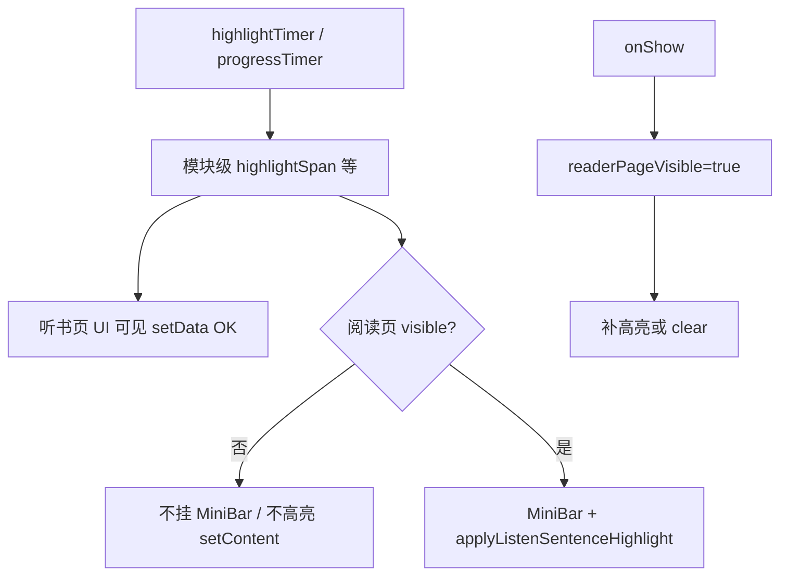

# 听书隐藏页 setData / `__subPageFrameEndTime__`（实现思路）

> **状态**：已采纳  
> **关联文件**：`src/pages/reader/index.vue`、`src/hooks/useChapterListen.ts`、`src/services/tts-player.ts`  
> **来源会话**：[听书跟读与迷你条迭代](c3f8bd51-ec80-47b8-be74-2f558038843f)  
> **相关文档**：跟读滚屏 [reader-listen-follow-scroll-impl.md](./reader-listen-follow-scroll-impl.md)；句高亮 [reader-listen-highlight-impl.md](./reader-listen-highlight-impl.md)

---

## 1. 需求背景（必填）

从阅读页进入独立听书页后，阅读页仍留在页面栈但处于隐藏态。听书 `setInterval`（高亮 tick / 进度同步）持续改共享 `ref`，隐藏页上的迷你条与句高亮仍尝试 `setData` / `mp-html.setContent`，微信开发者工具刷：

`TypeError: Cannot read property '__subPageFrameEndTime__' of null`（堆栈含 `<setInterval callback>`）。

成功标准：阅读页 ↔ 听书页切换时控制台不再刷该错误；回到阅读页高亮/迷你条仍正常。

---

## 2. 用户需求与 Agent 问答（必填）

### 2.1 控制台报 `__subPageFrameEndTime__`

**用户：**

> 小程序控制太报错：`Cannot read property '__subPageFrameEndTime__' of null`（`setInterval`）

**Agent 回答摘要：**

- 根因：隐藏阅读页仍挂 `ListenMiniBar` 并订阅句级文案；高亮 watch 仍对 mp-html `setContent`
- **最终落地**：`readerPageVisible` + `onShow/onHide/onUnload`；隐藏时卸迷你条；高亮入口拦截；可见时再补绘/清理

---

## 3. 实现思路（必填，细致到每个点）

### 3.1 总体策略

不改共享会话（听书页仍需进度/句文案），只切断**隐藏阅读页**上的 setData 路径：

1. 页面可见标志 `readerPageVisible`
2. `v-if="readerPageVisible"` 卸掉迷你条（取消模板对 `currentSentenceText` 等的订阅）
3. `setListenSegContent` / `applyListenSentenceHighlight` 入口直接 return
4. `onShow` 再补高亮或清残留

辅助：`tickHighlight` / `syncListenProgress` 包 try/catch，避免切换瞬间其它空指针放大噪声。

### 3.2 数据流 / 控制流



### 3.3 分点设计

- **可见标志**：见 4.1
- **迷你条卸载**：见 4.2
- **高亮 setContent 门闩**：见 4.3
- **生命周期补绘**：见 4.4

---

## 4. 改动点对比：改前 / 改后（必填）

### 4.1 改动点：`readerPageVisible` 与生命周期

- **位置**：`src/pages/reader/index.vue` → 约第 361 行；`onShow` / `onHide` / `onUnload`
- **差异摘要**：新增前台标志，隐藏/卸载置 false，显示置 true。

#### 改动前

```ts
// 仅有 chrome / toc 等 UI 状态，无「页是否在前台」标志
const chromeVisible = ref(false);
// 目录抽屉开关
const tocOpen = ref(false);
```

```ts
// onShow 只刷页面 chrome
onShow(() => {
  applyReaderPageChrome();
});

// onHide 只落进度
onHide(() => {
  void flushProgressSave();
});
```

#### 改动后

```ts
// 底栏显隐
const chromeVisible = ref(false);
// 目录抽屉
const tocOpen = ref(false);
// 阅读页在前台时才做听书高亮 setData
const readerPageVisible = ref(true);
```

```ts
// 回到前台：可见 + 补高亮或清残留
onShow(() => {
  readerPageVisible.value = true;
  applyReaderPageChrome();
  void nextTick(() => {
    if (listenActive.value) applyListenSentenceHighlight();
    else clearListenSentenceHighlight();
  });
});

// 进后台：不可见，停对隐藏页 setData
onHide(() => {
  readerPageVisible.value = false;
  void flushProgressSave();
});

// 卸载：不可见并清跟读 timer
onUnload(() => {
  readerPageVisible.value = false;
  clearListenAnchorTimer();
  tocSheetRef.value?.reset();
  stopListenIfLeavingReader();
  void flushProgressSave();
});
```

### 4.2 改动点：隐藏时不挂 `ListenMiniBar`

- **位置**：`src/pages/reader/index.vue` 底栏模板（约第 134–135 行）
- **差异摘要**：隐藏页卸载迷你条，避免 250ms/高亮 tick 驱动隐藏页 setData。

#### 改动前

```vue
<!-- 始终挂载；内部 v-if=isActive 只藏 DOM，setup 仍订阅会话 ref -->
<ListenMiniBar :dark="isDarkPaper" @layout="onListenMiniLayout" />
```

#### 改动后

```vue
<!-- 隐藏页仍挂迷你条会随 highlight setInterval setData → 微信 __subPageFrameEndTime__ -->
<ListenMiniBar v-if="readerPageVisible" :dark="isDarkPaper" @layout="onListenMiniLayout" />
```

### 4.3 改动点：高亮 `setContent` 门闩

- **位置**：`src/pages/reader/index.vue` → `setListenSegContent` / `clearListenSentenceHighlight` / `applyListenSentenceHighlight`
- **差异摘要**：不可见时不写 mp-html；清理时若隐藏则保留标记，待 `onShow` 处理。

#### 改动前

```ts
// 直接对 mp-html 灌 HTML
function setListenSegContent(chap: number, si: number, html: string) {
  // 取实例
  const inst = getMpHtmlById(`mp-html-${chap}-${si}`);
  // 无门闩，隐藏页也会 setContent
  inst?.setContent?.(html);
}

// 还原上一段干净 HTML
function clearListenSentenceHighlight() {
  // 无高亮记录则跳过
  if (listenHlChap < 0 || listenHlSeg < 0) return;
  // 找块
  const block = chapterBlocks.value.find((b) => b.index === listenHlChap);
  // 原文
  const clean = block?.segments[listenHlSeg]?.html;
  // 立刻写回（隐藏页也会）
  if (clean != null) setListenSegContent(listenHlChap, listenHlSeg, clean);
  // 清标记
  listenHlChap = -1;
  listenHlSeg = -1;
}

// 句级高亮入口
function applyListenSentenceHighlight(retry = true) {
  // 仅看是否在听
  if (!listenActive.value) {
    clearListenSentenceHighlight();
    return;
  }
  // … 注入高亮并 setContent …
}
```

#### 改动后

```ts
// 对 mp-html 灌 HTML（带可见门闩）
function setListenSegContent(chap: number, si: number, html: string) {
  // 隐藏页直接跳过，避免框架空指针
  if (!readerPageVisible.value) return;
  // 取实例
  const inst = getMpHtmlById(`mp-html-${chap}-${si}`);
  // 写内容
  inst?.setContent?.(html);
}

// 还原上一段干净 HTML
function clearListenSentenceHighlight() {
  // 无高亮记录则跳过
  if (listenHlChap < 0 || listenHlSeg < 0) return;
  // 隐藏时不 setContent，保留标记，onShow 再清/重绘
  if (!readerPageVisible.value) return;
  // 找块
  const block = chapterBlocks.value.find((b) => b.index === listenHlChap);
  // 原文
  const clean = block?.segments[listenHlSeg]?.html;
  // 可见时写回
  if (clean != null) setListenSegContent(listenHlChap, listenHlSeg, clean);
  // 清标记
  listenHlChap = -1;
  listenHlSeg = -1;
}

// 句级高亮入口
function applyListenSentenceHighlight(retry = true) {
  // 页不可见则整段跳过
  if (!readerPageVisible.value) return;
  // 未听书则清理
  if (!listenActive.value) {
    clearListenSentenceHighlight();
    return;
  }
  // … 注入高亮并 setContent …
}
```

### 4.4 改动点：watch / 跟读也看可见性

- **位置**：阅读页听书高亮 watch、跟读 watch（依赖数组含 `readerPageVisible`）
- **差异摘要**：不可见时不调度 `applyListenSentenceHighlight` / `scrollToListenSentence`。

#### 改动前

```ts
// 仅依赖听书与高亮 span
watch(
  () =>
    [
      listenActive.value,
      listenChapterIndex.value,
      listenHighlightSpan.value?.start,
      listenHighlightSpan.value?.end,
    ] as const,
  ([active]) => {
    // 在听就高亮（隐藏页也会）
    if (!active) return;
    void nextTick(() => applyListenSentenceHighlight());
  },
);
```

#### 改动后

```ts
// 增加可见依赖
watch(
  () =>
    [
      listenActive.value,
      listenChapterIndex.value,
      listenHighlightSpan.value?.start,
      listenHighlightSpan.value?.end,
      readerPageVisible.value,
    ] as const,
  ([active, , , , visible]) => {
    // 未听或隐藏都不 setData
    if (!active || !visible) return;
    void nextTick(() => applyListenSentenceHighlight());
  },
);
```

---

## 5. 验证要点（建议）

- [ ] 阅读页听书 → 进听书页：控制台不再刷 `__subPageFrameEndTime__`
- [ ] 听书页播放 / ±15：无上述错误
- [ ] 返回阅读页：迷你条回来，当前句高亮正确
- [ ] 返回后停听：高亮被清掉

---

## 6. 影响分析（必填，放在文档最后）

### 6.1 结论

- **是否影响已有功能点**：局部影响 — 仅改变「阅读页隐藏期间」是否更新迷你条/高亮 DOM；听书页播控与会话不变
- **是否影响既有正常逻辑**：局部影响 — 隐藏期间阅读页高亮可能短暂过时，回前台由 `onShow` 对齐

### 6.2 影响点明细

| #   | 影响对象               | 影响方式                            | 程度 | 说明与回归建议           |
| --- | ---------------------- | ----------------------------------- | ---- | ------------------------ |
| 1   | 阅读页隐藏时的 MiniBar | 卸载，不再刷新句文案                | 低   | 用户看不到隐藏页，可接受 |
| 2   | 阅读页隐藏时的句高亮   | 不 setContent                       | 低   | 回页后 `onShow` 补绘     |
| 3   | 听书页 / TTS 会话      | 无契约变化                          | —    | 回归播控、切章           |
| 4   | 微信框架报错           | 消除 `__subPageFrameEndTime__` 刷屏 | 高   | 开发者工具复现切换路径   |

### 6.3 调用面 / 波及说明（建议）

- `useChapterListen` 仍被阅读页、迷你条、听书页共用；本次只在阅读页侧加可见门闩
- `tts-player` 高亮 tick 仍更新模块 ref；听书页继续消费，阅读页隐藏时不再落到 DOM
