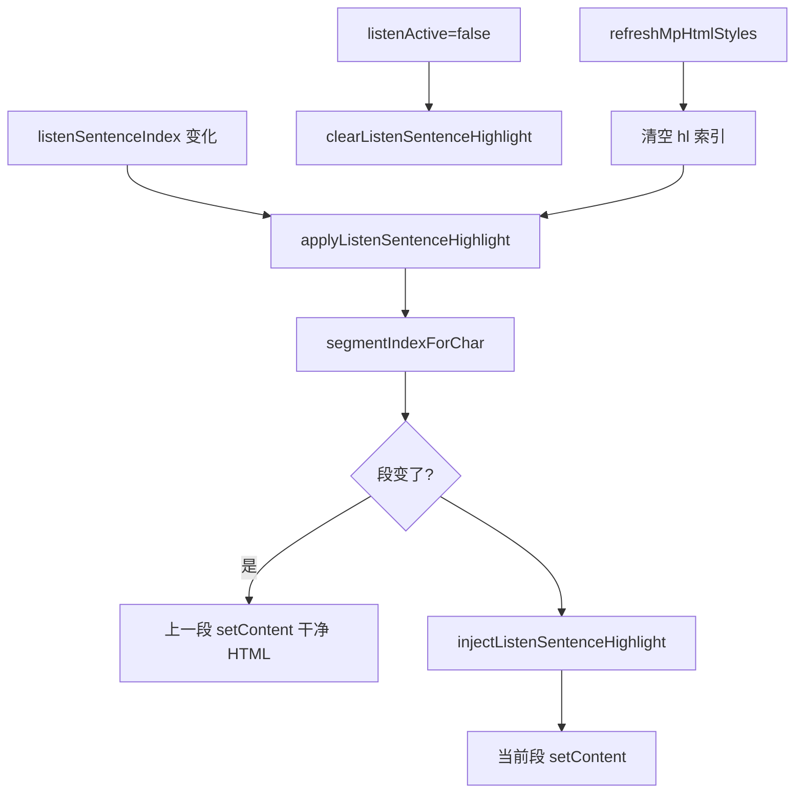

# 听书句级高亮（实现思路）

> **状态**：已采纳  
> **关联文件**：`src/utils/listen-text.ts`、`src/pages/reader/index.vue`  
> **来源会话**：[setData 与跟读定位](18e2e903-7486-4b12-b57a-8130fc3dea1d)  
> **依赖**：块段跟读见 [reader-listen-follow-scroll-impl.md](./reader-listen-follow-scroll-impl.md)；整套听书见 [reader-listen-guide.md](./reader-listen-guide.md)

---

## 1. 需求背景（必填）

在阅读页听书时，除跟读滚屏外，需要把**当前正在播放的那一句**在正文中高亮标出。要求句级精度，且不能破坏既有跟读/播控逻辑，也不能再引入整章 `setContent` 导致的卡顿与超大 setData。

成功标准：听书句切换时，当前句有可见高亮；停听后高亮消失；非听书阅读路径不变；切句只触达当前块段（或再加清上一段）。

---

## 2. 用户需求与 Agent 问答（必填）

### 2.1 能否高亮

**用户：**

> 能在页面中实现高亮当前播放句吗？

**Agent 回答摘要：**

- 能做；忌整章每句重灌 HTML
- 可选段级外壳高亮，或「只重绘当前块段」的句级包裹

### 2.2 定案句级且保性能

**用户：**

> 句级，但是需要在不影响当前功能逻辑已经性能的前提下实现

**Agent 回答摘要：**

- **最终落地**：在已有块段方案上，仅对当前句所在段 `injectListenSentenceHighlight` + `setContent`
- `segments[].html` 始终存干净原文；高亮不写回响应式数据
- 句切换独立 watch（与是否自动跟读无关）；换肤后重刷高亮

---

## 3. 实现思路（必填，细致到每个点）

### 3.1 总体策略

复用听书当前章的块段 DOM：定位用 `segmentIndexForChar`，高亮用「干净段 HTML → 包 `<span data-listen-hl>` → 只对该段 mp-html `setContent`」。换段时先把上一段 `setContent` 回干净 HTML。

### 3.2 数据流 / 控制流



### 3.3 分点设计

1. **匹配**：`findPlainRangeInHtml` 在段 HTML 内按纯文本找句；失败再试前 24/12 字前缀。
2. **包裹**：`<span data-listen-hl="1" style="…">`（mp-html 信任 `span`）。
3. **刷写**：不改 `seg.html`，避免 `:content` watch 双灌。
4. **生命周期**：停听清理；实例未就绪 retry 一次；换肤后重刷。

---

## 4. 改动点对比：改前 / 改后（必填）

### 4.1 改动点：高亮工具函数

- **位置**：`src/utils/listen-text.ts` → `stripListenHighlight` / `findPlainRangeInHtml` / `injectListenSentenceHighlight`
- **差异摘要**：新增段内句匹配与 span 包裹；供阅读页对单段 setContent。

#### 改动前

```text
（无句级高亮 API；listen-text 仅分句与切段）
```

#### 改动后

```ts
// 成对去掉 data-listen-hl 包裹，不动其它 span
export function stripListenHighlight(html: string): string {
  // 只剥离听书高亮壳，保留内部 HTML
  return html.replace(/<span\s+[^>]*data-listen-hl="1"[^>]*>([\s\S]*?)<\/span>/gi, "$1");
}

// 在一段 HTML 内包当前句高亮；勿整章重灌
export function injectListenSentenceHighlight(
  // 段原文
  html: string,
  // 当前句纯文本
  sentenceText: string,
  // 内联样式
  markStyle: string,
): string {
  // 先清已有高亮再匹配
  const cleaned = stripListenHighlight(html);
  // 去首尾空白
  const needle = sentenceText.trim();
  // 空句直接返回
  if (!needle) return cleaned;
  // 纯文本范围匹配（可跨标签）
  let range = findPlainRangeInHtml(cleaned, needle);
  // 失败则缩短 needle 再试（此处省略 24/12 分支，见源码）
  // …
  // 样式去危险字符
  const safeStyle = markStyle.replace(/["<>]/g, "");
  // 拼开闭 span
  const open = `<span data-listen-hl="1" style="${safeStyle}">`;
  const close = "</span>";
  // 插入包裹
  return (
    cleaned.slice(0, range.start) +
    open +
    cleaned.slice(range.start, range.end) +
    close +
    cleaned.slice(range.end)
  );
}
```

### 4.2 改动点：阅读页只刷当前段

- **位置**：`src/pages/reader/index.vue` → `applyListenSentenceHighlight` / `clearListenSentenceHighlight`
- **差异摘要**：维护 `listenHlChap/Seg`；换段先还原；从干净 `seg.html` 注入。

#### 改动前

```text
（无高亮逻辑；句切换仅触发 scrollToListenSentence）
```

#### 改动后

```ts
// 当前高亮落在哪章哪段；-1 表示无
let listenHlChap = -1;
let listenHlSeg = -1;

// 还原上一段干净 HTML（segments 里始终存无高亮原文）
function clearListenSentenceHighlight() {
  // 无高亮则跳过
  if (listenHlChap < 0 || listenHlSeg < 0) return;
  // 找到章块
  const block = chapterBlocks.value.find((b) => b.index === listenHlChap);
  // 取干净段 HTML
  const clean = block?.segments[listenHlSeg]?.html;
  // 有则写回 mp-html
  if (clean != null) setListenSegContent(listenHlChap, listenHlSeg, clean);
  // 清空索引
  listenHlChap = -1;
  listenHlSeg = -1;
}

// 句级高亮：只重绘当前句所在块段
function applyListenSentenceHighlight(retry = true) {
  // 未听书则清理
  if (!listenActive.value) {
    clearListenSentenceHighlight();
    return;
  }
  // 必须已分段渲染
  const chap = listenChapterIndex.value;
  if (!isListenSegmentedChapter(chap)) return;
  // 取段与当前句
  const block = chapterBlocks.value.find((b) => b.index === chap);
  const meta = listenSentences.value[listenSentenceIndex.value];
  if (!block?.segments.length || !meta?.text) return;
  const si = segmentIndexForChar(block.segments, meta.start);
  const seg = block.segments[si];
  if (!seg) return;
  // 实例未就绪则短延迟重试一次
  if (!getMpHtmlById(`mp-html-${chap}-${si}`)?.setContent) {
    if (retry) {
      void nextTick(() => {
        setTimeout(() => applyListenSentenceHighlight(false), 48);
      });
    }
    return;
  }
  // 换段先清旧高亮
  if (listenHlChap !== chap || listenHlSeg !== si) {
    clearListenSentenceHighlight();
  }
  // 从干净原文注入
  const highlighted = injectListenSentenceHighlight(
    seg.html,
    meta.text,
    listenHighlightMarkStyle(),
  );
  // 只 setContent 这一段
  setListenSegContent(chap, si, highlighted);
  listenHlChap = chap;
  listenHlSeg = si;
}
```

### 4.3 改动点：句切换 / 停听 / 换肤挂钩

- **位置**：`src/pages/reader/index.vue` → `watch(listenActive)`、句索引 watch、`refreshMpHtmlStyles` 末尾
- **差异摘要**：高亮与自动跟读解耦；换肤冲掉高亮后重刷。

#### 改动前

```ts
watch(listenActive, (active) => {
  if (active) {
    listenAutoFollow.value = true;
    syncListenFollowAnchor();
  }
});
```

#### 改动后

```ts
watch(listenActive, (active) => {
  if (active) {
    listenAutoFollow.value = true;
    syncListenFollowAnchor();
    // 起播后刷首句高亮
    void nextTick(() => {
      applyListenSentenceHighlight();
    });
  } else {
    // 停听清高亮
    clearListenSentenceHighlight();
  }
});

// 句切换必刷高亮（与是否跟读无关）
watch(
  () => [listenActive.value, listenChapterIndex.value, listenSentenceIndex.value] as const,
  ([active]) => {
    if (!active) return;
    void nextTick(() => applyListenSentenceHighlight());
  },
);

// refreshMpHtmlStyles 末尾：
listenHlChap = -1;
listenHlSeg = -1;
if (listenActive.value) applyListenSentenceHighlight();
```

---

## 5. 验证要点（建议）

- [ ] 听书句切换：当前句琥珀色高亮，上一句高亮消失
- [ ] 打断跟读后切句：仍更新高亮（可不滚屏）
- [ ] 停听：高亮消失，正文恢复
- [ ] 听书中换肤/改字号：高亮仍落在当前句
- [ ] 控制台：切句不应再出现数 MB 级连续 setData（仅小段）

---

## 6. 影响分析（必填，放在文档最后）

### 6.1 结论

- **是否影响已有功能点**：局部影响 — 听书当前章在句切换时多 1～2 次小段 `setContent`
- **是否影响既有正常逻辑**：否（非听书路径不变；跟读/播控逻辑未改契约）— 高亮为旁路刷写

### 6.2 影响点明细

| #   | 影响对象         | 影响方式                    | 程度 | 说明与回归建议                 |
| --- | ---------------- | --------------------------- | ---- | ------------------------------ |
| 1   | 听书块段 mp-html | 切句 setContent 带高亮 span | 中   | 快速连切句，确认不卡且高亮跟随 |
| 2   | 极端拆字标签句   | 纯文本匹配失败则无高亮      | 低   | 可接受；跟读仍可用             |
| 3   | 换肤             | 需重刷高亮                  | 低   | 听书中改主题看高亮是否回来     |
| 4   | `segments` 数据  | 仍存干净 HTML               | 低   | 停听后不应残留高亮标记在缓存章 |

### 6.3 调用面 / 波及说明（建议）

- `injectListenSentenceHighlight`：仅阅读页听书高亮路径
- 块段渲染与跟读仍见 [reader-listen-follow-scroll-impl.md](./reader-listen-follow-scroll-impl.md)

### 6.4 后续相关变更（口径矫正）

- **朗读单元**：已改为「一句一合成」（见 [reader-listen-sentence-unit-impl.md](./reader-listen-sentence-unit-impl.md)）；高亮仍按当前 `highlightSpan` 刷块段，与单元粒度一致。
- **高亮不显示**：若听书时被目录 `tocSplit` 挡住分段 `mp-html`，见 [reader-ebook-toc-listen-impl.md](./reader-ebook-toc-listen-impl.md)（分段模板优先 + 起播清 tocSplit）。
