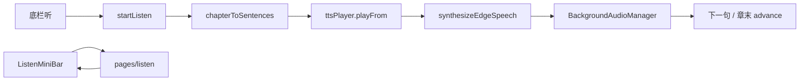

# 阅读页听书混合形态（实现思路）

> **状态**：已采纳  
> **关联文件**：`src/services/tts.ts`、`src/services/tts-player.ts`、`src/hooks/useChapterListen.ts`、`src/components/ListenMiniBar.vue`、`src/pages/listen/index.vue`、`src/pages/reader/index.vue`、`src/pages.json`、`src/manifest.json`、`src/hooks/useTheme.ts`、`src/utils/listen-text.ts`  
> **后续迭代文档**：迷你条 UI [reader-listen-minibar-ui-impl.md](./reader-listen-minibar-ui-impl.md)；跟读可视区 [reader-listen-follow-scroll-impl.md](./reader-listen-follow-scroll-impl.md)；隐藏页 setData [reader-listen-hidden-page-setdata-impl.md](./reader-listen-hidden-page-setdata-impl.md)  
> **来源会话**：[听书混合交互](faa5daf9-2879-4986-83be-4d4d503a5cec)

---

## 1. 需求背景（必填）

参照 Web 端 Edge TTS 与微信读书交互，在小程序阅读页接入听书：用户点底栏「听」后边听边读，底部出现迷你播控条，可展开独立听书页看大字当前句；会话在阅读页与听书页间不断；章末自动下一章；倍速不改变音色。

成功标准：能从当前阅读进度起播；迷你条与听书页共用同一播放器；后台可播；倍速走合成 speed 而非 `playbackRate` 变调。

---

## 2. 用户需求与 Agent 问答（必填）

### 2.1 选定混合形态并落地

**用户：**

> 参照 web 端，在点击听书按钮时，实现听书效果，接入 edge tts……小程序听书效果的实现，参照微信读书的交互方式  
> （选型）回复 `3`（混合：阅读页迷你条 + 独立听书页）

**Agent 回答摘要：**

- TTS：`POST /speech-transcription/edge/speech`，`arraybuffer` → 临时 mp3
- 音频：`uni.getBackgroundAudioManager()` + `requiredBackgroundModes: ["audio"]`
- 分句：移植 Web 句界算法，章节 HTML 本地抽纯文本

**Agent 当时给出的方案要点（仅保留最终已落地部分）：**

- 阅读页挂 `ListenMiniBar`；「展开」`navigateTo` 听书页
- `useChapterListen` 单例会话 + `ttsPlayer` 串播

### 2.2 迷你条进底栏、听按钮进工具条

**用户：**

> 播放悬浮条会挡住底部操作栏……放到底部操作栏中跟随交互  
> 不要单独在右下方设置听书按钮……放在字体设置后边，点击开启/关闭

**Agent 回答摘要：**

- `ListenMiniBar` 挂在 `reader-chrome-bottom` 内、工具条上方
- 底栏「听」toggle `startListen` / `stopListen`
- 听书中且底栏收起时右下角圆形「听」入口唤回底栏

### 2.3 倍速变调、起播位置、倍速菜单

**用户：**

> 切换播放倍速时，声音会变得尖锐  
> 点击播放每次都是从每一章节的开头开始播……需要从当前屏幕……开始播  
> 点击时出现播放速度选项……选中的选项显示在播放速度按钮上

**Agent 回答摘要：**

- 倍速改 Edge `speed` 重合成，`playbackRate` 固定 1
- `startListen` 传入 `scrollPercent` → 句下标
- 迷你条弹出倍速档，按钮显示当前 `Nx`

### 2.4 听书中滚动不收栏

**用户：**

> 如果正在听书，那么滚动不自动隐藏底部操作栏

**Agent 回答摘要：**

- 滚动收栏逻辑在 `listenActive` 时跳过自动收起

---

## 3. 实现思路（必填，细致到每个点）

### 3.1 总体策略

不在阅读页做句级 DOM 高亮（`mp-html` 成本高）。听书会话做成模块级单例：合成 → 写临时文件 → `BackgroundAudioManager` 逐句播；UI（迷你条 / 听书页 / 阅读页 FAB）只读同一套状态。

### 3.2 数据流 / 控制流



### 3.3 分点设计

#### 3.3.1 Edge TTS 请求

- **做法**：`tts.ts` 直接 `uni.request` + `responseType: 'arraybuffer'`，返回可 `abort` 句柄；见 4.3

#### 3.3.2 播放器单例

- **做法**：`tts-player.ts` 预取下一句、切句 abort、倍速重合成当前句；见 4.4

#### 3.3.3 会话 Hook

- **做法**：`useChapterListen` 持有 status / 句列表 / rate，`getChapter` 由阅读页注入；见 4.5

#### 3.3.4 阅读页挂载

- **做法**：底栏内迷你条 +「听」按钮 + 收栏时圆形入口；起播带 `readingScrollPercent`；见 4.7、4.8

#### 3.3.5 分句

- **做法**：`listen-text.ts` 的 `htmlToPlainText` + `buildSentenceOffsetSpans` + `chapterToSentences`

---

## 4. 改动点对比：改前 / 改后（必填）

### 4.1 改动点：注册听书页路由

- **位置**：`src/pages.json` → `pages` 数组（阅读页与设置页之间）
- **差异摘要**：新增自定义导航的听书页。

#### 改动前

```json
    {
      "path": "pages/reader/index",
      "style": {
        "navigationStyle": "custom",
        "navigationBarTitleText": "阅读",
        "backgroundColor": "#ffffff"
      }
    },
    {
      "path": "pages/settings/index",
      "style": {
        "navigationBarTitleText": "设置"
      }
    }
```

#### 改动后

```json
    {
      "path": "pages/reader/index",
      "style": {
        "navigationStyle": "custom",
        "navigationBarTitleText": "阅读",
        "backgroundColor": "#ffffff"
      }
    },
    {
      "path": "pages/listen/index",
      "style": {
        "navigationStyle": "custom",
        "navigationBarTitleText": "听书",
        "backgroundColor": "#ffffff"
      }
    },
    {
      "path": "pages/settings/index",
      "style": {
        "navigationBarTitleText": "设置"
      }
    }
```

### 4.2 改动点：微信后台音频能力

- **位置**：`src/manifest.json` → `mp-weixin`
- **差异摘要**：声明 `audio` 后台模式，供 `BackgroundAudioManager` 使用。

#### 改动前

```json
    "setting": {
      "urlCheck": false
    },
    "usingComponents": true
```

#### 改动后

```json
    "setting": {
      "urlCheck": false
    },
    "usingComponents": true,
    "requiredBackgroundModes": ["audio"]
```

### 4.3 改动点：Edge TTS 服务

- **位置**：`src/services/tts.ts`（新建）
- **差异摘要**：封装可取消的整段合成请求。

#### 改动前

```text
（无，新建文件）
插入点：供 tts-player 调用 synthesizeEdgeSpeech
```

#### 改动后

```ts
// 与 Web 默认 Edge 音色一致
export const DEFAULT_EDGE_TTS_VOICE = "zh-CN-XiaoxiaoNeural";

// 合成选项：倍速走 speed，避免客户端 playbackRate 变调
export type EdgeSpeechOptions = {
  // 可选音色
  voice?: string;
  // 合成语速 0.5–2
  speed?: number;
  // 音量
  vol?: number;
  // 音调
  pitch?: number;
};

// 返回 promise + abort，切句时取消 pending
export type EdgeSpeechRequest = {
  // 合成完成后的二进制
  promise: Promise<ArrayBuffer>;
  // 取消进行中的 uni.request
  abort: () => void;
};

// Edge TTS 整段合成入口
export function synthesizeEdgeSpeech(
  // 待朗读纯文本
  text: string,
  // 可选合成参数
  options: EdgeSpeechOptions = {},
): EdgeSpeechRequest {
  // … POST `${API_BASE_URL}/speech-transcription/edge/speech`
  // … responseType: 'arraybuffer'，带 Authorization
}
```

### 4.4 改动点：后台逐句播放器

- **位置**：`src/services/tts-player.ts`（新建）→ `setRate` / 合成路径
- **差异摘要**：倍速改合成参数；`playbackRate` 恒为 1。

#### 改动前

```text
（无，新建文件）
插入点：useChapterListen 通过 ttsPlayer.configure / playFrom 驱动
```

#### 改动后

```ts
// 用户切换倍速时更新内部 rate
setRate(rate: number): void {
  // 规范化倍速档
  this.rate = rate;
  // playbackRate 会连音调一起变；倍速改走 Edge TTS speed 重合成
  if (this.audio) {
    try {
      // 强制客户端不变速变调
      this.audio.playbackRate = 1;
    } catch {
      // 部分基础库可能只读，忽略
    }
  }
  // 若正在播当前句，按新 speed 重合成并续播
  // …
}

// 合成单句时带上当前倍速
const req = synthesizeEdgeSpeech(text, { speed: this.rate });
```

### 4.5 改动点：听书会话 Hook

- **位置**：`src/hooks/useChapterListen.ts`（新建）→ `startListen` / `loadAndPlayChapter`
- **差异摘要**：模块级单例状态；按 `scrollPercent` 映射起播句；章末 `advanceChapter`。

#### 改动前

```text
（无，新建文件）
插入点：阅读页 / ListenMiniBar / 听书页共同 import useChapterListen
```

#### 改动后

```ts
// 起播选项：阅读页注入 getChapter 与章内进度
export type StartListenOptions = {
  // 书籍 id
  bookId: string;
  // 书名（通知栏）
  bookTitle: string;
  // 封面（可选）
  coverUrl?: string;
  // 起始章索引
  chapterIndex: number;
  // 章内滚动进度 0–1，映射到起播句
  scrollPercent?: number;
  // 拉取章节 HTML
  getChapter: (index: number) => Promise<ListenChapterPayload>;
};

// 章内滚动进度 → 句下标
function sentenceIndexFromScrollPercent(count: number, scrollPercent: number): number {
  // 空列表兜底
  if (count <= 0) return 0;
  // 单句直接 0
  if (count === 1) return 0;
  // 夹紧到 0–1
  const p = Math.min(1, Math.max(0, scrollPercent));
  // 章首
  if (p <= 0) return 0;
  // 章末
  if (p >= 1) return count - 1;
  // 近似均分句数（与跟读估算同源思路）
  return Math.min(count - 1, Math.floor(p * count));
}
```

### 4.6 改动点：主题强调色（听书按钮）

- **位置**：`src/hooks/useTheme.ts` → 新增 `useThemeAccent`
- **差异摘要**：听书页/迷你条主按钮用主题色，不改状态栏 chrome。

#### 改动前

```ts
// 主题 id 变化时刷新页面 chrome
watch(backgroundThemeId, (id) => {
  // 应用窗口/导航配色
  applyPageChrome();
});

// 页面级主题 hook（会 applyPageChrome）
export function useTheme() {
  // 进入即刷 chrome
  applyPageChrome();
```

#### 改动后

```ts
// 主题 id 变化时刷新页面 chrome
watch(backgroundThemeId, (id) => {
  // 应用窗口/导航配色
  applyPageChrome();
});

// 仅读主题色，不改状态栏（阅读/听书页有自己的纸张 chrome）
export function useThemeAccent() {
  // 主按钮背景/前景取自 themeVars
  const accentBtnStyle = computed<CSSProperties>(() => ({
    // 主按钮背景
    backgroundColor: String(themeVars.value.buttonPrimaryBg ?? ""),
    // 主按钮文字
    color: String(themeVars.value.buttonMainColor ?? "#fff"),
  }));

  // 暴露 vars 与按钮样式
  return { themeVars, accentBtnStyle };
}

// 页面级主题 hook（会 applyPageChrome）
export function useTheme() {
  // 进入即刷 chrome
  applyPageChrome();
```

### 4.7 改动点：底栏挂迷你条与「听」按钮

- **位置**：`src/pages/reader/index.vue` → `reader-chrome-bottom` 模板（约第 126–290 行）
- **差异摘要**：原工具条仅目录/主题/翻页/字体；现增加迷你条插槽与「听」toggle。

#### 改动前

```vue
      <view class="reader-toolbar">
        <view class="toolbar-item" @click="openBottomPanel('toc')">
          <AppIcon name="list" :size="22" :color="readerStyle.color" />
          <text class="toolbar-label">目录</text>
        </view>
        <!-- … 主题 / 翻页 / 字体 … -->
      </view>
```

#### 改动后

```vue
      <!-- 挂在底栏上沿：高度随迷你条变化 -->
      <ListenMiniBar :dark="isDarkPaper" @layout="onListenMiniLayout" />
      <view class="reader-toolbar">
        <!-- … 目录 / 主题 / 翻页 / 字体 … -->
        <view
          class="toolbar-item"
          :class="{ active: listenActive }"
          @click="onListenTap"
        >
          <text class="toolbar-label">{{ listenToolbarLabel }}</text>
        </view>
      </view>
```

### 4.8 改动点：从当前阅读进度起播

- **位置**：`src/pages/reader/index.vue` → `onListenTap`
- **差异摘要**：起播带上 `readingScrollPercent`，并由 `getChapter` 复用章节缓存加载。

#### 改动前

```text
（无听书入口；底栏无「听」逻辑）
```

#### 改动后

```ts
// 底栏「听」：再点则停止
async function onListenTap() {
  // 无书或无内容直接返回
  if (!bookId.value || !hasContent.value) return;
  // 已在听书则停止会话
  if (listenActive.value) {
    // 停播并清会话
    stopListen();
    // 底栏高度变化后重测 inset
    void nextTick(() => setTimeout(measureChromeInsets, 80));
    return;
  }
  // 收起字体/主题等子面板，把高度让给迷你条
  bottomPanel.value = null;
  try {
    // 启动听书会话
    await startListen({
      // 当前书
      bookId: bookId.value,
      // 通知栏书名
      bookTitle: bookTitle.value,
      // 封面
      coverUrl: bookCoverUrl.value,
      // 当前章
      chapterIndex: chapterIndex.value,
      // 章内阅读进度 → 起播句
      scrollPercent: readingScrollPercent.value,
      // 按索引取章（走阅读页缓存）
      getChapter: async (index) => {
        // 拉取/缓存章节块
        const block = await fetchChapterBlock(index);
        // 转成听书 payload
        return {
          // 正文 HTML（分句用）
          html: block.html,
          // 章标题
          title: block.title,
          // 下一章索引
          nextIndex: index < chapterTotal.value - 1 ? index + 1 : null,
        };
      },
    });
    // 起播后跟读滚一次并重测底栏
    void nextTick(() => {
      setTimeout(measureChromeInsets, 80);
      void scrollToListenSentence(true);
    });
  } catch (err) {
    // 失败 toast
    uni.showToast({
      title: err instanceof Error ? err.message : "听书启动失败",
      icon: "none",
    });
  }
}
```

### 4.9 改动点：迷你条组件与独立听书页

- **位置**：`src/components/ListenMiniBar.vue`、`src/pages/listen/index.vue`（新建）
- **差异摘要**：迷你条含上/下句、播控、倍速菜单、展开；听书页大字当前句 + 底栏播控，共用 `useChapterListen`。

#### 改动前

```text
（无，新建文件）
挂载：阅读页 chrome 内 <ListenMiniBar />；路由 pages/listen/index
```

#### 改动后

```vue
<!-- ListenMiniBar：主区点展开；操作区上句/播控/下句/倍速/展开 -->
<view v-if="isActive" class="listen-mini" @click.stop>
  <view class="listen-mini__main" @click="expandListenPage">
    <text class="listen-mini__sentence">{{ currentSentenceText || "准备朗读…" }}</text>
  </view>
  <view class="listen-mini__actions">
    <view class="listen-mini__btn" @click.stop="prevListenSentence"><text>上句</text></view>
    <view class="listen-mini__btn listen-mini__btn--primary" @click.stop="onToggle">
      <text>{{ playLabel }}</text>
    </view>
    <!-- … 下句 / 倍速菜单 / 展开 … -->
  </view>
</view>
```

---

## 5. 验证要点（建议）

- [ ] 底栏点「听」从当前屏进度附近起播；再点关闭
- [ ] 迷你条播控 / 上下句 / 倍速菜单；倍速不变调
- [ ] 「展开」进听书页，返回阅读页会话不断
- [ ] 锁后台仍可播；章末自动下一章
- [ ] 听书中滚动不自动收底栏；收栏后右下角「听」可唤回

---

## 6. 影响分析（必填，放在文档最后）

### 6.1 结论

- **是否影响已有功能点**：局部影响 — 阅读页底栏多「听」与迷你条高度，chrome inset 测量路径增多
- **是否影响既有正常逻辑**：局部影响 — `manifest` 增后台音频；`useTheme` 增只读 accent hook，不改原 `useTheme` 行为

### 6.2 影响点明细

| #   | 影响对象       | 影响方式                                   | 程度 | 说明与回归建议                          |
| --- | -------------- | ------------------------------------------ | ---- | --------------------------------------- |
| 1   | 阅读页底栏布局 | 听书中多迷你条，paddingBottom 随 inset 变  | 中   | 开/关听书、展开字体面板，确认正文不被挡 |
| 2   | 滚动收栏       | 听书中跳过自动收起                         | 中   | 听书时滚动应保持底栏；非听书仍收栏      |
| 3   | 目录跳章       | `goChapter` 在听书中会 `seekListenChapter` | 中   | 听书时点目录，应从该章章首续播          |
| 4   | 网络/登录      | TTS 走鉴权 API                             | 中   | 未登录应 toast；失败可暂停              |
| 5   | 其它页面主题   | `useThemeAccent` 只读                      | 低   | 书架/设置页主题切换仍正常               |

### 6.3 调用面 / 波及说明（建议）

- `useChapterListen` / `ttsPlayer`：阅读页、`ListenMiniBar`、听书页
- `synthesizeEdgeSpeech`：仅 `tts-player`
- 跟读滚屏精度与 setData 性能见 [reader-listen-follow-scroll-impl.md](./reader-listen-follow-scroll-impl.md)
- 句级正文高亮见 [reader-listen-highlight-impl.md](./reader-listen-highlight-impl.md)
- 整套复刻指南见 [reader-listen-guide.md](./reader-listen-guide.md)

### 6.4 后续相关变更（口径矫正）

- **倍速 UI**：听书页刻度尺 + 预设到 3.0x，见 [reader-listen-rate-picker-impl.md](./reader-listen-rate-picker-impl.md)。
- **>2x**：`timed` 的 `speed` 仍钳在 ≤2；超过部分用 `playbackRate` 补速（有意例外，避免 400），见 [reader-listen-rate-synth-cap-impl.md](./reader-listen-rate-synth-cap-impl.md)。
