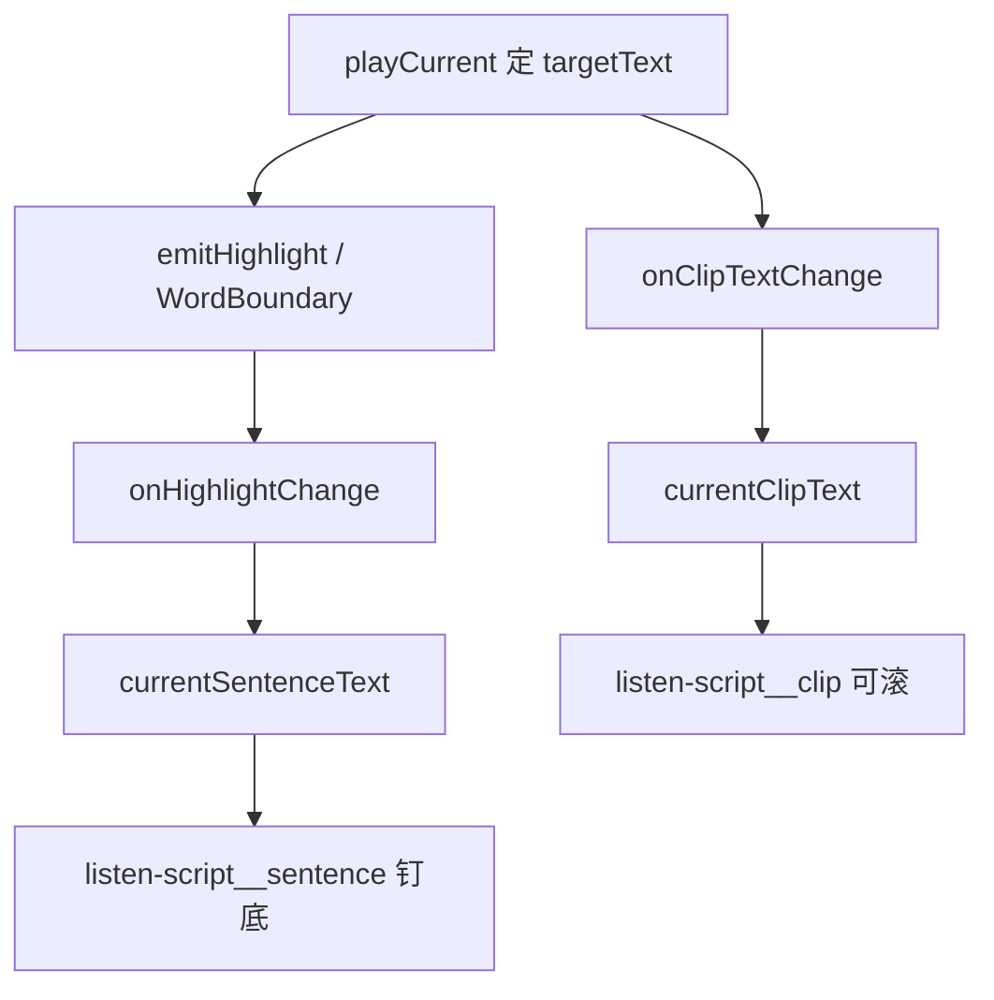

# 听书页：合成片段 + 当前句双层文案（实现思路）

> **状态**：已采纳  
> **关联文件**：`src/pages/listen/index.vue`、`src/hooks/useChapterListen.ts`、`src/services/tts-player.ts`  
> **来源会话**：[听书页双层文案](c3f8bd51-ec80-47b8-be74-2f558038843f)

---

## 1. 需求背景（必填）

听书页原先只展示「当前高亮句」一条文案。双轨合成落地后，真正出声的往往是整段 / 剩余长段 TTS，用户希望：

- **上方**：当前正在播放的 TTS 合成内容（短句或长段全文）
- **下方**：当前正在播的那一句（WordBoundary 高亮句）
- 同一张卡片；当前句固定在卡片底部不随片段滚动
- 滚动区上下留白、两端对齐、字色够深、字号略大

成功标准：播放长段时上区可见整段，下区随句切换；短句阶段两区可同文。

---

## 2. 用户需求与 Agent 问答（必填）

### 2.1 双层展示

**用户：**

> 听书页的播放内容当前是一句一句的，我希望将每一段正在播放的 TTS 内容展示在上面，下面展示当前的正在播放句

**Agent 回答摘要：**

- 播放器在确定 `targetText` 时回调 `onClipTextChange`
- 会话增加 `currentClipText`；`currentSentenceText` 仍跟高亮句
- 听书页拆成上片段 / 下当前句

### 2.2 合成一张卡片

**用户：**

> 不要分成两个卡片，在一个卡片中展示

**Agent 回答摘要：**

- 合并为单一 `listen-script` 表面色卡片

### 2.3 当前句钉底

**用户：**

> 但是当前句不要跟随滚动，要一直展示在底部

**Agent 回答摘要：**

- 仅片段进 `scroll-view`；「当前句」放在卡片 flex 底部、`flex-shrink: 0`

### 2.4 滚动区上下边距

**用户：**

> 这上下需要设置边距，使在滚动时有上下间距

**Agent 回答摘要：**

- 外层 `listen-script__body` 用上下 padding（小程序 `scroll-view` 自身 padding 不可靠）

### 2.5 两端对齐 / 字色 / 字号

**用户：**

> 展示的文本内容需要设置为左右对齐  
> 文本颜色太淡了  
> 字体大小稍微调大一点

**Agent 回答摘要：**

- `<text>` 改为 `<view>` + `text-align: justify` / `text-justify: inter-ideograph`（对齐阅读页）
- 片段色由 `--listen-ink-soft` 改为 `--listen-fg`
- 片段 36rpx、当前句 44rpx

---

## 3. 实现思路（必填，细致到每个点）

### 3.1 总体策略

- **文案来源拆两层**：片段 = 本次合成文本；当前句 = 已有 `onHighlightChange` / `applyHighlight`
- **UI 最小结构**：一卡两区；滚动只包片段
- **不新造状态机**：只加 `currentClipText` + 播放器回调

### 3.2 数据流



### 3.3 分点设计

1. **占位**：`applySentence` 先用 `unit.text` 填片段，合成回调再覆盖为短句/长段真实文本
2. **钉底**：卡片 `flex` 列；`body` flex:1 + padding；`sentence` 不进 scroll
3. **两端对齐**：块级 `view` + 与阅读页一致的 justify 属性
4. **可读性**：主色 + 略大字号

---

## 4. 改动点对比：改前 / 改后（必填）

### 4.1 播放器：合成文本回调

- **位置**：`src/services/tts-player.ts` → `TtsPlayerConfigure` / `playCurrent`
- **差异摘要**：确定 `targetText` 后通知 UI 当前 TTS 片段全文

#### 改动前

```ts
// 会话配置类型：尚无片段文案通道
export type TtsPlayerConfigure = {
  // 书本与章节元数据略
  sentences: ListenSentence[];
  // 句索引变化
  onSentenceChange?: (index: number, partIndex?: number) => void;
  // 段内高亮句变化
  onHighlightChange?: (span: ListenTextSpan) => void;
  // 章末
  onChapterEnd?: () => void;
};
```

#### 改动后

```ts
// 会话配置类型：增加合成片段回调
export type TtsPlayerConfigure = {
  // 书本与章节元数据略
  sentences: ListenSentence[];
  // 句索引变化
  onSentenceChange?: (index: number, partIndex?: number) => void;
  // 段内高亮句变化
  onHighlightChange?: (span: ListenTextSpan) => void;
  // 当前正在播的 TTS 合成文本（短句或整段/剩余长段）
  onClipTextChange?: (text: string) => void;
  // 章末
  onChapterEnd?: () => void;
};

// 在 playCurrent 内写好 targetText 之后：
// 把本次合成全文推给会话层
this.onClipTextChange?.(targetText);
```

### 4.2 会话：`currentClipText`

- **位置**：`src/hooks/useChapterListen.ts`
- **差异摘要**：新增片段 ref，并在 configure / applySentence / reset 中维护

#### 改动前

```ts
// 仅当前高亮句文案
const currentSentenceText = ref("");

function applySentence(index: number) {
  // 写入当前单元下标
  sentenceIndex.value = index;
  // 取单元并高亮首句或整段（旧逻辑）
  const unit = sentences.value[index];
  // …
}

function resetSession() {
  // 清空高亮
  highlightSpan.value = null;
  // 清空当前句文案
  currentSentenceText.value = "";
}
```

#### 改动后

```ts
// 当前 TTS 合成片段全文（短句或整段/剩余长段）
const currentClipText = ref("");
// 当前正在播的句（段内高亮句）
const currentSentenceText = ref("");

function applySentence(index: number, partIndex = 0) {
  // 写入当前单元下标
  sentenceIndex.value = index;
  // 按 part 更新高亮句（逻辑略）
  // …
  // 合成回调到来前先用整段占位
  if (unit) currentClipText.value = unit.text;
}

function resetSession() {
  // 清空高亮
  highlightSpan.value = null;
  // 清空片段文案
  currentClipText.value = "";
  // 清空当前句文案
  currentSentenceText.value = "";
}

// configure 内挂载：
onClipTextChange: (text) => {
  // 丢弃过期会话回调
  if (gen !== sessionGen) return;
  // 覆盖为真实合成文本
  currentClipText.value = text;
};
```

### 4.3 听书页模板：一卡双层

- **位置**：`src/pages/listen/index.vue` 主文案区
- **差异摘要**：单卡片；上滚下钉

#### 改动前

```vue
<!-- 单层句子卡片 -->
<view class="listen-sentence-card">
  <!-- 整卡可滚 -->
  <scroll-view scroll-y enable-flex class="listen-sentence-card__scroll">
    <!-- padding 在内容层，滚动条可贴边 -->
    <view class="listen-sentence-card__pad">
      <!-- 仅展示当前句 -->
      <text class="listen-sentence-card__text">
        {{
          currentSentenceText || (status === "loading" ? "合成中…" : "点击播放开始听书")
        }}
      </text>
    </view>
  </scroll-view>
</view>
```

#### 改动后

```vue
<!-- 同一张脚本卡片 -->
<view class="listen-script">
  <!-- 上下留白放在 body，滚动中也不贴顶/贴当前句 -->
  <view class="listen-script__body">
    <!-- 仅片段区域可滚 -->
    <scroll-view scroll-y enable-flex class="listen-script__scroll">
      <!-- 水平内边距 -->
      <view class="listen-script__pad">
        <!-- 块级 view 才能可靠两端对齐 -->
        <view class="listen-script__clip">
          {{
            currentClipText || (status === "loading" ? "合成中…" : "点击播放开始听书")
          }}
        </view>
      </view>
    </scroll-view>
  </view>
  <!-- 钉在卡片底部，不随 scroll 移动 -->
  <view v-if="currentSentenceText" class="listen-script__sentence">
    <!-- 区隔标签 -->
    <text class="listen-script__label">当前句</text>
    <!-- 当前高亮句正文 -->
    <view class="listen-script__now">{{ currentSentenceText }}</view>
  </view>
</view>
```

### 4.4 听书页样式：留白 / 对齐 / 字色字号

- **位置**：`src/pages/listen/index.vue` → `.listen-script*`
- **差异摘要**：flex 钉底、body padding、justify、主色、36/44rpx

#### 改动前

```css
/* 旧单层卡片占满主区 */
.listen-sentence-card {
  flex: 1;
  min-height: 0;
  /* 表面色与圆角略 */
}

/* 旧正文：偏淡 soft 色 */
.listen-sentence-card__text {
  font-size: 40rpx;
  text-align: justify;
  color: var(--listen-ink-soft);
}
```

#### 改动后

```css
/* 卡片列布局：上可压、下不缩 */
.listen-script {
  flex: 1;
  min-height: 0;
  display: flex;
  flex-direction: column;
  overflow: hidden;
}

/* 滚动视口上下留白（不写在 scroll-view 上） */
.listen-script__body {
  flex: 1;
  min-height: 0;
  padding: 28rpx 0 24rpx;
  box-sizing: border-box;
}

/* 片段：主色 + 略大 + 两端对齐 */
.listen-script__clip {
  width: 100%;
  font-size: 36rpx;
  line-height: 1.7;
  text-align: justify;
  text-justify: inter-ideograph;
  text-align-last: left;
  color: var(--listen-fg);
  box-sizing: border-box;
}

/* 钉底当前句区 */
.listen-script__sentence {
  flex-shrink: 0;
  border-top: 1rpx solid var(--listen-divider);
}

/* 当前句更大字号 */
.listen-script__now {
  width: 100%;
  font-size: 44rpx;
  text-align: justify;
  text-justify: inter-ideograph;
  color: var(--listen-fg);
}
```

---

## 5. 验证要点（建议）

- [ ] 长段播放：上方为整段/剩余长段，下方随句切换
- [ ] 短句紧急轨：上下可能同文，结构仍在
- [ ] 滚动片段时「当前句」不跟着滚
- [ ] 滚到顶/底与「当前句」分隔线之间有留白
- [ ] 两端对齐、字色清晰、字号可读

---

## 6. 影响分析（必填，放在文档最后）

### 6.1 结论

- **是否影响已有功能点**：局部影响 — 听书页主文案区布局与数据源变化；迷你条仍只用 `currentSentenceText`
- **是否影响既有正常逻辑**：局部影响 — 播放器多一个可选回调，不改合成/播控算法

### 6.2 影响点明细

| #   | 影响对象                | 影响方式                                     | 程度 | 说明与回归建议           |
| --- | ----------------------- | -------------------------------------------- | ---- | ------------------------ |
| 1   | 听书页主文案            | 由单句改为片段+当前句                        | 中   | 打开听书页对照长段/短句  |
| 2   | `useChapterListen` 导出 | 新增 `currentClipText`                       | 低   | 仅听书页消费             |
| 3   | `tts-player` 回调       | 新增 `onClipTextChange`                      | 低   | 未配置时行为不变         |
| 4   | 迷你条 / 阅读页跟读     | 仍跟 `currentSentenceText` / `highlightSpan` | 无   | 回归迷你条文案与阅读高亮 |

### 6.3 调用面 / 波及说明

`currentClipText` 目前仅听书页解构使用；阅读页跟读不依赖片段全文。与双轨合成文档互补：本篇只覆盖展示层。
