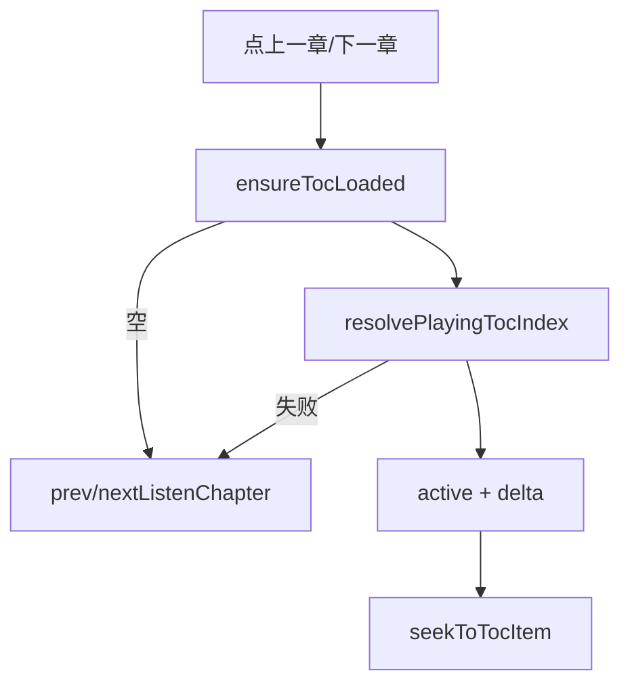

# 听书页上下章按目录项切换（实现思路）

> **状态**：已采纳  
> **关联文件**：`src/pages/listen/index.vue`、`src/utils/ebook-toc.ts`、`src/hooks/useChapterListen.ts`  
> **来源会话**：[听书切句与起播](c3f8bd51-ec80-47b8-be74-2f558038843f)  
> **依赖**：[reader-ebook-toc-listen-impl.md](./reader-ebook-toc-listen-impl.md)

---

## 1. 需求背景（必填）

听书页「上一章 / 下一章」若按 spine±1，同文件多节时无法落到「当前播放目录项」的上/下一项。需要按 TOC 列表邻项切，并用节起点播。

成功标准：正在播第二节时点下一章 → 第三节（即使 spine 相同或跨文件）；上一章对称；无 TOC 时回退 spine 切章。

---

## 2. 用户需求与 Agent 问答（必填）

### 2.1 上下章逻辑不对

**用户：**

> 这个上下章切换逻辑不对，无法正常切换到当前播放章节的上下章

**Agent 回答摘要（已落地）：**

- `jumpChapterByToc(±1)`：以 `findActiveTocListIndex` 为当前项，再 ±1
- 目标项走 `seekToTocItem`（`tocItemListenSentenceIndex`）
- TOC 空或解析失败时回退 `prevListenChapter` / `nextListenChapter`

---

## 3. 实现思路（必填）

### 3.1 总体策略

「章」在听书 UI 上对齐用户可见目录项，不是 EPUB spine。复用阅读页同一套 active 算法与起播句映射。

### 3.2 控制流



### 3.3 分点设计

1. **当前项**：`chapterIndex` + 章 HTML + 播放进度比 → `findActiveTocListIndex`。
2. **边界**：首/末项 toast。
3. **按钮**：模板改为 `onPrevChapter` / `onNextChapter`。

---

## 4. 改动点对比：改前 / 改后（必填）

### 4.1 改动点：模板绑定从 spine 切章改为目录邻项

- **位置**：`src/pages/listen/index.vue` → 上下章按钮
- **差异摘要**：点击不再直接调 hook 的 spine±1。

#### 改动前

```vue
<!-- 上一章直接 spine-1 -->
<view class="listen-chap" @click="prevListenChapter">
  <!-- 图标/文案 -->
</view>
<!-- 下一章直接 spine+1 -->
<view class="listen-chap" @click="nextListenChapter">
  <!-- 图标/文案 -->
</view>
```

#### 改动后

```vue
<!-- 上一章：目录上一项 -->
<view class="listen-chap" @click="onPrevChapter">
  <!-- 图标/文案 -->
</view>
<!-- 下一章：目录下一项 -->
<view class="listen-chap" @click="onNextChapter">
  <!-- 图标/文案 -->
</view>
```

### 4.2 改动点：新增 `jumpChapterByToc`

- **位置**：`src/pages/listen/index.vue` → `jumpChapterByToc` / `onPrevChapter` / `onNextChapter`
- **差异摘要**：同文件多节可切到相邻目录项。

#### 改动前

```ts
// （无 jumpChapterByToc）
// 按钮直接：
// prevListenChapter() → seekListenChapter(chapterIndex - 1, 0)
// nextListenChapter() → 下一 spine 章首
```

#### 改动后

```ts
/** 按目录上一项/下一项切章（同文件多节不能用 spine±1） */
async function jumpChapterByToc(delta: -1 | 1) {
  // 保证有 TOC
  const toc = await ensureTocLoaded();
  // 无目录回退 spine
  if (!toc.length) {
    if (delta < 0) await prevListenChapter();
    else await nextListenChapter();
    return;
  }
  // 当前播放对应的目录下标
  const active = await resolvePlayingTocIndex(toc);
  // 解析失败回退 spine
  if (active < 0) {
    if (delta < 0) await prevListenChapter();
    else await nextListenChapter();
    return;
  }
  // 邻项
  const target = active + delta;
  // 顶部边界
  if (target < 0) {
    uni.showToast({ title: "已是第一章", icon: "none" });
    return;
  }
  // 底部边界
  if (target >= toc.length) {
    uni.showToast({ title: "已是最后一章", icon: "none" });
    return;
  }
  // 取目标目录项
  const item = toc[target];
  // 空项防护
  if (!item) return;
  // 节起点播
  await seekToTocItem(item);
}

function onPrevChapter() {
  // 上一项
  void jumpChapterByToc(-1);
}

function onNextChapter() {
  // 下一项
  void jumpChapterByToc(1);
}
```

---

## 5. 验证要点（建议）

- [ ] 同 spine 多节：播第二节时点下一章 → 第三节起点，不跳到下一文件
- [ ] 播第一节点上一章 →「已是第一章」（若确为 TOC 首项）
- [ ] TOC 接口失败：仍能 spine 切章
- [ ] 切过后迷你条/封面标题为目录项标题（若传了 `chapterTitle`）

---

## 6. 影响分析（必填）

### 6.1 结论

- **是否影响已有功能点**：是 — 听书页上下章语义从 spine 变为 TOC。
- **是否影响既有正常逻辑**：不影响阅读页底栏切章；`prevListenChapter` / `nextListenChapter` 仍保留作回退与自动连播。

### 6.2 影响点清单

| 影响对象         | 影响方式                                   | 严重程度 | 回归建议                                             |
| ---------------- | ------------------------------------------ | -------- | ---------------------------------------------------- |
| 听书页上下章按钮 | 邻项可能同 spine                           | 中       | 多节目录书实测                                       |
| 自动章末连播     | 仍 `advanceChapter` → `nextIndex`（spine） | 中       | 听完一节是否进下一 spine；与手动上下章语义不同属有意 |
| `seekToTocItem`  | 多一次拉章算句下标                         | 低       | 弱网切章                                             |

### 6.3 说明

章末自动进入下一 spine 与手动「下一目录项」可以不一致：前者跟 EPUB 文件序，后者跟 TOC UI。若产品要统一，需另开需求改 `onChapterEnd`。
