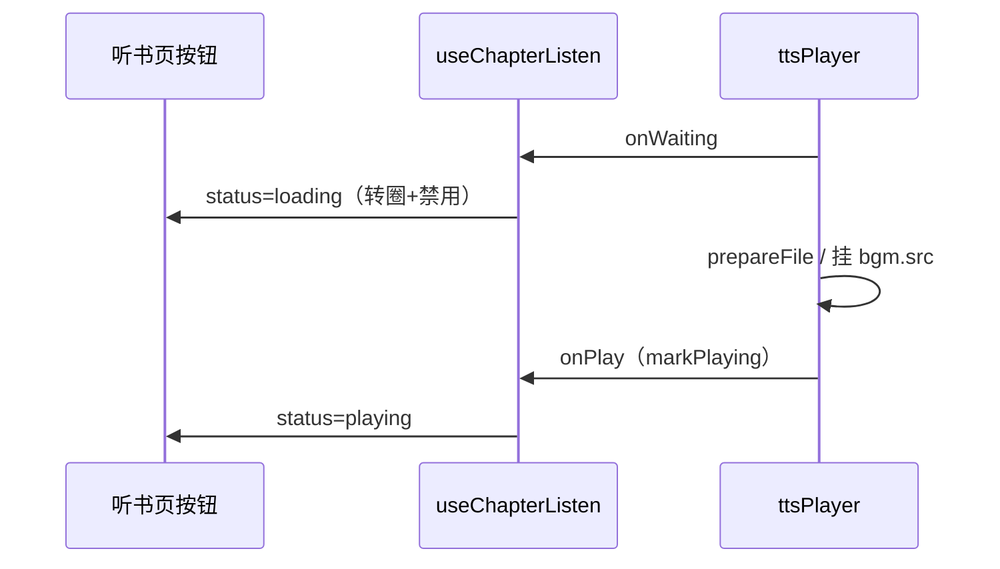

# 听书页：等待出声时播放按钮 Loading（实现思路）

> **状态**：已采纳  
> **关联文件**：`src/services/tts-player.ts`、`src/hooks/useChapterListen.ts`、`src/pages/listen/index.vue`  
> **来源会话**：[听书页双层文案](c3f8bd51-ec80-47b8-be74-2f558038843f)  
> **延伸阅读**：[reader-listen-play-status-machine-fix.md](./reader-listen-play-status-machine-fix.md)（播放状态机深度修复、seek 连拖合并、BGM 事件防护）

---

## 1. 需求背景（必填）

听书页播放按钮虽有 `status === 'loading'` 时的 `wd-loading` UI，但合成/挂 src 等待期间，`status` 常被过早写成 `playing`（句切换、`playFrom.then`、切句/seek/改倍速等），用户感觉「在等却仍显示暂停键且可点」。

成功标准：凡 `playCurrent` 准备出声阶段，按钮显示 loading 且不可点；真正 `onPlay`（出声）后再恢复。

---

## 2. 用户需求与 Agent 问答（必填）

### 2.1 等待播放时的按钮态

**用户：**

> 听书页播放正在等待播放时，需要给播放按钮增加 loading 效果，同时要让播放按钮禁用。

**Agent 回答摘要：**

- 播放器增加 `onWaiting`，在 `playCurrent` 入口触发
- 会话 `onWaiting` → `status = loading`；`onPlay` → `playing`
- 去掉过早切 `playing` 的路径
- 按钮保留 loading 图标，并加 `pointer-events: none`

---

## 3. 实现思路（必填，细致到每个点）

### 3.1 总体策略

以「真正出声」为 `playing` 的唯一权威来源（已有 `markPlaying` → `onPlay`）。等待阶段统一走 `onWaiting` → `loading`，而不是各调用方自行猜状态。

### 3.2 控制流



### 3.3 分点设计

1. **触发点**：仅 `playCurrent`（会合成或重挂音频）；段内 seek 不触发 waiting
2. **去掉假 playing**：`onSentenceChange`、`playFrom.then`、prev/next/seek/rate/voice 不再强行 `playing`
3. **resume**：仍直接 `playing`（同 `playGen` 时 `markPlaying` 会早退，不能靠 onPlay）
4. **UI**：已有 `wd-loading`；补禁用样式

---

## 4. 改动点对比：改前 / 改后（必填）

### 4.1 播放器：`onWaiting`

- **位置**：`src/services/tts-player.ts` → `configure` / `playCurrent`
- **差异摘要**：每次进入准备出声流程先通知 UI

#### 改动前

```ts
// 配置只有 onPlay，没有「开始等待」回调
export type TtsPlayerConfigure = {
  // …
  // 真正开始出声
  onPlay?: () => void
}

private async playCurrent(): Promise<void> {
  // 推进播放代次
  const gen = ++this.playGen
  // 停高亮时钟
  this.stopHighlightTick()
  // 取当前单元
  const sentence = this.sentences[this.sentenceIndex]
  if (!sentence) {
    // 无文本则章末
    this.onChapterEnd?.()
    return
  }
  // 直接进入合成分支，UI 不知已进入等待
}
```

#### 改动后

```ts
// 配置增加等待回调
export type TtsPlayerConfigure = {
  // …
  // 开始准备/等待出声（合成或挂 src）
  onWaiting?: () => void
  // 真正开始出声
  onPlay?: () => void
}

private async playCurrent(): Promise<void> {
  // 推进播放代次
  const gen = ++this.playGen
  // 停高亮时钟
  this.stopHighlightTick()
  // 取当前单元
  const sentence = this.sentences[this.sentenceIndex]
  if (!sentence) {
    // 无文本则章末
    this.onChapterEnd?.()
    return
  }
  // 通知会话进入 loading（按钮转圈禁用）
  this.onWaiting?.()
  // 再继续解析 targetText / prepareFile
}
```

### 4.2 会话：以 onWaiting / onPlay 驱动 status

- **位置**：`src/hooks/useChapterListen.ts` → `loadAndPlayChapter` 及 seek/rate 等
- **差异摘要**：等待只由回调设 loading；去掉过早 playing

#### 改动前

```ts
onSentenceChange: ((i, part) => {
  // 忽略过期会话
  if (gen !== sessionGen) return;
  // 更新句/高亮
  applySentence(i, part ?? 0);
  // 同步进度
  syncListenProgress();
  // 句一切换就把 loading 改成 playing（音频可能还没出声）
  if (status.value === "loading") status.value = "playing";
},
  // playFrom 完成后也强行 playing
  void ttsPlayer.playFrom(startIdx, startPart).then(() => {
    if (gen !== sessionGen) return;
    if (status.value === "loading") status.value = "playing";
  }));

export function nextListenSentence(): void {
  if (status.value === "idle") return;
  // 点下一句立刻显示 playing
  status.value = "playing";
  ttsPlayer.nextSentence();
}
```

#### 改动后

```ts
onSentenceChange: (i, part) => {
  // 忽略过期会话
  if (gen !== sessionGen) return
  // 只更新文案与进度，不改播放态
  applySentence(i, part ?? 0)
  syncListenProgress()
},

onWaiting: () => {
  // 忽略过期会话
  if (gen !== sessionGen) return
  // idle 会话不抢状态
  if (status.value === "idle") return
  // 进入等待：听书页/迷你条显示 loading
  status.value = "loading"
},

onPlay: () => {
  // 忽略过期会话
  if (gen !== sessionGen) return
  // 真正出声才算 playing
  status.value = "playing"
  startProgressTimer()
  syncListenProgress()
},

// 不 await；出声由 onPlay 负责
void ttsPlayer.playFrom(startIdx, startPart)

export function nextListenSentence(): void {
  if (status.value === "idle") return
  // 若走 playCurrent 会经 onWaiting；段内 seek 则保持原 status
  ttsPlayer.nextSentence()
}
```

### 4.3 听书页：禁用样式

- **位置**：`src/pages/listen/index.vue` → `.listen-play--loading`
- **差异摘要**：loading 时不可点，并降低不透明度

#### 改动前

```css
/* 仅略降核心圆透明度，仍可点击（靠 onToggle 早退） */
.listen-play--loading .listen-play__core {
  opacity: 0.92;
}
```

#### 改动后

```css
/* 整钮禁用点击 */
.listen-play--loading {
  pointer-events: none;
  opacity: 0.72;
}

/* 核心圆本身不叠乘变灰 */
.listen-play--loading .listen-play__core {
  opacity: 1;
}
```

模板侧原有逻辑保留：

```vue
<!-- loading 时挂类名并显示转圈 -->
<view
  class="listen-play"
  :class="{ 'listen-play--loading': status === 'loading' }"
  @click="onToggle"
>
  <view class="listen-play__core">
    <wd-loading v-if="status === 'loading'" :color="playIconColor" size="32px" />
    <!-- 非 loading 才显示播/暂停图标 -->
  </view>
</view>
```

```ts
function onToggle() {
  // loading 直接忽略
  if (status.value === "loading") return;
  // …
}
```

---

## 5. 验证要点（建议）

- [ ] 起播/切章：按钮转圈，出声后变暂停
- [ ] 切到无缓存句：等待期不可点暂停/播放
- [ ] 改音色或需重合成的倍速：等待期 loading
- [ ] 段内上下句 seek：不应无谓长时间卡 loading
- [ ] 暂停后再播：可立刻恢复 playing（不依赖 onPlay）
- [ ] 迷你条同步 loading（共享 status）

---

## 6. 影响分析（必填，放在文档最后）

### 6.1 结论

- **是否影响已有功能点**：是 — 播放态在合成等待期更准确，UI 更常显示 loading
- **是否影响既有正常逻辑**：局部影响 — 共用 `status` 的迷你条一并进入 loading；段内 seek 路径不变

### 6.2 影响点明细

| #   | 影响对象               | 影响方式                    | 程度 | 说明与回归建议            |
| --- | ---------------------- | --------------------------- | ---- | ------------------------- |
| 1   | 听书页播放钮           | 等待期 loading + 禁用       | 中   | 慢网起播/切段观察         |
| 2   | 迷你条播放钮           | 同 status，亦 loading       | 中   | 阅读页起播同步看迷你条    |
| 3   | 切句 / 改倍速 / 改音色 | 可能经 onWaiting 进 loading | 中   | 有缓存与无缓存各试一次    |
| 4   | 暂停续播               | 仍直接 playing              | 低   | 暂停→继续应无卡死 loading |
| 5   | 合成失败               | onError → paused            | 低   | 断网合成失败应能再点播放  |

### 6.3 调用面 / 波及说明

`status` 为模块单例，阅读页迷你条与听书页共享。`onWaiting` 仅在 `playCurrent` 触发；`seekInClip` 不触发。与「听书页双层文案」文档独立：本篇只覆盖播控等待态。
