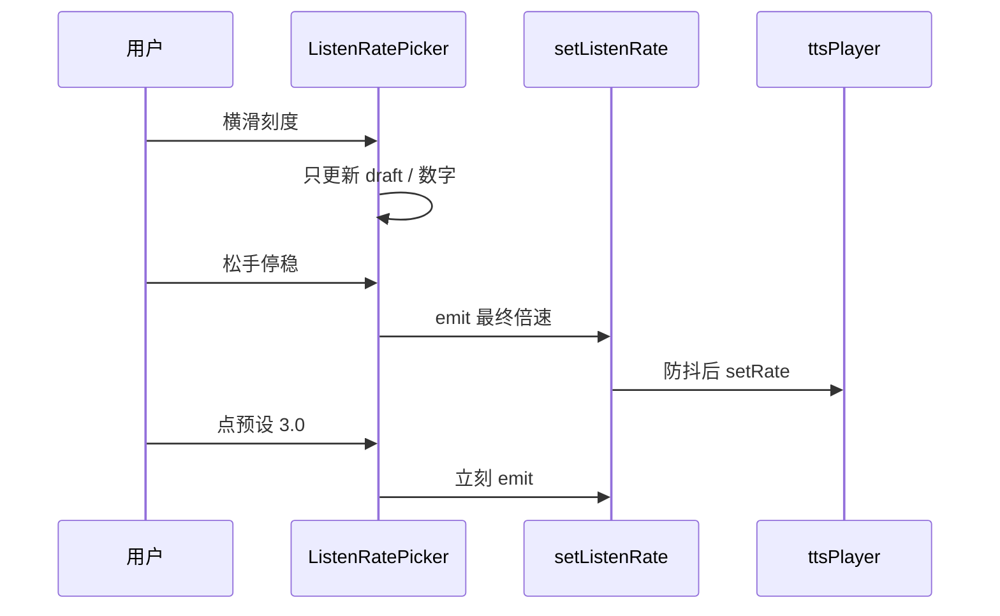
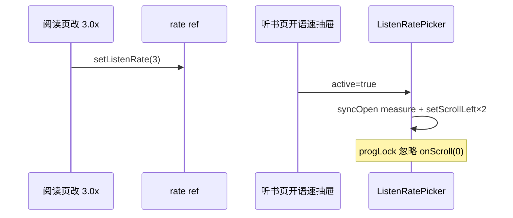

# 听书倍速刻度选择器（实现思路）

> **状态**：已采纳  
> **关联文件**：`src/components/ListenRatePicker.vue`、`src/pages/listen/index.vue`、`src/hooks/useChapterListen.ts`、`src/components/ListenMiniBar.vue`  
> **来源会话**：[听书切句与起播](c3f8bd51-ec80-47b8-be74-2f558038843f)  
> **相关**：合成倍速钳制见 [reader-listen-rate-synth-cap-impl.md](./reader-listen-rate-synth-cap-impl.md)

---

## 1. 需求背景（必填）

听书页「语速」抽屉需按设计稿做成**可横滑刻度尺 + 居中固定指针 + 底部预设圆钮**；抽屉外壳与音色抽屉一致并跟纸张主题配色；滑动过程不抖、刻度可对准；停稳或点预设后**实时改播放倍速**；预设与阅读页迷你条支持到 **3.0x**。

成功标准：1:1 还原刻度交互；主题色正确；停稳后倍速生效且不因滑动连打 `timed`（合成策略见关联文档）。

---

## 2. 用户需求与 Agent 问答（必填）

### 2.1 按设计做刻度倍速

**用户：**

> 听书页播放倍速设置抽屉中的倍速选择按照这个 UI 实现，要 1:1 还原。注意是刻度条可以滚动，上面的指针固定在居中位置

**Agent 回答摘要（已落地）：**

- 新建 `ListenRatePicker`：大号倍速、固定红/主题色指针、横滑刻度、预设圆钮

### 2.2 刻度选不中 / 页面抖 / 主题

**用户：**

> 刻度滚动又问题，无法选中刻度条中的某些刻度  
> 抽屉的 UI 要保持与之前的一致，同时其中的倍速切换组件背景等颜色要复合主题配色  
> 滑动刻度时为什么整个页面会抖动？

**Agent 回答摘要（已落地）：**

- 整像素格宽 + spacer；滑动中同步 `scrollLeft` 防回写
- 抽屉复用 `popupStyle` / `paperTokenStyle` / `--listen-accent`
- `@touchmove.stop` 挡冒泡

### 2.3 实时改倍速 + 到 3x（含阅读页）

**用户：**

> 但是需要切换倍速时实时更改播放倍速  
> 这个倍速要到 3 倍速，阅读页面的也要到 3 倍速

**Agent 回答摘要（已落地）：**

- 松手停稳 / 点预设 → `emit` → `setListenRate`（防抖后交给 player）
- 刻度 0.5–3.0 / 0.1；预设与迷你条 `[0.8, 1, 1.5, 2, 3]`

### 2.4 阅读页改倍速后，听书页刻度停在 0.5x

**用户：**

> 当在阅读页切换倍速后，在听书页打开倍速设置时，刻度滑块没有滑倒指定倍速的位置（文案/预设已是 3.0x，指针仍指 0.5x）

**Agent 回答摘要（已落地）：**

- 抽屉隐藏时设 `scroll-left` 无效；打开后再 `syncOpen` 量宽并钉两次刻度
- `progLock` 期间忽略 `onScroll(0)` 回写，避免冲回 0.5x
- `modelValue` 在抽屉未开时只同步文案/预设，不写隐藏态 scroll

---

## 3. 实现思路（必填）

### 3.1 总体策略

刻度 UI 与 TTS 解耦：滑动只改组件内 `draftRate`；停稳再 `commitToParent`。抽屉样式走听书页纸色 token，不写死深色底。

外部已改倍速（阅读页迷你条）时：打开语速抽屉必须按 `modelValue` **重新定位**横滑刻度；定位过程要挡住微信 `scroll-view` 常见的 `scrollLeft=0` 回写。

### 3.2 控制流





### 3.3 分点设计

1. **指针固定**：绝对定位居中；`scroll-view` 只滚刻度轨。
2. **首尾可对准**：左右 `pad = 半屏 - 半格`。
3. **防抖提交**：`lastCommitted` + settle 320ms；关抽屉再兜底一次。
4. **预设 / 迷你条**：同一档位列表，含 3.0x。
5. **打开对齐**：`active` 变 true → `syncOpen`（量宽 + 钉两次 `scroll-left`）；`progLock` 期间忽略 `onScroll(0)`，避免阅读页已是 3.0x 时指针仍停在 0.5x。
6. **隐藏态**：抽屉未开时 `modelValue` 只更新文案/预设高亮，不写无效的 `scroll-left`。

---

## 4. 改动点对比：改前 / 改后（必填）

### 4.1 改动点：新建 `ListenRatePicker`

- **位置**：`src/components/ListenRatePicker.vue`（新建）
- **差异摘要**：列表点选改为刻度尺 + 预设圆钮。

#### 改动前

```ts
// （无，新建文件）
// 听书页原为 rate 列表：v-for rates → 点选 r x 后关抽屉
```

#### 改动后

```vue
<!-- 大号当前倍速 -->
<text class="rate-picker__value">{{ displayLabel }}</text>
<!-- 固定居中指针 + 可横滑刻度 -->
<view class="rate-picker__ruler">
  <!-- 指针不随滚动 -->
  <view class="rate-picker__pointer" />
  <!-- 刻度轨：左右 spacer + 等宽格 -->
  <scroll-view scroll-x :scroll-left="scrollLeft" @scroll="onScroll">
    <!-- 轨道总宽写死，避免 flex 挤窄格宽 -->
    <view class="rate-picker__track" :style="{ width: `${trackWidthPx}px` }" />
  </scroll-view>
</view>
<!-- 预设：0.8 / 1 / 1.5 / 2 / 3 -->
<view class="rate-picker__presets">
  <!-- 圆钮 -->
  <view v-for="p in presets" :key="p" @tap="onPreset(p)" />
</view>
```

### 4.2 改动点：听书页倍速抽屉接入与主题

- **位置**：`src/pages/listen/index.vue` → 语速 `wd-popup`
- **差异摘要**：与音色抽屉同壳；组件吃 `--listen-*` / `--listen-accent`。

#### 改动前

```vue
<!-- 原：纸色抽屉内列表点选倍速 -->
<view class="rate-drawer" :style="paperTokenStyle">
  <!-- 标题「语速」 -->
  <view v-for="r in rates" :key="r" @tap="onPickRate(r)">
    <!-- 文案 r x -->
    <text>{{ r }}x</text>
  </view>
</view>
```

#### 改动后

```vue
<!-- 与音色抽屉一致：popupStyle + config-provider -->
<wd-popup v-model="rateDrawerOpen" :custom-style="popupStyle">
  <wd-config-provider :theme="configTheme" :theme-vars="listenThemeVars">
    <!-- 纸色 + 主题强调色；挡 touchmove 冒泡防整页抖 -->
    <view class="rate-drawer" :style="rateDrawerStyle" @touchmove.stop="noopTouchMove">
      <!-- 把手 / 标题与音色抽屉同款 -->
      <text class="voice-drawer__title">语速</text>
      <!-- 停稳或预设后才改播放倍速 -->
      <ListenRatePicker
        :model-value="rate"
        :active="rateDrawerOpen"
        @update:model-value="setListenRate"
      />
    </view>
  </wd-config-provider>
</wd-popup>
```

### 4.3 改动点：滑动中同步 `scrollLeft` + 停稳提交

- **位置**：`ListenRatePicker.vue` → `onScroll` / `snapAndCommit`
- **差异摘要**：避免重渲染回写旧 `scroll-left`；停稳才 emit。

#### 改动前

```ts
// 概念：只改 draft，重渲染时 :scroll-left 仍是旧值 → 抖 / 对不齐
function onScroll(e) {
  // 算倍速
  draftRate.value = rateFromScroll(e.detail.scrollLeft);
  // 未同步绑定值
}
```

#### 改动后

```ts
function onScroll(e: { detail?: { scrollLeft?: number } }) {
  // 真实偏移
  const left = Number(e.detail?.scrollLeft ?? 0);
  // 供吸附计算
  liveLeft = left;
  // 关键：绑定值跟上当前位置，杜绝回写旧值造成抖动
  if (!scrollAnim.value) {
    scrollLeft.value = left;
  }
  // 滑动中只更新展示
  queueDraft(rateFromScroll(left));
  // 惯性停稳后再吸附并提交
  if (!touching) scheduleSettle();
}

function snapAndCommit() {
  // 吸附到最近 0.1x
  // …
  // 与上次提交相同则跳过
  commitToParent(next);
}
```

### 4.4 改动点：预设与阅读页迷你条到 3x

- **位置**：`ListenRatePicker` `PRESETS`；`useChapterListen` `LISTEN_RATES`
- **差异摘要**：快捷档改为含 3.0。

#### 改动前

```ts
// 听书页预设 / 迷你条
const LISTEN_RATES = [0.8, 1, 1.2, 1.5, 1.8] as const;
```

#### 改动后

```ts
// 阅读页迷你条 / 听书页预设圆钮；刻度另支持 0.5–3.0 / 0.1
const LISTEN_RATES = [0.8, 1, 1.5, 2, 3] as const;
// ListenRatePicker 内
const PRESETS = [0.8, 1, 1.5, 2, 3] as const;
```

### 4.5 改动点：`setListenRate` 防抖

- **位置**：`src/hooks/useChapterListen.ts` → `setListenRate`
- **差异摘要**：展示立刻改；合成合并到停稳后一次。

#### 改动前

```ts
export function setListenRate(next: number): void {
  // 立刻改会话倍速
  rate.value = next;
  // 立刻 setRate → 可能连打 timed
  ttsPlayer.setRate(next);
  if (status.value !== "idle") status.value = "playing";
}
```

#### 改动后

```ts
let rateSynthTimer: ReturnType<typeof setTimeout> | null = null;

export function setListenRate(next: number): void {
  // 归一到 0.1
  const n = Math.round(next * 10) / 10;
  // 迷你条 / 语速文案立刻变
  rate.value = n;
  // 清掉上一次待合成
  if (rateSynthTimer != null) clearTimeout(rateSynthTimer);
  // 合并到约 360ms 后一次
  rateSynthTimer = setTimeout(() => {
    rateSynthTimer = null;
    // 交给 player（>2x 合成档不变时不会重打 timed）
    ttsPlayer.setRate(rate.value);
    if (status.value !== "idle") status.value = "playing";
  }, 360);
}
```

### 4.6 改动点：打开抽屉时刻度对齐当前倍速

- **位置**：`src/components/ListenRatePicker.vue` → `onScroll` / `syncOpen` / `modelValue` watch
- **差异摘要**：阅读页已改 3.0x 后进听书页语速抽屉，指针应停在 3.0，不再卡在 0.5x。

#### 改动前

```ts
function onScroll(e: { detail?: { scrollLeft?: number } }) {
  const left = Number(e.detail?.scrollLeft ?? 0);
  // 先回写绑定值
  liveLeft = left;
  if (!scrollAnim.value) {
    // 抽屉刚开时常收到 scrollLeft=0，冲掉目标位
    scrollLeft.value = left;
  }
  if (progLock > 0 && !touching) return;
  queueDraft(rateFromScroll(left));
}

async function syncOpen() {
  await nextTick();
  // 等待过短，抽屉未布局完
  await new Promise<void>((r) => setTimeout(r, 40));
  await measure();
  // 只钉一次，易被忽略或被 onScroll(0) 覆盖
  setScrollLeftTo(scrollForRate(clampRate(props.modelValue)), false);
}

onMounted(() => {
  // 隐藏态也 sync，scroll-left 无效
  void syncOpen();
});
```

#### 改动后

```ts
function onScroll(e: { detail?: { scrollLeft?: number } }) {
  const left = Number(e.detail?.scrollLeft ?? 0);
  // 程序化定位中直接忽略，避免 0 回写
  if (progLock > 0 && !touching) return;
  liveLeft = left;
  if (!scrollAnim.value) {
    scrollLeft.value = left;
  }
  queueDraft(rateFromScroll(left));
  if (!touching) scheduleSettle();
}

async function syncOpen() {
  await nextTick();
  // 等抽屉动画/布局
  await new Promise<void>((r) => setTimeout(r, 80));
  await measure();
  await nextTick();
  const next = clampRate(props.modelValue);
  // 同步文案与预设
  draftRate.value = next;
  lastCommitted = next;
  // 第一次钉位
  setScrollLeftTo(scrollForRate(next), false);
  // 二次钉位，防首次被微信忽略
  await new Promise<void>((r) => setTimeout(r, 160));
  if (touching) return;
  setScrollLeftTo(scrollForRate(clampRate(props.modelValue)), false);
}

onMounted(() => {
  // 只量宽；真正滚到倍速等 active
  void measure();
});

watch(
  () => props.modelValue,
  (v) => {
    if (touching || progLock > 0) return;
    const next = clampRate(v);
    draftRate.value = next;
    lastCommitted = next;
    // 抽屉未开不写 scroll-left
    if (!props.active) return;
    setScrollLeftTo(scrollForRate(next), false);
  },
);
```

---

## 5. 验证要点（建议）

- [ ] 语速抽屉：刻度可滚到 0.5x / 3.0x，指针居中，数字与指针一致
- [ ] 浅/深纸张主题：背景、刻度、强调色跟主题走
- [ ] 滑动过程网络面板无连续 `timed`；松手停稳后才变倍速
- [ ] 点预设 3.0：刻度跳到 3.0x，播放倍速更新
- [ ] 阅读页迷你条倍速菜单含 3.0x
- [ ] **阅读页先改 3.0x → 听书页开语速：大字/预设/指针均为 3.0x**

---

## 6. 影响分析（必填）

### 6.1 结论

- **是否影响已有功能点**：是 — 听书页倍速 UI 与提交时序；迷你条快捷档位；打开抽屉时的刻度同步。
- **是否影响既有正常逻辑**：局部 — `setListenRate` 合成略延迟；真实合成上限见关联文档；`onScroll` 在 `progLock` 下更保守。

### 6.2 影响点清单

| 影响对象        | 影响方式                          | 严重程度 | 回归建议                   |
| --------------- | --------------------------------- | -------- | -------------------------- |
| 听书页语速抽屉  | 列表 → 刻度尺                     | 中       | 对照设计稿滑一遍           |
| 阅读页迷你条    | 档位含 3.0，去掉 1.2/1.8          | 低       | 点开倍速菜单               |
| `setListenRate` | 防抖 360ms                        | 低       | 连点预设是否只合成最终档   |
| 主题 token      | 依赖 `--listen-*` 继承            | 低       | 换纸张主题看抽屉           |
| 跨页倍速同步    | 打开抽屉 `syncOpen` + 忽略 0 回写 | 中       | 阅读页改速后再开听书页语速 |

### 6.3 相关文档

- [reader-listen-rate-synth-cap-impl.md](./reader-listen-rate-synth-cap-impl.md)
- [reader-listen-minibar-ui-impl.md](./reader-listen-minibar-ui-impl.md)
