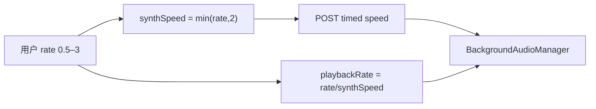

# 听书倍速 >2x 合成钳制与防 timed 连打（实现思路）

> **状态**：已采纳  
> **关联文件**：`src/services/tts-player.ts`、`src/services/tts.ts`、`src/hooks/useChapterListen.ts`  
> **来源会话**：[听书切句与起播](c3f8bd51-ec80-47b8-be74-2f558038843f)  
> **UI 侧**：[reader-listen-rate-picker-impl.md](./reader-listen-rate-picker-impl.md)

---

## 1. 需求背景（必填）

UI 倍速需到 **3.0x**，但 `/edge/speech/timed` 对 `speed>2` 返回 **400**，滑动时连打失败请求会导致「语音合成失败」无法续播。需要：UI 仍可达 3x；接口只打合法 speed；切换实时生效且不刷爆 timed。

成功标准：2x 以上可选可播；同合成档内微调不重打 timed；400 不重试。

---

## 2. 用户需求与 Agent 问答（必填）

### 2.1 滑动连打 timed / 合成失败

**用户：**

> 滑动切换倍速时会一直掉 timed 接口  
> 目前又会导致倍速刻度滑动连续调 timed 接口导致语音合成报错了  
> 现在切换会导致语音合成失败，无法正常播放

**Agent 回答摘要（已落地）：**

- 滑杆停稳再提交 + `setListenRate` 防抖
- `timed` 的 `speed` 钳在 ≤2；失败不重试
- 合成档不变时只改 `playbackRate` 补速

### 2.2 仍要 3 倍速且实时

**用户：**

> 倍速要增加到 3 倍速  
> 但是需要切换倍速时实时更改播放倍速

**Agent 回答摘要（已落地）：**

- UI / `clampRate`：0.5–3.0
- `synthSpeedOf`：发给接口 ≤2；`playbackBoost = rate / synthSpeed`

---

## 3. 实现思路（必填）

### 3.1 总体策略

把「用户倍速」与「合成 speed」拆开：音频按 ≤2x 烘焙；>2x 用 BGM `playbackRate`（端支持时）补足。2.1～3.0 之间滑动不再反复打 timed。

### 3.2 数据流



### 3.3 分点设计

1. **缓存 key** 用 `synthSpeed`，2.x～3.x 共用 speed=2 音频。
2. **setRate**：合成档相同则只 `applyPlaybackBoost`。
3. **takeSpeech**：非取消失败不二次请求。

---

## 4. 改动点对比：改前 / 改后（必填）

### 4.1 改动点：`synthSpeedOf` + `setRate` 分流

- **位置**：`src/services/tts-player.ts` → `clampRate` / `setRate`
- **差异摘要**：>2x 不再把非法 speed 发给 timed。

#### 改动前

```ts
function clampRate(rate: number): number {
  // 原先上限 2，后曾扩到 3 并直接当 timed speed
  const n = Math.round(rate * 10) / 10;
  return Math.min(3, Math.max(0.5, n));
}

setRate(rate: number, opts: ApplyOpts = {}): void {
  const next = clampRate(rate);
  if (next === this.rate) return;
  this.rate = next;
  // 一律 abort 并重合成 → 2.4x 打 timed 得 400
  this.abortAllSpeech();
  this.reestimateDurations();
  if (opts.play !== false && this.sentences.length) {
    void this.playCurrent();
  }
}
```

#### 改动后

```ts
function clampRate(rate: number): number {
  // UI：0.5x–3.0x
  const n = Math.round(rate * 10) / 10;
  return Math.min(3, Math.max(0.5, n));
}

/** timed / Edge 合成上限 2x */
function synthSpeedOf(rate: number): number {
  return Math.min(2, clampRate(rate));
}

setRate(rate: number, opts: ApplyOpts = {}): void {
  const next = clampRate(rate);
  if (next === this.rate) return;
  // 改前合成档
  const prevSynth = synthSpeedOf(this.rate);
  // 改后合成档
  const nextSynth = synthSpeedOf(next);
  this.rate = next;
  this.reestimateDurations();
  // >2x 补播放速率
  this.applyPlaybackBoost();
  // 例如 2.1→2.8：都是 speed=2，不重打 timed
  if (prevSynth === nextSynth) return;
  this.clearPrefetchTimer();
  this.abortAllSpeech();
  if (opts.play !== false && this.sentences.length) {
    void this.playCurrent();
  }
}
```

### 4.2 改动点：请求与缓存用 `synthSpeed`

- **位置**：`tts-player.ts` → `cacheKey` / `startSpeech` / `playCurrent`
- **差异摘要**：接口始终收到 ≤2 的 speed。

#### 改动前

```ts
private cacheKey(text: string): string {
  // 用完整 rate 做 key
  return `${this.voice}\0${this.rate}\0${text}`;
}

// 请求
synthesizeEdgeSpeechTimed(text, { voice: this.voice, speed: this.rate });
```

#### 改动后

```ts
private cacheKey(text: string): string {
  // 按实际合成 speed 缓存；2.x~3.x 共用 speed=2 音频
  return `${this.voice}\0${this.synthSpeed()}\0${text}`;
}

const req = synthesizeEdgeSpeechTimed(text, {
  voice: this.voice,
  // 发给 timed 的合法 speed
  speed: this.synthSpeed(),
});

// playCurrent 赋 src 后
this.applyPlaybackBoost();
```

### 4.3 改动点：合成失败不重试

- **位置**：`tts-player.ts` → `takeSpeech`
- **差异摘要**：400 等业务失败只请求一次，避免刷屏。

#### 改动前

```ts
private async takeSpeech(text: string, gen: number): Promise<SpeechPayload | null> {
  const hit = await this.startSpeech(text);
  if (gen !== this.playGen) return null;
  if (hit?.audio.byteLength) return hit;
  // 失败后无条件再打一轮 → 连打 timed
  const again = await this.startSpeech(text);
  return again?.audio.byteLength ? again : null;
}
```

#### 改动后

```ts
private async takeSpeech(text: string, gen: number): Promise<SpeechPayload | null> {
  const hit = await this.startSpeech(text);
  if (gen !== this.playGen) return null;
  if (hit?.audio.byteLength) return hit;
  // 400/业务失败不重试
  if (this.lastSynthError && !/取消/.test(this.lastSynthError)) {
    return null;
  }
  // 仅取消类再开一轮
  // …
  const again = await this.startSpeech(text);
  if (gen !== this.playGen) return null;
  return again?.audio.byteLength ? again : null;
}
```

---

## 5. 验证要点（建议）

- [ ] 1.0→1.5：一次（或防抖后一次）`timed`，speed=1.5，可播
- [ ] 2.0→2.5→3.0：不应再出现 speed>2 的 400；有 `playbackRate` 的端上听感更快
- [ ] 滑动过程不应刷一排 400
- [ ] 合成失败 toast 后，改回 ≤2x 仍能恢复播放

---

## 6. 影响分析（必填）

### 6.1 结论

- **是否影响已有功能点**：是 — 倍速与 TTS 请求契约、>2x 听感实现方式。
- **是否影响既有正常逻辑**：局部 — ≤2x 仍整段重合成；>2x 依赖端是否支持 BGM `playbackRate`（不支持时听感停在约 2x，但不再因 400 卡死）。

### 6.2 影响点清单

| 影响对象               | 影响方式                      | 严重程度   | 回归建议             |
| ---------------------- | ----------------------------- | ---------- | -------------------- |
| `/edge/speech/timed`   | speed 始终 ≤2                 | 中（正面） | 抓包确认             |
| >2x 听感               | playbackRate 补速，可能略变调 | 中         | 真机 3.0x 听感       |
| 预取 / 缓存            | key 按 synthSpeed             | 低         | 2.5↔3.0 切勿重复下载 |
| 高亮时钟               | 优先 bgm.currentTime          | 低         | >2x 时高亮是否跟句   |
| 后端若日后支持 speed=3 | 可放宽 `synthSpeedOf`         | 低         | 与后端对齐后再改     |

### 6.3 说明

历史文档写「倍速绝不走 playbackRate」针对的是 **≤2x 整段变调**；本方案仅在 **超过接口上限** 时用 playbackRate 补足，属于有意例外。
