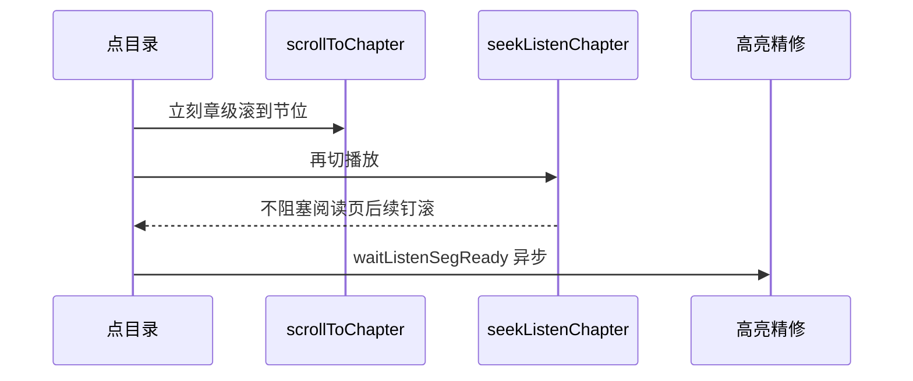

# 听书起播 / 目录切节先滚后合成（实现思路）

> **状态**：已采纳  
> **关联文件**：`src/pages/reader/index.vue`、`src/hooks/useChapterListen.ts`  
> **来源会话**：[听书切句与起播](c3f8bd51-ec80-47b8-be74-2f558038843f)  
> **依赖**：目录句映射见 [reader-ebook-toc-listen-impl.md](./reader-ebook-toc-listen-impl.md)

---

## 1. 需求背景（必填）

点听书或听书中点目录时：画面长时间停在章首等 TTS；或多次从头连滚；高亮要等很久。需要**先把目标滚进展示区**，再合成；`loadAndPlayChapter` 不阻塞在 `playFrom` 上。

成功标准：起播/切节后立刻看到目标附近正文；不再「停章首很久再跳」；高亮精修可异步。

---

## 2. 用户需求与 Agent 问答（必填）

### 2.1 连滚且高亮慢

**用户：**

> 目前虽然基本问题已经解决了，但是在这个过程中会滚动多次，而且每次都会从头滚动到当前章节，并且高亮需要等待很长时间

**用户：**

> 目前点击听书也会滚动多次，同时高亮也需要等很久

### 2.2 起播不进视口、目录卡章首

**用户：**

> 开启听书时，并没有立即将播放内容展示在屏幕展示区域……

**用户：**

> 目前开启播放还是无法立即将播放内容展示在当前屏幕展示区域，同时点击目录时，会在书籍初始位置停留等很长时间才能滚动到当前播放区域进行高亮

**Agent 回答摘要（已落地）：**

- `onListenTap`：先 `scrollToChapter`，再 `startListen`，拆段后再钉一次
- `jumpListenToTocItem`：先滚再 seek；高亮 `waitListenSegReady` 异步
- `loadAndPlayChapter`：`void ttsPlayer.playFrom`（不 await）
- 切章 `unlockFromUserGesture`；起播前清 `tocSplit`

---

## 3. 实现思路（必填）

### 3.1 总体策略

滚动依赖整章或章级定位，不依赖分段 mp-html 就绪；TTS 与滚屏解耦。精修跟读/高亮放到微任务，不挡首屏。

### 3.2 控制流（目录切节）



### 3.3 分点设计

1. **起播**：阅读位 percent 先滚 → `startListen` → 拆段后 `scrollToChapter` 钉回。
2. **切节**：`tocItemScrollPercent` 先滚 → `fromSentence` seek。
3. **Hook**：配置完 player 即返回；合成在后台。

---

## 4. 改动点对比：改前 / 改后（必填）

### 4.1 改动点：`loadAndPlayChapter` 不 await 合成

- **位置**：`src/hooks/useChapterListen.ts` → `loadAndPlayChapter`（约第 199–203 行）
- **差异摘要**：阅读页可在 TTS 返回前继续滚屏。

#### 改动前

```ts
// 配置 player 后
ttsPlayer.setVoice(voice.value, { play: false });
// 同步倍速
ttsPlayer.setRate(rate.value, { play: false });
// 进度
syncListenProgress();
// 进度定时器
startProgressTimer();

// 卡在合成完成才返回 → 目录切章停章首
await ttsPlayer.playFrom(startIdx);
// generation 校验
if (gen !== sessionGen) return;
// loading 兜底
if (status.value === "loading") status.value = "playing";
```

#### 改动后

```ts
// 配置 player 后
ttsPlayer.setVoice(voice.value, { play: false });
// 同步倍速
ttsPlayer.setRate(rate.value, { play: false });
// 进度
syncListenProgress();
// 进度定时器
startProgressTimer();

// 不 await：阅读页可立刻跟读滚屏
void ttsPlayer.playFrom(startIdx).then(() => {
  // 会话已换则忽略
  if (gen !== sessionGen) return;
  // 仍 loading 则兜底 playing
  if (status.value === "loading") status.value = "playing";
});
```

### 4.2 改动点：`onListenTap` 先滚再听

- **位置**：`src/pages/reader/index.vue` → `onListenTap`
- **差异摘要**：合成前画面已在阅读焦点带。

#### 改动前

```ts
// 概念：先 startListen（内部 await 合成），再滚
async function onListenTap() {
  // …
  // 等 TTS 完才滚 → 用户先看章首
  await startListen({ /* … */ scrollPercent: readingPct /* … */ });
  // 再滚到句
  await scrollToListenSentence(true);
}
```

#### 改动后

```ts
async function onListenTap() {
  // …
  // 起播前清 tocSplit，避免挡住分段
  for (const b of chapterBlocks.value) {
    if (b.tocSplit) b.tocSplit = null;
  }
  const spine = chapterIndex.value;
  const readingPct = readingScrollPercent.value;
  // 护栏：程序化滚动不打断跟读
  suppressListenBreak(2000);
  markListenProgrammatic(2000);
  // 合成前先按阅读位滚进焦点带
  await scrollToChapter(spine, readingPct, "listen");

  // 再起播（hook 内不阻塞合成）
  await startListen({
    bookId: bookId.value,
    bookTitle: bookTitle.value,
    coverUrl: bookCoverUrl.value,
    chapterIndex: spine,
    chapterTotal: chapterTotal.value,
    scrollPercent: readingPct,
    getChapter: async (index) => {
      const block = await fetchChapterBlock(index);
      return {
        html: block.html,
        title: block.title,
        nextIndex: index < chapterTotal.value - 1 ? index + 1 : null,
      };
    },
  });

  // 拆段 remount 后立刻章级钉回
  const chap = listenChapterIndex.value;
  const sent = listenSentenceIndex.value;
  await nextTick();
  await scrollToChapter(chap, listenSentenceScrollPercent(sent), "listen");
  applyListenSentenceHighlight();

  // 高亮精修异步，不挡首屏
  void (async () => {
    const meta = listenHighlightSpan.value ?? listenSentences.value[sent];
    await waitListenSegReady(chap, typeof meta?.start === "number" ? meta.start : 0, 500);
    applyListenSentenceHighlight();
    await scrollToListenSentence(true);
  })();
}
```

### 4.3 改动点：`jumpListenToTocItem` 先滚后 seek

- **位置**：`src/pages/reader/index.vue` → `jumpListenToTocItem`
- **差异摘要**：绝不能先 await TTS / waitListenSegReady 再滚。

#### 改动前

```ts
// 概念：先 seek（await 合成）再滚 / 或先等分段就绪
async function jumpListenToTocItem(item: ChapterMeta) {
  // 先切播放，画面停章首
  await seekListenChapter(item.index, fromSentence);
  // 再等分段
  await waitListenSegReady(/* … */);
  // 最后才滚 → 用户感知卡顿
  await scrollToListenSentence(true);
}
```

#### 改动后

```ts
async function jumpListenToTocItem(item: ChapterMeta) {
  // …
  const scrollPercent = tocItemScrollPercent(block.html, item);
  const fromSentence = tocItemListenSentenceIndex(block.html, item);
  persistProgress(scrollPercent);

  // 1) 立刻章级滚到目录位
  await scrollToChapter(index, scrollPercent, "listen");

  // 2) 再切播放（同章 seek 句；跨章 seekListenChapter）
  if (sameSpine) {
    seekListenSentence(fromSentence, { chapterTitle: title || undefined });
  } else {
    await seekListenChapter(index, {
      fromSentence,
      chapterTitle: title || undefined,
    });
    await nextTick();
    await scrollToChapter(index, listenSentenceScrollPercent(listenSentenceIndex.value), "listen");
  }

  // 粗高亮
  applyListenSentenceHighlight();

  // 3) 分段精修异步
  void (async () => {
    const meta = listenHighlightSpan.value ?? listenSentences.value[listenSentenceIndex.value];
    await waitListenSegReady(index, typeof meta?.start === "number" ? meta.start : 0, 500);
    applyListenSentenceHighlight();
    await scrollToListenSentence(true);
  })();
}
```

### 4.4 改动点：`seekListenChapter` 支持对象参数 + 解锁

- **位置**：`src/hooks/useChapterListen.ts` → `seekListenChapter`
- **差异摘要**：可传 `fromSentence` / `chapterTitle`；切章点击栈解锁。

#### 改动前

```ts
// 仅数字句下标
export async function seekListenChapter(index: number, fromSentence = 0): Promise<void> {
  // idle 直接返回
  if (status.value === "idle" || !getChapterFn) return;
  // 换会话
  sessionGen += 1;
  // 停播
  ttsPlayer.stop();
  // loading
  status.value = "loading";
  // 文案
  currentSentenceText.value = "准备朗读…";
  // 只带句下标
  await loadAndPlayChapter(index, { fromSentence });
}
```

#### 改动后

```ts
export async function seekListenChapter(
  index: number,
  fromSentenceOrOpts:
    number | { fromSentence?: number; scrollPercent?: number; chapterTitle?: string } = 0,
): Promise<void> {
  // idle 直接返回
  if (status.value === "idle" || !getChapterFn) return;
  // 换会话
  sessionGen += 1;
  // 停播
  ttsPlayer.stop();
  // 切章也在点击栈里解锁
  ttsPlayer.unlockFromUserGesture();
  // loading
  status.value = "loading";
  // 文案
  currentSentenceText.value = "准备朗读…";
  // 兼容旧数字参数
  const start =
    typeof fromSentenceOrOpts === "number"
      ? { fromSentence: fromSentenceOrOpts }
      : fromSentenceOrOpts;
  // 加载并播放
  await loadAndPlayChapter(index, start);
}
```

---

## 5. 验证要点（建议）

- [ ] 滚到章中点听书：正文立刻在焦点带，不先停章首等几秒
- [ ] 听书中点同文件第二节：立刻顶齐节位，再出声
- [ ] 跨 spine 切节：合成返回后仍钉在目标附近，高亮稍后跟上
- [ ] 连滚次数肉眼可接受（无反复从头扫完整章）

---

## 6. 影响分析（必填）

### 6.1 结论

- **是否影响已有功能点**：是 — 起播/切章时序与 loading 语义（可能更早露出迷你条）。
- **是否影响既有正常逻辑**：局部 — `startListen` 的 await 不再表示「已出声」，出声仍以 `onPlay` 为准。

### 6.2 影响点清单

| 影响对象                   | 影响方式                         | 严重程度 | 回归建议                   |
| -------------------------- | -------------------------------- | -------- | -------------------------- |
| 迷你条 loading→playing     | 可能先 loading 再 onPlay         | 低       | 起播态切换                 |
| 跟读护栏                   | `suppressListenBreak` 窗口加长   | 低       | 起播后立刻手滑是否误断跟读 |
| 听书页 `seekListenChapter` | 新对象参数                       | 低       | 听书页点目录               |
| 体验版首次 play            | `unlockFromUserGesture` 覆盖切章 | 中       | 体验版切章出声             |

### 6.3 相关文档

- [reader-listen-follow-scroll-impl.md](./reader-listen-follow-scroll-impl.md)
- [reader-ebook-toc-listen-impl.md](./reader-ebook-toc-listen-impl.md)
