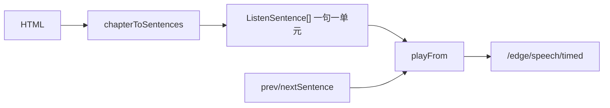

# 听书按句合成与上下句切换（实现思路）

> **状态**：部分被后续方案取代  
> **关联文件**：`src/utils/listen-text.ts`、`src/services/tts-player.ts`  
> **来源会话**：[听书切句与起播](c3f8bd51-ec80-47b8-be74-2f558038843f)  
> **现行口径**：朗读单元已改为「先按句切再打包长片段」+ **紧急短句 / 续播长段** 双轨，见  
> [reader-listen-dual-track-synth-impl.md](./reader-listen-dual-track-synth-impl.md)、  
> [reader-listen-skip-debounce-abort-impl.md](./reader-listen-skip-debounce-abort-impl.md)。  
> 下文保留「一句一单元」阶段的已采纳记录，便于对照演进，**新开发请以双轨文档为准**。

---

## 1. 需求背景（必填）

迷你条 `<<` / `>>` 需要按**当前播放句的上一句 / 下一句**切换。原先朗读单元按**段落**合成，高亮靠段内 `parts` + WordBoundary 估时 seek，会出现：切不过去、卡在同一句循环、或误跳到下下句。

成功标准：点下一句即换到相邻句并重新合成播放；高亮与迷你条文案同步；不再依赖段内音频 seek。

---

## 2. 用户需求与 Agent 问答（必填）

### 2.1 应按句切换而非按段

**用户：**

> 点击切句不应该按照一段一段切换，而是需要按照句切换，即切换到当前播放句的下语句或者上一句，而不是下一段或者上一段

**Agent 回答摘要：**

- 最终以「一句一合成单元」满足句切（中间段内 seek 路径未保留）

### 2.2 段内方案失败，要求换路

**用户：**

> 点击切换上下句，有时会切不过去……之前的解决方案无法解决问题，而且还会导致播放时，跳过某段的下一句，直接播放下下句。你要放弃之前的处理方式，使用其他有效的解决方式

**Agent 回答摘要（已落地）：**

- `chapterToSentences` 改为**一句一合成单元**
- `prevSentence` / `nextSentence`：`sentenceIndex ± 1` + `playCurrent`
- 旧缓存里的 `listenUnitParts` 报错：以重新编译/清缓存 + 最终无该符号的源码为准

---

## 3. 实现思路（必填）

### 3.1 总体策略

切句可靠性优先于「少打 timed」。把播放队列变成真正的句列表后，上下句与自动连播都走「换单元 → 新合成」，边界清晰。

### 3.2 数据流



### 3.3 分点设计

1. **分句**：全文 `buildSentenceOffsetSpans`，超长再按 `MAX_LISTEN_UNIT_CHARS` 切开；`parts` 仅含自身。
2. **切句**：只改下标并 `pendingStartMs = 0`，整段重播该句音频。
3. **目录起播下标**：`tocItemListenSentenceIndex` / `sentenceIndexAtScrollPercent` 与同一套句列表对齐（见 TOC 文档）。

---

## 4. 改动点对比：改前 / 改后（必填）

### 4.1 改动点：`chapterToSentences` 按句切单元

- **位置**：`src/utils/listen-text.ts` → `chapterToSentences`
- **差异摘要**：输入从段落 span 改为句 span；每单元 `parts` 仅自身。

#### 改动前

```ts
// 听书朗读单元：默认按段落切
export function chapterToSentences(html: string): ListenSentence[] {
  // 清洗为纯文本
  const plain = stripMarkdownForTts(htmlToPlainText(html));
  // 空章直接返回
  if (!plain) return [];
  // 先按段落，再对超长段按句切开
  const spans = expandSpansToMaxChars(
    plain,
    // 段落坐标
    buildParagraphOffsetSpans(plain),
    MAX_LISTEN_UNIT_CHARS,
  );
  return spans
    .map(({ start, end }) => {
      // 段文本
      const text = plain.slice(start, end).replace(/\s+/g, " ").trim();
      // 段内再拆 parts 供高亮
      const parts = partsForUnitSpan(plain, start, end).filter(
        (p) => !isDecorativeSeparatorText(p.text),
      );
      return { text, start, end, parts };
    })
    .filter((s) => s.text.length > 0 && !isDecorativeSeparatorText(s.text))
    .map((s, index) => ({ ...s, index }));
}
```

#### 改动后

```ts
// 听书朗读单元：按句切开（一句一合成片段）
export function chapterToSentences(html: string): ListenSentence[] {
  // 清洗为纯文本
  const plain = stripMarkdownForTts(htmlToPlainText(html));
  // 空章直接返回
  if (!plain) return [];
  // 先按句界，超长句再切
  const spans = expandSpansToMaxChars(
    plain,
    // 句坐标
    buildSentenceOffsetSpans(plain),
    MAX_LISTEN_UNIT_CHARS,
  );
  return spans
    .map(({ start, end }) => {
      // 句文本
      const text = plain.slice(start, end).replace(/\s+/g, " ").trim();
      // 空片丢掉
      if (!text) return null;
      return {
        text,
        start,
        end,
        // 高亮即整句
        parts: [{ text, start, end }],
      };
    })
    .filter(
      (s): s is { text: string; start: number; end: number; parts: ListenTextSpan[] } =>
        !!s && !isDecorativeSeparatorText(s.text),
    )
    .map((s, index) => ({ ...s, index }));
}
```

### 4.2 改动点：`prevSentence` / `nextSentence` 只换单元

- **位置**：`src/services/tts-player.ts` → `prevSentence` / `nextSentence`
- **差异摘要**：删除段内 `listenUnitParts` / `seekInCurrentClip` 路径，避免卡句与跳句。

#### 改动前（逻辑摘要）

```ts
// 下一句曾优先在段内 parts 里 seek
nextSentence(): void {
  // 取当前朗读段
  const unit = this.sentences[this.sentenceIndex];
  // 算当前落在段内第几句
  const cur = listenPartIndexAtTime(unit, this.activeBoundaries, this.resolvePlaybackTimeMs());
  // 同段还有下一句则 clip seek
  if (cur < parts.length - 1) {
    // 按 boundary 估起点
    const startMs = listenPartStartOffsetMs(...);
    // 同文件 seek，不重合成
    if (this.seekInCurrentClip(startMs)) return;
  }
  // 否则才 sentenceIndex++
  this.sentenceIndex += 1;
  void this.playCurrent();
}
```

#### 改动后

```ts
// 下一句：换合成单元（一句一片）
nextSentence(): void {
  // 末句则章末回调
  if (this.sentenceIndex >= this.sentences.length - 1) {
    this.onChapterEnd?.();
    return;
  }
  // 前进一句
  this.sentenceIndex += 1;
  // 新单元从头播
  this.pendingStartMs = 0;
  // 重新合成并播放
  void this.playCurrent();
}
```

（`prevSentence` 对称：`sentenceIndex -= 1` 后 `playCurrent`。）

---

## 5. 验证要点（建议）

- [ ] 同一段内多句：连续点 `>>` 逐句前进，高亮与迷你条文案同步
- [ ] 点 `<<` 回到上一句，不卡在句首循环
- [ ] 段末再 `>>` 进入下一段第一句

---

## 6. 影响分析（必填）

### 6.1 结论

- **是否影响已有功能点**：是（有意）— 朗读单元粒度从段变为句。
- **是否影响既有正常逻辑**：是 — `timed` 请求次数上升；进度「N / Total」分母变大；段间连贯性略降。

### 6.2 影响点清单

| 影响对象                                                | 影响方式                        | 严重程度   | 回归建议                       |
| ------------------------------------------------------- | ------------------------------- | ---------- | ------------------------------ |
| `/edge/speech/timed`                                    | 一句一请求，调用更密            | 中         | 结合预取延迟文档，观察起播首包 |
| 迷你条进度 `sentenceIndex / count`                      | 总数变大                        | 低         | 目视进度数字                   |
| 句级高亮                                                | 单元即句，高亮范围与合成一致    | 低（正面） | 播一段含多句的段落             |
| 跟读滚屏                                                | 仍按 `highlightSpan` / 块段定位 | 低         | 跟读是否仍跟当前句             |
| `docs/reader-listen-highlight-impl.md` 旧述「按段合成」 | 文档口径过时                    | 低         | 见该文档补充说明               |

### 6.3 无影响说明

无「完全无影响」结论；本改动是播放模型变更，需按上表回归。
