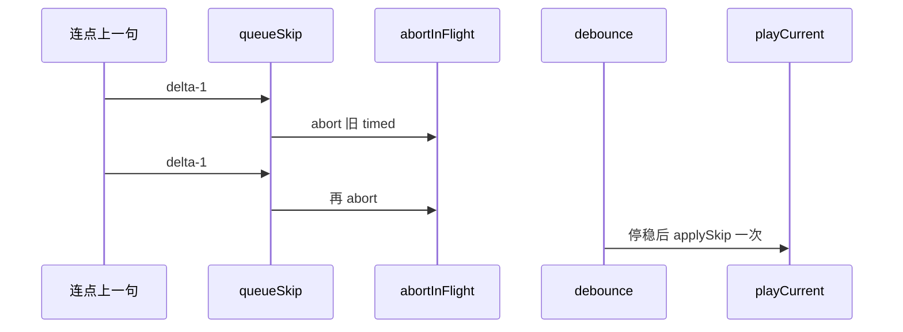

# 听书上下句防抖与取消进行中 timed（实现思路）

> **状态**：已采纳  
> **关联文件**：`src/services/tts-player.ts`  
> **来源会话**：[听书切句与起播](c3f8bd51-ec80-47b8-be74-2f558038843f)  
> **相关文档**：[双轨合成](./reader-listen-dual-track-synth-impl.md)

---

## 1. 需求背景（必填）

短句轨下点「上一句/下一句」若每次立刻 `playCurrent`+`preferShort`，会**点一次打一次 timed**；连点堆出大量请求。需要合并连点，并在再次切换时**取消上一次未完成的 timed**。

成功标准：连点只对最终目标至多一次合成；旧请求被 abort；长片段内优先 seek 不打接口。

---

## 2. 用户需求与 Agent 问答（必填）

### 2.1 连点刷 timed

**用户：**

> 切换上一句时为什么有的时候会每切一次调用一次接口。而且点一次调一次。这样连续快速点击时就会存在非常多的接口调用

**Agent 回答摘要（已落地）：**

- `queueSkip` + `SKIP_DEBOUNCE_MS`（约 220ms）合并步数
- 长片段内可立刻 `seekInClip`

### 2.2 应取消上一次调用

**用户：**

> 我觉得切换时应该取消之前切换时的调用，这样更合理。方式接口连续调用

**Agent 回答摘要（已落地）：**

- `abortInFlightSpeech`：`playGen++` + abort 所有进行中 jobs（保留已完成缓存）
- 非 seek 的切句路径上，入队时与落地 `applySkip` 前各取消一次

---

## 3. 实现思路（必填）

### 3.1 总体策略

切句先算累计 `skipDelta`；能段内 seek 则立刻完成且不清缓存预取；否则 abort 旧请求，防抖后再 `applySkip` → 一次 `playCurrent`。

### 3.2 控制流



---

## 4. 改动点对比：改前 / 改后（必填）

### 4.1 改动点：切句立即 abort + 防抖

- **位置**：`src/services/tts-player.ts` → `queueSkip` / `abortInFlightSpeech`
- **差异摘要**：连点不再并行堆 timed。

#### 改动前

```ts
// 每次 prevSentence 直接
this.pendingPartIndex = cur - 1;
// 强制短句
this.preferShort = true;
// 立刻开播，连点即连打 timed
void this.playCurrent();
```

#### 改动后

```ts
/** 取消进行中的 timed（保留已完成缓存） */
private abortInFlightSpeech(): void {
  // 作废进行中的 playCurrent/prepareFile
  this.playGen += 1;
  // 清掉延迟预取定时器
  this.clearPrefetchTimer();
  // 中止所有未完成的合成请求
  for (const job of this.jobs.values()) {
    job.req.abort();
  }
  // 清空进行中任务表（缓存文件/speech 保留）
  this.jobs.clear();
}

private queueSkip(delta: -1 | 1): void {
  // 累计步数
  this.skipDelta += delta;
  // …同单元 seek 成功则直接 return…
  // 需要重开播：先取消上一次
  this.abortInFlightSpeech();
  // 防抖后只打最终目标
  this.clearSkipTimer();
  const gen = ++this.skipGen;
  this.skipTimer = setTimeout(() => {
    if (gen !== this.skipGen) return;
    const steps = this.skipDelta;
    this.skipDelta = 0;
    this.applySkip(steps);
  }, SKIP_DEBOUNCE_MS);
}
```

---

## 5. 验证要点（建议）

- [ ] 长片段内连点上一句：无新 timed，仅 seek
- [ ] 短句轨连点：网络可见旧请求 abort，停稳后至多 1 次新 timed
- [ ] 停播/切章后 skip 状态被清空

---

## 6. 影响分析（必填）

### 6.1 结论

- **是否影响已有功能点**：是（局部）— 上下句响应带约 220ms 合并窗（段内 seek 除外）
- **是否影响既有正常逻辑**：局部 — 切句会 abort 进行中预取 jobs

### 6.2 影响点明细

| #   | 影响对象            | 影响方式                         | 程度 | 回归建议           |
| --- | ------------------- | -------------------------------- | ---- | ------------------ |
| 1   | 迷你条/听书页上下句 | 连点合并 + abort                 | 高   | 连点看 timed 数量  |
| 2   | 预取 jobs           | 切句时可能被取消                 | 中   | 切句后是否仍能续播 |
| 3   | 系统播控 prev/next  | 同 `prevSentence`/`nextSentence` | 中   | 锁屏切句           |
