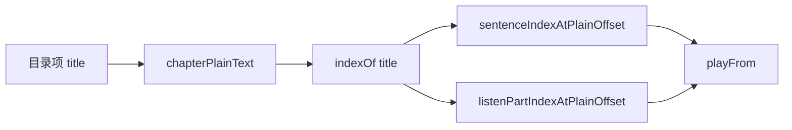

# 听书目录锚点落到打包单元内句（实现思路）

> **状态**：已采纳  
> **关联文件**：`src/utils/ebook-toc.ts`、`src/utils/listen-text.ts`、`src/hooks/useChapterListen.ts`、`src/pages/reader/index.vue`、`src/pages/listen/index.vue`  
> **来源会话**：[听书切句与起播](c3f8bd51-ec80-47b8-be74-2f558038843f)  
> **相关文档**：[双轨合成](./reader-listen-dual-track-synth-impl.md)、[听书页目录切章](./reader-listen-page-toc-chapter-nav-impl.md)

---

## 1. 需求背景（必填）

朗读单元改为多句打包后，目录切节若只定位到**单元下标**并从 `parts[0]` 起播，会从**节标题上方**开始播，跟读滚屏也会偏到节上方。

成功标准：目录/上下章按标题落到**标题所在 part**；二次滚屏用标题 `scrollPercent`，不用单元字符占比。

---

## 2. 用户需求与 Agent 问答（必填）

### 2.1 切章不从节首播、也不进展示区

**用户：**

> 还是切换章节时，还是没有从当前章节开始播放，同时也不会将当前章节显示在当前屏幕展示区域

**Agent 回答摘要（已落地）：**

- `tocItemListenAnchor` → `{ sentenceIndex, partIndex }`
- `playFrom(i, partIndex)` / `seekListenChapter({ fromPart })` / `applySentence(i, part)`
- 阅读页切章后二次滚屏改回 `tocItemScrollPercent`，避免 `listenSentenceScrollPercent(unit)` 滚到节上

---

## 3. 实现思路（必填）

### 3.1 总体策略

目录标题在纯文本中的 offset → 单元下标 + **单元内 part 下标**；起播与高亮都带 `fromPart`。

### 3.2 数据流



---

## 4. 改动点对比：改前 / 改后（必填）

### 4.1 改动点：目录起播锚点

- **位置**：`src/utils/ebook-toc.ts` → `tocItemListenAnchor`
- **差异摘要**：不再只有单元下标。

#### 改动前

```ts
export function tocItemListenSentenceIndex(chapterHtml: string, item: ChapterMeta): number {
  // 只返回打包单元下标
  return sentenceIndexAtPlainOffset(list, pos);
}
```

#### 改动后

```ts
export function tocItemListenAnchor(
  chapterHtml: string,
  item: ChapterMeta,
): { sentenceIndex: number; partIndex: number } {
  // 按句打包后的单元列表
  const list = chapterToSentences(chapterHtml);
  // 无正文
  if (!list.length) return { sentenceIndex: 0, partIndex: 0 };
  // 标题在纯文本中的位置
  const pos = plain.indexOf(title);
  // 落到哪个打包单元
  const sentenceIndex = sentenceIndexAtPlainOffset(list, pos);
  // 落到单元内第几句（避免从 parts[0] 开）
  const partIndex = unit ? listenPartIndexAtPlainOffset(unit, pos) : 0;
  return { sentenceIndex, partIndex };
}
```

### 4.2 改动点：阅读页二次滚屏

- **位置**：`src/pages/reader/index.vue` → `jumpListenToTocItem`
- **差异摘要**：按标题位置钉视口，不用单元占比。

#### 改动前

```ts
await scrollToChapter(
  index,
  // 单元级占比，易滚到节标题上方
  listenSentenceScrollPercent(listenSentenceIndex.value),
  "listen",
);
```

#### 改动后

```ts
// 拆段 remount 后按目录标题位置再钉一次
await scrollToChapter(index, scrollPercent, "listen");
```

---

## 5. 验证要点（建议）

- [ ] 同 spine 多节：点第二节应从标题句起播
- [ ] 阅读页视口停在节附近，而非节上方大段
- [ ] 听书页目录切章同样带 `fromPart`

---

## 6. 影响分析（必填）

### 6.1 结论

- **是否影响已有功能点**：是 — 目录切节起播坐标更细
- **是否影响既有正常逻辑**：局部 — `playFrom` 增加 `partIndex` 参数

### 6.2 影响点明细

| #   | 影响对象                     | 影响方式               | 程度 | 回归建议              |
| --- | ---------------------------- | ---------------------- | ---- | --------------------- |
| 1   | 阅读页听书中点目录           | 锚点 + 滚屏            | 高   | 多节 EPUB             |
| 2   | 听书页目录/上下章            | `fromPart`             | 高   | 同                    |
| 3   | `tocItemListenSentenceIndex` | 兼容包装只返回单元下标 | 低   | 旧调用方需改用 Anchor |
