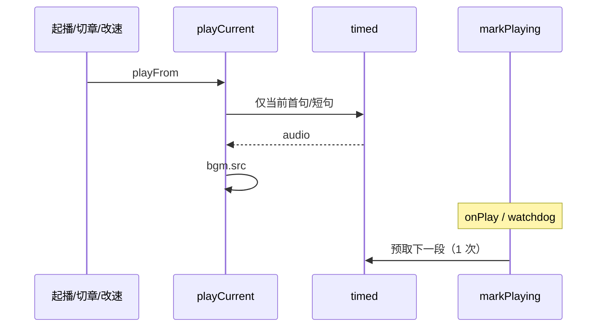

# 听书 TTS 预取与合成失败透出（实现思路）

> **状态**：已采纳（含后续修订）  
> **关联文件**：`src/services/tts-player.ts`、`src/services/tts.ts`  
> **来源会话**：[听书切句与起播](c3f8bd51-ec80-47b8-be74-2f558038843f)  
> **相关文档**：[双轨合成](./reader-listen-dual-track-synth-impl.md)

---

## 1. 需求背景（必填）

起播瞬间连续打多次 `/edge/speech/timed`；预取失败还会冒成未捕获异常。需要：**首句只打一次 timed**；等**真正开始播放**后再预取下一段；每次只备 1 段；失败 toast 不抛穿。

成功标准：起播/切章/改倍速先 1 条 timed；出声后再出现预取；预取完成后不链式立刻打下一段。

---

## 2. 用户需求与 Agent 问答（必填）

### 2.1 起播连打 timed

**用户：**

> 点击听书开始听书时，会连续调三次接口 timed  
> 开启听书/切换章节/切换倍速时会立即调用两次 timed 接口。正常应该等首句开始播放时在调用预取接口

**Agent 回答摘要（已落地）：**

- 去掉与首句并行的预取
- 预取挂在 `markPlaying`（`onPlay` / watchdog 真正出声）之后
- 每次 `prefetchAhead` 只备「下一段」（短句→剩余 tail；长段→下一单元）

### 2.2 预取结束不要立刻打下一段

**用户：**

> 会在预取接口调用结束后，立即调用下一个预取接口。我希望在预取内容开始播放时再调用下一个预取

**Agent 回答摘要（已落地）：**

- `prefetchAhead` 只合成一份；下一段等该段 `markPlaying` 再调度

### 2.3 合成失败冒成 MiniProgramError

**用户：**（日志）

> `<Error: MiniProgramError 语音合成失败>`

**Agent 回答摘要（已落地）：**

- 失败返回 `null` + `lastSynthError`；预取 `.catch` 吞掉

---

## 3. 实现思路（必填）

### 3.1 总体策略

首包与预取串行错开；预取触发点是**播放开始**而不是「合成成功赋 src」或「上一段预取 HTTP 结束」。

### 3.2 控制流



### 3.3 分点设计

1. **`schedulePrefetch`**：由 `markPlaying` 调用。
2. **`nextPrefetchText`**：短句轨→tail；长段轨→`sentences[i+1]`。
3. **错误**：取消不覆盖真实错误。

---

## 4. 改动点对比：改前 / 改后（必填）

### 4.1 改动点：预取时机改为真正出声后

- **位置**：`src/services/tts-player.ts` → `markPlaying` / `playCurrent`
- **差异摘要**：起播不再双 timed。

#### 改动前

```ts
// 短句合成同时并行预取 → 起播双 timed
if (kind === "part") {
  void this.prefetchAhead(this.sentenceIndex, gen);
}
const prepared = await this.prepareFile(targetText, gen);
// …
// 赋 src 后立刻预取长段
if (kind === "unit") this.schedulePrefetch(this.sentenceIndex);
```

#### 改动后

```ts
private markPlaying(gen: number): void {
  // 校验仍是本轮播放
  if (gen !== this.playGen) return;
  // 同 gen 只标记一次
  if (this.playedGen === gen) return;
  this.playedGen = gen;
  this.expectingPlayback = false;
  this.clearPlayWatchdog();
  this.startHighlightTick(true);
  this.onPlay?.();
  // 首句真正出声后再预取
  this.schedulePrefetch(this.sentenceIndex);
}

// playCurrent：只 prepareFile 当前文本，不在此处预取
const prepared = await this.prepareFile(targetText, gen);
```

### 4.2 改动点：每次只预取一段

- **位置**：`src/services/tts-player.ts` → `prefetchAhead`
- **差异摘要**：预取完成不链式打下一段。

#### 改动前

```ts
// 先 await 当前剩余，再 for 循环预取 i+1（HTTP 一结束就打下一段）
await this.prepareFile(tailText, gen);
for (let i = 1; i <= PREFETCH_AHEAD; i += 1) {
  await this.prepareFile(s.text, gen);
}
```

#### 改动后

```ts
private async prefetchAhead(fromIndex: number, gen = this.playGen): Promise<void> {
  // 代次过期则放弃
  if (gen !== this.playGen) return;
  // 只取「紧接着要播」的一段文本
  const text = this.nextPrefetchText(fromIndex);
  if (!text) return;
  const key = this.cacheKey(text);
  // 已有缓存则不再请求
  if (this.fileCache.has(key) || this.speechCache.has(key)) return;
  // 只打这一次；下一段等该内容 markPlaying
  await this.prepareFile(text, gen).catch(() => undefined);
}
```

---

## 5. 验证要点（建议）

- [ ] 起播/切章/改倍速：先 1 条 timed，出声后再 1 条预取
- [ ] 预取结束后不会马上出现第三条（除非下一段已开播）
- [ ] 合成失败 toast，无 MiniProgramError 抛穿

---

## 6. 影响分析（必填）

### 6.1 结论

- **是否影响已有功能点**：是 — 预取更晚启动，短句播完后接龙空窗可能略增（换双轨 tail 缓存缓解）
- **是否影响既有正常逻辑**：局部 — 与双轨合成、切句 abort 共用 jobs 表

### 6.2 影响点明细

| #   | 影响对象        | 影响方式      | 程度 | 回归建议           |
| --- | --------------- | ------------- | ---- | ------------------ |
| 1   | 起播 timed 数量 | 出声前仅 1 次 | 高   | 网络面板           |
| 2   | 短句→长段接龙   | 预取更晚      | 中   | 短句是否播完才接上 |
| 3   | 失败处理        | 仍不 throw    | 低   | 断网 toast         |
