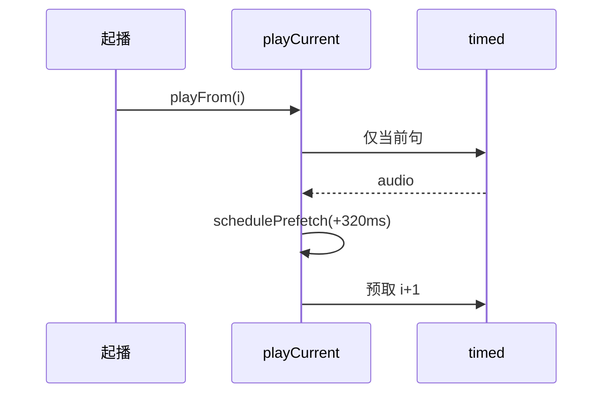

# 听书 TTS 预取与合成失败透出（实现思路）

> **状态**：已采纳  
> **关联文件**：`src/services/tts-player.ts`、`src/services/tts.ts`  
> **来源会话**：[听书切句与起播](c3f8bd51-ec80-47b8-be74-2f558038843f)

---

## 1. 需求背景（必填）

起播瞬间连续打多次 `/edge/speech/timed`；预取失败还会以未捕获异常冒成 `MiniProgramError 语音合成失败`。需要起播只先合成当前句，成功后再预取；失败走 toast，不抛穿框架。

成功标准：点听书首包只见当前句 timed；预取延迟错开；合成失败 toast，不崩控制台。

---

## 2. 用户需求与 Agent 问答（必填）

### 2.1 起播连打 timed

**用户：**

> 点击听书开始听书时，会连续调三次接口 timed

**Agent 回答摘要（已落地）：**

- `PREFETCH_AHEAD`：2 → 1
- 起播前不再立刻 `prefetchAhead`；当前句开播后 `schedulePrefetch`（约 320ms）

### 2.2 合成失败冒成 MiniProgramError

**用户：**（日志）

> `<Error: MiniProgramError 语音合成失败> ... at TtsPlayer...`

**Agent 回答摘要（已落地）：**

- `startSpeech` / `takeSpeech` 失败返回 `null`，写入 `lastSynthError`
- `playCurrent` 用 `onError` toast；预取路径 `.catch` 吞掉

---

## 3. 实现思路（必填）

### 3.1 总体策略

预取仍保留（防切句卡顿），但与首包错开；失败不 throw，与「一句一合成」请求变密兼容。

### 3.2 控制流



### 3.3 分点设计

1. **窗口**：只预取前方 1 句。
2. **时机**：当前句 `prepareFile` 成功并赋 `bgm.src` 后再调度。
3. **错误**：取消不覆盖真实错误；UI 只读 `lastSynthError`。

---

## 4. 改动点对比：改前 / 改后（必填）

### 4.1 改动点：预取窗口与延迟调度

- **位置**：`src/services/tts-player.ts` → 常量 / `schedulePrefetch` / `playCurrent`
- **差异摘要**：起播不再并行打满「当前 + 预取 2」。

#### 改动前

```ts
// 预取前方 2 句 → 起播易连打 3 次 timed
const PREFETCH_AHEAD = 2;

// playCurrent 内：合成当前句之前就预取
private async playCurrent(): Promise<void> {
  // 保留当前与预取 key
  const keep = this.keepKeysFrom(this.sentenceIndex);
  // 清掉窗口外任务
  this.abortSpeechExcept(keep);
  // 立刻预取 → 与当前句并行打 timed
  this.prefetchAhead(this.sentenceIndex);
  // 再合成当前句
  const prepared = await this.prepareFile(sentence.text, gen);
  // …
  if (gen === this.playGen) {
    // 成功后再预取一次（重复）
    this.prefetchAhead(this.sentenceIndex);
  }
}
```

#### 改动后

```ts
// 预取段数：起播只打当前句；成功后再预取 1 段
const PREFETCH_AHEAD = 1;
// 当前句开播后再预取，错开首包
const PREFETCH_DELAY_MS = 320;

// 当前句合成成功后再预取
private schedulePrefetch(fromIndex: number): void {
  // 清掉未触发的定时器
  this.clearPrefetchTimer();
  // 捕获 generation，避免过期回调
  const gen = this.playGen;
  // 延迟预取
  this.prefetchTimer = setTimeout(() => {
    // 定时器已触发
    this.prefetchTimer = null;
    // 已切句/停播则作废
    if (gen !== this.playGen) return;
    // 预取前方窗口
    this.prefetchAhead(fromIndex);
  }, PREFETCH_DELAY_MS);
}

// playCurrent：先只合成当前句
const prepared = await this.prepareFile(sentence.text, gen);
// …
if (gen === this.playGen) {
  // 赋 src 后再调度预取
  this.schedulePrefetch(this.sentenceIndex);
}
```

### 4.2 改动点：合成失败不 throw

- **位置**：`src/services/tts-player.ts` → `startSpeech` / `takeSpeech` / `playCurrent`
- **差异摘要**：预取失败不再变成未捕获 Promise；播放失败走 `onError`。

#### 改动前

```ts
// 概念：失败向上抛，预取 catch 不住时冒 MiniProgramError
private async takeSpeech(text: string, gen: number): Promise<SpeechPayload> {
  // 第二次仍失败则抛
  const again = await this.startSpeech(text);
  // 无音频直接 throw
  if (!again?.audio.byteLength) throw new Error("语音合成失败");
  // 返回
  return again;
}
```

#### 改动后

```ts
// 最近一次合成失败原因（供 UI toast）
private lastSynthError = "";

private startSpeech(text: string): Promise<SpeechPayload | null> {
  // …
  const promise = req.promise
    .then((result) => {
      // 空音频记错误
      if (!result.audio?.byteLength) {
        this.lastSynthError = "语音合成失败：无音频";
        return null;
      }
      // 写入缓存
      const payload: SpeechPayload = {
        audio: result.audio,
        boundaries: result.boundaries ?? [],
      };
      this.speechCache.set(key, payload);
      return payload;
    })
    .catch((err: unknown) => {
      // 规范化文案
      const msg = err instanceof Error ? err.message : "语音合成失败";
      // 取消不覆盖真实错误
      if (!/取消/.test(msg)) this.lastSynthError = msg;
      // 不向上抛
      return null;
    });
  // …
  return promise;
}

// playCurrent：prepared 为空则 toast
if (!prepared) {
  const msg = this.lastSynthError || "语音合成失败";
  if (!/取消/.test(msg)) this.onError?.(msg);
  return;
}
```

---

## 5. 验证要点（建议）

- [ ] 起播：网络面板首段时间内只有 1 次 timed，约 320ms 后再见预取
- [ ] 断网/后端失败：toast「语音合成失败…」，控制台无未捕获 MiniProgramError
- [ ] 切下一句仍能命中预取缓存（体感无整段空白）

---

## 6. 影响分析（必填）

### 6.1 结论

- **是否影响已有功能点**：是 — 预取激进程度下降；错误展示路径变化。
- **是否影响既有正常逻辑**：局部 — 连点切句时偶发多等一包（可接受）。

### 6.2 影响点清单

| 影响对象           | 影响方式                                                       | 严重程度   | 回归建议         |
| ------------------ | -------------------------------------------------------------- | ---------- | ---------------- |
| 起播首包           | 并行请求减少                                                   | 低（正面） | 抓包确认         |
| 切句连贯           | 预取仅 1 句                                                    | 低         | 快速连点 `>>`    |
| `onError` / toast  | 失败必弹（非取消）                                             | 低         | 模拟失败         |
| 句单元变多后的 QPS | 与 [sentence-unit](./reader-listen-sentence-unit-impl.md) 叠加 | 中         | 长章听书观察限流 |

### 6.3 无影响说明

未改 Edge TTS 协议本身；仅客户端调度与错误透出。
