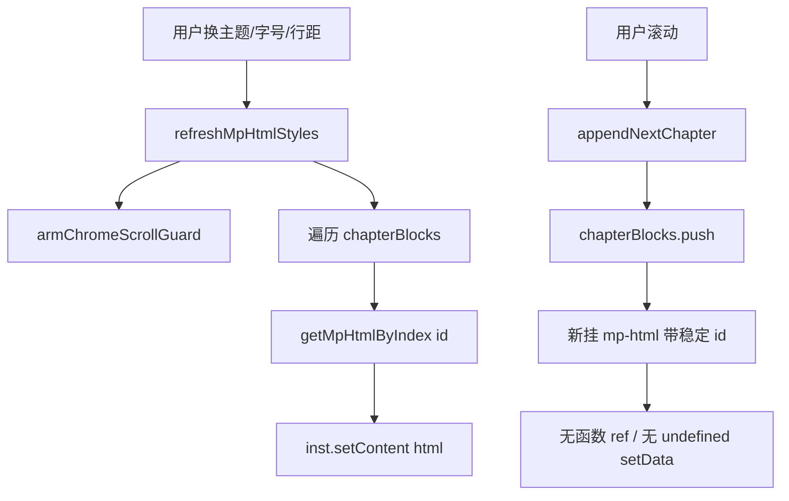

# 微信小程序 mp-html setData(undefined) 警告修复（实现思路）

> **状态**：已采纳  
> **关联文件**：`src/pages/reader/index.vue`  
> **来源会话**：[阅读页 UI / 换肤与 setData 警告](478d2163-8768-4eb5-8e66-d25230844f76)

---

## 1. 需求背景（必填）

进入阅读页、换肤后继续滚动加载后续章节时，微信开发者工具反复输出：

```text
Setting data field "uR" to undefined is invalid.
```

堆栈落在 `ensureChapterLoaded` → `appendNextChapter` → `onScroll` 触发的章节流更新。`uR` 为编译压缩后的 data 字段名。用户要求消除该警告，且换肤后滚动内容仍正常加载、主题样式仍即时生效。

成功标准：重新编译后，换主题再滑动加载章节时，不再（或显著减少）出现上述 `setData(undefined)` 警告；换肤仍通过 `setContent` 即时刷新正文。

---

## 2. 用户需求与 Agent 问答（必填）

### 2.1 初次出现警告

**用户：**

> 控制台出现 `Setting data field "uR" to undefined is invalid`，堆栈在 `ensureChapterLoaded` / `onLoad` 等路径。

**Agent 回答摘要：**

- 微信不允许 `setData` 把字段写成 `undefined`
- 排查 `mp-html` 可选 props、函数 `ref`、`style` 对象删键等路径

**Agent 当时给出的方案要点（仅保留最终已落地部分）：**

- 为 `mp-html` 显式传入字符串/`false` 默认值，避免未声明 props 落到 `undefined`
- `streamPaddingStyle` 始终带 `paddingBottom`，避免删键

### 2.2 换肤后滚动仍报警

**用户：**

> 每次切换主题后，页面内容滚动就会出现这个警告。

**Agent 回答摘要：**

- 除可选 props 外，主因是 `v-for` 上的函数 `:ref`：增章/卸载时 Vue 用 `null/undefined` 清空 ref，uni-app 同步到微信即报警
- 叠加原因：`:key` 绑定了主题色（`mpRenderKey`），换肤会整表 remount，放大 ref 清空

**Agent 当时给出的方案要点（仅保留最终已落地部分）：**

- 去掉函数 `ref`，改用稳定 `id` + `$scope.selectComponent` 取实例再 `setContent`
- `:key` 只保留 `block.index`，换肤不再整表重挂
- 章节块 / 标题样式改为完整 CSS 字符串；底栏 padding 始终写键

---

## 3. 实现思路（必填，细致到每个点）

### 3.1 总体策略

在微信小程序约束下（禁止 `setData(undefined)`），换肤仍需拿到 `mp-html` 实例调用 `setContent`。放弃「函数 `ref` + Map 缓存」这一会把 `undefined` 写入页面 data 的路径，改为按 `id` 查询组件实例；同时避免把主题写进 `v-for` 的 `:key`，减少无意义 remount。

### 3.2 数据流 / 控制流



### 3.3 分点设计

#### 3.3.1 去掉 v-for 函数 ref

- **现象**：增章或 remount 时刷 `uR` 警告
- **目标**：卸装组件时不要向页面 data 写 `undefined`
- **做法**：删除 `bindMpHtmlRef` / `mpHtmlRefs`；模板不再绑 `:ref`；见 4.1、4.3

#### 3.3.2 用 id + selectComponent 换肤

- **目标**：仍能 `setContent` 即时换肤
- **做法**：`mp-html` 设 `:id="mp-html-${index}"`，`getMpHtmlByIndex` 经 `readerInstance.proxy.$scope.selectComponent` 取实例；见 4.2、4.3

#### 3.3.3 :key 不再带主题

- **现象**：换肤后整表 remount + 随后滚动增章，警告集中爆发
- **做法**：`:key="block.index"`；换肤只靠 `setContent`；见 4.1

#### 3.3.4 style / props 避免 undefined

- **做法**：`chapterBlockStyle` 拼字符串；`streamPaddingStyle` 恒含 `paddingBottom`；`mp-html` 可选 props 显式默认值；章节 `title`/`html` 空串兜底；见 4.1、4.4、4.5

---

## 4. 改动点对比：改前 / 改后（必填）

### 4.1 改动点：章节列表 key / 样式 / mp-html 绑定

- **位置**：`src/pages/reader/index.vue` → 模板 `chapterBlocks` 的 `v-for` 区块（约第 43–72 行）
- **差异摘要**：key 不再掺主题；去掉函数 ref；改为稳定 id 与显式 props；style 改为字符串。

#### 改动前

```vue
        <!-- 遍历已加载章节块 -->
        <view
          <!-- 用章节索引做 DOM id，供滚动定位 -->
          v-for="block in chapterBlocks"
          <!-- 章节块锚点 id -->
          :id="`chapter-${block.index}`"
          <!-- key 含主题色/字号/行距，换肤即整表 remount -->
          :key="`${block.index}-${mpRenderKey}`"
          <!-- 章节块样式类名 -->
          class="chapter-block"
          <!-- 对象形式绑定阅读样式（差分时可能删键） -->
          :style="readerStyle"
        >
          <!-- 有标题时再渲染标题行 -->
          <view
            <!-- 条件：章节有 title -->
            v-if="block.title"
            <!-- 标题样式类 -->
            class="chapter-heading"
            <!-- 对象 style：字号与颜色 -->
            :style="{ fontSize: readerStyle.fontSize, color: readerStyle.color }"
          >
            <!-- 输出章节标题文本 -->
            {{ block.title }}
          </view>
          <!-- 富文本正文组件 -->
          <mp-html
            <!-- 允许整体卸载重挂以兜底换肤 -->
            v-if="mpHtmlMounted"
            <!-- 函数 ref：卸载时会 setData(undefined) 触发警告 -->
            :ref="bindMpHtmlRef(block.index)"
            <!-- 章节 HTML -->
            :content="block.html"
            <!-- 禁止复制链接 -->
            :copy-link="false"
            <!-- 开启懒加载（布尔特性写法） -->
            lazy-load
            <!-- 标签默认样式（主题色等） -->
            :tag-style="mpTagStyle"
            <!-- 容器内联样式字符串 -->
            :container-style="containerStyle"
          />
        </view>
```

#### 改动后

```vue
        <!-- 遍历已加载章节块 -->
        <view
          <!-- 用章节索引做 DOM id，供滚动定位 -->
          v-for="block in chapterBlocks"
          <!-- 章节块锚点 id -->
          :id="`chapter-${block.index}`"
          <!-- key 只随章节索引，换肤不整表 remount -->
          :key="block.index"
          <!-- 章节块样式类名 -->
          class="chapter-block"
          <!-- 完整 CSS 字符串，避免对象 style 删键写 undefined -->
          :style="chapterBlockStyle"
        >
          <!-- 有标题时再渲染标题行 -->
          <view
            <!-- 条件：章节有 title -->
            v-if="block.title"
            <!-- 标题样式类 -->
            class="chapter-heading"
            <!-- 标题样式拼成字符串 -->
            :style="`font-size:${readerStyle.fontSize};color:${readerStyle.color}`"
          >
            <!-- 输出章节标题文本 -->
            {{ block.title }}
          </view>
          <!-- 富文本正文组件 -->
          <mp-html
            <!-- 允许整体卸载重挂以兜底换肤 -->
            v-if="mpHtmlMounted"
            <!-- 稳定 id，供 selectComponent 查询 -->
            :id="`mp-html-${block.index}`"
            <!-- content 禁止 undefined -->
            :content="block.html || ''"
            <!-- 容器内联样式字符串 -->
            :container-style="containerStyle"
            <!-- 标签默认样式（主题色等） -->
            :tag-style="mpTagStyle"
            <!-- 禁止复制链接 -->
            :copy-link="false"
            <!-- 懒加载显式 true -->
            :lazy-load="true"
            <!-- domain 显式空串，避免 props undefined -->
            :domain="''"
            <!-- 错误图占位空串 -->
            :error-img="''"
            <!-- 加载图占位空串 -->
            :loading-img="''"
            <!-- 关闭表格横向滚动层 -->
            :scroll-table="false"
            <!-- 关闭长按选择 -->
            :selectable="false"
            <!-- 关闭锚点 -->
            :use-anchor="false"
          />
        </view>
```

### 4.2 改动点：章节块字符串样式与去掉 mpRenderKey

- **位置**：`src/pages/reader/index.vue` → `chapterBlockStyle` / 原 `mpRenderKey`（约第 423–441 行）
- **差异摘要**：新增字符串样式 computed；删除会把主题写进 `:key` 的 `mpRenderKey`。

#### 改动前

```ts
// 注释称靠 setContent 换肤，但下方 key 仍绑了主题
const mpRenderKey = computed(
  // 主题色+字号+行距变化即换 key，迫使 v-for 整表 remount
  () => `${readerStyle.value.color}-${fontSize.value}-${lineHeight.value}`,
);
```

#### 改动后

```ts
// 把阅读样式拼成单行 CSS，供章节块 :style 使用
const chapterBlockStyle = computed(() => {
  // 取出当前纸张与字体相关样式对象
  const s = readerStyle.value;
  // 返回分号拼接的完整样式字符串
  return [
    // 背景色跟随纸张主题
    `background-color:${s.backgroundColor}`,
    // 正文字色跟随主题
    `color:${s.color}`,
    // 字号
    `font-size:${s.fontSize}`,
    // 字体族
    `font-family:${s.fontFamily}`,
    // 行高（可用无单位数字）
    `line-height:${s.lineHeight}`,
    // 字间距
    `letter-spacing:${s.letterSpacing}`,
  ].join(";");
});

// 换肤靠 setContent，不把主题塞进 v-for :key（避免整表 remount）
```

### 4.3 改动点：用 selectComponent 替代函数 ref Map

- **位置**：`src/pages/reader/index.vue` → `getMpHtmlByIndex` / `refreshMpHtmlStyles`（约第 443–490 行）
- **差异摘要**：删除 `mpHtmlRefs`、`registerMpHtmlRef`、`bindMpHtmlRef`；换肤时按 id 取实例再 `setContent`。

#### 改动前

```ts
// 缓存各章节 mp-html 组件实例
const mpHtmlRefs = new Map<number, MpHtmlInstance>();
// 控制 mp-html 整体是否挂载（失败时 remount）
const mpHtmlMounted = ref(true);

// 从 ref 回调拿到的实例上解析 setContent
function extractMpHtml(inst: unknown): MpHtmlInstance | null {
  // 非对象直接失败
  if (!inst || typeof inst !== "object") return null;
  // 当成可索引对象
  const candidate = inst as Record<string, unknown>;
  // 实例自身带 setContent
  if (typeof candidate.setContent === "function") return candidate as MpHtmlInstance;
  // 兼容 $vm 包一层的情况
  const vm = candidate.$vm as Record<string, unknown> | undefined;
  // $vm 上有 setContent 则用 $vm
  if (vm && typeof vm.setContent === "function") return vm as MpHtmlInstance;
  // 解析失败
  return null;
}

// 把解析结果写入/移出 Map
function registerMpHtmlRef(index: number, el: unknown) {
  // 解析组件实例
  const inst = extractMpHtml(el);
  // 有实例则缓存
  if (inst) mpHtmlRefs.set(index, inst);
  // 卸载时 el 为 null/undefined → delete；同时触发微信 undefined 警告的源头之一
  else mpHtmlRefs.delete(index);
}

// 给模板用的函数 ref 工厂
function bindMpHtmlRef(index: number) {
  // 返回 Vue 函数 ref
  return (el: unknown) => registerMpHtmlRef(index, el);
}

function refreshMpHtmlStyles() {
  // 换肤前打开滚动护栏，避免伪 scroll 收起底栏
  armChromeScrollGuard();
  // 等 DOM 更新后再刷内容
  void nextTick(async () => {
    // 成功 setContent 的计数
    let hit = 0;
    // 遍历已加载章节
    for (const block of chapterBlocks.value) {
      // 清洗内联色/对齐
      const html = stripReaderColorStyles(block.html);
      // 清洗结果写回 block
      if (html !== block.html) block.html = html;
      // Map 里有实例则强制重解析
      if (mpHtmlRefs.has(block.index)) {
        // 调用 setContent
        mpHtmlRefs.get(block.index)?.setContent?.(html);
        // 命中计数 +1
        hit++;
      }
    }
    // 一个都没命中则 remount 全部 mp-html
    if (chapterBlocks.value.length && hit === 0) {
      // 先卸载
      mpHtmlMounted.value = false;
      // 等卸载完成
      await nextTick();
      // 再挂载
      mpHtmlMounted.value = true;
    }
  });
}
```

#### 改动后

```ts
// 控制 mp-html 整体是否挂载（失败时 remount）
const mpHtmlMounted = ref(true);

// 从组件实例上解析 setContent
function extractMpHtml(inst: unknown): MpHtmlInstance | null {
  // 非对象直接失败
  if (!inst || typeof inst !== "object") return null;
  // 当成可索引对象
  const candidate = inst as Record<string, unknown>;
  // 实例自身带 setContent
  if (typeof candidate.setContent === "function") return candidate as MpHtmlInstance;
  // 兼容 $vm 包一层的情况
  const vm = candidate.$vm as Record<string, unknown> | undefined;
  // $vm 上有 setContent 则用 $vm
  if (vm && typeof vm.setContent === "function") return vm as MpHtmlInstance;
  // 解析失败
  return null;
}

// 不用函数 ref：按稳定 id 向页面作用域查询组件
function getMpHtmlByIndex(index: number): MpHtmlInstance | null {
  try {
    // 取当前页 proxy，并收窄 $scope.selectComponent 类型
    const proxy = readerInstance?.proxy as
      { $scope?: { selectComponent?: (sel: string) => unknown } } | null | undefined;
    // 按 id 查询对应 mp-html
    const comp = proxy?.$scope?.selectComponent?.(`#mp-html-${index}`);
    // 解析为带 setContent 的实例
    return extractMpHtml(comp);
  } catch {
    // 非微信或查询失败时返回空
    return null;
  }
}

function refreshMpHtmlStyles() {
  // 换肤前打开滚动护栏，避免伪 scroll 收起底栏
  armChromeScrollGuard();
  // 等 DOM 更新后再刷内容
  void nextTick(async () => {
    // 成功 setContent 的计数
    let hit = 0;
    // 遍历已加载章节
    for (const block of chapterBlocks.value) {
      // 清洗内联色/对齐
      const html = stripReaderColorStyles(block.html);
      // 清洗结果写回 block
      if (html !== block.html) block.html = html;
      // 按 id 取实例
      const inst = getMpHtmlByIndex(block.index);
      // 有 setContent 则强制重解析
      if (inst?.setContent) {
        // 写入清洗后的 HTML
        inst.setContent(html);
        // 命中计数 +1
        hit++;
      }
    }
    // 一个都没命中则 remount 全部 mp-html
    if (chapterBlocks.value.length && hit === 0) {
      // 先卸载
      mpHtmlMounted.value = false;
      // 等卸载完成
      await nextTick();
      // 再挂载
      mpHtmlMounted.value = true;
    }
  });
}
```

### 4.4 改动点：streamPaddingStyle 始终带键

- **位置**：`src/pages/reader/index.vue` → `streamPaddingStyle`（约第 504–510 行）
- **差异摘要**：隐藏底栏时写 `paddingBottom: 0px`，不再返回空对象删字段。

#### 改动前

```ts
const streamPaddingStyle = computed(() => {
  // 底栏隐藏时返回空对象 → 等价于删掉 paddingBottom
  if (!chromeVisible.value) return {};
  // 取实测或回退 inset
  const pad = chromeInsets.value.bottom || lastChromeBottom;
  // 仅 pad>0 时写对象，否则又是空对象
  return pad > 0 ? { paddingBottom: `${pad}px` } : {};
});
```

#### 改动后

```ts
const streamPaddingStyle = computed(() => {
  // 取实测底栏高度或回退值
  const inset = chromeInsets.value.bottom || lastChromeBottom;
  // 底栏可见且有高度才用正 padding，否则 0
  const pad = chromeVisible.value && inset > 0 ? inset : 0;
  // 始终带 paddingBottom，避免从小程序 data 里删字段变成 undefined
  return { paddingBottom: `${pad}px` };
});
```

### 4.5 改动点：章节 title/html 空值兜底

- **位置**：`src/pages/reader/index.vue` → `fetchChapterBlock` 返回值（约第 927–932 行）
- **差异摘要**：禁止把 `undefined` title/html 推进响应式列表。

#### 改动前

```ts
return {
  // 章节序号
  index: data.index,
  // 标题可能为 undefined
  title: data.title,
  // html 可能为 undefined，再传入 strip
  html: stripReaderColorStyles(data.html),
  // 目录 href
  href: toc.value[index]?.href ?? "",
};
```

#### 改动后

```ts
return {
  // 章节序号
  index: data.index,
  // 标题兜底为空串
  title: data.title || "",
  // html 兜底为空串再清洗
  html: stripReaderColorStyles(data.html || ""),
  // 目录 href
  href: toc.value[index]?.href ?? "",
};
```

---

## 5. 验证要点（建议）

- [ ] 冷启动进入阅读页：控制台无明显 `Setting data field "…" to undefined`
- [ ] 切换纸张主题后立刻上下滑动，触发 `appendNextChapter`：同上警告不再刷屏
- [ ] 换肤 / 改字号 / 改行距后正文颜色与排版仍即时生效（`setContent`）
- [ ] 连续加载多章、短章垫高流仍正常
- [ ] 底栏显隐时正文底部留白仍正确（`paddingBottom` 0 或正值）

---

## 6. 影响分析（必填，放在文档最后）

### 6.1 结论

- **是否影响已有功能点**：局部影响 — 换肤取 `mp-html` 实例的方式从 `ref` Map 改为 `selectComponent`，其它阅读行为（目录、底栏护栏、连续流）保持。
- **是否影响既有正常逻辑**：局部影响 — `v-for` key 策略变更后换肤不再整表 remount，依赖「靠 remount 刷新样式」的路径变弱，统一走 `setContent`；若 `selectComponent` 取不到实例会退回 remount 兜底。

### 6.2 影响点明细

| #   | 影响对象                       | 影响方式                           | 程度 | 说明与回归建议                                                              |
| --- | ------------------------------ | ---------------------------------- | ---- | --------------------------------------------------------------------------- |
| 1   | `refreshMpHtmlStyles`          | 取实例方式变更                     | 中   | 换主题/字号/行距，确认正文即时变色变字；若偶发不生效看是否走到 remount 兜底 |
| 2   | 连续章节流 `appendNextChapter` | 增章时不再函数 ref 清空            | 低   | 滚到页尾加载下章，观察控制台与内容衔接                                      |
| 3   | 章节块 DOM 复用                | `:key` 不再含主题                  | 低   | 换肤时块不销毁重建，性能更好；确认无「旧章样式残留」                        |
| 4   | `streamPaddingStyle`           | 隐藏栏时 padding 为 `0px` 而非删键 | 低   | 收起底栏后正文底边距应为 0，无残留空白                                      |
| 5   | 其它页面                       | 无                                 | —    | 改动封闭在阅读页，无共享 hook 签名变更                                      |

### 6.3 调用面 / 波及说明（建议）

- `refreshMpHtmlStyles`、`getMpHtmlByIndex` 仅阅读页内部使用。
- `useReaderSettings` / `stripReaderColorStyles` 契约未改。
- 既有文档 `reader-theme-typography-impl.md`、`reader-continuous-stream-impl.md` 中若仍出现「函数 `ref` + Map」描述，以本文档与当前源码为准。
