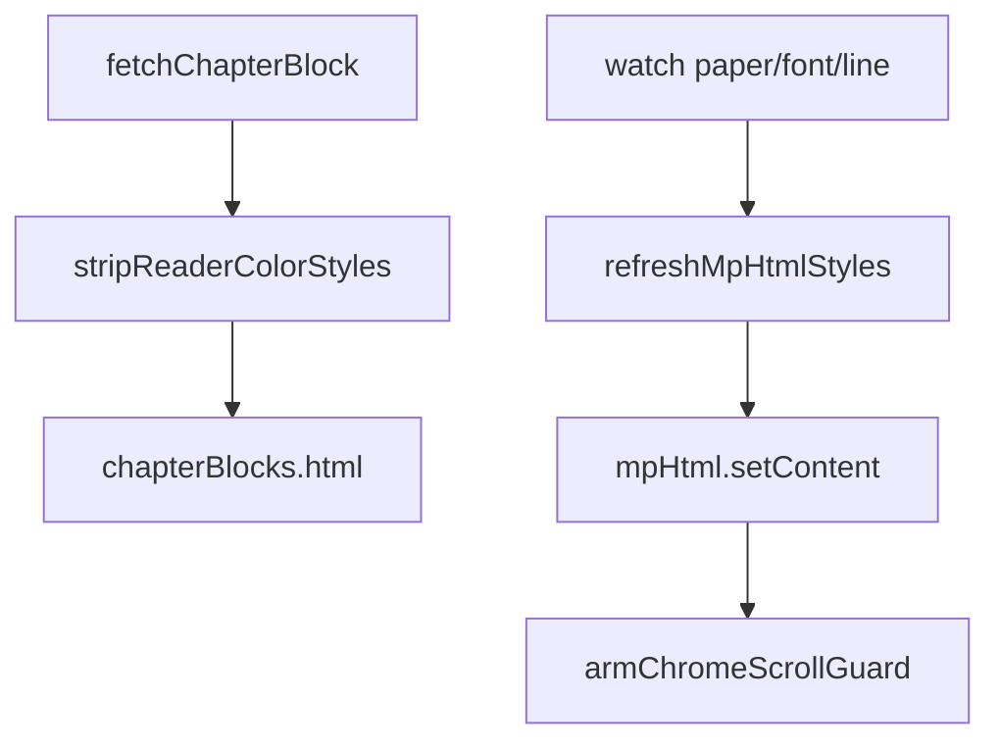

# 阅读主题、两端对齐与字体滑轨（实现思路）

> **状态**：已采纳  
> **关联文件**：`src/hooks/useReaderSettings.ts`、`src/utils/reader-html.ts`、`src/pages/reader/index.vue`  
> **来源会话**：[EPUB 阅读与操作栏](8b499fc2-b71a-4661-a818-13e365c53986)、[阅读 UI 迭代](478d2163-8768-4eb5-8e66-d25230844f76)

---

## 1. 需求背景（必填）

用户需要：正文两端对齐且左右观感一致；切换纸张主题 / 字号 / 行距**立刻**作用到已渲染章节（不必切章）；主题色不被 EPUB 内联 `color`/`text-align` 盖住；字体面板滑轨接近微信读书；底栏字色跟随主题。中间曾尝试只靠 `:key` 重建 `mp-html`，在微信小程序上不可靠，最终改为 `setContent` 强制重解析。

---

## 2. 用户需求与 Agent 问答（必填）

### 2.1 设置不即时生效

**用户：**

> 在切换主题、或者更改文字大小、行间距时不会立即生效，需要在切换别的章节时才回生效

**根因：** `mp-html` 主要在 `content` 变化时重解析，`tag-style` 变更不够。

### 2.2 主题后字色不变

**用户：**

> 切换主题后，字体颜色没有立即随着更改 / ……必须要切换章节后才生效

**已落地方案：** `stripReaderColorStyles` 去掉内联色；`mpTagStyle` 用 `!important`；`refreshMpHtmlStyles` 调 `setContent`。

### 2.3 两端对齐 / 左右间距观感

**用户：**

> 我希望实现左右文字紧贴左右两侧，即文字左右对齐，避免……间距不一致

**已采纳：** `text-align:justify` + 剥离内联对齐相关属性；章节块统一左右 `40rpx` padding。

### 2.4 字体滑轨 UI

**用户：**

> 字体大小，行间距 UI 要与上述图片一样 / 这个 UI 还是不美观，重新调整 / 滑动条高度调大一点

**已采纳：** 标签在上、细轨+圆钮、字号数字/行距「紧…松」、轨道约 `16rpx`。

### 2.5 底栏字色随主题

**用户：**

> 切换主题后，底部这个操作栏字体也需要随着更改

**已采纳：** `chromeBarStyle` 绑定纸张 `fg/bg`。

### 2.6 行距类型报错

**用户：**

> 类型“number”的参数不能赋给类型“2 | 1.4 | …”

**已采纳：** `ReaderLineHeight` + `lineHeightOptions.indexOf`（非 `findIndex`）。

---

## 3. 实现思路（必填）

### 3.1 总体策略

三层同时做：

1. **内容清洗**：加载章时剥内联颜色/对齐
2. **样式契约**：`mpTagStyle` + `containerStyle` + `:deep` 强制字色与两端对齐
3. **运行时刷新**：主题/字号/行距变更 → `setContent`；refs 全 miss 时短暂卸载重挂

### 3.2 数据流



---

## 4. 改动点对比：改前 / 改后（必填）

### 4.1 改动点：新建 HTML 清洗工具

- **位置**：`src/utils/reader-html.ts`（新建）
- **差异摘要：** 阅读主题才能控制字色与对齐。

#### 改动前

```ts
// （无，新建文件）
// 章节 HTML 原样交给 mp-html，内联 color/text-align 会盖过主题
```

#### 改动后

```ts
// 需要从 style / 属性中剔除的声明名
const READER_STRIP_PROPS = new Set([
  "color",
  "background",
  "background-color",
  "text-align",
  "text-align-last",
  "text-justify",
]);

/** 去掉 EPUB 内联颜色与对齐，阅读主题才能即时控制字色与两端对齐 */
export function stripReaderColorStyles(html: string): string {
  // 去掉 <font color="...">
  return (
    html
      .replace(/<font\b([^>]*)\s+color\s*=\s*["'][^"']*["']([^>]*)>/gi, "<font$1$2>")
      // 去掉其它标签上的 color 属性
      .replace(/\s+color\s*=\s*["'][^"']*["']/gi, "")
      // 过滤 style 里的颜色与对齐声明
      .replace(
        /(\sstyle\s*=\s*["'])([^"']*)(["'])/gi,
        (_match, open: string, styles: string, close: string) => {
          // 按分号拆声明
          const kept = styles
            .split(";")
            .map((s) => s.trim())
            .filter(Boolean)
            // 属性名落在剔除集合则丢弃
            .filter((s) => !READER_STRIP_PROPS.has(s.split(":")[0]?.trim().toLowerCase() ?? ""));
          // 无剩余声明则删掉整个 style 属性
          return kept.length ? `${open}${kept.join(";")}${close}` : "";
        },
      )
  );
}
```

### 4.2 改动点：`mpTagStyle` 强制字色与两端对齐

- **位置**：`src/hooks/useReaderSettings.ts` → `mpTagStyle`（约第 97–114 行）
- **差异摘要：** `!important` + 扩展到 span/li/a；行距类型收窄。

#### 改动前

```ts
// 旧 tag-style：无 !important，无 justify，未覆盖 span/li/a
const mpTagStyle = computed(() => ({
  p: `margin:0 0 1em;line-height:${lineHeight.value};font-size:${fontSize.value}px;color:${readerStyle.value.color}`,
  div: `line-height:${lineHeight.value};font-size:${fontSize.value}px;color:${readerStyle.value.color}`,
  h1: `font-size:${fontSize.value + 8}px;font-weight:600;margin:1em 0 0.5em`,
  h2: `font-size:${fontSize.value + 6}px;font-weight:600;margin:1em 0 0.5em`,
  h3: `font-size:${fontSize.value + 4}px;font-weight:600;margin:1em 0 0.5em`,
  img: "max-width:100%;height:auto;display:block;margin:0.5em 0",
  blockquote: "margin:0.5em 0;padding-left:1em;border-left:3px solid #ccc",
}));
```

#### 改动后

```ts
const mpTagStyle = computed(() => {
  // 字色带 !important，压过残留内联
  const color = `color:${readerStyle.value.color} !important`;
  // 两端对齐；末行左齐，避免最后一行被拉扯
  const justify = "text-align:justify !important;text-justify:inter-ideograph;text-align-last:left";
  // 正文通用基线
  const textBase = `line-height:${lineHeight.value};font-size:${fontSize.value}px;${color};${justify}`;
  return {
    p: `margin:0 0 1em;${textBase}`,
    div: textBase,
    span: textBase,
    li: textBase,
    a: textBase,
    h1: `font-size:${fontSize.value + 8}px;font-weight:600;margin:1em 0 0.5em;${color}`,
    h2: `font-size:${fontSize.value + 6}px;font-weight:600;margin:1em 0 0.5em;${color}`,
    h3: `font-size:${fontSize.value + 4}px;font-weight:600;margin:1em 0 0.5em;${color}`,
    img: "max-width:100%;height:auto;display:block;margin:0.5em 0",
    blockquote: `margin:0.5em 0;padding-left:1em;border-left:3px solid #ccc;${color}`,
  };
});
```

### 4.3 改动点：主题变更强制 `setContent`

- **位置**：`src/pages/reader/index.vue` → `refreshMpHtmlStyles`（约第 453–477 行）
- **差异摘要：** 不依赖仅改 `:key`；先 arm 滚动护栏。

#### 改动前

```ts
// 仅靠 chapterRenderKey / :key 期望重建；小程序上常不触发重解析
const chapterRenderKey = ref(0);
// 改主题时不一定 ++key，即使 ++ 也不稳定
```

#### 改动后

```ts
// 主动对每个已挂载实例 setContent
function refreshMpHtmlStyles() {
  // 重排会冒伪 scroll，先护栏避免收起底栏
  armChromeScrollGuard();
  void nextTick(async () => {
    let hit = 0;
    for (const block of chapterBlocks.value) {
      // 防御：块内 HTML 再洗一遍
      const html = stripReaderColorStyles(block.html);
      if (html !== block.html) block.html = html;
      // 有 ref 则强制重解析
      if (mpHtmlRefs.has(block.index)) {
        mpHtmlRefs.get(block.index)?.setContent?.(html);
        hit++;
      }
    }
    // 全部 miss：卸载再挂载兜底
    if (chapterBlocks.value.length && hit === 0) {
      mpHtmlMounted.value = false;
      await nextTick();
      mpHtmlMounted.value = true;
    }
  });
}

// 纸张 / 字号 / 行距任一变就刷新
watch(
  () => `${paperTheme.value}-${fontSize.value}-${lineHeight.value}`,
  () => refreshMpHtmlStyles(),
  { flush: "post" },
);
```

### 4.4 改动点：字号/行距 step 滑轨

- **位置**：模板 typography 子面板 + `setFontStep` / `onFontRailTouch`（约第 125–190、493–598 行）
- **差异摘要：** 由 A± 按钮改为轨道步进；行距用文案档位。

#### 改动前

```vue
<!-- 设置弹层里用按钮 -->
<wd-button size="small" @click="bumpFontSize(-1)">A-</wd-button>
<text>{{ fontSize }}</text>
<wd-button size="small" @click="bumpFontSize(1)">A+</wd-button>
<!-- 行距同样是一排数字按钮 -->
```

#### 改动后

```vue
<!-- 标签与当前值在轨道上方 -->
<view class="typo-slider-head">
  <text class="typo-slider-label">字号</text>
  <text class="typo-slider-value">{{ fontSize }}</text>
</view>
<!-- 左 A、轨道、右 A -->
<view class="typo-slider-body">
  <text class="typo-slider-mark" @tap.stop="setFontStep(0)">A</text>
  <view
    id="font-rail"
    class="typo-slider-rail"
    @tap="onFontRailTap"
    @touchstart.stop="onFontRailTouch"
    @touchmove.stop.prevent="onFontRailTouch"
    @touchend.stop="onFontRailTouchEnd"
  >
    <view class="typo-slider-track" />
    <view class="typo-slider-knob" :style="{ left: fontKnobLeft }" />
  </view>
  <text class="typo-slider-mark" @tap.stop="setFontStep(FONT_SIZE_MAX - FONT_SIZE_MIN)">A</text>
</view>
```

```ts
// 将触点 X 映射为离散档位
function resolveStepIndex(localX: number, railWidth: number, stepCount: number): number {
  // 按轨道宽度均分 stepCount 档
  const ratio = Math.min(1, Math.max(0, localX / Math.max(railWidth, 1)));
  return Math.round(ratio * (stepCount - 1));
}

// 字号写入 14–28
function setFontStep(index: number) {
  fontSize.value = FONT_SIZE_MIN + Math.min(FONT_STEP_COUNT - 1, Math.max(0, index));
}

// 行距必须是联合字面量，避免 number 赋不进去
function setLineStep(index: number) {
  const clamped = Math.min(lineHeightOptions.length - 1, Math.max(0, index));
  setLineHeight(lineHeightOptions[clamped]);
}
```

---

## 5. 验证要点（建议）

- [ ] 同章内切换默认/护眼/绿色/夜间：正文与底栏字色立刻变
- [ ] 拖字号/行距：排版立刻变，底栏不因伪滚动收起
- [ ] 正文两端对齐；末行不异常拉伸
- [ ] 含大量内联 color 的 EPUB 也能被主题覆盖
- [ ] TypeScript：`setLineHeight` 仅接受 `ReaderLineHeight`

---

## 6. 影响分析（必填，放在文档最后）

### 6.1 结论

- **是否影响已有功能点**：是 — 换肤路径与字体 UI 替换；正文渲染依赖清洗后的 HTML。
- **是否影响既有正常逻辑**：局部影响 — `mpTagStyle` 行为变强；`stripReaderColorStyles` 会丢掉作者指定颜色/对齐（有意为之）。

### 6.2 影响点明细

| #   | 影响对象       | 影响方式                    | 程度 | 说明与回归建议           |
| --- | -------------- | --------------------------- | ---- | ------------------------ |
| 1   | EPUB 原色/对齐 | 被剥离                      | 中   | 确认产品接受主题优先     |
| 2   | mp-html 性能   | 换肤时多章 setContent       | 中   | 多章已加载时快速连点主题 |
| 3   | 底栏保持       | 与滚动护栏联动              | 中   | 见操作栏文档回归         |
| 4   | 行距默认       | 缺省从 1.75 → 1.8（合法档） | 低   | 旧存储非法值回落 1.8     |

### 6.3 调用面 / 波及说明

`stripReaderColorStyles` 仅阅读页加载/刷新调用；`useReaderSettings` 的 `mpTagStyle` 亦主要服务阅读页。不影响书架全局主题 preset。
