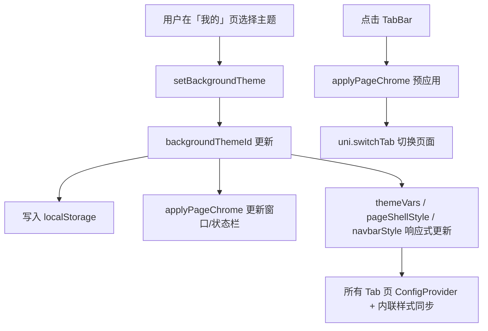

# 自定义 TabBar 与背景主题系统实现文档

本文档整理本项目（uni-app + Vue 3 + wot-ui）中**自定义底部菜单**与**背景主题切换**的完整实现思路、遇到的问题及解决方案，便于后续维护与扩展。

---

## 目录

1. [整体架构](#整体架构)
2. [自定义 TabBar](#自定义-tabbar)
3. [背景主题系统](#背景主题系统)
4. [页面结构约定](#页面结构约定)
5. [问题与解决方案汇总](#问题与解决方案汇总)
6. [关键代码说明](#关键代码说明)
7. [扩展指南](#扩展指南)

---

## 整体架构

```
src/
├── App.vue                      # 启动时隐藏原生 TabBar、应用主题
├── pages.json                   # Tab 页路由、原生 TabBar 配置、自定义导航栏
├── components/
│   ├── AppTabbar.vue            # 自定义底部菜单（wd-tabbar）
│   └── AppNavbar.vue            # 自定义顶部导航（wd-navbar）
├── composables/
│   ├── useTabbar.ts             # Tab 切换逻辑（模块级状态）
│   └── useTheme.ts              # 背景主题逻辑（模块级状态 + 持久化）
└── theme/
    ├── presets.ts               # 三种背景主题预设
    └── variables.scss           # TabBar 布局变量（高度等）
```

### 设计原则

| 原则                  | 说明                                                                  |
| --------------------- | --------------------------------------------------------------------- |
| **模块级共享状态**    | `useTabbar`、`useTheme` 使用模块级 `ref`，保证 Tab 页之间状态同步     |
| **配置驱动**          | 主题色、文字色集中在 `presets.ts`，新增主题只改一处                   |
| **原生 + 自定义结合** | `pages.json` 配置 Tab 页以支持 `switchTab`；UI 层用 wot-ui 自定义组件 |
| **内联色值优先**      | 页面背景用 `:style` 绑定 hex 色值，避免 CSS 变量首帧延迟导致闪烁      |

### 数据流



---

## 自定义 TabBar

### 实现思路

微信小程序要实现自定义底部菜单，需要同时满足：

1. 在 `pages.json` 中声明 `tabBar.list`（否则 `uni.switchTab` 无效）
2. 隐藏原生 TabBar（`uni.hideTabBar`）
3. 在每个 Tab 页底部放置 `wd-tabbar` 组件
4. 点击时调用 `uni.switchTab` 跳转

参考 [Wot Starter 自定义 Tabbar 指南](https://starter.wot-ui.cn/guide/tabbar.html)。

### pages.json 配置

```json
{
  "tabBar": {
    "color": "#7A7E83",
    "selectedColor": "#83AD28",
    "backgroundColor": "#ffffff",
    "borderStyle": "black",
    "list": [
      { "pagePath": "pages/index/index", "text": "首页" },
      { "pagePath": "pages/mine/index", "text": "我的" }
    ]
  }
}
```

> **注意**：不要设置 `"custom": true` 的同时再调用 `uni.hideTabBar()`，否则会报错（见下文问题 1）。

### App.vue：隐藏原生 TabBar

```typescript
onLaunch(() => {
  uni.hideTabBar({ animation: false });
  applyPageChrome();
});
```

### useTabbar.ts：Tab 切换逻辑

核心要点：

- 使用 **模块级** `selected` ref，避免每个页面实例各自维护选中态
- 使用 `:model-value` 单向绑定，**不要用 `v-model`**（见问题 3）
- 切换前调用 `applyPageChrome()` 预应用主题（见问题 8）

```typescript
// ponytail: 模块级状态，避免每个页面各自维护 active 导致切换不同步
const selected = ref(getActiveNameByRoute());

function handleChange({ value }: { value: string | number }) {
  const item = tabbarItems.find((tab) => tab.name === value);
  if (!item || getActiveNameByRoute() === item.name) return;

  applyPageChrome();
  uni.switchTab({ url: item.pagePath });
}
```

### AppTabbar.vue：样式规范

对标主流小程序 TabBar 的尺寸与间距：

| 变量                  | 值                       | 说明                                  |
| --------------------- | ------------------------ | ------------------------------------- |
| `--wot-tabbar-height` | `50px`                   | 内容区高度（定义于 `variables.scss`） |
| 图标大小              | `24px`                   | `--wot-tabbar-item-icon-size`         |
| 文字大小              | `12px`                   | `--wot-tabbar-item-title-font-size`   |
| 图标距顶              | `6px`                    | 通过 `:deep(.app-tabbar-item)` 设置   |
| 安全区                | `safe-area-inset-bottom` | 适配 iPhone 底部 Home 指示条          |

页面底部留白应使用变量，便于维护：

```css
padding: 48rpx 32rpx calc(64rpx + var(--wot-tabbar-height) + env(safe-area-inset-bottom));
```

### 页面布局：scroll-view 包裹内容

微信小程序中，页面级 `position: fixed` 会随页面滚动而「飘起来」。解决方案：

```vue
<view class="page-container" :style="pageShellStyle">
  <AppNavbar title="首页" />
  <scroll-view scroll-y class="page-scroll">
    <view class="page">...</view>
  </scroll-view>
  <AppTabbar />
</view>
```

```css
.page-container {
  height: 100vh;
  display: flex;
  flex-direction: column;
}
.page-scroll {
  flex: 1;
  height: 0;
}
```

TabBar 放在 `scroll-view` **外部**，固定在底部不随内容滚动。

---

## 背景主题系统

### 实现思路

用户在「我的」页选择背景主题，全站（所有 Tab 页 + 导航栏 + TabBar + 按钮）同步更新。

三种预设主题：

| ID          | 名称 | 背景色    | 文字主色          | wot mode |
| ----------- | ---- | --------- | ----------------- | -------- |
| `moonlight` | 月光 | `#F5F5F5` | `#1C2D25`（墨绿） | `light`  |
| `willow`    | 柳绿 | `#83AD28` | `#FFFFFF`         | `dark`   |
| `ink`       | 墨绿 | `#1C2D25` | `#E8EFE6`         | `dark`   |

品牌强调色：**柳绿 `#83AD28`**，在月光/墨绿主题中作为按钮主色；柳绿主题中按钮用墨绿 `#1C2D25` 形成对比。

### presets.ts：主题预设

每个预设包含三部分：

```typescript
export interface BackgroundThemePreset {
  id: BackgroundThemeId;
  name: string; // 显示名称
  color: string; // 色块预览色
  mode: "light" | "dark"; // wot-ui ConfigProvider 模式
  themeVars: ConfigProviderThemeVars; // 组件主题变量
  pageChrome: {
    // 原生窗口/状态栏配色
    frontColor: "#000000" | "#ffffff";
    backgroundColor: string;
    backgroundColorTop: string;
    backgroundColorBottom: string;
  };
}
```

`themeVars` 通过 `wd-config-provider` 的 `:theme-vars` 注入，映射为 CSS 变量（如 `filledBottom` → `--wot-filled-bottom`），驱动 wot-ui 组件和页面文字颜色。

### useTheme.ts：状态管理与持久化

```typescript
const STORAGE_KEY = "background-theme-id";
const backgroundThemeId = ref<BackgroundThemeId>(getStoredThemeId());

watch(backgroundThemeId, (id) => {
  uni.setStorageSync(STORAGE_KEY, id);
  applyPageChrome();
});
```

暴露给页面的响应式数据：

| 导出                 | 用途                                  |
| -------------------- | ------------------------------------- |
| `theme`              | 传给 `wd-config-provider :theme`      |
| `themeVars`          | 传给 `wd-config-provider :theme-vars` |
| `pageShellStyle`     | 页面容器内联背景色（hex，防闪烁）     |
| `themeRootStyle`     | ConfigProvider 根节点背景             |
| `navbarStyle`        | 自定义导航栏背景 + 文字色             |
| `setBackgroundTheme` | 切换主题                              |

### 页面接入方式

每个 Tab 页统一结构：

```vue
<wd-config-provider :theme="theme" :theme-vars="themeVars" :custom-style="themeRootStyle">
  <view class="page-container" :style="pageShellStyle">
    <AppNavbar title="首页" />
    <scroll-view scroll-y class="page-scroll">...</scroll-view>
    <AppTabbar />
  </view>
</wd-config-provider>
```

文字颜色统一使用主题变量，不要写死 hex：

```css
.title {
  color: var(--wot-text-main);
}
.subtitle {
  color: var(--wot-text-auxiliary);
}
```

### AppNavbar.vue：自定义导航栏

为解决 Header 切换 Tab 时闪烁（见问题 6、7），采用 `navigationStyle: "custom"` + `wd-navbar`：

```vue
<wd-navbar
  :title="title"
  fixed
  placeholder
  safe-area-inset-top
  :bordered="false"
  :custom-style="navbarStyle"
/>
```

`navbarStyle` 由 `useTheme` 计算，绑定当前主题的 `filledBottom` 和 `textMain`，随 `backgroundThemeId` 响应式更新——即使页面在后台，Vue 也会提前渲染正确颜色，切 Tab 时不闪。

---

## 页面结构约定

标准 Tab 页模板：

```
wd-config-provider（主题根）
└── page-container（:style="pageShellStyle"）
    ├── AppNavbar（自定义 Header）
    ├── scroll-view（可滚动内容区）
    │   └── page（内容 + 底部 padding）
    └── AppTabbar（固定底部菜单）
```

组件自动导入：`AppTabbar`、`AppNavbar` 位于 `src/components/`，由 `@uni-helper/vite-plugin-uni-components` 自动注册，**无需手动 import**（见问题 5）。

---

## 问题与解决方案汇总

### 问题 1：`hideTabBar:fail custom Tabbar`

**现象**

```
Error: MiniProgramError {"errMsg":"hideTabBar:fail custom Tabbar"}
```

**原因**

`pages.json` 中设置了 `tabBar.custom: true`，此时微信已走自定义 TabBar 模式，不能再调用 `uni.hideTabBar()`。

**解决**

去掉 `custom: true`，保留普通 `tabBar` 配置 + `App.vue` 中 `uni.hideTabBar()` 隐藏原生栏。

---

### 问题 2：滚动时底部菜单脱离底部，底部留白

**现象**

向下滑动时 TabBar 跟着内容「飘起来」，底部出现空白。

**原因**

1. 微信小程序页面内 `position: fixed` 在原生页面滚动上下文里表现不稳定
2. `wd-tabbar` 的 `placeholder` 与 `safe-area-inset-bottom` 叠加产生额外占位

**解决**

1. 用 `scroll-view` 包裹页面内容，TabBar 放在滚动区域外
2. 去掉 `placeholder`，保留 `safe-area-inset-bottom`
3. 页面结构使用 `flex` 列布局（见 [页面布局](#页面布局scroll-view-包裹内容)）

---

### 问题 3：点击菜单无法切换页面

**现象**

点击 TabBar 项无反应，页面不切换。

**原因**

`AppTabbar` 使用了 `v-model="active"`。`wd-tabbar` 在触发 `@change` 之前已通过 `v-model` 更新了 `active`，导致 `handleChange` 中：

```typescript
if (item.name === active.value) return; // 永远为 true，提前 return
```

`uni.switchTab` 从未执行。

**解决**

改为 `:model-value="selected"` 单向绑定，用路由判断是否需要跳转：

```typescript
function handleChange({ value }: { value: string | number }) {
  const item = tabbarItems.find((tab) => tab.name === value);
  if (!item || getActiveNameByRoute() === item.name) return;
  uni.switchTab({ url: item.pagePath });
}
```

---

### 问题 4：TabBar 距底部过高 / 图标贴顶

**现象**

菜单区域过高，图标紧贴顶栏，上下不协调。

**原因**

1. `safe-area-inset-bottom` 在 TabBar 内部以 `padding-bottom` 形式追加，图标仍在固定高度区内垂直居中，视觉上偏上
2. 默认高度 50px + 安全区 padding 叠加

**解决**

1. 保留 `safe-area-inset-bottom`（适配 Home 指示条）
2. 通过 `variables.scss` 设置 `--wot-tabbar-height: 50px`
3. 图标区增加 `padding-top: 6px`，`:deep(.app-tabbar-item)` 使用 `align-items: flex-start`

---

### 问题 5：`AppTabbar` import 报 unused

**现象**

Biome 报 `This import is unused`。

**原因**

`@uni-helper/vite-plugin-uni-components` 自动扫描 `src/components/` 并注册全局组件，手动 import 多余。

**解决**

删除 `import AppTabbar from "@/components/AppTabbar.vue"`，模板中直接使用 `<AppTabbar />`。

---

### 问题 6：墨绿主题 Header 背景不更新

**现象**

页面内容已变为墨绿，顶部导航栏仍为白色。

**原因**

`uni.setNavigationBarColor` 必须在**页面生命周期**（如 `onShow`）中调用才生效；模块加载时 `watch immediate` 调用没有页面上下文；`switchTab` 还会重置为 `pages.json` 默认值。

**解决（第一阶段）**

在 `useTheme()` 中注册 `onShow`，每次页面显示时调用 `applyPageChrome()`。

---

### 问题 7：切换 Tab 时 Header / 背景闪烁旧主题色

**现象**

在「我的」页切换主题后，首次点击菜单切到其他 Tab，Header 或背景短暂闪现上一次的主题色（如月光 `#F5F5F5`）。

**原因**

1. **原生导航栏**在 `switchTab` 瞬间恢复 `pages.json` 的 `navigationBarBackgroundColor`（默认 `#F5F5F5`），直到目标页 `onShow` 才更新 —— 存在一帧延迟
2. 页面背景依赖 CSS 变量，需等 `ConfigProvider` 注入后才生效
3. `setNavigationBarColor` 只能作用于**当前**页面，无法在切 Tab 前修改目标页的原生 Header

**解决（分阶段）**

| 阶段 | 手段                                          | 效果                     |
| ---- | --------------------------------------------- | ------------------------ |
| 1    | `switchTab` 前调用 `applyPageChrome()`        | 减轻窗口背景闪烁         |
| 2    | `pageShellStyle` 内联 hex 背景色              | 页面内容区不闪           |
| 3    | `App.vue` 启动时 `applyPageChrome()`          | 冷启动正确主题           |
| 4    | **`navigationStyle: "custom"` + `AppNavbar`** | **彻底解决 Header 闪烁** |

最终方案：隐藏原生导航栏，用 `wd-navbar` 绑定响应式 `navbarStyle`。主题变更时所有 Tab 页的 Navbar 在后台即已更新，切 Tab 时首帧即为正确颜色。

```json
// pages.json
"navigationStyle": "custom"
```

```typescript
// navbarStyle 随主题响应式更新
const navbarStyle = computed(() => {
  const { filledBottom, textMain } = activePreset.value.themeVars;
  return `background-color: ${filledBottom}; color: ${textMain};`;
});
```

`applyPageChrome()` 中 `setNavigationBarColor` 的 `frontColor` 在自定义导航栏下仅影响**状态栏**时间/电量文字颜色。

---

### 问题 8：字体加载失败（wot-ui 图标）

**现象**

```
Failed to load font https://at.alicdn.com/t/c/font_5024693_....woff
```

**原因**

wot-ui 图标字体从阿里云 CDN 加载，小程序需配置合法域名。

**解决**

- 开发阶段：微信开发者工具 → 详情 → 本地设置 → 勾选「不校验合法域名」
- 上线前：将 `at.alicdn.com` 加入小程序 download 合法域名，或改为本地字体

---

## 关键代码说明

### applyPageChrome：原生窗口配色

```typescript
export function applyPageChrome() {
  const colors = activePreset.value.pageChrome;

  // 自定义导航栏下 frontColor 仅影响状态栏文字颜色
  uni.setNavigationBarColor({
    frontColor: colors.frontColor,
    backgroundColor: colors.backgroundColor,
  });

  uni.setBackgroundColor({
    backgroundColor: colors.backgroundColor,
    backgroundColorTop: colors.backgroundColorTop,
    backgroundColorBottom: colors.backgroundColorBottom,
  });
}
```

调用时机：

- 主题切换 `watch`
- 每个页面 `useTheme()` → `onShow`
- `App.vue` → `onLaunch`
- Tab 切换前 `useTabbar` → `handleChange`

### variables.scss：布局变量

主题色已迁移至 `presets.ts`，此处仅保留 TabBar 布局变量：

```scss
@mixin app-layout-vars {
  --wot-tabbar-height: 50px;
  --wot-tabbar-item-icon-size: 24px;
  --wot-tabbar-item-title-font-size: 12px;
}

page,
.wd-root-portal {
  @include app-layout-vars();
}
```

### 组件自动导入

`vite.config.ts` 配置：

```typescript
Components({
  resolvers: [WotResolver()],
  dts: "src/components.d.ts",
});
```

`src/components/` 下组件（如 `AppTabbar.vue` → `<AppTabbar />`）自动全局注册，类型声明写入 `components.d.ts`。

---

## 扩展指南

### 新增 Tab 页

1. 创建页面文件，复用标准 Tab 页结构
2. 在 `pages.json` → `pages` 和 `tabBar.list` 中添加路径
3. 在 `useTabbar.ts` → `tabbarItems` 中添加菜单项

### 新增背景主题

1. 在 `presets.ts` 的 `BackgroundThemeId` 和 `backgroundThemePresets` 中添加预设
2. 配置 `themeVars`（背景、文字、边框、按钮色）和 `pageChrome`（状态栏/窗口色）
3. 「我的」页色块选择器通过 `backgroundThemeOptions` 自动展示，无需改 UI

示例：

```typescript
forest: {
  id: "forest",
  name: "森林",
  color: "#2d5016",
  mode: "dark",
  themeVars: {
    filledBottom: "#2d5016",
    textMain: "#e8f0e4",
    // ...
  },
  pageChrome: {
    frontColor: "#ffffff",
    backgroundColor: "#2d5016",
    backgroundColorTop: "#2d5016",
    backgroundColorBottom: "#2d5016",
  },
},
```

### 调整 TabBar 高度

只改 `src/theme/variables.scss` 中的 `--wot-tabbar-height`，页面底部 padding 使用 `var(--wot-tabbar-height)` 会自动同步。

### 注意事项

1. **不要**同时使用 `tabBar.custom: true` 和 `uni.hideTabBar()`
2. **不要**在 TabBar 上使用 `v-model`，用 `:model-value` + `@change`
3. Tab 页 Header 必须用自定义导航栏才能避免主题闪烁
4. 页面背景优先用 `pageShellStyle` 内联 hex，而非仅依赖 CSS 变量
5. 主题状态必须是**模块级** `ref`，不能放在 `useTheme()` 函数体内每次新建

---

## 相关文件索引

| 文件                           | 职责                                         |
| ------------------------------ | -------------------------------------------- |
| `src/pages.json`               | Tab 路由、自定义导航栏、原生 TabBar 占位配置 |
| `src/App.vue`                  | 隐藏原生 TabBar、启动时应用主题              |
| `src/components/AppTabbar.vue` | 底部菜单 UI                                  |
| `src/components/AppNavbar.vue` | 顶部导航 UI                                  |
| `src/composables/useTabbar.ts` | Tab 切换、选中态同步                         |
| `src/composables/useTheme.ts`  | 主题状态、持久化、窗口配色                   |
| `src/theme/presets.ts`         | 背景主题预设（色值单一数据源）               |
| `src/theme/variables.scss`     | TabBar 布局 CSS 变量                         |
| `src/pages/mine/index.vue`     | 主题色选择 UI                                |
| `src/pages/index/index.vue`    | 首页示例                                     |

---

_文档版本：2026-07-10，对应当前 `master` 分支实现。_
